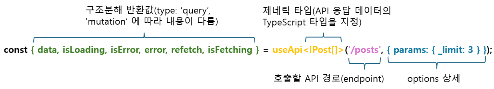

# useApi


## useApi()
---

`useApi()` 훅은 **TanStack Query(React Query)** 를 기반으로 만든, **REST API 호출을 위한 훅 함수**입니다.  

* **TanStack Query(React Query)** 의 자동 캐싱, 로딩/에러 상태 관리, 백그라운드 재검증, refetch 등 강력한 데이터 페칭 기능을 제공하고, **TypeScript 제네릭**을 통해 API 응답 데이터의 타입 안정성을 보장합니다.
* **Client Component**에서 사용하는 REST API 호출용 훅 이므로 **호출 도메인이 다르면 CORS 이슈**가 발생할 수 있으며, Component가 모두 렌더링된 후 API 요청이 발생하므로 **SEO 최적화**에 부적합합니다.


HTTP Method에 따라 **자동으로 동작 방식이 결정**됩니다.
| 동작 모드 | 해당 HTTP 메서드 | 특징 |
|-----------|-----------------|------|
| `query`(조회) | `GET` (기본값) | 컴포넌트 마운트 시 **자동 실행**, 결과를 **캐싱** |
| `mutation`(업데이트) | `POST` · `PUT` · `PATCH` · `DELETE` | 명시적으로 호출해야 **수동 실행**, 캐시 무효화 지원 |

> `type` 옵션을 직접 지정하면 HTTP 메서드와 관계없이 동작 방식을 강제할 수 있습니다.  
> 예) `POST`로 검색 조회를 할 경우 `type: 'query'`로 설정하면 자동 실행 + 캐싱이 적용됩니다.
* **type 기본값 결정:**
	- **type**이 명시된 경우 → 명시값 우선
	- **type** 생략 + **method**가 없거나 GET → 'query'
	- **type** 생략 + **method**가 POST/PUT/PATCH/DELETE → 'mutation'

:::info <span class="text-blue-normal admonition-title">query</span>와 <span class="text-blue-normal admonition-title">mutation</span>을 나누는 이유
데이터를 **읽는 행위**와 **변경하는 행위**는 본질적으로 성격이 다릅니다.

- **`query`(읽기)** 는 같은 요청을 여러 번 반복해도 서버 상태가 바뀌지 않습니다 (**멱등성**).  
  그래서 결과를 캐싱해두고, 컴포넌트가 마운트될 때 자동으로 실행해도 안전합니다.

- **`mutation`(변경)** 은 요청할 때마다 서버 데이터가 달라집니다 (**비멱등성**).  
  실수로 자동 실행되면 의도치 않은 데이터 변경이 발생할 수 있으므로, 반드시 **명시적으로 호출**해야 합니다.

이 구분 덕분에 **TanStack Query**는 **캐시 관리 · 자동 재시도 · 백그라운드 갱신** 같은 전략을 각 동작에 맞게 최적화할 수 있습니다.
:::


## 기본 사용 예제
---
* `useApi` 훅을 `@axiom/hooks`에서 import 합니다.
```ts
import { useApi } from '@axiom/hooks';
```

* **Client Component** 최상위에서 **useApi()** 훅 사용을 위한 코드를 작성합니다.
```tsx
// SamplePage.tsx
export default function SamplePage(): React.ReactNode {
    // useApi 훅 사용 코드 작성
    // highlight-start
    const { data, error, isLoading } = useApi<IPost[]>('/posts');
    // highlight-end
    return (
        <div>
            {
                isLoading
                ? 'Loading...'
                : error
                ? 'Error: ' + JSON.stringify(error)
                : JSON.stringify(data || [], null, 2) || 'No data'
            }
        </div>
    );
}
```



## API 참조
---


### 타입 정의
```ts
import {
    type UseQueryResult,
    type UseQueryOptions,
    type UseMutationResult,
    type UseMutationOptions,
} from '@tanstack/react-query';

// ─── 기본 옵션 타입 ────────────────────────────────────────────────────────────
interface IUseApiBaseOptions {
    /** HTTP Method (기본값: 'GET') */
    method?: THttpMethod;
    /** Query string parameters */
    params?: QueryParams;
    /** Request body */
    body?: Record<string, unknown>;
    /** Custom headers */
    headers?: Record<string, string>;
    /** Request timeout (ms) */
    timeout?: number;
}
// ─── 옵션 타입 ────────────────────────────────────────────────────────────────
interface IUseApiQueryOptions<TData> extends IUseApiBaseOptions {
    /** 'query': useQuery 동작 (자동 실행, 캐싱) */
    type?: 'query';
    /** TanStack Query useQuery 옵션 (queryKey/queryFn 제외) */
    queryOptions?: Omit<UseQueryOptions<TData, Error, TData>, 'queryKey' | 'queryFn'>;
}

interface IUseApiMutationOptions<TData, TVariables> extends IUseApiBaseOptions {
    /** 'mutation': useMutation 동작 (수동 실행) */
    type: 'mutation';
    /** TanStack Query useMutation 옵션 (mutationFn 제외) */
    mutationOptions?: Omit<UseMutationOptions<TData, Error, TVariables>, 'mutationFn'>;
}

// ─── 반환 타입 ────────────────────────────────────────────────────────────────
type UseApiMutationResult<TData, TVariables> = UseMutationResult<TData, Error, TVariables> & {
    /** 특정 endpoint의 TanStack Query 캐시를 무효화합니다 */
    invalidateQueries: (endpoint: string) => Promise<void>;
};

// highlight-start
function useApi<TData = unknown, TVariables = Record<string, unknown>>(
    endpoint: string,
    options?: IUseApiQueryOptions<TData> | IUseApiMutationOptions<TData, TVariables>,
): UseQueryResult<TData, Error> | UseApiMutationResult<TData, TVariables>
// highlight-end
```

### 매개변수
* **useApi(<span class="text-blue-big">endpoint</span>, options)**
    - **endpoint**: API 엔드포인트 경로 *(필수)*   
      도메인을 제외한 경로(`/posts`)만 입력하거나, 도메인을 포함한 풀 URL(`https://other.example.com/posts`)을 입력할 수 있습니다.
      - **경로만 입력한 경우** → 현재 프로젝트에 설정된 기본 도메인을 기준으로 요청합니다.
      - **풀 URL을 입력한 경우** → 입력한 URL의 도메인으로 직접 요청합니다. 단, 외부 도메인 호출 시 **CORS 정책**의 영향을 받을 수 있습니다.
* **useApi(endpoint, <span class="text-blue-big">options</span>)**
    - **options**: 옵션 객체 *(선택)*  
      `type` 값(`'query'` / `'mutation'`)에 따라 사용할 수 있는 옵션이 달라집니다.

      **공통 옵션** (`IUseApiBaseOptions`) — `query` · `mutation` 모두 사용 가능

      | 옵션 | 타입 | 기본값 | 설명 |
      |------|------|--------|------|
      | `method` | `'GET' \| 'POST' \| 'PUT' \| 'PATCH' \| 'DELETE'` | `'GET'` | HTTP 요청 메서드 |
      | `params` | `QueryParams` | — | URL 쿼리스트링 파라미터 (`?key=value`) |
      | `body` | `Record<string, unknown>` | — | 요청 바디 (POST · PUT · PATCH 등에서 사용) |
      | `headers` | `Record<string, string>` | — | 커스텀 요청 헤더 |
      | `timeout` | `number` (ms) | — | 요청 타임아웃 시간 (밀리초) |

      **query 전용 옵션** (`IUseApiQueryOptions`) — `type: 'query'` 또는 method가 `GET`일 때

      | 옵션 | 타입 | 설명 |
      |------|------|------|
      | `type` | `'query'` | 동작 방식을 query(자동 실행 + 캐싱)로 강제 지정 |
      | `queryOptions` | `Omit<UseQueryOptions, 'queryKey' \| 'queryFn'>` | [TanStack Query `useQuery`](https://tanstack.com/query/latest/docs/framework/react/reference/useQuery)에 전달할 추가 옵션 (`staleTime`, `enabled`, `retry` 등) |

      **mutation 전용 옵션** (`IUseApiMutationOptions`) — `type: 'mutation'` 또는 method가 `POST · PUT · PATCH · DELETE`일 때

      | 옵션 | 타입 | 설명 |
      |------|------|------|
      | `type` | `'mutation'` | 동작 방식을 mutation(수동 실행)으로 강제 지정 |
      | `mutationOptions` | `Omit<UseMutationOptions, 'mutationFn'>` | [TanStack Query `useMutation`](https://tanstack.com/query/latest/docs/framework/react/reference/useMutation)에 전달할 추가 옵션 (`onSuccess`, `onError`, `onSettled` 등) |


### 반환값
* **useApi()** 훅은 **TanStack Query**의 **`useQuery`** 또는 **`useMutation`** 결과를 반환합니다.  
  `type`(또는 HTTP 메서드)에 따라 반환 타입이 달라집니다.

* <span class="text-blue-big">`query` 모드</span> → [`UseQueryResult<TData, Error>`](https://tanstack.com/query/latest/docs/framework/react/reference/useQuery)

    **데이터**

    | 속성 | 타입 | 설명 |
    |------|------|------|
    | `data` | `TData \| undefined` | 마지막으로 성공한 API 응답 데이터 (기본값: `undefined`) |
    | `dataUpdatedAt` | `number` | 마지막으로 `success` 상태가 된 시점의 타임스탬프 |
    | `error` | `Error \| null` | 요청 실패 시 에러 객체 (기본값: `null`) |
    | `errorUpdatedAt` | `number` | 마지막으로 `error` 상태가 된 시점의 타임스탬프 |

    **상태 (status)**

    | 속성 | 타입 | 설명 |
    |------|------|------|
    | `status` | `'pending' \| 'error' \| 'success'` | 현재 요청 상태 |
    | `isPending` | `boolean` | 캐시 데이터 없이 아직 요청이 완료되지 않은 상태 |
    | `isSuccess` | `boolean` | 요청 성공 여부 |
    | `isError` | `boolean` | 요청 실패 여부 |
    | `isLoadingError` | `boolean` | 최초 로딩 중 실패한 경우 `true` |
    | `isRefetchError` | `boolean` | 리패칭 중 실패한 경우 `true` |

    **패칭 상태 (fetchStatus)**

    | 속성 | 타입 | 설명 |
    |------|------|------|
    | `fetchStatus` | `'fetching' \| 'paused' \| 'idle'` | 현재 네트워크 요청 상태 |
    | `isLoading` | `boolean` | 최초 fetch 진행 중 여부 (`isFetching && isPending`) |
    | `isFetching` | `boolean` | 초기 로딩 및 백그라운드 재요청 포함 패칭 중 여부 |
    | `isRefetching` | `boolean` | 백그라운드 리패칭 중 여부 (`isFetching && !isPending`) |
    | `isPaused` | `boolean` | 요청이 일시 중단된 상태 (네트워크 오프라인 등) |

    **데이터 신선도 / 캐시**

    | 속성 | 타입 | 설명 |
    |------|------|------|
    | `isStale` | `boolean` | 캐시 데이터가 만료(stale)되었거나 무효화된 경우 `true` |
    | `isFetched` | `boolean` | 최소 1회 이상 fetch가 완료된 경우 `true` |
    | `isFetchedAfterMount` | `boolean` | 컴포넌트 마운트 이후 fetch가 완료된 경우 `true` |
    | `isPlaceholderData` | `boolean` | 현재 표시 중인 데이터가 placeholder 데이터인 경우 `true` |
    | `isEnabled` | `boolean` | 쿼리가 활성화된 상태인지 여부 |

    **재시도**

    | 속성 | 타입 | 설명 |
    |------|------|------|
    | `failureCount` | `number` | 누적 실패 횟수 (성공 시 0으로 초기화) |
    | `failureReason` | `Error \| null` | 마지막 재시도 실패 원인 (성공 시 `null`로 초기화) |

    **함수**

    | 속성 | 타입 | 설명 |
    |------|------|------|
    | `refetch` | `(options?: { throwOnError?: boolean, cancelRefetch?: boolean }) => Promise<UseQueryResult>` | 수동으로 데이터를 다시 요청 |

    ---

* <span class="text-blue-big">`mutation` 모드</span> → [`UseApiMutationResult<TData, TVariables>`](https://tanstack.com/query/latest/docs/framework/react/reference/useMutation) (`UseMutationResult` 확장)

    **데이터**

    | 속성 | 타입 | 설명 |
    |------|------|------|
    | `data` | `TData \| undefined` | mutation 성공 시 응답 데이터 (기본값: `undefined`) |
    | `error` | `Error \| null` | mutation 실패 시 에러 객체 (기본값: `null`) |
    | `variables` | `TVariables \| undefined` | `mutate` 호출 시 전달한 변수 객체 (기본값: `undefined`) |
    | `submittedAt` | `number` | mutation이 실행된 시점의 타임스탬프 (기본값: `0`) |

    **상태 (status)**

    | 속성 | 타입 | 설명 |
    |------|------|------|
    | `status` | `'idle' \| 'pending' \| 'error' \| 'success'` | 현재 mutation 상태 |
    | `isIdle` | `boolean` | mutation 실행 전 초기 상태 |
    | `isPending` | `boolean` | mutation 실행 중 여부 |
    | `isSuccess` | `boolean` | mutation 성공 여부 |
    | `isError` | `boolean` | mutation 실패 여부 |
    | `isPaused` | `boolean` | mutation이 일시 중단된 상태 (네트워크 오프라인 등) |

    **재시도**

    | 속성 | 타입 | 설명 |
    |------|------|------|
    | `failureCount` | `number` | 누적 실패 횟수 (성공 시 0으로 초기화) |
    | `failureReason` | `Error \| null` | 마지막 재시도 실패 원인 (성공 시 `null`로 초기화) |

    **함수**

    | 속성 | 타입 | 설명 |
    |------|------|------|
    | `mutate` | `(variables?: TVariables) => void` | mutation을 수동으로 실행 (반환값 무시, 여러 번 호출 시 마지막 호출 기준으로 콜백 실행) |
    | `mutateAsync` | `(variables?: TVariables) => Promise<TData>` | mutation을 수동으로 실행하고 `Promise`로 결과 반환 (`await` 사용 가능) |
    | `reset` | `() => void` | mutation 내부 상태를 초기 상태(`idle`)로 리셋 |
    | `invalidateQueries` | `(endpoint: string) => Promise<void>` | ⭐ 특정 endpoint의 TanStack Query 캐시를 무효화 — `useApi` 커스텀 확장 속성 (목록 재조회 등에 활용) |


## 다양한 예제
---

### 버튼 클릭 시 데이터 요청하기
```tsx
import { useApi } from '@axiom/mfe-lib-shared/hooks';

export default function SamplePage(): React.ReactNode {
    // useApi 훅 사용 코드 작성
    // highlight-start
    const { data, refetch } = useApi<IPost[]>('/posts', { queryOptions: { enabled: false } });
    // highlight-end

    // 버튼 클릭 핸들러 (클릭 시 데이터 요청)
    // highlight-start
    const handleClick = () => {
        refetch();
    };
    // highlight-end

    return (
        // highlight-start
        <button onClick={handleClick}>Refetch</button>
        // highlight-end
        <div>
            { JSON.stringify(data || [], null, 2) || 'No data' }
        </div>
    );
}
```
:::info 설명
* `queryOptions: { enabled: false }` 옵션을 사용하여 초기 렌더링 시 데이터 요청을 방지합니다.
* `refetch` 함수를 사용하여 데이터를 다시 요청합니다.
:::


### params 옵션으로 쿼리스트링 전달
```tsx
import { useApi } from '@axiom/mfe-lib-shared/hooks';

export default function SamplePage(): React.ReactNode {
    const { data } = useApi<IPost[]>('/posts', { params: { page: 1, limit: 10 } });
}
```
:::info 설명
* `params` 옵션을 사용하여 쿼리스트링을 전달합니다.
  - `page` 파라미터: 1
  - `limit` 파라미터: 10
  - 전달형태: `?page=1&limit=10`
:::


### POST mutation — 데이터 생성, 업데이트
```tsx
import { useApi } from '@axiom/mfe-lib-shared/hooks';

export default function SamplePage(): React.ReactNode {
    // highlight-start
    const { mutate, data } = useApi<IPost, Omit<IPost, 'id'>>('/posts', {
        type: 'mutation',
        method: 'POST',
    });
    // highlight-end

    const [title, setTitle] = useState('');
    const [body, setBody] = useState('');

    function handleSubmit(e: React.FormEvent) {
        e.preventDefault();
        if (!title.trim()) return;
        // highlight-start
        mutate({ userId: 1, title, body });
        // highlight-end
    }

    return (
        <>
            <form onSubmit={handleSubmit}>
                <div>
                    <input
                        type="text"
                        value={title}
                        onChange={(e) => setTitle(e.target.value)}
                    />
                </div>
                <div>
                    <textarea
                        value={body}
                        onChange={(e) => setBody(e.target.value)}
                    />
                </div>
                <button type="submit">포스트 생성</button>
            </form>
        </>
    );
}
```
:::info 설명
* `type: 'mutation'` 옵션을 사용하여 mutation 모드로 설정합니다.
* `method: 'POST'` 옵션을 사용하여 POST 메서드로 설정합니다.
* `mutate` 함수를 사용하여 데이터를 생성, 업데이트합니다.
* `data` 속성을 사용하여 결과과 데이터를 확인합니다.
:::