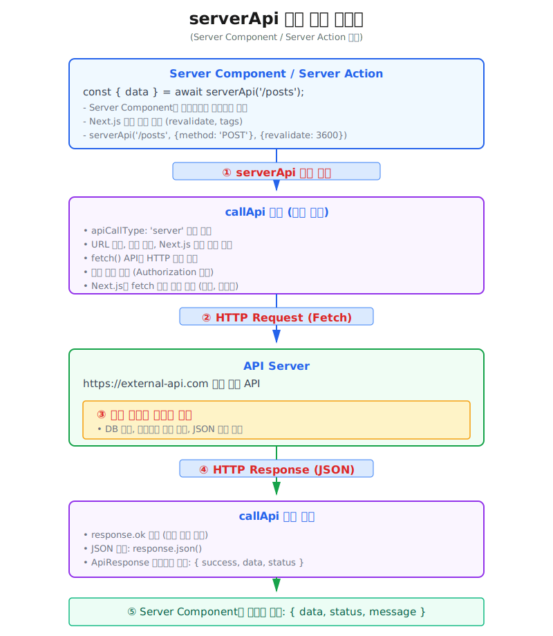

# serverApi
`serverApi` 함수는 **Server Component** 와 **Server Action**, **Route Handler** 에서 사용되는 서버 통신 함수입니다.
* `serverApi` 함수는 내부적으로 **fetch** 기반의 API 요청을 처리하며, Next.js의 강력한 데이터 캐싱 기능(revalidate, tags)을 활용할 수 있습니다.
* 이 함수는 서버 사이드에서 REST API를 호출할 때 일관된 인터페이스 제공과, Next.js의 캐싱 전략을 쉽게 적용할 수 있도록 하기위해 설계되었습니다.

:::tip <span class="admonition-title">fetch 함수의 'revalidate', 'tags'</span>옵션
* `revalidate`와 `tags` 옵션은 표준 Fetch API에는 없는 옵션이고, Next.js가 fetch 함수를 확장(패치)해서 추가한 옵션입니다.
* **서버 전용**: `revalidate`와 `tags` 옵션은 **Server Component**나 **Server Action**에서만 작동합니다
  - **revalidate**: 데이터의 캐시 재검증 주기를 초 단위로 설정합니다.
    - revalidate: 3600: 데이터를 3600초(1시간) 동안 캐시하고, 그 이후에는 재검증
    - revalidate: 0: 캐싱 비활성화 (매 요청마다 새로 fetch)
    - revalidate: false: 무기한 캐싱 (수동으로 재검증하기 전까지 계속 캐시 사용)
  - **tags**: 캐시된 데이터를 그룹화하여, 나중에 선택적으로 재검증(On-Demand Revalidation)할 수 있게 합니다.
    - tags: ['posts']: 데이터를 'posts' 태그로 캐시합니다.
    - tags: ['users']: 데이터를 'users' 태그로 캐시합니다.
    - tags: ['posts', 'users']: 데이터를 'posts'와 'users' 태그로 캐시합니다.
  - 설정된 **tags** 를 통해 캐시 무효화할 수 있습니다.
    ```ts
    // 'posts' 태그를 가진 모든 캐시 무효화
    revalidateTag('posts');
    ```
  - 사용 예시
    ```ts
    // 게시글 목록 - 'posts' 태그로 분류
    const posts = await serverApi('/api/posts', {}, { 
      revalidate: 3600, 
      tags: ['posts'] 
    });

    // 특정 게시글 - 'posts'와 게시글 ID로 분류
    const post = await serverApi(`/api/posts/${id}`, {}, { 
      revalidate: 3600, 
      tags: ['posts', `post-${id}`] 
    });
    ```
:::
:::warning <span class="admonition-title">revalidate, tags</span> 옵션 기본값
* `revalidate`옵션의 기본값은 **0** 입니다. 추 후 어떻게 조정할지 고민 필요.
:::





## 사용 예제
---
* [실제 동작 예제 보기: https://next-app-boilerplate.vercel.app/example/library-api/common/server-api](https://next-app-boilerplate.vercel.app/example/library-api/common/server-api)
```tsx
import { JSX } from 'react';
import { serverApi } from '@fetch/api';

// KoreanJSON API - Posts(업무 폴더 내부의 _types 폴더에 선언된 타입 사용)
// https://koreanjson.com/posts
export interface IPost {
  id: number;
  title: string;
  content: string;
  createdAt: string;
  updatedAt: string;
  UserId: number;
}

// 페이지 컴포넌트의 Props 타입 정의
export interface ISamplePageProps {
  // test?: string;
}

// 페이지 컴포넌트 함수
export default async function SamplePage({}: ISamplePageProps): Promise<JSX.Element> {
  // basic serverApi example ========================================================
  // serverApi 호출 (Server Component이므로 async/await 직접 사용 가능)
  // 캐싱 옵션: 60초 동안 캐시 유지 (ISR)
  const { data: postsData } = await serverApi<IPost[]>(
    '/posts',
    { method: 'GET' },
    { revalidate: 60 },
  );
  //==============================================================================

  return (
    <div>
      <p className="text-muted-foreground text-[1.05rem] text-balance sm:text-base h-40 overflow-y-auto">
        <code>{JSON.stringify(postsData || [], null, 2) || 'No data'}</code>
      </p>
    </div>
  );
}
```


## 사용법
---
* `serverApi` 훅을 import 합니다.
  ```tsx
  import { serverApi } from '@fetch/api';
  ```
* **Server Component** 나 **Server Action** 에서 `serverApi` 훅을 사용하여 API 호출을 수행합니다.
  ```tsx
  const { data: postsData } = await serverApi<IPost[]>(
    '/posts',
    { method: 'GET' },
    { revalidate: 60 },
  );
  ```
* 결과 데이터(`postsData`)를 활용하여 화면에서 서버 사이드 렌더링(SSR)을 하고 브라우저에 전달합니다.


## API 참조
---
### 타입
  ```typescript
  interface NextFetchRequestConfig {
    revalidate?: number | false
    tags?: string[]
  }

  export interface ApiRequestConfig {
    method?: 'GET' | 'POST' | 'PUT' | 'DELETE' | 'PATCH';
    headers?: Record<string, string>;
    body?: any;
    cache?: RequestCache;
    /** Query parameters (주로 GET 요청 시 사용) */
    params?: QueryParams;
    timeout?: number; // axios 옵션
    apiCallType?: 'client' | 'server'; // 내부 라우팅 제어용
  }

  // server 호출용 api config 타입 정의 (timeout, apiCallType 제외)
  type ServerApiRequestConfig = Omit<ApiRequestConfig, 'timeout' | 'apiCallType'> & {
    next?: NextFetchRequestConfig;
  };

  // highlight-start
  export async function serverApi<T = any>(
    endpoint: string,
    config: ServerApiRequestConfig = {},
    nextConfig: NextFetchRequestConfig = {},
  ): Promise<ApiResponse<T>> 
  // highlight-end
  ```


### 매개변수
  | Parameter  | Type                 | 필수 | 기본값  | 설명                        |
  | :--------- | :------------------- | :--- | :------ | :------------------------- |
  | endpoint   | string               | 필수 | -       | API 엔드포인트 URL (예: '/api/posts', '/users/1')   |
  | config     | ServerApiRequestConfig  | 선택 | -       | API 호출 옵션 객체 (아래 참조)    |
  | nextConfig | NextFetchRequestConfig  | 선택 | -       | Next.js 캐시 옵션 객체 (아래 참조)    |

  **config 객체 속성**
  | Property       | Type                          | 필수 | 기본값     | 설명                        |
  | :------------- | :---------------------------- | :--- | :--------- | :------------------------- |
  | method         | 'GET' \| 'POST' \| 'PUT' \| 'DELETE' \| 'PATCH'  | 선택 | -       | HTTP 메서드   |
  | headers        | Record\<string, string\>      | 선택 | undefined  | 커스텀 HTTP 헤더   |
  | body           | any                           | 선택 | undefined  | 요청 본문 데이터   |
  | cache          | RequestCache                  | 선택 | undefined  | 캐시 정책   |
  | params         | QueryParams                   | 선택 | undefined  | URL 쿼리 파라미터 객체   |
  | timeout        | number                        | 선택 | undefined  | 요청 타임아웃 (밀리초)   |

  **nextConfig 객체 속성**
  | Property       | Type                          | 필수 | 기본값     | 설명                        |
  | :------------- | :---------------------------- | :--- | :--------- | :------------------------- |
  | revalidate     | number \| false               | 선택 | undefined  | 재검증 간격 (초)   |
  | tags           | string[]                      | 선택 | undefined  | 캐시 태그   |