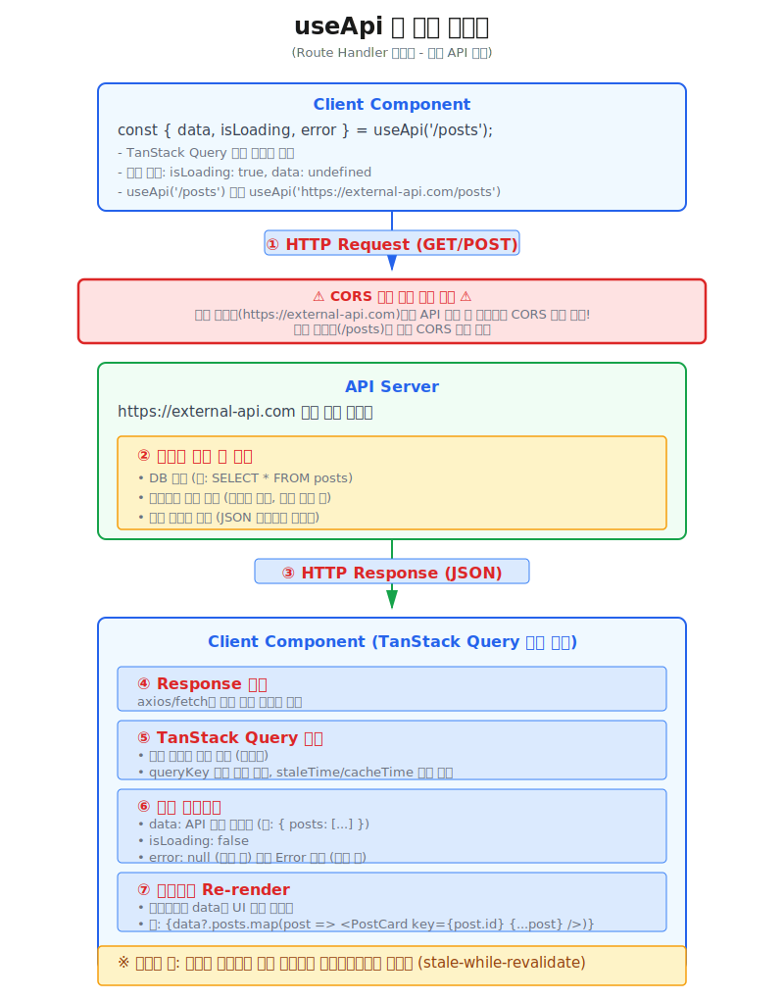
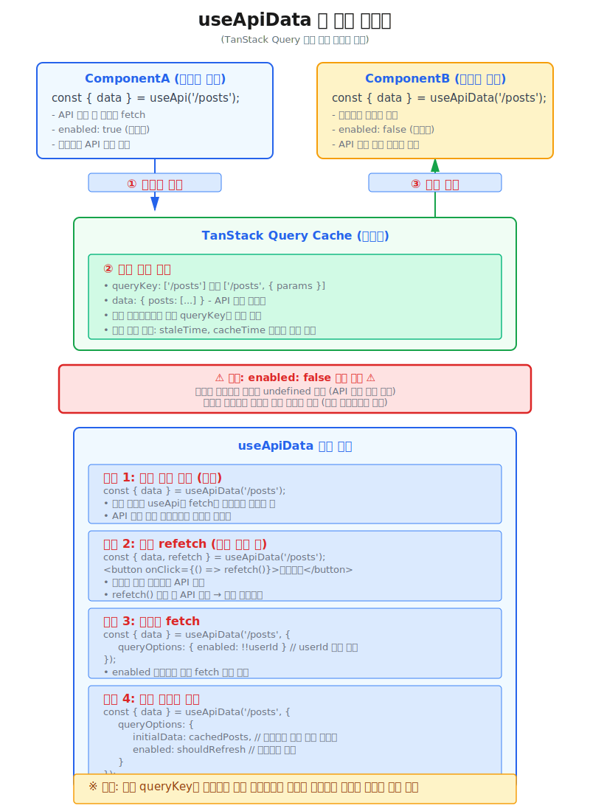

# hooks
**react-app-scaffold** 프로젝트에서 공통으로 제공하는 **hook** 함수 목록입니다.

:::warning 공통 hook 함수 사용 시 주의사항
* Hook 함수도 일반 Hook의 규칙을 따라야 합니다 (함수 컴포넌트 최상위에서만 호출 등).
* 공통 훅을 호출할 때마다 내부 state는 독립적으로 생성됩니다.
* 같은 커스텀 훅을 여러 곳에서 사용해도 state는 공유되지 않습니다.
:::


## 전체 목록
---
| Hook Name                                        | 설명                        |
| :----------------------------------------------- | :------------------------- |
| **[useApi](./global-hooks#useapi)**    | 업무 화면에서 **REST API**를 호출하고 결과값을 클라이언트 상태에 저장하는 함수. (상황에 따라 상태관리 라이브러리를 원하는 라이브러리로 사용하기 위한 공통 함수.)   |
| **[useApiData](./global-hooks#useapidata)**    | `useApi`를 통해 TanStack Query에 저장되어 있는 결과값을 가져오는 훅.   |
| **[useInterval](./global-hooks#useinterval)**    | 안전한 인터벌 관리를 이한 hook. 타이머, 폴링 등에 사용.   |
| **[useLocalStorage](./global-hooks#uselocalstorage)**    | 로컬스토리지 관리. 사용자설정, 테마, 토큰 등의 저장 시 유용.   |
| **[useReduxAPI](./global-hooks#usereduxapi)**    | 업무 화면에서 **REST API**를 호출하고 결과값을 Redux State에 저장하는 함수.   |
| **[useWindowSize](./global-hooks#usewindowsize)**    | 윈도우 크기 추적. 반응형 디자인의 화면 크기 처리용 hook함수.   |


## useApi
---
**TanStack Query(React Query)** 기반으로 구축된 **REST API 호출용 훅** 함수입니다.

* **useApi** 훅은 내부적으로 **axios** 또는 **fetch**를 활용하여 **GET, POST** HTTP 메서드를 사용하여 데이터를 조회합니다.
  * 데이터를 조회할 때만 **useApi** 훅을 사용하고, 데이터를 업데이트할 때는 **useApiMutation** 훅을 사용합니다.
* **TanStack Query(React Query)** 의 자동 캐싱, 로딩/에러 상태 관리, 백그라운드 재검증, refetch 등 강력한 데이터 페칭 기능을 제공하고, **TypeScript 제네릭**을 통해 API 응답 데이터의 타입 안정성을 보장합니다.
* **Client Component**에서 사용하는 REST API 호출용 훅 이므로 **호출 도메인이 다르면 CORS 이슈**가 발생할 수 있으며, Component가 모두 렌더링된 후 API 요청이 발생하므로 **SEO 최적화**에 부적합합니다.





#### ◉ 사용 예제
```tsx
'use client';

import { JSX } from 'react';
import { useApi } from '@hooks/api';

// 내부 API - Posts(업무 폴더 내부의 _types 폴더에 선언된 타입 사용)
export interface IPost {
  id: number;
  title: string;
  content: string;
  createdAt: string;
  updatedAt: string;
  UserId: number;
}

// 페이지 컴포넌트의 Props 타입 정의
export interface ISamplePageProps {
  // test?: string;
}

// 페이지 컴포넌트 함수
export default function SamplePage({}: ISamplePageProps): JSX.Element {
  // 내부 API 호출(/posts)
  // highlight-start
  const {
    data: postsData,
    error: postsError,
    isLoading: postsLoading,
  } = useApi<IPost[]>('/posts');
  // highlight-end
  return (
    <div>
      {
        postsLoading
          ? 'Loading...'
          : postsError
            ? 'Error: ' + JSON.stringify(postsError)
            : JSON.stringify(postsData || [], null, 2) || 'No data'
      }
    </div>
  );
}
```


#### ◉ 사용법
* **useApi** 훅을 import 합니다.
  ```tsx
  import { useApi } from '@hooks/api';
  ```
* **Client Component** 함수 최상위에서 **useApi** 훅을 호출합니다.
  - Client Component가 렌더링될 때 useApi가 자동으로 API 요청을 수행합니다.
  - **IPost** 타입을 제네릭으로 전달하여 반환값의 타입을 정의합니다. (업무 폴더 내부의 _types 폴더에 선언된 타입 사용)
  ```tsx
  export default function SamplePage(): JSX.Element {
    // useApi 훅을 호출하여 API 요청을 수행합니다.
    // highlight-start
    const {
      data: postsData,
      error: postsError,
      isLoading: postsLoading,
    } = useApi<IPost[]>('/posts');
    // highlight-end
    return (
      <div>
        {
          postsLoading
            ? 'Loading...'
            : postsError
              ? 'Error: ' + JSON.stringify(postsError)
              : JSON.stringify(postsData || [], null, 2) || 'No data'
        }
      </div>
    );
  }
  ```
* **useApi** 훅의 반환값은 **TanStack Query** 의 `useQuery` 훅의 반환값과 사용법과 내용이 동일합니다.
  - [TanStack Query - useQuery 반환값 참조](https://tanstack.com/query/latest/docs/framework/react/reference/useQuery)
  ```tsx
  const {
    data,
    dataUpdatedAt,
    error,
    errorUpdatedAt,
    failureCount,
    failureReason,
    fetchStatus,
    isError,
    isFetched,
    isFetchedAfterMount,
    isFetching,
    isInitialLoading,
    isLoading,
    isLoadingError,
    isPaused,
    isPending,
    isPlaceholderData,
    isRefetchError,
    isRefetching,
    isStale,
    isSuccess,
    isEnabled,
    promise,
    refetch,
    status,
  } = useQuery(
    {
      queryKey,
      queryFn,
      gcTime,
      enabled,
      networkMode,
      initialData,
      initialDataUpdatedAt,
      meta,
      notifyOnChangeProps,
      placeholderData,
      queryKeyHashFn,
      refetchInterval,
      refetchIntervalInBackground,
      refetchOnMount,
      refetchOnReconnect,
      refetchOnWindowFocus,
      retry,
      retryOnMount,
      retryDelay,
      select,
      staleTime,
      structuralSharing,
      subscribed,
      throwOnError,
    },
    queryClient,
  )
  ```

* **useApi**를 사용하면, 쿼리 함수의 반환 데이터와 각종 상태값(로딩, 에러, 성공 등)이 내부적으로 **TanStack Query 캐시**에 저장 및 관리됩니다. 따라서 동일한 **URL**(`queryKey`)로 여러 컴포넌트에서 데이터를 효율적으로 공유하거나 재사용할 수 있고, 네트워크 요청 최적화 및 캐싱, 상태 동기화가 자동으로 처리됩니다.
  
#### ◉ API 참조
* **타입**
  ```typescript
  import { type UseQueryResult } from '@tanstack/react-query';
  
  export interface IUseApiOptions<T> {
    /** HTTP Method (기본값: 'GET') */
    method?: THttpMethod;
    /** Query parameters (주로 GET 요청 시 사용) */
    params?: QueryParams;
    /** Request body (POST/PUT/PATCH/DELETE 요청 시 사용) */
    body?: Record<string, any>;
    /** Custom headers */
    headers?: Record<string, string>;
    /** React Query options (queryKey와 queryFn은 내부에서 자동 생성됨) */
    queryOptions?: Omit<UseQueryOptions<T, Error, T>, 'queryKey' | 'queryFn'>;
    /** Request timeout */
    timeout?: number;
    /** API Call Type (기본값: 'client') */
    apiCallType?: 'client' | 'server';
  }
  
  function useApi<T>(
    endpoint: string, 
    options?: IUseApiOptions<T>
  ): UseQueryResult<NoInfer<T>, Error>;
  ```

* **매개변수** 

  | Parameter  | Type                 | 필수 | 기본값  | 설명                        |
  | :--------- | :------------------- | :--- | :------ | :------------------------- |
  | endpoint   | string               | 필수 | -       | API 엔드포인트 URL (예: '/api/posts', '/users/1')   |
  | options    | IUseApiOptions\<T\>  | 선택 | -       | API 호출 옵션 객체 (아래 참조)   |

  **options 객체 속성**

  | Property       | Type                          | 필수 | 기본값     | 설명                        |
  | :------------- | :---------------------------- | :--- | :--------- | :------------------------- |
  | method         | THttpMethod                   | 선택 | 'GET'      | HTTP 메서드 ('GET', 'POST', 'PUT', 'PATCH', 'DELETE')   |
  | params         | QueryParams                   | 선택 | undefined  | URL 쿼리 파라미터 객체 (GET 요청 시 주로 사용)   |
  | body           | Record\<string, any\>         | 선택 | undefined  | 요청 본문 데이터 (POST/PUT/PATCH 요청 시 사용)   |
  | headers        | Record\<string, string\>      | 선택 | undefined  | 커스텀 HTTP 헤더   |
  | queryOptions   | Omit\<UseQueryOptions\<T, Error, T\>, 'queryKey' \| 'queryFn'\> | 선택 | undefined  | React Query 옵션 (enabled, staleTime, gcTime, refetchInterval 등)   |
  | timeout        | number                        | 선택 | undefined  | 요청 타임아웃 (밀리초)   |
  | apiCallType    | 'client' \| 'server'          | 선택 | 'client'   | API 호출 타입   |

* **반환값**  
**useApi** 훅은 TanStack Query의 `UseQueryResult<T, Error>` 객체를 반환합니다. 주요 속성은 다음과 같습니다:

  | 속성               | Type                   | 설명                        |
  | :----------------- | :--------------------- | :------------------------- |
  | data               | T \| undefined         | API 응답 데이터 (성공 시)   |
  | error              | Error \| null          | 에러 객체 (실패 시)   |
  | isLoading          | boolean                | 최초 로딩 중 여부   |
  | isFetching         | boolean                | 데이터 페칭 중 여부 (백그라운드 리페치 포함)   |
  | isSuccess          | boolean                | 요청 성공 여부   |
  | isError            | boolean                | 요청 실패 여부   |
  | refetch            | \(\) => Promise\<UseQueryResult\> | 수동으로 데이터 다시 가져오기   |
  | status             | 'pending' \| 'error' \| 'success' | 요청 상태   |
  | fetchStatus        | 'fetching' \| 'paused' \| 'idle' | 페칭 상태   |

  :::info <span class="admonition-title">TanStack Query UseQueryResult</span>.
  * 전체 반환값 속성은 [TanStack Query - useQuery 공식 문서](https://tanstack.com/query/latest/docs/framework/react/reference/useQuery)를 참조하세요.
  * `data`, `error`, `isLoading`, `isFetching`, `isSuccess`, `isError`, `refetch` 등의 속성을 통해 API 호출 상태와 결과를 관리할 수 있습니다.
  :::

* **사용 예시**
  ```tsx
  // 기본 사용
  const { data, error, isLoading } = useApi<IPost[]>('/posts');

  // 쿼리 파라미터 사용
  const { data } = useApi<IUser>('/users/1', {
    params: { include: 'profile' }
  });

  // POST 메서드 사용 (조회 시에만 useApi 사용)
  const { data } = useApi<IPost>('/posts', {
    method: 'POST',
    body: { title: '제목', content: '내용' }
  });

  // React Query 옵션 사용
  const { data, refetch } = useApi<IPost[]>('/posts', {
    queryOptions: {
      enabled: true,           // 자동 실행 여부
      staleTime: 5000,         // 5초 동안 데이터를 신선한 상태로 유지
      gcTime: 300000,          // 5분 후 캐시에서 제거
      refetchOnWindowFocus: true, // 윈도우 포커스 시 재요청
      refetchInterval: 10000,  // 10초마다 자동 재요청
    }
  });
  ```


## useApiData
---
**TanStack Query(React Query)** 에 캐시된 데이터를 읽어와서 데이터만 활용하기 위한 용도의 훅입니다.
* `useApi` 훅을 통해 사전에 특정 URL에 해당하는 캐시되어 있는 데이터가 있다면 `useApiData` 훅을 통해 데이터를 가져와서 사용할 수 있습니다.





## useInterval
---
안전한 인터벌 관리를 이한 hook. 타이머, 폴링 등에 사용.

#### ◉ 사용 예제
#### ◉ 사용법
#### ◉ API 참조


## useLocalStorage
---
로컬스토리지 관리. 사용자설정, 테마, 토큰 등의 저장 시 유용.

#### ◉ 사용 예제
#### ◉ 사용법
#### ◉ API 참조


## useReduxAPI
---
업무 화면 컴포넌트에서 **REST API**를 호출하고 결과값을 전역 Redux State에 저장하는 함수.

:::info <span class="admonition-title">Redux Toolkit</span>을 사용한 전역 상태 데이터 관리
* **REST API response** 데이터를 **Redux-Toolkit** 상태 관리 라이브러리를 사용하여 관리합니다.
* [Redux-Toolkit공식문서 : https://redux-toolkit.js.org/](https://redux-toolkit.js.org/)
* **REST API** 호출 및 결과 데이터 사용을 위한 **useReduxAPI** 훅을 사용하면 원하는 api url에서 비동기 데이터를 가져오고 클라이언트 전역 State에 저장합니다.
:::

#### ◉ 사용 예제
* [useReduxAPI 훅 예제 이동](http://redsky0212.dothome.co.kr/entec/react_assets/ex/#/example/use-redux-api-ex)

#### ◉ 사용법
:::tip <span class="admonition-title">useReduxAPI</span> 훅 사용을 위한 사전 준비 사항
* **useReduxAPI** 훅을 사용하여 **REST API**를 호출 하려면 몇가지 먼저 설정해줘야할 사항이 있습니다.
  - **API url 등록** : 업무 도메인의 **api 폴더**에, 사용할 api **url**을 등록해야 합니다. api url은 업무 백앤드 개발자에게 전달 받아야합니다.
  - **action 등록** : **url**이 등록 되었다면, **store 폴더**에 해당 url에 해당하는 **action**을 등록합니다.
* **url**과 **action** 이 모두 등록된 후 화면에서 실제로 사용하는 방법 예제는 [REST API 호출하기](../../../assets-docs/dev/use-rest-api.md) 에서 순서대로 확인할 수 있습니다.
:::

##### 1. `api/url.ts`파일에 api url 등록하기
* `api/url.ts` 파일은 REST API의 url 을 모아놓은 파일입니다. 각 업무 도메인 내부에 **api 폴더**가 존재합니다.
* 사용해야할 API url이 https://app.domain.com/api/v1/search 라고 가정했을 때 도메인(https://app.domain.com)은 빼고 하위 url만 입력합니다.
* 도메인(https://app.domain.com)은 추후 공통 영역(공통 개발자)에서 따로 설정합니다.
* API 이름은 **대문자**로 입력합니다.
  ```ts
  // api/url.ts파일
  // TEST 라는 api를 사용한다고 가정.

  // url의 타입을 선언
  export type TUrl = (typeof url)[keyof typeof url];

  const url = {
    TEST: '/api/v1/search',
    // 필요한 api url을 이곳에 계속 등록할 수 있습니다.
  } as const;
  export default url;
  ```

##### 2. `store/index.ts`파일에 action 등록
* `store/index.ts`파일은 REST API의 action을 생성하는 파일입니다.
* `url.ts`파일에 생성한 TEST API를 사용하여 다음 코드와 같이 test Action을 만듭니다.
  ```ts
  import type { IActionObject, IRootState } from '@/app/types/store';
  import url from '@/domains/example/api/url';

  export interface IExampleStore<T = IRootState> {
    test: T;
  }

  // Example Action 객체 ==============================================
  // 생성할 Store state의 이름을 정하고, 값으로 actionType과 url을 입력한다.
  // API호출이 아닌 경우에는 url을 입력 하지 않아도 된다.
  // actionType은 '{업무도메인 store이름}/{action이름}' 조합으로 생성합니다.
  const exampleAction: IExampleStore<IActionObject> = {
    test: { actionType: 'exampleStore/test', url: url.TEST },
  } as const;

  export default exampleAction;
  ```
  :::info 설명
  * `import url from '@/domains/example/api/url';` 이전에 생성한 url을 가져옵니다.
  * `export interface IExampleStore<T = IRootState> {}` Action의 구조를 타입(typescript)으로 설정한 부분, 타입명은 각 업무에 맞게 자유롭게 작성합니다. **action**이 하나 생성될 때 똑같이 타입도 하나 생성합니다.
  * `const accountAction: IAccountStore<IActionObject> = {` action 타입(IExampleStore)을 `IExampleStore<IActionObject>` 형태로 연결합니다.
  * `test: { actionType: 'exampleStore/test', url: url.TEST },` test Action을 한 줄 생성합니다.
    * **action 객체**는 **actionType**과 **url**로 이루어져 있습니다.
    * **actionType**은 `/src/shared/store/app-store-redux.ts`파일에 연결한 **store명**과 위에 입력한 **action이름**을 "/"로 조합하여 생성합니다. ex) "exampleStore/test"
    * **url**은 `api/url.ts`파일에 생성한 url을 가져와서 추가합니다 ex) url.TEST
    * 만약 REST API를 사용하지 않고 그냥 **전역 상태 관리를 위한 데이터만 저장**, 사용할 경우에는 **url**을 입력하지 않습니다.
  * `export default exampleAction;` 생성된 example업무의 exampleAction을 export default 합니다.
  :::

##### 3. 등록된 action을 이용하여 useReduxAPI 훅 사용 예제
* 화면 컴포넌트에서 **useReduxAPI** 훅을 사용하기 위한 기본 코드는 다음과 같습니다.
  ```tsx showLineNumbers
  import type { IComponent } from '@/app/types/common';
  import { JSX } from 'react';

  // useReduxAPI 훅 가져오기
  // highlight-start
  import { useReduxAPI } from '@/app/hooks';
  // highlight-end

  interface ISamplePageProps {
    test?: string;
  }

  const SamplePage: IComponent<ISamplePageProps> = (): JSX.Element => {
    // useReduxAPI 함수 파라미터로 actionType값을 입력합니다.
    // highlight-start
    const { data, fetch, setData } = useReduxAPI('exampleStore/test');
    // highlight-end

    return (
      <>
        <div>New Sample Page!!</div>
      </>
    );
  };

  SamplePage.displayName = 'SamplePage';
  export default SamplePage;
  ```

#### ◉ API 참조
* **타입**
  ```typescript
  interface IUseReduxAPI {
    data: { value: any, status: 'Loading' | 'Complete' | 'Fail' | '' };
    fetch: (arg: object): Promise<any>;
    setData: (data: any): void;
  };

  function useReduxAPI(actionType: string): IUseReduxAPI;
  ```

* **매개변수** 

  | Parameter            | Type    | 설명                        |
  | :------------------- | :------ | :------------------------- |
  | actionType           | string  | `/src/shared/store/app-store-redux.ts`파일에 연결한 **store명**과 **action이름**을 "/"로 조합하여 생성<br /> ex) 'exampleStore/test'   |

* **반환값**  
**useReduxAPI** 훅을 사용하면 `data`, `fetch`, `setData`를 가지는 Object를 반환합니다. ex) `{ data, fetch, setData }`

  | return object value    | Type    | 설명                        |
  | :------------------- | :------ | :------------------------- |
  | data           | \{ value: any, status: 'Loading' \| 'Complete' \| 'Fail' \| '' \};  | `fetch()` 호출 후 response 데이터와 status값이 들어있는 object 데이터   |
  | fetch           | \(arg: object\): Promise\<any\>;  | REST API를 호출하는 함수.   |
  | setData           | \(data: any\): void;  | REST API와는 상관없이 전역 상태(state)에 값을 저장하는 함수.    |


## useWindowSize
---
윈도우 크기 추적. 반응형 디자인의 화면 크기 처리용 hook함수.

#### ◉ 사용 예제
#### ◉ 사용법
#### ◉ API 참조


