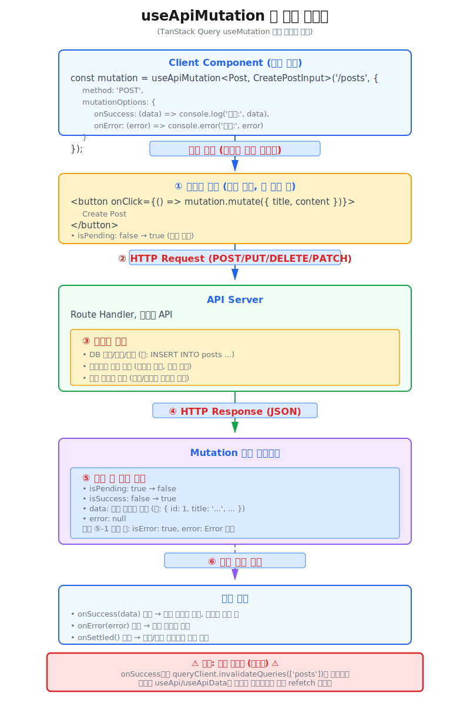

# useApiMutation
`useApiMutation` 훅은 **Client Component** 훅으로, 서버 상태 변경을 위한 범용 Mutation 함수입니다.
* `useApiMutation` 훅을 이용하여 서버 상태 데이터를 변경할 수 있습니다.




## 사용 예제
---
* [실제 동작 예제 보기: https://next-app-boilerplate.vercel.app/example/library-api/hooks/use-api-mutation](https://next-app-boilerplate.vercel.app/example/library-api/hooks/use-api-mutation)
```tsx
'use client';

import { JSX } from 'react';
// highlight-start
import { useApiMutation } from '@hooks/api';
// highlight-end
import { Button, Input } from '@components/ui';

// 내부 API - Posts(업무 폴더 내부의 _types 폴더에 선언된 타입 사용)
export interface IPost {
	id: number;
	title: string;
	content: string;
	createdAt: string;
	updatedAt: string;
	UserId: number;
}

// 페이지 컴포넌트의 Props 타입 정의
export interface ISamplePageProps {
	// test?: string;
}

// 페이지 컴포넌트 함수
export default function SamplePage({}: ISamplePageProps): JSX.Element {
  // useApiMutation 인스턴스 생성
  // highlight-start
  const createPostMutation = useApiMutation<IPost, { title: string; content: string }>('/posts', {
    method: 'POST',
    mutationOptions: {
      onSuccess: (data) => {
        console.log('Post created successfully!', data);
        // 캐시 무효화(선택적)
        createPostMutation.invalidateQueries('/posts');
      },
      onError: (error) => {
        console.error('Error creating post:', error);
      },
    },
  });
  // highlight-end
  // 입력 상태 관리
  const [title, setTitle] = useState('');
  const [content, setContent] = useState('');

  // 버튼 클릭 핸들러
  const handleMutate = () => {
    createPostMutation.mutate({
      title,
      content,
    });
  };

  return (
    <div>
      <Input
        type="text"
        placeholder="Title"
        value={title}
        onChange={(e) => setTitle(e.target.value)}
      />
      <Input
        type="text"
        placeholder="Content"
        value={content}
        onChange={(e) => setContent(e.target.value)}
      />
      <Button
        onClick={handleMutate}
        disabled={createPostMutation.isPending || !title || !content}
        className="w-full"
      >
        {createPostMutation.isPending ? 'Creating...' : 'Create Post'}
      </Button>
      {createPostMutation.isSuccess && (
        <div className="text-sm text-green-600 dark:text-green-400">✓ Post created successfully!</div>
      )}
    </div>
  );
}
```


## 사용법
---
* `useApiMutation` 훅을 import 합니다.
  ```tsx
  import { useApiMutation } from '@hooks/api';
  ```
* **Client Component** 함수 최상위에서 `useApiMutation` 훅 함수를 호출합니다.
  - **Client Component**가 렌더링될 때는 API 요청을 수행하지 않고, 데이터를 변경하는 함수를 반환합니다.
  - **IPost** 타입을 제네릭으로 전달하여 반환값의 타입을 정의합니다. (업무 폴더 내부의 _types 폴더에 선언된 타입 사용)
  ```tsx
  const createPostMutation = useApiMutation<IPost, { title: string; content: string }>('/posts', {
    method: 'POST',
    mutationOptions: {
      onSuccess: (data) => {
        console.log('Post created successfully!', data);
        // 캐시 무효화(선택적)
        createPostMutation.invalidateQueries('/posts');
      },
      onError: (error) => {
        console.error('Error creating post:', error);
      },
    },
  });
  ```
  - `mutationOptions` 옵션은 **TanStack Query** 의 `useMutation` 훅의 옵션과 동일합니다.
  - `onSuccess` 콜백 함수는 데이터 변경이 성공했을 때 호출됩니다. 여기서 `createPostMutation.invalidateQueries('/posts');` 코드는 해당 URL의 캐시를 무효화하는 코드입니다.
    - 서버 데이터가 성공적으로 변경이 이루어 졌다면 애플리케이션 내에 캐시를 무효화 하고자 하는 데이터를 무효화 하기 위해 `invalidateQueries` 함수를 호출합니다.
    - 캐시를 무효화 하지 않으면 애플리케이션 내에 캐시된 데이터와 서버 데이터가 일치하지 않는 문제가 발생할 수 있습니다. 물론 화면 전환이 되거나 데이터 조회 훅을 호출하면 캐시된 데이터를 다시 조회하게 되므로 문제는 없습니다. 하지만 현재 화면에 가만히 있는 경우에는 변경된 데이터 refetch 되지 않습니다.
* `useApiMutation` 훅 함수는 **TanStack Query** 의 `useMutation` 훅 함수의 반환값과 내용, 사용법이 동일합니다.
  - [TanStack Query - useMutation 반환값 참조](https://tanstack.com/query/latest/docs/framework/react/reference/useMutation)
  ```tsx
  const {
    data,
    error,
    isError,
    isIdle,
    isPending,
    isPaused,
    isSuccess,
    failureCount,
    failureReason,
    mutate,
    mutateAsync,
    reset,
    status,
    submittedAt,
    variables,
  } = useMutation(
    {
      mutationFn,
      gcTime,
      meta,
      mutationKey,
      networkMode,
      onError,
      onMutate,
      onSettled,
      onSuccess,
      retry,
      retryDelay,
      scope,
      throwOnError,
    },
    queryClient,
  )

  // mutate 함수
  mutate(variables, {
    onError,
    onSettled,
    onSuccess,
  })
  ```


## API 참조
---
### 타입
  ```typescript
  import { type UseMutationResult } from '@tanstack/react-query';
  
  function useApiMutation<TData = unknown, TVariables = unknown>(
    endpoint: string,
    options?: IUseApiOptions<TData, TVariables>
  ): UseMutationResult<TData, Error, TVariables>;
  ```

### 매개변수

  | Parameter  | Type                 | 필수 | 기본값  | 설명                        |
  | :--------- | :------------------- | :--- | :------ | :------------------------- |
  | endpoint   | string               | 필수 | -       | API 엔드포인트 URL (예: '/api/posts', '/users/1')   |
  | options    | IUseApiOptions\<TData, TVariables\>  | 선택 | -       | API 호출 옵션 객체 (아래 참조)   |

  **options 객체 속성**

  | Property       | Type                          | 필수 | 기본값     | 설명                        |
  | :------------- | :---------------------------- | :--- | :--------- | :------------------------- |
  | method         | THttpMethod                   | 선택 | 'GET'      | HTTP 메서드 ('POST', 'PUT', 'DELETE', 'PATCH') 업데이트용 API 호출 시 사용   |
  | params         | QueryParams                   | 선택 | undefined  | URL 쿼리 파라미터 객체    |
  | body           | Record\<string, any\>         | 선택 | undefined  | 요청 본문 데이터    |
  | headers        | Record\<string, string\>      | 선택 | undefined  | 커스텀 HTTP 헤더   |
  | mutationOptions   |  Omit\<UseMutationOptions\<TData, Error, TVariables\>, 'mutationKey' \| 'mutationFn'\> | 선택 | undefined  | **TanStack Query** 의 `useMutation` 훅 옵션   |
  | timeout        | number                        | 선택 | undefined  | 요청 타임아웃 (밀리초)   |

### 반환값

  | Property | Type | 설명 |
  |:---------|:-----|:-----|
  | mutate | 함수 | Mutation을 트리거하는 함수 |
  | mutateAsync | 함수 | Promise를 반환하는 Mutation 함수 |
  | status | string | 'idle' \| 'pending' \| 'error' \| 'success' |
  | isIdle | boolean | status === 'idle' |
  | isPending | boolean | status === 'pending' |
  | isError | boolean | status === 'error' |
  | isSuccess | boolean | status === 'success' |
  | isPaused | boolean | Mutation이 일시 중지된 상태 |
  | data | TData \| undefined | 성공적으로 반환된 데이터 |
  | error | TError \| null | 에러 객체 |
  | reset | 함수 | Mutation 상태를 초기화하는 함수 |
  | failureCount | number | Mutation 실패 횟수 |
  | failureReason | TError \| null | Mutation 재시도 실패 이유 |
  | submittedAt | number | Mutation이 제출된 타임스탬프 |
  | variables | TVariables \| undefined | mutationFn에 전달된 변수 |