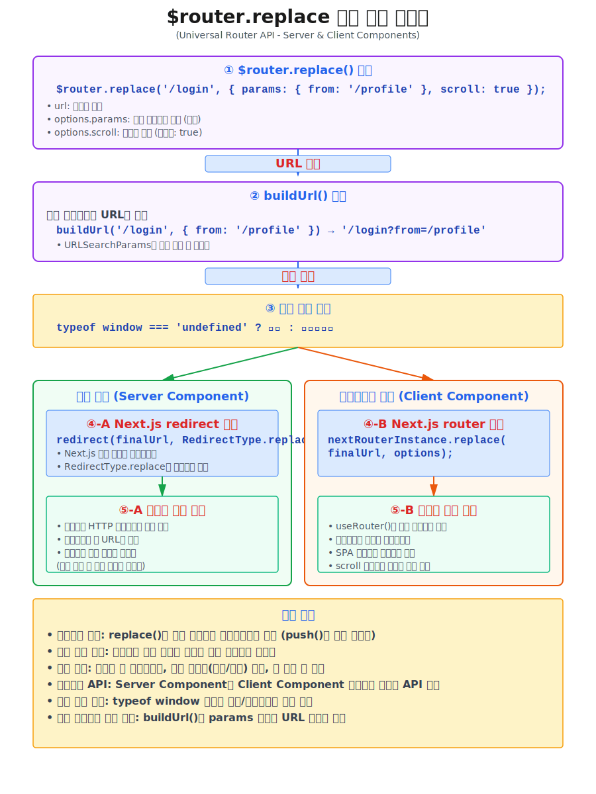
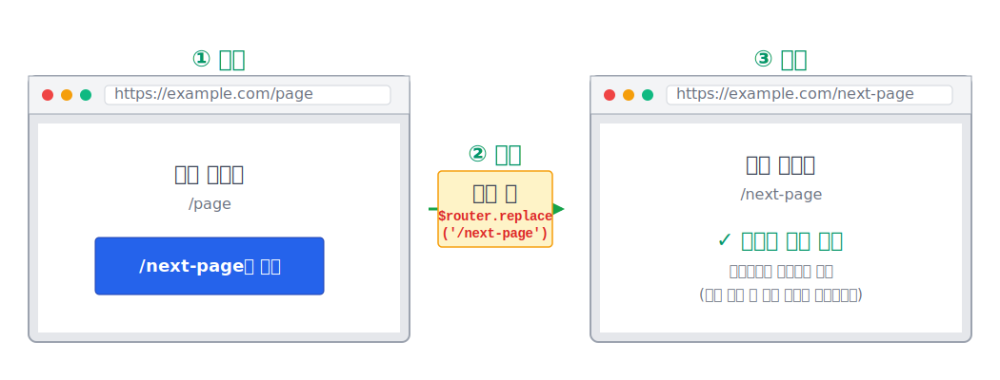

# $router.replace()
* 페이지 이동을 위한 `redirect`와 `router.push`를 통합한 `$router` 전역 객체의 **push()** 메서드입니다.
* 클라이언트 환경에서는 내부적으로 Next.js의 useRouter를 자동으로 사용하여 SPA 네비게이션을 지원하고, 서버 환경에서는 내부적으로 `redirect`를 사용하여 페이지 이동을 지원합니다.





## 기본 사용법
---
```tsx
import { $router } from '@router';

// 페이지 이동 (히스토리 추가되지 않음. 이전 history를 덮어씌움)
$router.replace('/next-page');
```
:::info <span class="admonition-title">$router.replace()</span> 실제 구동 예제 확인해보기
👉 [$router.replace(): https://react-app-scaffold.vercel.app/example/library-api/router/replace](https://react-app-scaffold.vercel.app/example/library-api/router/replace)
:::


## 결과 화면
---




## 타입
---
```ts
// 페이지 이동 (히스토리 대체)
$router.replace(url: string, options?: RouterOptions)

interface RouterOptions {
  scroll?: boolean;
  params?: Record<string, any>;
}
```


## 매개 변수
---
* **url** : `string` 타입의 페이지 이동 주소.
* **options** : `RouterOptions` 타입의 옵션 객체.
  - **scroll** : `boolean` 타입의 스크롤 위치 유지 여부를 설정할 수 있습니다. 기본값은 `true`이고 `true`이면 스크롤이 맨 위로 이동합니다.
  - **params** : `Record<string, any>` 타입의 파라미터를 전달할 수 있습니다.
    - 파라미터 이름과 값을 전달할 수 있습니다.
    - 예시
      ```ts
      {
        id: 1,
        name: 'John',
      }
      ```


<!-- ## 반환값
--- -->


## 예제
---
### 페이지 이동 시 스크롤 위치 유지 여부 설정
```tsx
// 페이지 이동 시 스크롤 위치 유지하기
$router.replace('/next-page', { scroll: false });
```

### 페이지 이동 시 파라미터 전달
```tsx
// 페이지 이동 시 파라미터 전달하기
// /next-page?id=1&name=John 형태로 파라미터가 전달됩니다.
$router.replace('/next-page', { params: { id: 1, name: 'John' } });
```