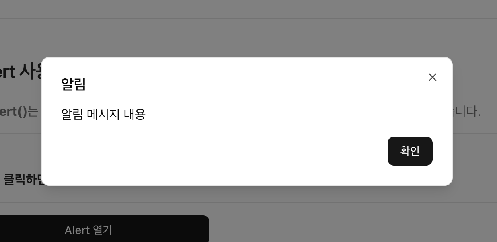

# $ui.alert()

`$ui.alert()` 함수는 **Client Component** 전용 이며, **Alert Dialog** 형태의 UI를 띄워 사용자에게 중요한 정보를 전달하는데 사용됩니다.  
전역 공통 Component이기 때문에 따로 **import** 하지 않아도 됩니다.


## 기본 사용법
---
```tsx
'use client';

import { Button } from '@components/ui';

function SamplePage() {
  const alert = useRef<IAlertControl>(null);

  // 기본 사용법
  const handlerOpenAlert = async () => {
    // 1. $ui.alert() 함수 호출
    // highlight-start
    alert.current = $ui.alert('알림 메시지 내용');
    // highlight-end

    // 2. promise 객체의 action 값에 따라 다른 작업 수행하기
    // highlight-start
    const result = await alert.current?.promise;
    if (result.action === 'confirm') {
      console.log('확인됨:', result.action);
    } else if (result.action === 'close') {
      console.log('닫기, ESC 또는 오버레이 클릭');
    }
  };

  return (
    <div>
      <Button onClick={handlerOpenAlert}>Alert 열기</Button>
    </div>
  );
}
```


## 결과 화면
---



## 타입
---
```typescript
/** 
 * Alert Dialog를 띄워주는 함수.
 * @param message 알림 메시지 내용.
 * @param options 알림 메시지에 대한 옵션 객체.
 * @returns Alert Dialog를 조작할 수 있는 제어 객체.
 */
$ui.alert(
  message?: ReactNode | string,
  options?: IAlertOptions,
) => IAlertControl;

export interface IAlertOptions {
  type?: 'success' | 'info' | 'warning' | 'error';
  title?: ReactNode | string;
  description?: ReactNode | string;
  autoDismiss?: number;
  confirmText?: string;
  className?: string;
  showConfirm?: boolean;
}

export interface IAlertControl {
  promise: Promise<IAlertResult>;
  close: () => void;
}

export interface IAlertResult {
  action: 'confirm' | 'close';
}
```


## 매개 변수
---
* **message** : `ReactNode | string` 타입의 알림 메시지 내용.
  - 알림 메시지 내용. 메시지 내용을 문자열로 전달하거나, **ReactNode** 객체로 전달할 수 있습니다.
  `$ui.alert(<div style={{ color: 'red' }}>알림 메시지 내용</div>);`
* **options** : `IAlertOptions` 타입의 옵션 객체.
  - 알림 메시지에 대한 옵션 객체.

  | 옵션명      | 설명              |
  | :---------- | :---------------- |
  | type        | 알림 메시지 타입. `success`, `info`, `warning`, `error` 중 하나의 값을 가집니다. `success`는 성공 메시지, `info`는 정보 메시지, `warning`는 경고 메시지, `error`는 오류 메시지를 나타냅니다. |
  | title       | 알림 메시지의 제목. |
  | description | 알림 메시지의 설명. |
  | autoDismiss | 알림 메시지가 자동으로 닫히는 시간(ms). |
  | confirmText | 확인 버튼의 텍스트. |
  | className   | 알림 메시지의 CSS 클래스 적용. |
  | showConfirm | 확인 버튼 표시 여부. |


## 반환 값
---
* **반환 값** : `IAlertControl` 타입의 반환 객체.
  - Alert을 선언할 때 반환되는 객체를 통해 조작할 수 있습니다.
  ```typescript
  export interface IAlertControl {
    promise: Promise<IAlertResult>;
    close: () => void;
  }

  export interface IAlertResult {
    action: 'confirm' | 'close';
  }
  ```
  | 반환 값명      | 설명              |
  | :---------- | :---------------- |
  | promise   | Alert의 프로미스 객체. 알림 메시지가 닫힐 때 resolve 되는 객체이며, `action` 값을 반환합니다.<br />* **`action`**: 팝업이 닫힐 때 어떤 액션으로 닫힌 것인지를 나타내는 값. `confirm`, `close` 중 하나의 값을 가집니다. |
  | close   | Alert를 닫는 함수. |


## 예제
---
