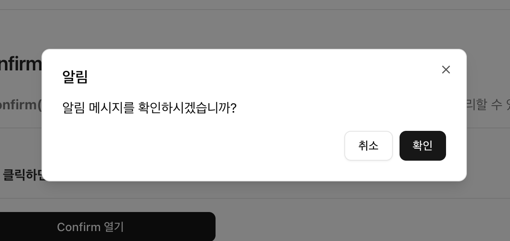

# $ui.confirm()

`$ui.confirm()` 함수는 **Client Component** 전용 이며, 사용자에게 작업을 확인하거나 취소할 수 있는 선택권을 제공하는 **Confirm Dialog** 형태의 UI 컴포넌트입니다.  
전역 공통 Component이기 때문에 따로 **import** 하지 않아도 됩니다.


## 기본 사용법
---
```tsx
'use client';

import { Button } from '@components/ui';

function SamplePage() {
  const confirm = useRef<IConfirmControl>(null);

  // 기본 사용법
  const handlerOpenConfirm = async () => {
    // 1. $ui.confirm() 함수 호출
    // highlight-start
    confirm.current = $ui.confirm('알림 메시지를 확인하시겠습니까?');
    // highlight-end

    // 2. promise 객체의 action 값에 따라 다른 작업 수행하기
    const result = await confirm.current?.promise;
    if (result.action === 'confirm') {
      console.log('확인됨:', result.action);
    } else if (result.action === 'cancel') {
      console.log('취소됨:', result.action);
    } else if (result.action === 'close') {
      console.log('닫기, ESC 또는 오버레이 클릭');
    }
  };

  return (
    <div>
      <Button onClick={handlerOpenConfirm}>Confirm 열기</Button>
    </div>
  );
}
```


## 결과 화면
---



## 타입
---
```typescript
/** 
 * Confirm Dialog를 띄워주는 함수.
 * @param message 확인 메시지 내용.
 * @param options 확인 메시지에 대한 옵션 객체.
 * @returns Confirm Dialog를 조작할 수 있는 제어 객체.
 */
$ui.confirm(
	message?: ReactNode | string,
	options?: IConfirmOptions,
) => IConfirmControl;

export interface IConfirmOptions {
	type?: 'success' | 'info' | 'warning' | 'error';
	title?: ReactNode | string;
	description?: ReactNode | string;
	confirmText?: string;
	cancelText?: string;
	className?: string;
}

export interface IConfirmControl {
	promise: Promise<IConfirmResult>;
	close: () => void;
}
export interface IConfirmResult {
	action: 'confirm' | 'close' | 'cancel';
}
```


## 매개 변수
---
* **message** : `ReactNode | string` 타입의 확인 메시지 내용.
  - 확인 메시지 내용. 메시지 내용을 문자열로 전달하거나, **ReactNode** 객체로 전달할 수 있습니다.
  `$ui.confirm(<div style={{ color: 'red' }}>확인 메시지 내용</div>);`
* **options** : `IConfirmOptions` 타입의 옵션 객체.
  - 확인 메시지에 대한 옵션 객체.

  | 옵션명      | 설명              |
  | :---------- | :---------------- |
  | type        | 확인 메시지 타입. `success`, `info`, `warning`, `error` 중 하나의 값을 가집니다. `success`는 성공 메시지, `info`는 정보 메시지, `warning`는 경고 메시지, `error`는 오류 메시지를 나타냅니다. |
  | title       | 확인 메시지의 제목. |
  | description | 확인 메시지의 설명. |
  | confirmText | 확인 버튼의 텍스트. |
  | cancelText | 취소 버튼의 텍스트. |
  | className   | 확인 메시지의 CSS 클래스 적용. |


## 반환 값
---
* **반환 값** : `IConfirmControl` 타입의 반환 객체.
  - Confirm을 선언할 때 반환되는 객체를 통해 조작할 수 있습니다.
  ```typescript
  export interface IConfirmControl {
    promise: Promise<IConfirmResult>;
    close: () => void;
  }

  export interface IConfirmResult {
    action: 'confirm' | 'close' | 'cancel';
  }
  ```
  | 반환 값명      | 설명              |
  | :---------- | :---------------- |
  | promise   | Confirm의 프로미스 객체. 확인 메시지가 닫힐 때 resolve 되는 객체이며, `action` 값을 반환합니다.<br />* **`action`**: 팝업이 닫힐 때 어떤 액션으로 닫힌 것인지를 나타내는 값. `confirm`, `cancel`, `close` 중 하나의 값을 가집니다. |
  | close   | Confirm를 닫는 함수. |


## 예제
---
