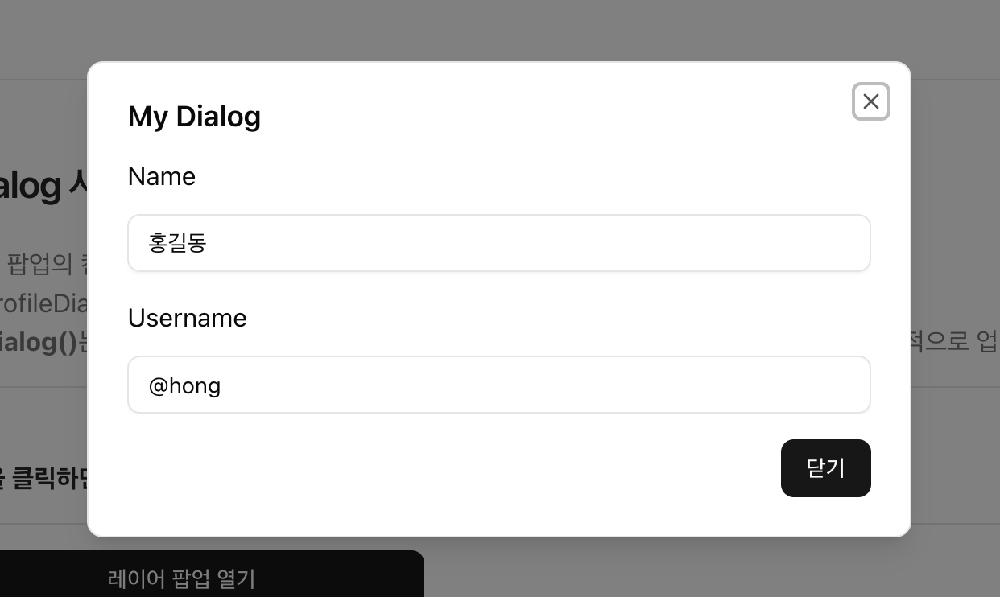
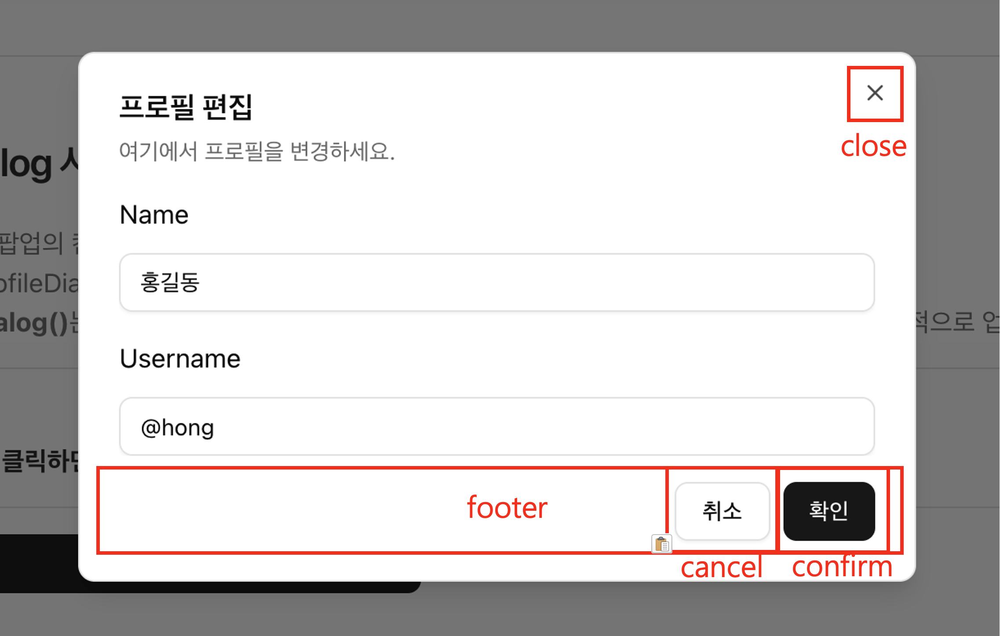

# $ui.dialog()

`$ui.dialog()` 함수는 **Client Component** 전용 레이어 팝업을 띄워주는 함수입니다.  
전역 공통 Component이기 때문에 따로 **import** 하지 않아도 됩니다.


## 기본 사용법
---
```tsx
'use client';

// 레이어 팝업에서 컨텐츠 영역에 렌더링 할 컴포넌트.
import MyComponent from '../MyComponent';

$ui.dialog({
  component: MyComponent, // 레이어 팝업에서 컨텐츠 영역에 렌더링 할 컴포넌트.
  title: 'My Dialog',     // 레이어 팝업의 제목.
  props: {                // 컴포넌트에 전달할 Props.
    name: '홍길동',
    username: '@hong',
  },
});
```


## 결과 화면
---



## 타입
---
```typescript
/** 
 * 레이어 팝업을 띄워주는 함수.
 * @param options 레이어 팝업에 대한 옵션 객체.
 * @returns 레이어 팝업을 조작할 수 있는 제어 객체.
 */
$ui.dialog<P>(options: IDialogOptions): IDialogControl<P>;

export interface IDialogOptions<P = any> {
  component?: ComponentType<P & IDialogComponentProps>;
  props?: Omit<P, keyof IDialogComponentProps>;
  title?: ReactNode | string;
  description?: ReactNode | string;
  className?: string;
  showCloseButton?: boolean;
  footer?: {
    confirmText?: string;
    cancelText?: string;
  };
  onConfirm?: (data?: any) => void;
  onCancel?: (data?: any) => void;
}

export interface IDialogControl<P = any> {
  promise: Promise<IDialogResult>;
  update: (newProps: Partial<Omit<P, keyof IDialogComponentProps>>) => void;
  close: () => void;
}

export interface IDialogResult<T = any> {
  action: 'confirm' | 'close' | 'cancel';
  data?: T;
}
```


## 매개 변수
---
* **options** : `IDialogOptions` 타입의 옵션 객체.
  - 레이어 팝업에서 사용할 컴포넌트, 컴포넌트에 전달할 Props, 레이어 팝업의 제목, 설명, 확인 버튼 클릭 시 실행할 함수, 취소 버튼 클릭 시 실행할 함수 등을 설정할 수 있습니다.

  | 옵션명      | 설명              |
  | :---------- | :---------------- |
  | component   | 레이어 팝업에서 컨텐츠 영역에 렌더링 할 컴포넌트. |
  | props       | 컴포넌트에 전달할 Props. |
  | title       | 레이어 팝업의 제목. |
  | description | 레이어 팝업의 설명. |
  | className   | 레이어 팝업의 CSS 클래스 적용. |
  | footer      | 레이어 팝업의 푸터 영역. `{ confirmText: string; cancelText: string; }` footer 객체로 확인 버튼과 취소 버튼의 텍스트를 설정하면 확인 버튼과 취소 버튼이 화면에 표시됩니다. |
  | onConfirm   | 확인 버튼 클릭 시 실행할 함수. |
  | onCancel    | 취소 버튼 클릭 시 실행할 함수. |
 


## 반환 값
---
* **반환 값** : `IDialogControl<P>` 타입의 반환 객체.
  - 레이어 팝업을 선언할 때 반환되는 객체를 통해 레이어 팝업을 조작할 수 있습니다.
  ```typescript
  export interface IDialogControl<P = any> {
    promise: Promise<IDialogResult>;
    update: (newProps: Partial<Omit<P, keyof IDialogComponentProps>>) => void;
    close: () => void;
  }

  export interface IDialogResult<T = any> {
    action: 'confirm' | 'close' | 'cancel';
    data?: T;
  }
  ```
  | 반환 값명      | 설명              |
  | :---------- | :---------------- |
  | promise   | 레이어 팝업의 프로미스 객체. 팝업이 닫힐 때 resolve 되는 객체이며, `action`, `data` 값을 반환합니다.<br />* **`action`**: 팝업이 닫힐 때 어떤 액션으로 닫힌 것인지를 나타내는 값. `confirm`, `close`, `cancel` 중 하나의 값을 가집니다.<br />* **`data`**: 팝업이 닫힐 때 전달된 데이터. |
  | update   | 레이어 팝업의 컴포넌트에 전달할 Props를 업데이트 하는 함수. Props의 값이 변경되어 팝업의 컨텐츠에도 반영하고 싶을 때 사용합니다. |
  | close   | 레이어 팝업을 닫는 함수. |
 


## 예제
---

### 팝업 닫힐 때 반환값 `action`에 따라 다른 작업 수행하기
* promise 객체의 `action` 값을 참조한 방법.
  ```tsx
  $ui.dialog({
    component: EditProfileDialog,
    title: '프로필 편집',
    description: '여기에서 프로필을 변경하세요.',
    props: {},
    footer: {
      confirmText: '확인',
      cancelText: '취소',
    },
  }).promise.then((result: IDialogResult) => {
    if (result.action === 'confirm') {
      console.log('확인 버튼 클릭:', result.data);
    } else if (result.action === 'close') {
      console.log('닫기, ESC 또는 오버레이 클릭');
    } else if (result.action === 'cancel') {
      console.log('취소 버튼 클릭');
    }
  });
  ```



### 부모창에 데이터 전달하기
* 팝업 내부에서 확인 버튼 또는 취소 버튼 클릭 시 promise 객체의 `data`값을 전달하는 방법
* **footer**에 생성된 확인 버튼에서는 `data`값을 전달하지 못합니다. 따라서 `data`값을 전달하고 싶다면 컨텐츠 컴포넌트 내부에서 `onConfirm`, `onCancel` 이벤트 함수를 정의하여 전달 해야 합니다.
  ```tsx
  dialog.current = $ui.dialog({
      component: EditProfileDialog,
      title: '프로필 편집',
      description: '여기에서 프로필을 변경하세요.',
      props: {},
      footer: {
        confirmText: '확인',
        cancelText: '취소',
      },
      // 1. onConfirm, onCancel 이벤트 함수 정의에서 data 값을 전달 반는 방법.
      // highlight-start
      onConfirm: (data?: any) => {
        console.log('확인됨:', data);
      },
      onCancel: (data?: any) => {
        console.log('취소됨:', data);
      },
      // highlight-end
    });

    // 2. promise 객체의 `data`값을 사용하는 방법
    // highlight-start
    const result = await dialog.current?.promise;
    if (result.action === 'confirm') {
      console.log('확인됨:', result.data);
    } else if (result.action === 'close') {
      console.log('닫기 버튼 클릭');
    } else if (result.action === 'cancel') {
      console.log('취소됨:', result.data);
    }
    // highlight-end
  };

  // =======================================================
  // EditProfileDialog 컴포넌트 내부에서 onConfirm, onCancel 이벤트 함수 정의
  // =======================================================
  interface IEditProfileDialogProps {
    onCancel: (data?: any) => void;
    onConfirm: (data?: any) => void;
  }

  export default function EditProfileDialog({ onCancel, onConfirm }: IEditProfileDialogProps): JSX.Element {

    const handlerCancel = () => {
      onCancel?.('22222222'); // data 전달  
    };

    const handlerConfirm = () => {
      onConfirm?.('33333333');  // data 전달
    };

    return (
      <>
        <div className="space-y-4">
          <div className="space-y-2 max-h-80 overflow-y-auto">
            <div className="grid gap-4">
              <div className="grid gap-3">
                <label htmlFor="name-1">Name</label>
                <Input
                  id="name-1"
                  name="name"
                  defaultValue="홍길동"
                />
              </div>
              <div className="grid gap-3">
                <label htmlFor="username-1">Username</label>
                <Input
                  id="username-1"
                  name="username"
                  defaultValue="@hong"
                />
              </div>
            </div>
          </div>

          <div className="flex justify-end">
            <Button onClick={handlerConfirm}>확인</Button>
            <Button onClick={handlerCancel}>취소</Button>
          </div>
        </div>
      </>
    );
  }
  ```