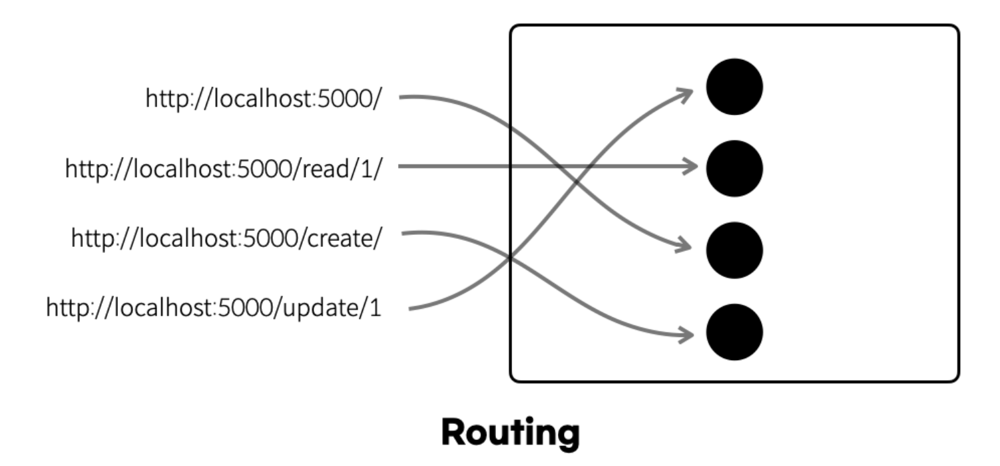

# $router
* **next-app-boilerplate**를 이용하여 애플리케이션 개발 시 사용할 수 있는 **$router** 전역 객체입니다.
* 전역 공통 객체이기 때문에 따로 **import** 하지 않고 바로 사용합니다.
* **$router** 객체는 내부적으로 **React Router**를 사용하는 전역 공통 객체입니다.


## $router 의 라우팅 이해



## $router 목록
---
| Hook Name                                        | 설명                        |
| :----------------------------------------------- | :------------------------- |
| **[push](./global-router#routerpush)**    | **Route주소(path)** 를 이용하여 각각의 콘텐츠로 이동 시켜주는 push() 메서드입니다.   |
| **[goBack](./global-router#routergoback)**    | 지금까지 이동한 라우터 **history stack**의 현재 위치에서 한단계 앞으로 이동하는 메서드 입니다.   |
| **[getLocation](./global-router#routergetlocation)**    | **React Router**의 **location**객체를 가져오는 메서드입니다.   |
| **[getNavigation](./global-router#routergetnavigation)**    | **React Router**의 **navigation**객체를 가져오는 메서드입니다.   |


## $router.push()
---
* **Route주소(path)** 를 이용하여 각각의 콘텐츠로 이동 시켜주는 push() 메서드입니다.
* **$router.push()** 메서드의 타입
  ```ts
  push(path: string, options?: any);
  ```
* 사용 예시
  ```tsx showLineNumbers
      import type { IComponent } from '@/app/types/common';
      import { Button } from '@/app/components/ui';

      interface ISamplePageProps {
        //
      }

      const SamplePage: IComponent<ISamplePageProps> = () => {

        // 다른 화면으로 이동하는 버튼 클릭 이벤트 핸들러
        const goPageHandler = () => {
          // 다른 화면으로 이동(원하는 페이지의 라우터 path를 매개변수로 넘겨준다)
          // highlight-start
          $router.push('/next-page');
          // highlight-end
        };

        return (
          <>
            <Button
              variant="default"
              onClick={goPageHandler}
            >
              화면 이동
            </Button>
          </>
        );
      };

      SamplePage.displayName = 'SamplePage';
      export default SamplePage;
      ```


## $router.goBack()
---
* 지금까지 이동한 라우터 **history stack**의 현재 위치에서 한단계 앞으로 이동하는 메서드 입니다.


## $router.getLocation()
---
* **React Router**의 **location**객체를 가져오는 메서드입니다.


## $router.getNavigation()
---
* **React Router**의 **navigation**객체를 가져오는 메서드입니다.