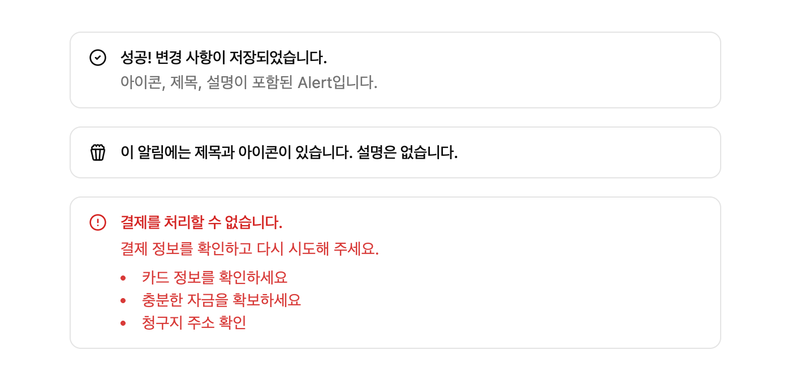

# Alert
**Alert** 컴포넌트는 화면에 중요한 정보나 상태를 사용자에게 알리는 알림 메시지 박스입니다. 성공, 경고, 오류 등의 다양한 상황에 맞는 스타일을 제공하며, 제목과 설명을 포함하여 정보를 명확하게 전달할 수 있습니다.
:::note 예제
* **Alert 실제 구동 예제를 확인해보기** : → [http://redsky0212.dothome.co.kr/entec/react_assets/ex/#/example/components/alert](http://redsky0212.dothome.co.kr/entec/react_assets/ex/#/example/components/alert)
:::

import Tabs from '@theme/Tabs';
import TabItem from '@theme/TabItem';

<Tabs>
  <TabItem value="Preview" label="Preview" default>
    
  

  </TabItem>
  <TabItem value="Code" label="Code">
    ```tsx showLineNumbers
    import type { IComponent } from '@/app/types/common';
    import { CheckCircle2Icon, PopcornIcon, AlertCircleIcon } from 'lucide-react';
    // highlight-start
    import { Alert, AlertTitle, AlertDescription } from '@/app/components/ui';
    // highlight-end

    interface ISampleAlertPageProps {
      //
    }

    const SampleAlertPage: IComponent<ISampleAlertPageProps> = () => {
      return (
        <>
          {/* highlight-start */}
          <Alert>
            <CheckCircle2Icon />
            <AlertTitle>성공! 변경 사항이 저장되었습니다.</AlertTitle>
            <AlertDescription>아이콘, 제목, 설명이 포함된 Alert입니다.</AlertDescription>
          </Alert>
          <Alert>
            <PopcornIcon />
            <AlertTitle>이 알림에는 제목과 아이콘이 있습니다. 설명은 없습니다.</AlertTitle>
          </Alert>
          <Alert variant="destructive">
            <AlertCircleIcon />
            <AlertTitle>결제를 처리할 수 없습니다.</AlertTitle>
            <AlertDescription>
              <p>결제 정보를 확인하고 다시 시도해 주세요.</p>
              <ul className="list-inside list-disc text-sm">
                <li>카드 정보를 확인하세요</li>
                <li>충분한 자금을 확보하세요</li>
                <li>청구지 주소 확인</li>
              </ul>
            </AlertDescription>
          </Alert>
          {/* highlight-end */}
        </>
      );
    };

    SampleAlertPage.displayName = 'SampleAlertPage';
    export default SampleAlertPage;
    ```
  </TabItem>
</Tabs>


## 사용법
---

* 애플리케이션 공통 컴포넌트 영역(`@/app/components/ui`)에서 **Alert** 관련 컴포넌트를 가져옵니다.
  ```tsx
  import { Alert, AlertTitle, AlertDescription } from '@/app/components/ui';
  ```
* 화면 **jsx** 영역에 **Alert** 컴포넌트와 내부 요소들을 구성하여 사용합니다.
  ```tsx
  <Alert>
    <AlertTitle>제목</AlertTitle>
    <AlertDescription>설명</AlertDescription>
  </Alert>
  ```


## API 참조
---
**react-app-scaffold**의 **Alert** 컴포넌트는 **[shadcn/ui](https://ui.shadcn.com/)** 의 Alert 컴포넌트를 래핑(wrap)한 컴포넌트 세트입니다.

| Component           | 설명                                                         |
| :------------------ | :---------------------------------------------------------- |
| `Alert`             | Alert의 최상위 래퍼. 내부에 제목과 설명을 포함.             |
| `AlertTitle`        | Alert의 제목을 표시하는 컴포넌트.                           |
| `AlertDescription`  | Alert의 설명 내용을 표시하는 컴포넌트.                      |

### Alert Props

| Props     | Type                         | Default | 설명                                                                                  |
| :-------- | :--------------------------- | :------ | :------------------------------------------------------------------------------------ |
| `variant` | "default" \| "destructive"   | "default" | Alert의 스타일 변형을 지정합니다. "default"는 기본 스타일, "destructive"는 경고/오류 스타일입니다. |

### AlertTitle Props

| Props     | Type    | Default | 설명                                                                                  |
| :-------- | :------ | :------ | :------------------------------------------------------------------------------------ |
| `asChild` | boolean | false   | 자식 요소를 렌더링할지 여부.                                                          |

### AlertDescription Props

| Props     | Type    | Default | 설명                                                                                  |
| :-------- | :------ | :------ | :------------------------------------------------------------------------------------ |
| `asChild` | boolean | false   | 자식 요소를 렌더링할지 여부.                                                          |


## 예제
---

### 기본 사용법

```tsx
<Alert>
  <AlertTitle>알림</AlertTitle>
  <AlertDescription>
    이것은 기본 Alert 컴포넌트입니다.
  </AlertDescription>
</Alert>
```

### Destructive variant (경고/오류)

```tsx
<Alert variant="destructive">
  <AlertTitle>오류</AlertTitle>
  <AlertDescription>
    작업 중 오류가 발생했습니다. 다시 시도해주세요.
  </AlertDescription>
</Alert>
```

### 제목 없이 사용

```tsx
<Alert>
  <AlertDescription>
    제목 없이 설명만 표시할 수도 있습니다.
  </AlertDescription>
</Alert>
```

### 설명 없이 사용

```tsx
<Alert>
  <AlertTitle>간단한 알림</AlertTitle>
</Alert>
```


## 변경 내역
---

* 2025-10-22 최초 생성.

