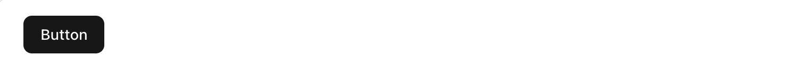
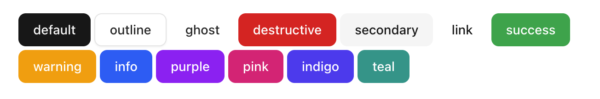
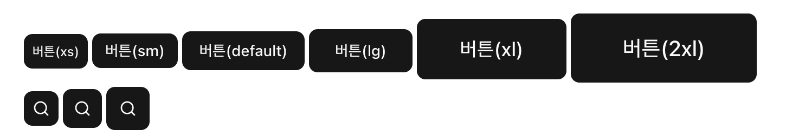
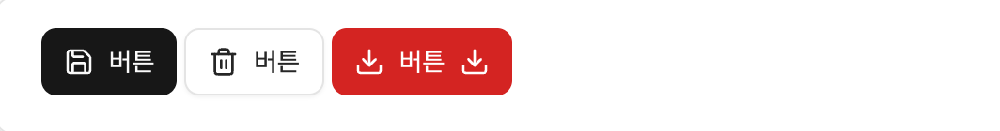
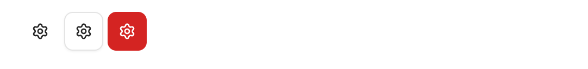

# Button
**Button** 컴포넌트는 UI 전반적으로 한번의 클릭으로 작업을 수행하는 컴포넌트입니다. Modal Dialog나 Forms, Cards, Toolbar 등의 다양한 UI에서 사용될 수 있습니다.  
**Button** 컴포넌트는 **Server Component, Client Component** 모두 사용할 수 있습니다. 상황에 맞게 사용하면 됩니다.

:::info <span class="admonition-title">Button</span> 실제 구동 예제 확인해보기
👉 [Button: https://react-app-scaffold.vercel.app/example/components/button](https://react-app-scaffold.vercel.app/example/components/button)
:::


## 기본 사용법
---
```tsx showLineNumbers
import type { JSX } from 'react';
// highlight-start
import { Button } from '@components/ui';
// highlight-end

interface ISamplePageProps {
  // 
}

export default function SamplePage({}: ISamplePageProps): JSX.Element {
  return (
    // highlight-start
    <Button>Button</Button>
    // highlight-end
  );
}
```


## 결과 화면
---


:::info <span class="admonition-title">설</span>명
* **react-app-scaffold** 공통 UI 컴포넌트 디렉토리(`@components/ui`)에서 **Button** 컴포넌트를 import하여 가져옵니다.
  ```tsx
  import { Button } from '@components/ui';
  ```
* 화면의 **JSX** 영역에서 **Button** 컴포넌트를 사용합니다.
  ```tsx
  <Button>Button</Button>
  ```
:star: **Button** 컴포넌트 자체는 **Server Component, Client Component** 모두 사용할 수 있습니다. 하지만 `onClick` 이벤트 핸들러와 같이 JavaScript 상호작용(이벤트, 상태)이 필요하면 Client Component에서만 사용할 수 있습니다.
:::


## API 참조
---
**react-app-scaffold**의 **Button** 컴포넌트는 **[shadcn/ui](https://ui.shadcn.com/)** 의 **Button** 컴포넌트를 래핑하여 사용합니다.
| Props     | default    | Type                         |
| :-------- | :--------- | :--------------------------- |
| `variant` | "default" | "default" \| "outline" \| "ghost" \| "destructive" \| "secondary" \| "link" \| "success" \| "warning" \| "info" \| "purple" \| "pink" \| "indigo" \| "teal" |
| `size`    | "default" | "default" \| "sm" \| "lg" \| "icon" \| "icon-sm" \| "icon-lg" \| "xl" \| "2xl" \| "xs"              |
| `asChild` | false     | boolean                      |

* **variant** 속성은 버튼의 색상을 지정합니다.
* **size** 속성은 버튼의 크기를 지정합니다.
* **asChild** 속성은 `true`로 설정하면, `Button`이 자체 DOM 요소를 렌더링하는 대신, 직접 작성한 자식 요소를 렌더링하고 `Button`의 모든 props를 자식 요소에 전달합니다.


## 예제
---

### variant 속성 변경
* `variant` 속성은 버튼의 시각적 스타일(색상, 배경, 테두리 등)을 결정하는 속성입니다.
  > **default** : 기본 버튼 스타일  
  > **destructive** : 삭제/파괴적인 액션에 사용되는 빨간색 계열  
  > **outline** : 테두리만 있는 스타일  
  > **secondary** : 보조 버튼 스타일  
  > **ghost** : 배경이 투명한 스타일  
  > **link** : 링크처럼 보이는 스타일 (밑줄 포함)  
  > **success** : 상태를 나타내는 색상 (초록)  
  > **warning** : 상태를 나타내는 색상 (주황)  
  > **info** : 상태를 나타내는 색상 (파랑)  
  > **purple** : 추가 purple색상 옵션  
  > **pink** : 추가 pink 색상 옵션  
  > **indigo** : 추가 indigo 색상 옵션  
  > **teal** : 추가 teal 색상 옵션  

  
  ```ts
  import { Button } from '@components/ui';
  ```
  ```tsx
  <Button variant="default">default</Button>
  <Button variant="outline">outline</Button>
  <Button variant="ghost">ghost</Button>
  <Button variant="destructive">destructive</Button>
  <Button variant="secondary">secondary</Button>
  <Button variant="link">link</Button>
  <Button variant="success">success</Button>
  <Button variant="warning">warning</Button>
  <Button variant="info">info</Button>
  <Button variant="purple">purple</Button>
  <Button variant="pink">pink</Button>
  <Button variant="indigo">indigo</Button>
  <Button variant="teal">teal</Button>
  ```
  

### size 변경
* `size` 속성은 버튼의 크기를 적용하는 속성입니다.
* **"icon-*"** 속성값은 아이콘 전용 버튼일 때만 사용합니다.  
  > **default** : 기본 버튼 크기  
  > **sm** : 작은 버튼 크기  
  > **lg** : 큰 버튼 크기  
  > **icon** : 아이콘 버튼 크기  
  > **icon-sm** : 작은 아이콘 버튼 크기  
  > **icon-lg** : 큰 아이콘 버튼 크기  
  > **xl** : 더 큰 버튼 크기  
  > **2xl** : 가장 큰 버튼 크기  
  > **xs** : 가장 작은 버튼 크기  

  
  ```ts
  import { Button, Icon } from '@components/ui';
  ```
  ```tsx
  <Button size="xs">버튼(xs)</Button>
  <Button size="sm">버튼(sm)</Button>
  <Button size="default">버튼(default)</Button>
  <Button size="lg">버튼(lg)</Button>
  <Button size="xl">버튼(xl)</Button>
  <Button size="2xl">버튼(2xl)</Button>
  <Button size="icon-sm">
    <Icon name="Search" />
  </Button>
  <Button size="icon">
    <Icon name="Search" />
  </Button>
  <Button size="icon-lg">
    <Icon name="Search" />
  </Button>
  ```
### 아이콘과 함께 사용
* 아이콘과 레이블이 있는 버튼은 버튼의 시작이나 끝에 아이콘을 추가하여 시각적 강조를 더할 수 있습니다.
  
  ```ts
  import { Button, Icon } from '@components/ui';
  ```
  ```tsx
  <Button>
    <Icon name="Save" />
    버튼
  </Button>
  <Button variant="outline">
    <Icon name="Trash2" />
    버튼
  </Button>
  <Button variant="destructive">
    <Icon name="Download" />
    버튼
    <Icon name="Download" />
  </Button>
  ```

### 아이콘 전용 버튼
* Button 컴포넌트는 아이콘 전용 버튼으로도 사용할 수 있습니다.
  
  ```ts
  import { Button, Icon } from '@components/ui';
  ```
  ```tsx
  <Button
    size="icon"
    variant="ghost"
  >
    <Icon name="Settings" />
  </Button>
  <Button
    size="icon"
    variant="outline"
  >
    <Icon name="Settings" />
  </Button>
  <Button
    size="icon"
    variant="destructive"
  >
    <Icon name="Settings" />
  </Button>
  ```


### Client Component에서의 onClick 이벤트 처리
* `onClick` 이벤트는 Client Component에서 사용할 수 있습니다.
```tsx
'use client';

import { Button } from '@components/ui';

function SamplePage() {
  return (
    <Button onClick={() => alert('Clicked!')}>
      Click Me
    </Button>
  );
}
```


### Server Component에서의 Form Submit 버튼 처리
* **Server Component**에서 **Button** 컴포넌트는 JavsScript의 이벤트 처리를 하지않고 **Form의 Submit 이벤트**를 처리할 수 있습니다.
```tsx
import { Button, Input } from '@components/ui';

function SamplePage() {
  return (
    <form action="/api/submit">
      <Input
        name="email"
        type="email"
      />
      <Button type="submit">Submit</Button>
    </form>
  );
}
```


### Server Component에서의 버튼 링크 처리
* **Server Component**에서 **Button** 컴포넌트로 링크를 처리를 다음과 같이 할 수 있습니다.
```tsx
import { Button } from '@components/ui';
import Link from 'next/link';

function SamplePage() {
  return (
    <>
      {/* Link와 함께 사용 (asChild 활용) */}
      <Button
        variant="outline"
        asChild
      >
        <Link href="/about">Go to About</Link>
      </Button>
      {/* 외부 링크 버튼 */}
      <Button variant="default" asChild>
        <a href="https://example.com" target="_blank" rel="noopener noreferrer">
          Visit Store
        </a>
      </Button>
    </>
  );
}
```
:::tip <span class="admonition-title">링크</span> 처리에 대한 설명
* **방법 1**: Button + asChild로 Link 감싸기 (추천)
  ```tsx
  <Button type="button" variant="ghost" asChild>
    <Link href="/forgot-password">Forgot Password?</Link>
  </Button>
  ```
  - 장점
    - **디자인 시스템 일관성**: variant, size 등 Button의 모든 스타일 옵션 활용 가능
    - **코드 재사용성**: 버튼 스타일을 중복 작성할 필요 없음
    - **유지보수**: Button 컴포넌트만 수정하면 전체 프로젝트에 반영
    - **타입 안전성**: Button의 variant, size 타입 체크
* **방법 2**: 버튼을 사용하지 않고 Link만 사용하고 className 직접 지정
  ```tsx
  import Link from 'next/link';
  import { buttonVariants } from '@/shared/components/ui/button/Button';

  <Link 
    href="/forgot-password"
    className={buttonVariants({ variant: "ghost" })}
  >
    Forgot Password?
  </Link>
  ```
  - 장점
    - 더 직관적이고 간단함
    - 불필요한 컴포넌트 중첩 없음
  - 단점
    - **buttonVariants**를 import 해야 함
    - **Button**의 다른 기능들(data attributes 등)을 수동으로 추가해야 함
:::