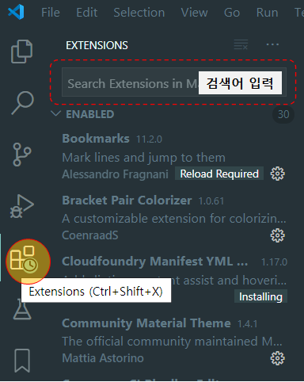
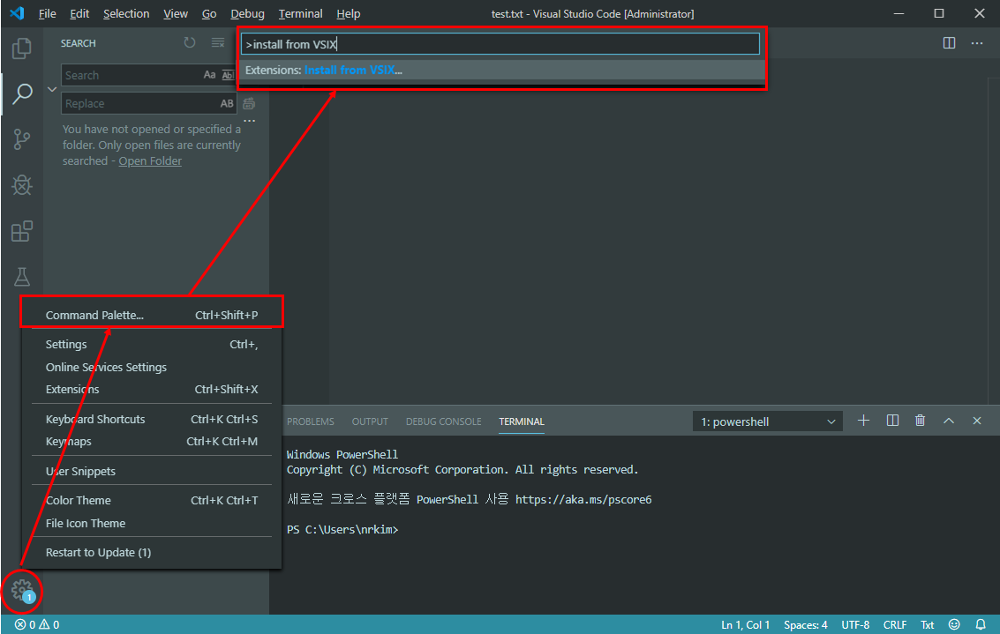
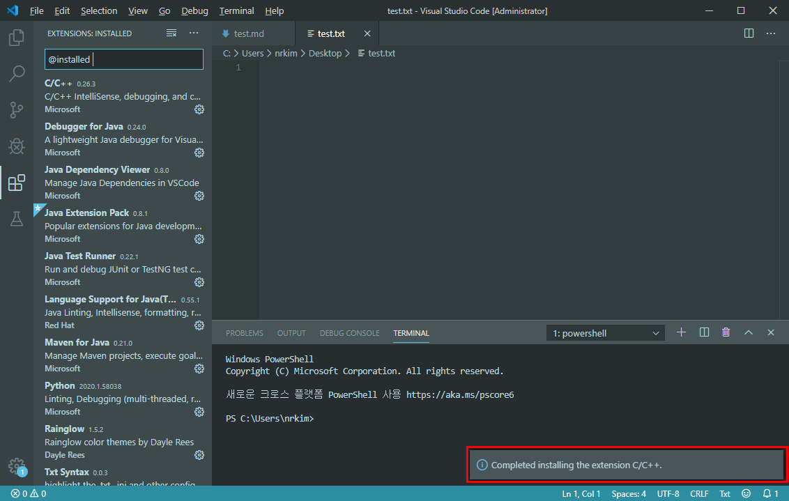
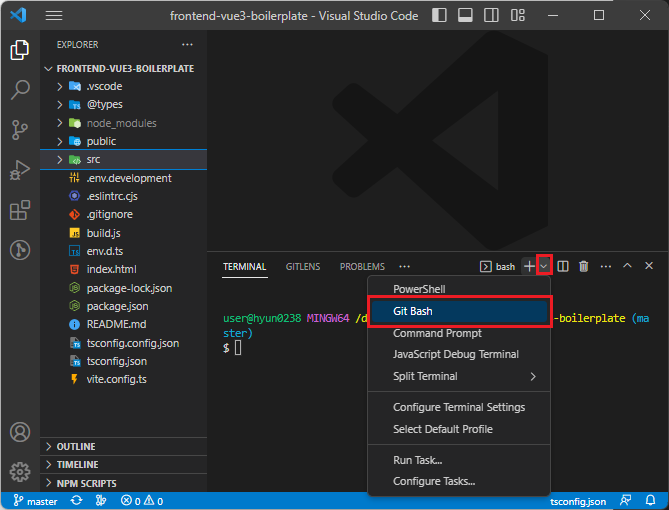
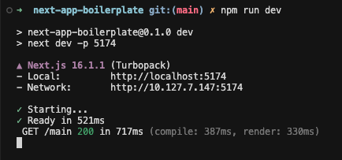
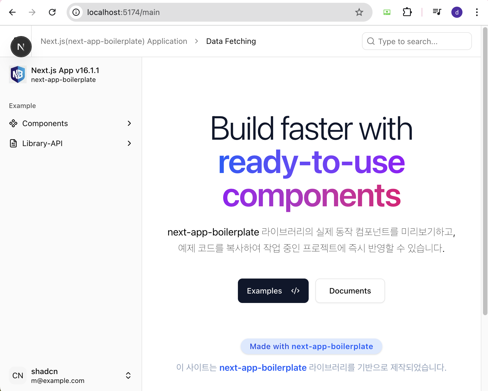

# Next.js 개발 환경 구성


## Node.js설치
---
**Node.js**가 PC에 설치되어 있지 않다면 설치한다. LTS버전(v22.20.0)을 설치합니다. 
* [설치링크:(https://nodejs.org)](https://nodejs.org)  
<!-- * node.js설치 파일을 파일서버에서 제공하므로 `/aaaa/bbbbb/Frontend` 위치에서 다운로드 받아 설치 합니다.
  * node.js설치 파일: `node-vv22.13.1-x64.msi` -->
<!--  -->

1. **LTS버전 (v22.20.0)** - 설치 완료 후 아래와 같이 윈도우 **명령 프롬프트** 창에서 `node`와 `npm` 설치 여부를 확인해봅니다.

    <!-- - node-v18.16.0-x64.msi
    - node-v18.16.0-win-x64.zip -->
<!-- 3. 환경변수 설정 (설정 > 시스템 > 정보 > 고급시스템설정 > 환경변수)
4. 환경변수에서 시스템변수의 Path를 ‘새로만들기’ 누르고 zip파일 압축 해제한 폴더 경로를 입력합니다.
5. 정확하게는 node.exe파일이 있는 폴더의 경로를 지정 해주면 됩니다. -->
```sh
# 설치 후 설치 버전 확인
node -v
# vv22.20.0 

npm -v
# 10.9.3
```


## Git 설치
---
Git사용을 위하여 설치합니다.  
[설치링크:(https://git-scm.com/downloads)](https://git-scm.com/downloads)  


## Visual Studio Code 설치
---
**Vue Frontend** 개발을 위한 Microsoft사에서 만든 개발용 코드 편집기입니다.  
[설치링크:(https://code.visualstudio.com/Download)](https://code.visualstudio.com/Download)  

* **Visual Studio Code(VSCode)** 를 설치한 후 개발에 도움이 되는 **Extensions**를 설치합니다. 

:::tip <span class="admonition-title">VSCode Extensions</span> 설치
VSCode에서 사용할 수 있는 <span class="text-color-red">필수</span> 또는 <span class="text-blue-normal">선택</span> 익스텐션 입니다.
* <span class="text-color-red">ESLint</span> : (필수) 코드의 포맷팅과 품질관리 도구.
* <span class="text-color-red">Prettier</span> - Code formatter : (필수) 코드를 정렬해주는 Formatter.
* <span class="text-color-red">GitLens Git supercharged</span> : (필수) 각 파일에서 Line별로 가장 마지막에 누가, 언제, 무슨 commit했는 지 확인할 수 있다.
* <span class="text-blue-normal">Git Graph</span> : (선택) Git 저장소의 Git Graph를 보고 Git 작업을 수행합니다.
* <span class="text-blue-normal">indent-rainbow</span> : (선택) 들여쓰기에 컬러표시로 가독성을 좋게함.
* <span class="text-blue-normal">Import Cost (Display import/require package size in the editor)</span> : (선택) import하는 모듈의 사이즈를 보여줌.
* <span class="text-blue-normal">TODO Highlight</span> : (선택) 주석처리 시 'TODO:' 이렇게 시작하는 text를 입력하면 색깔로 반전시켜주는 기능.
* <span class="text-blue-normal">vscode-icons</span> : (선택) VSCode의 아이콘을 이쁘게 보여줌.
* <span class="text-blue-normal">es6-string-html</span> : (선택) es6 여러 줄 문자열에서 구문 강조 표시.
* <span class="text-blue-normal">Tailwind CSS IntelliSense</span> : (선택) Tailwindcss 를 사용하는 프로젝트에서 도움이 되는 익스텐션입니다.
* <span class="text-blue-normal">SVN</span> : (SVN을 사용하는 환경이라면...) 검색된 svn중에 Integrated Subversion source control Chris Johnston을 설치한다.
:::

### VSCode Extensions 온라인 설치 방법
* VSCode에서 아래 이미지와 같이 검색어 입력란에 **Extensions명**을 입력하여 설치합니다.


### VSCode Extensions 오프라인 VSIX설치 방법(외부 인터넷이 되지 않는 환경일때 )
* 외부 인터넷이 되지 않는 환경의 PC에서는 따로 제공하는 ***.vsix**파일을 이용하여 설치합니다.
* 아래와 같이 순서대로 가지고 있는 ***.vsix**파일을 선택하고 install합니다.

* 설치가 완료 되고 오른쪽 하단에 아래와 같이 팝업이 뜨면 성공.



## Chrome Browser 설치
---
Frontend 개발 시 로컬환경에서 다양한 개발자 환경을 제공하는 크롬 브라우저를 설치합니다.  
* [Chrome 브라우저 설치 링크](https://www.google.co.kr/chrome/?brand=QCDH&gclid=CjwKCAiA8bqOBhANEiwA-sIlN8GC9kFUJffeeF2Ybz1S6hHu3fWQl0lz3T22w26Iuy6bV53q9KBqexoCYGwQAvD_BwE&gclsrc=aw.ds)  


## React Developer Tools 설치 (크롬 브라우저 확장 프로그램)
---
React를 사용할 때, React 앱을 보다 더 사용자 친화적인 인터페이스에서 검사하고 디버깅할 수 있습니다.  
[React Developer Tools 설치 링크](https://chrome.google.com/webstore/detail/react-developer-tools/fmkadmapgofadopljbjfkapdkoienihi?hl=ko)


## TanStack Query(React Query) DevTools 설치 (크롬 브라우저 확장 프로그램)
---
React에서 사용하는 상태 관리 라이브러리 Redux의 상태 변경을 디버깅 할 수 있는 Redux DevTools를 설치합니다.  
[TanStack Query(React Query) DevTools 설치 링크](https://chromewebstore.google.com/detail/tanstack-query-devtools/annajfchloimdhceglpgglpeepfghfai)
* **TanStack Query(React Query)** 외에도 [Zustand](https://zustand-demo.pmnd.rs/)도 함께 고려해볼 필요가 있습니다.


## VSCode에서 <span class="text-green-bold">Git bash</span> 쉘(Shll)프로그램을 사용하자.
---
* VSCode를 사용하여 Frontend 개발을 진행하다 보면 터미널창을 이용하는 상황이 많이 생깁니다.
* 만약 **Windows**(윈도우) 운영체제(OS)를 사용하는 환경 이라면, <span class="text-green-bold">리눅스 커맨드를 사용</span>할 수 있는 <span class="text-green-bold">Git bash</span> 터미널을 사용합니다.
* **VSCode**에서 터미널창을 열때 아래와 같이 <span class="text-green-bold">Git bash</span>로 바꿔서 사용합니다.



## Visual Studio Code (VSCode) 코드편집기 설정
---

### settings.json 셋팅 (VSCode 설정)

<span class="react-color">Frontend (React)</span> 개발을 위해 **VSCode**를 활용할 것입니다. 따라서 개발자의 통일된 코드 작성을 위하여 **VSCode**의 환경설정을 **settings.json**파일에 적용합니다.

#### settings.json 설정

> - **settings.json 파일열기** : f1 ⤍ settings 입력 ⤍ Preferences: Open Workspace Settings (JSON) 클릭.  
>   위와같이 열면 프로젝트 루트에 **.vscode** 디렉토리가 생성되고 **settings.json**파일이 생성됩니다.
> - **settings(설정)가 적용되는 우선 순위** : .vscode settings.json ⤇ settings.json ⤇ defaultSetting.json(<span class="text-color-red">수정하지 않는 파일.</span>)  
>   <span class="text-color-red">defaultSetting.json은 모든 설정내용이 다 들어있는 기본 설정 파일입니다. 수정은 하지 않는 파일입니다.</span>
> - **.vscode** 디렉토리에 생성된 **settings.json** 파일에 아래 내용 입력합니다.

```json
{
  "editor.formatOnSave": true,
  "editor.codeActionsOnSave": {
    "source.fixAll.eslint": "explicit"
  },
  "editor.tabSize": 2,
  "editor.detectIndentation": false,
  "editor.insertSpaces": false,
  "editor.renderWhitespace": "all",
  "editor.comments.insertSpace": false,
  "files.associations": {
    "*.json": "jsonc"
  },
  "eslint.validate": [
    "javascript",
    "javascriptreact",
    "typescript",
    "typescriptreact"
  ],
  "eslint.workingDirectories": [{ "mode": "auto" }],
  "editor.defaultFormatter": "esbenp.prettier-vscode",
  "eslint.useFlatConfig": true,
  "css.lint.unknownAtRules": "ignore",
  "scss.lint.unknownAtRules": "ignore",
  "less.lint.unknownAtRules": "ignore"
}
```

:star: 이렇게 `settings.json` 파일로 **VSCode** 설정을 하면 **메뉴(File ⤍ Preferences ⤍ Settings)** 로 설정한것 보다 우선순위가 높게 적용됩니다.


:::info 설명
- **"editor.formatOnSave"** : 파일 저장 시 자동으로 코드 서식을 정리합니다.
- **"editor.codeActionsOnSave" ⤍ "source.fixAll.eslint"** : 파일 저장 시 ESLint가 감지한 모든 문제를 자동으로 수정합니다.
- **"editor.tabSize"** : 탭 크기를 몇칸으로 설정할지 지정합니다.
- **"editor.detectIndentation"** : VSCode가 파일의 들여쓰기를 자동으로 감지하는 기능을 활용할지 여부 입니다.
- **"editor.insertSpaces"** : 탭 키를 누를 때 공백 대신 탭 문자를 삽입합니다.
- **"editor.renderWhitespace"** : 공백 문자를 시각적으로 표시합니다.
- **"editor.comments.insertSpace"** : 주석 기호(//, /\*) 뒤에 자동으로 공백을 삽입할지 여부 입니다.
- **"files.associations" ⤍ "\*.json": "jsonc"** : .json 파일을 jsonc(주석이 있는 JSON) 형식으로 인식하도록 설정합니다.
- **"eslint.validate": \["javascript", "javascriptreact", "typescript", "typescriptreact"\]** : ESLint가 TypeScript, React, JavaScript 파일을 검사하도록 설정합니다.
- **"eslint.workingDirectories"** : \[\{"mode":"auto"\}\] : ESLint 작업 디렉토리를 자동으로 감지하도록 설정합니다.
- **"editor.defaultFormatter": "esbenp.prettier-vscode"** : VSCode의 기본 코드 포맷터로 Prettier를 사용합니다.
- **"eslint.useFlatConfig"** : ESLint의 설정방식이 `v8.21.0` 부터 **Flat Config**를 지원하면서, 구성 형식을 **Flat Config**으로 할지 여부 설정.

- **"css.lint.unknownAtRules": "ignore"** : VSCode에서 CSS의 "Unknown At Rules" 경고를 무시하도록 설정.
- **"scss.lint.unknownAtRules": "ignore"** : VSCode에서 scss의 "Unknown At Rules" 경고를 무시하도록 설정.
- **"less.lint.unknownAtRules": "ignore"** : VSCode에서 less의 "Unknown At Rules" 경고를 무시하도록 설정.
:::


## Frontend 개발 코드(react-app-scaffold) 내려받기
---
:::info <span class="admonition-title">Git 레포지토리(react-app-scaffold)</span> url
* [https://github.com/redsky-project/react-app-scaffold](https://github.com/redsky-project/react-app-scaffold)
* 개발 코드(react-app-scaffold)를 내려받기 위해서는 계정 및 권한이 필요합니다. (해당 권한은 담당자에게 요청)
:::

#### 작업 폴더 생성 및 Frontend 소스 코드 받기
* 먼저 PC에 작업 할 폴더를 생성합니다.
  ```sh
  # C:\my\ 디렉토리에서 폴더를 생성한다고 가정.
  # 내가 작업 할 폴더를 'frontend-next' 라고 하고 해당 폴더를 생성.
  mkdir frontend-next
  # D:\my\frontend-next 폴더가 생성 됨.
  ```
* 생성한 **frontend-next** 폴더로 이동하여 `git clone`을 실행하여 **react-app-scaffold** 코드를 내려 받습니다.
  ```sh
  git clone git@github.com:redsky-project/react-app-scaffold.git
  ```
* `git clone`하여 내려받은 소스를 확인해보면 아직 **node_modules**폴더가 없는상태입니다. 의존성 라이브러리를 설치면 **node_modules**폴더를 자동생성합니다.
  ```sh
  # 프로젝트 루트 폴더에서 의존성 라이브러리 설치
  npm install
  ```


## VSCode에서 로컬 서버 띄우고 브라우저로 확인해 보기
---
* :star: 최초 내려받은 Frontend 소스에 `node_modules`가 없으면 **Frontend 로컬 서버**를 띄울 수 없습니다. 반드시 의존성 라이브러리를 설치하여 `node_modules`를 추가 해야 합니다.
  * 인터넷이 되는 환경에서는 `npm install` 명령어로 바로 설치 가능.
* 의존성 라이브러리(node_modules) 설치가 모두 완료 되면, 로컬 PC에서 로컬 서버를 띄우고 브라우저로 확인할 수 있습니다.
* 로컬 서버 띄우기
  ```sh
  npm run dev
  ```
  
* **Chrome** 브라우저를 띄우고 `http://localhost:5174` 확인하면 다음과 같이 확인할 수 있습니다.(url port와 화면 결과물은 다를 수 있음.)
