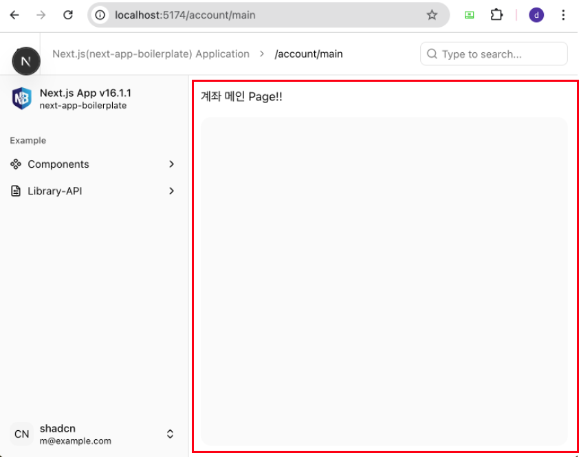

# 업무(domain) 페이지 만들기

:::info 작업 내용
* 각 업무(domain) 담당 개발자는 자신의 담당 영역(폴더)에서 개발을 진행합니다.
* 본 문서에서는 업무 페이지 컴포넌트 생성 방법을 안내합니다.
* App Router 구조에서의 페이지 컴포넌트 구성 방식에 대해 설명합니다.
* 생성한 페이지를 브라우저에서 직접 확인합니다.
:::


## 업무(domain) 폴더 구조 만들기
---
* 모든 업무(domain)는 업무 그룹 폴더인 **`(domains)`** 폴더 아래에서 작업합니다.
* 개발해야 할 업무가 **"계좌(account)"** 라고 가정 했을 때 다음과 같이 `src/app/(domains)/account` 폴더를 생성하고, **account**폴더 하위에 업무 기본 구조를 만듭니다.
* **account** 폴더가 생성되면 하위로 **_action, _hooks, _styles, _components, _common, (pages), api, _types**폴더를 가질 수 있습니다. 불필요 시 생성하지 않아도 됩니다.  
  - **account** 폴더가 생성되면 자신이 개발할 업무 영역은 **계좌(account)** 이므로 **account** 폴더에서만 작업을 진행합니다.  
  - 만약 다른 업무의 코드를 참조해야 한다거나, 공통적인 요소의 코드를 참조해야 한다면 `src/shared` 폴더를 통해서만 소통합니다.  
* 자세한 내용은 [개발구조 및 규칙](../config/dev-convention.md) 내용을 참조 하세요.
```sh
# 내가 작업할 업무가 "계좌(account)" 업무라고 가정한다면
# 다음과 같은 account 기본 폴더구조를 가질 수 있습니다.

src
├── app
│   ├── (domains)
│   │   ├── example
│   │   ├── main
// highlight-start
│   │   └── account # account 업무 폴더를 생성
│   │       ├── (pages)       # 페이지 그룹 폴더
│   │       │   ├── main            # 계좌메인화면(가정)
│   │       │   │   ├── page.tsx    # 페이지 컴포넌트
│   │       │   │   └── ...         # 기타 App Router 라우팅 파일들
│   │       │   └── usage-history   # 계좌이용내역화면(가정)
│   │       │       ├── page.tsx    # 페이지 컴포넌트
│   │       │       └── ...         # 기타 App Router 라우팅 파일들
│   │       ├── _action       # server action 폴더
│   │       ├── _hooks        # 커스텀 훅 폴더
│   │       ├── _styles       # 스타일 파일 폴더
│   │       ├── _common       # account 업무 전용 공통 폴더
│   │       ├── _components   # account 업무에서 사용하는 컴포넌트 폴더
│   │       │   └── List.tsx        # 계좌 리스트 컴포넌트(가정)
│   │       ├── api           # route handler 폴더(account 업무용)
│   │       └── _types        # account 업무에서 사용하는 type 폴더
// highlight-end
│   ├── favicon.ico
│   └── layout.tsx
├── assets
├── shared       # 전역 공유 코드 폴더
└── ...
```
:::info 설명
* 각 업무 폴더구조 생성은 내려받은 소스 코드의 **/src/app/(domains)/example** 폴더의 예제 폴더를 참조하면 도움이 됩니다.
* 내가 작업하는 업무가 **account**라고 가정합니다.
* **account** 업무의 하위에는 **_action, _hooks, _styles, _components, _common, (pages), api, _types**폴더를 가질 수 있습니다.
* **account** 업무의 내부 폴더(_action, _hooks, _styles, _components, _common, (pages), api, _types)는 업무 상황에 따라 필요한 폴더만 생성하여 사용합니다.
:::


## 업무 페이지 만들기
---
* 업무 폴더 구조가 완성되면 원하는 페이지를 만들어 봅니다.
* 페이지 컴포넌트는 **`(pages)`** 폴더 내부에 계좌 메인 페이지 URL에 해당하는 `main` 폴더를 생성하고 `main` 폴더 내부에 **`page.tsx`** 파일을 생성합니다.
  - 예제로 만든 페이지 경로가 `src/app/(domains)/account/(pages)/main/page.tsx` 이고, 실제 브라우저 주소창에는 `localhost:5174/account/main` 로 표시됩니다.
* 페이지 컴포넌트(**page.tsx**)파일의 **기본 구조**는 다음과 같습니다.
```tsx showLineNumbers
import { JSX } from 'react';

interface IAccountMainProps {
  test?: string;
}

export default function AccountMain({}: IAccountMainProps): JSX.Element {
  return (
    <>
      <div>계좌 메인 Page!!</div>
    </>
  );
}
```
:::info <span class="admonition-title"> Next.js의 App Router</span> 및 사전지식 관련 안내
* Next.js 공식 문서의 파일 시스템 규칙을 사전에 충분히 숙지하여, 최신 문법과 개발 패러다임에 대한 이해를 갖추는 것이 중요합니다.
  - [Next.js 공식 문서: https://nextjs.org/docs/app/api-reference/file-conventions](https://nextjs.org/docs/app/api-reference/file-conventions)
* 프론트엔드 개발 시 **TypeScript** 및 **ES6 이상의 JavaScript 문법**에 대한 숙련도가 필수적입니다.
  - [JavaScript 공식 문서: https://developer.mozilla.org/ko/docs/Web/JavaScript](https://developer.mozilla.org/ko/docs/Web/JavaScript)
  - [TypeScript 공식 문서: https://www.typescriptlang.org/ko/](https://www.typescriptlang.org/ko/)
:::


## 계좌 메인 화면 브라우저에서 확인
---
* 위에서 만든 **account** 메인화면이 완성되었으면, 로컬(Frontend)서버를 띄우고 브라우저로 확인해 봅니다.  
* 로컬 Next서버 띄우는 방법을 모른다면 "[Frontend 개발 환경 구성/VSCode에서 Frontend 서버 띄우고 브라우저로 확인해 보기 ](../config/set-dev-env-config#vscode에서-로컬-서버-띄우고-브라우저로-확인해-보기)" 부분을 참조 하세요.
* 브라우저를 열고 위에서 만든 계좌메인 (**localhost:포트/account/main**) URL을 입력하면 생성한 계좌메인 화면이 보입니다.
  
:star: 여기까지 했으면 해당 업무의 코딩 준비가 완료 되었습니다. 필요에 따라 기능을 추가하고 페이지 작업을 진행하면 됩니다.


