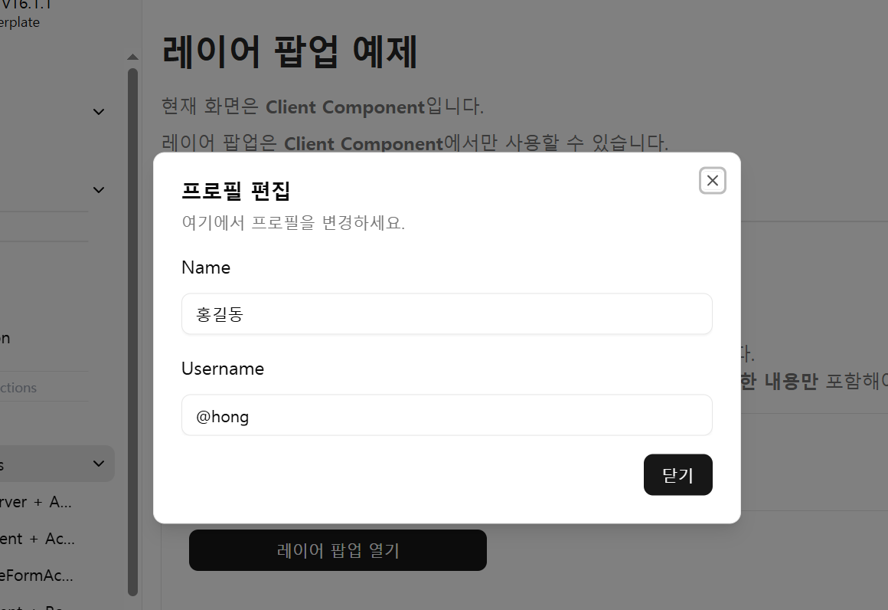
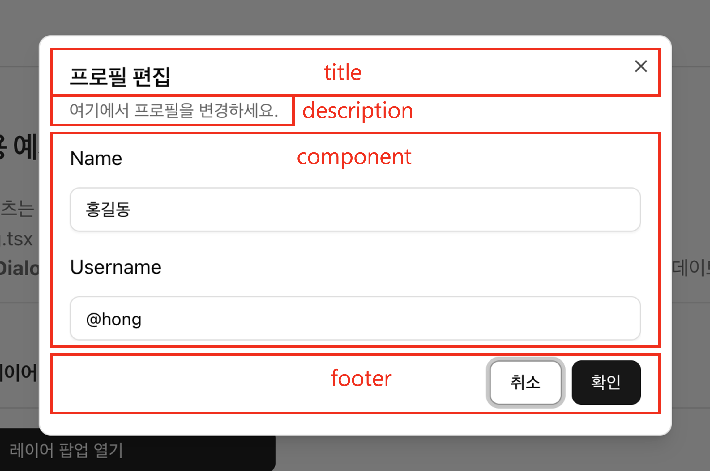

# Client Component 레이어팝업

**react-app-scaffold**에서는 내장된 `$ui.dialog()` 함수를 활용하여 레이어 팝업(Dialog)을 쉽고 효율적으로 띄울 수 있습니다.  
`$ui.dialog()` 함수는 **Client Component** 전용 레이어 팝업입니다.
* 전역적으로 제공되는 함수이므로 별도의 **import** 없이 바로 사용할 수 있습니다.


## 레이어팝업 결과 화면
---



## 사용 예제
---
[실제 동작 예제 보기: https://react-app-scaffold.vercel.app/example/docs-examples/layer-popup](https://react-app-scaffold.vercel.app/example/docs-examples/layer-popup)


```tsx
// ========================================================
// page.tsx (Client Component)
// 레이어 팝업 띄우기
// ========================================================
'use client';

import { Button } from '@components/ui';
import loadable from '@loadable/component';
const EditProfileDialog = loadable(() => import('./EditProfileDialog'));

function SamplePage() {
	
  const handlerOpenLayerPopup = () => {
    // $ui.dialog를 사용하여 레이어 팝업을 띄웁니다.
    // highlight-start
    $ui.dialog({
      component: EditProfileDialog, // 팝업 컨텐츠로 사용될 컴포넌트
      title: '프로필 편집',
      description: '여기에서 프로필을 변경하세요.',
      props: {}, // EditProfileDialog 컴포넌트에 전달할 프로퍼티
    });
    // highlight-end
  };

  return (
    <div>
      <Button onClick={handlerOpenLayerPopup}>레이어 팝업 열기</Button>
    </div>
  );
}

// ========================================================
// EditProfileDialog.tsx (Client Component)
// ========================================================
'use client';

import type { JSX } from 'react';
import { Button, Input } from '@components/ui';

interface IEditProfileDialogProps {
  onClose: () => void;
}

export default function EditProfileDialog({ onClose }: IEditProfileDialogProps): JSX.Element {
  return (
    <>
      <div className="space-y-4">
        <div className="space-y-2 max-h-80 overflow-y-auto">
          <div className="grid gap-4">
            <div className="grid gap-3">
              <label htmlFor="name-1">Name</label>
              <Input
                id="name-1"
                name="name"
                defaultValue="홍길동"
              />
            </div>
            <div className="grid gap-3">
              <label htmlFor="username-1">Username</label>
              <Input
                id="username-1"
                name="username"
                defaultValue="@hong"
              />
            </div>
          </div>
        </div>

        <div className="flex justify-end">
          <Button onClick={onClose}>닫기</Button>
        </div>
      </div>
    </>
  );
}
```


## `$ui.dialog({옵션})` 옵션에 따른 렌더링 위치
---
* `{옵션}` 타입 정의
  ```ts
  export interface IDialogOptions<P = any> {
    component?: ComponentType<P & IDialogComponentProps>;
    props?: Omit<P, keyof IDialogComponentProps>;
    title?: ReactNode;
    description?: ReactNode;
    className?: string;
    footer?: {
      confirmText?: string;
      cancelText?: string;
    };
    onConfirm?: (data?: any) => void;
    onCancel?: (data?: any) => void;
  }
  ```
* 옵션에 따른 렌더링 위치
