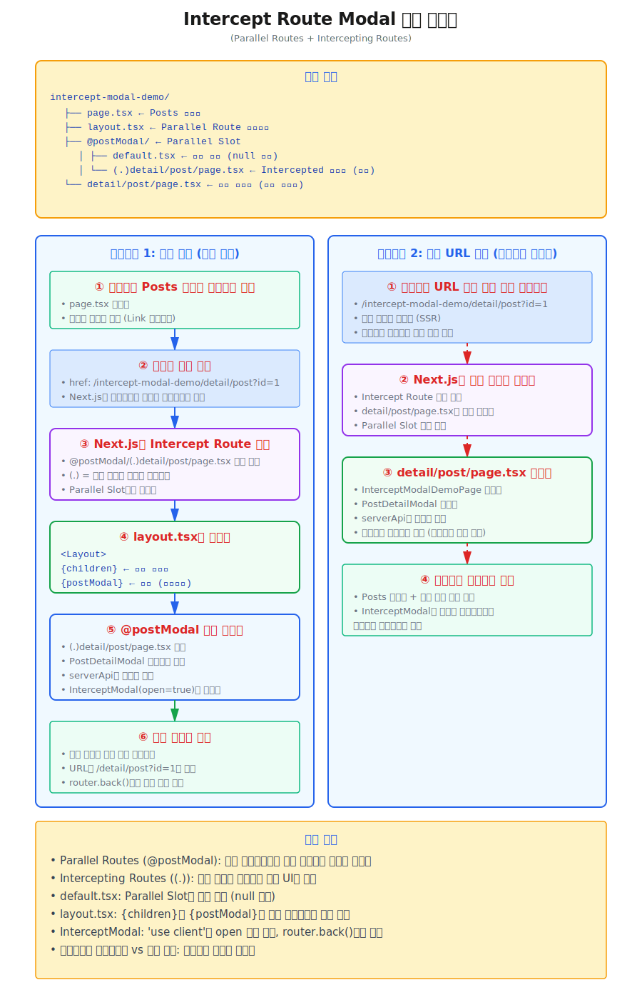
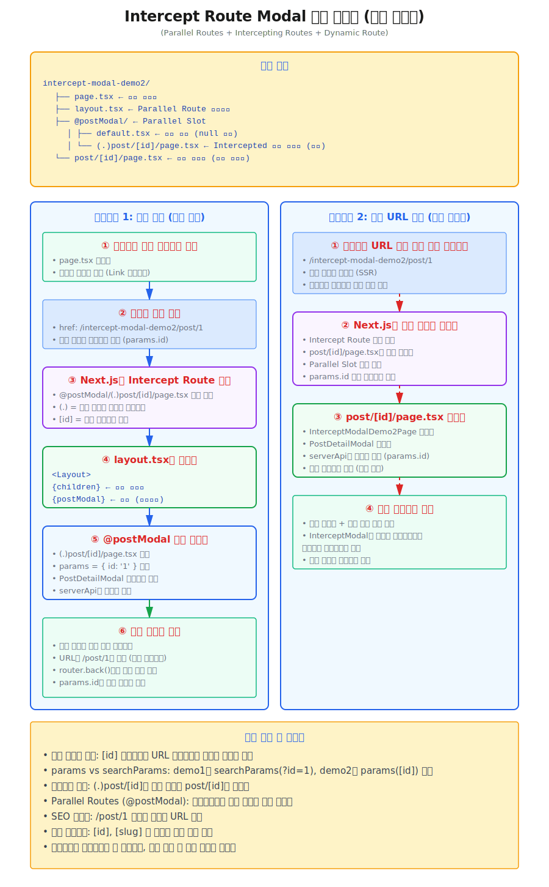

# Intercepting Modal 띄우기
**Intercepting Modal** 은 **Next.js**의 **App Router(Intercepting Routes)** 기능을 활용하여 팝업형태의 모달을 띄우는 방식입니다.  
팝업을 띄우면 URL은 변경되자만, 실제로는 모달 형태로 보여지고, 새로고침해도 모달 형태로 보여지는 팝업입니다.

:::info 왜 사용하는가?
* **URL 공유 가능성**: 팝업 상태를 URL로 표현할 수 있어 팝업으로 바로 이동할 수 있고, 특정 팝업을 직접 공유하거나 북마크할 수 있습니다
* **브라우저 히스토리 관리**: 팝업이 URL을 가지고 있기 때문에, 뒤로가기 버튼으로 팝업을 닫을 수 있어 자연스러운 UX를 제공합니다
* **SEO 친화적**: 각 팝업 콘텐츠가 실제 페이지(Server Component)이므로 검색 엔진이 인덱싱할 수 있습니다
* **Server Component 활용**: 팝업을 서버 컴포넌트로 구현하면 초기 로딩 성능을 최적화할 수 있습니다
:::
:::tip 일반 레이어 팝업과의 차이점
* 일반 레이어 팝업
  - **URL 변경 없음**: 팝업이 열려도 URL은 그대로이며, 페이지 위에 레이어 형태로 띄워집니다.
  - **상태 기반**: useState, Zustand 등으로 팝업 열림/닫힘 상태 관리
  - **클라이언트 전용**: 주로 Client Component로만 구현
  - **공유 불가**: 팝업이 열린 상태를 URL로 공유할 수 없음
  - **히스토리 없음**: 뒤로가기로 팝업을 닫을 수 없음 (별도 구현 필요)
* Intercepting Modal
  - **URL 변경됨**: /feed → /feed/photo/123 (모달로 표시)
  - **라우팅 기반**: Next.js 라우터가 상태 관리
  - **Server + Client 혼용**: 서버 컴포넌트로 초기 데이터 로딩 가능
  - **공유 가능**: /feed/photo/123을 직접 공유하면 전체 페이지로 접근
  - **자연스러운 히스토리**: 브라우저 뒤로가기로 자동으로 모달 닫힘
:::
:::tip 어떤 것을 사용해야 하는가?
* **Intercepting Modal이 적합한 경우**
  - Instagram 사진 상세, 트위터 트윗 상세처럼 공유 가능한 콘텐츠
  - 검색 결과, 상품 상세 등 SEO가 중요한 콘텐츠
  - 사용자가 북마크하거나 직접 접근할 가능성이 있는 콘텐츠
* **일반 레이어 팝업이 적합한 경우**
  - 단순 confirm, alert 같은 임시 UI
  - 로그인/회원가입 폼
  - 설정 패널, 필터 옵션 같은 일시적 상태
  - URL 변경이 불필요한 간단한 상호작용
:::


## 구현 폴더 구조
---
* **App Router**의 **페레럴 라우트(parallel routes)** 와 **인터셉팅 라우트(intercepted routes)** 를 활용하여 구현해야 하므로, 모달을 위한 폴더 구조는 직접 구성해야합니다.
* 다음은 두가지 형태의 폴더구조를 예시로 들었습니다.
  - url query string 으로 파라미터를 전달하는 방식
  ```sh
  src/app/(domains)/example
  ├── (pages)
  │   └── docs-examples
  │       └── (dialog)
  // highlight-start
  │           └── intercept-modal-demo
  │               ├── @postModal
  │               │   ├── (.)detail
  │               │   │   └── post
  │               │   │       └── page.tsx  # 상세 페이지(Link로 접근 모달)
  │               │   └── default.tsx       # 모달 기본 페이지(null 반환)
  │               ├── _components
  │               │   └── InterceptModalDemoPage.tsx  # 모달 컴포넌트
  │               ├── detail
  │               │   └── post
  │               │       └── page.tsx      # 상세 페이지(브라우저에서 바로 접근 페이지)
  │               ├── layout.tsx            # 바닥 페이지 레이아웃
  │               └── page.tsx              # 진입 바닥 페이지
  // highlight-end
  │   
  ├── _components
  │   ├── dialog
  │   │   └── PostDetailModal.tsx         # 모달 공통 컴포넌트
  │   └── ...
  └── ...
  ```
  - 동적 라우트(dynamic routes)를 활용하여 파라미터를 전달하는 방식
  ```sh
   src/app/(domains)/example
  ├── (pages)
  │   └── docs-examples
  │       └── (dialog)
  // highlight-start
  │           └── intercept-modal-demo2
  │               ├── @postModal
  │               │   ├── (.)post
  │               │   │   └── [id]
  │               │   │       └── page.tsx      # 상세 페이지(Link로 접근 모달)
  │               │   └── default.tsx           # 모달 기본 페이지(null 반환)
  │               ├── _components
  │               │   └── InterceptModalDemo2Page.tsx  # 모달 컴포넌트
  │               ├── post
  │               │   └── [id]
  │               │       └── page.tsx          # 상세 페이지(브라우저에서 바로 접근 페이지)
  │               ├── layout.tsx                # 바닥 페이지 레이아웃
  │               └── page.tsx                  # 진입 바닥 페이지
  // highlight-end
  │           
  │       
  ├── _components
  │   ├── dialog
  │   │   └── PostDetailModal.tsx         # 모달 공통 컴포넌트
  │   └── ...
  └── ...
  ```


## 구현 예제
---
* 첫번째 예제 모달 흐름도
* [실제 동작 예제 보기: https://react-app-scaffold.vercel.app/example/docs-examples/intercept-modal-demo](https://react-app-scaffold.vercel.app/example/docs-examples/intercept-modal-demo)

* 두번째 예제 모달 흐름도
* [실제 동작 예제 보기: https://react-app-scaffold.vercel.app/example/docs-examples/intercept-modal-demo2](https://react-app-scaffold.vercel.app/example/docs-examples/intercept-modal-demo2)



