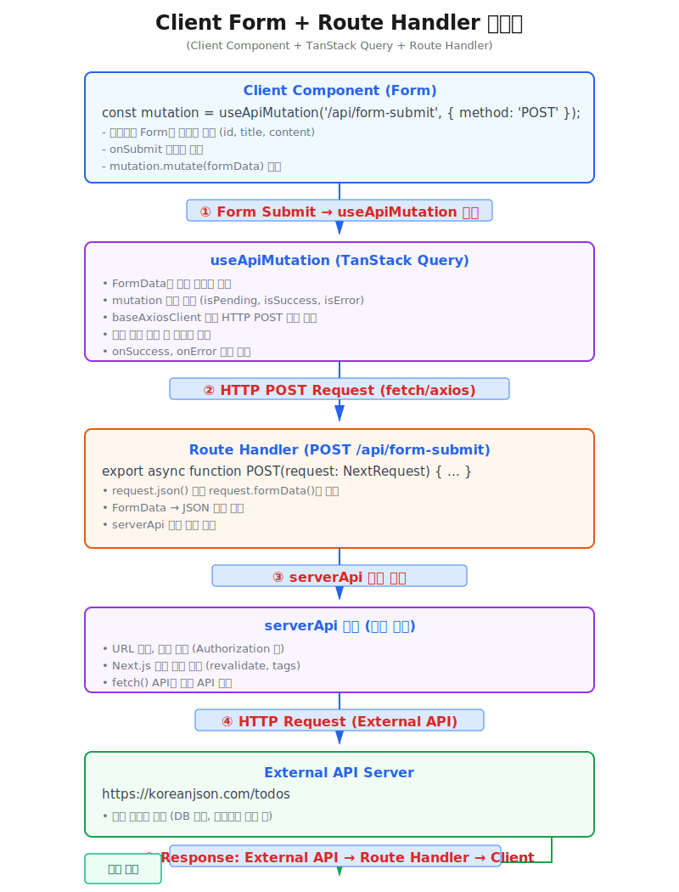

# Form 전송 (Client Component + Route Handler)

**Client Component**에서 FormData를 **Route Handler**로 전달하고, **Route Handler**에서는 FormData를 파싱하여 REST API를 호출하는 방식입니다.





## 사용 예제
---
* [실제 동작 예제 보기: https://next-app-boilerplate.vercel.app/example/docs-examples/client-form-routehandler](https://next-app-boilerplate.vercel.app/example/docs-examples/client-form-routehandler)
* **TanStack Query**의 **useMutation**을 랩핑한 **useApiMutation**을 사용하여 **Route Handler**를 호출하고, 로딩 상태와 에러를 자동으로 관리합니다.

:::info <span class="admonition-title">TanStack Query useApiMutation</span> 사용 장점.
* **자동 상태 관리** : isPending, isSuccess, isError 등의 상태를 자동으로 관리
* **에러 처리** : onError 콜백으로 에러 처리를 일관되게 관리
* **성공 처리** : onSuccess 콜백으로 성공 후 추가 로직 실행 가능
* **재시도 & 캐싱** : 자동 재시도, 낙관적 업데이트 등 고급 기능 사용 가능
:::
:::warning <span class="admonition-title">useApiMutation 사용 시 FormData </span>객체 직렬화 문제
FormData 객체를 직접 **useApiMutation**에 전달하면 다음 에러가 발생합니다:
`Failed to execute 'postMessage' on 'Window': FormData object could not be cloned.`

**원인**: TanStack Query가 FormData를 직렬화하려고 시도하지만, FormData는 구조화된 복제를 지원하지 않습니다.  
**해결**: FormData를 일반 객체로 변환하여 전달하고, mutationFn 내부에서 다시 FormData로 변환하여 사용하거나, json으로 직렬화하여 전달하여 사용합니다.
:::
:::tip <span class="admonition-title">Route Handler 의 request</span> 관련
* **client**에서 **json**으로 **body**에 세팅했을 때는 **await request.json()** 으로 파싱해야 함.  
* **그 외 여러가지 경우 파싱 방법**
```ts
export async function POST(request: NextRequest) {
  // 1. JSON 데이터 파싱
  const body = await request.json();
  // 2. FormData 파싱
  const formData = await request.formData();
  // 3. Plain Text 파싱
  const text = await request.text();
  // 4. Blob 파싱
  const blob = await request.blob();
  // 5. ArrayBuffer 파싱
  const buffer = await request.arrayBuffer();

// ...
}
```
:::

```tsx
// ========================================================
// page.tsx (Client Component)
// useApiMutation을 사용한 Form 제출
// ========================================================
'use client';

import { useApiMutation } from '@hooks/api';

function SamplePage() {
  // useApiMutation으로 Router Handler 호출
  const mutation = useApiMutation('@routes/example/api/form-submit', { method: 'POST' });

  // form 제출  START ================================================
  // form의 onSubmit 이벤트 처리 핸들러
  // Form 제출 핸들러
  const handleSubmit = async (e: React.FormEvent<HTMLFormElement>) => {
    e.preventDefault();
    const formData = new FormData(e.currentTarget);
    mutation.mutate(formData);
  };
  // form 제출  END ==================================================

  return (
    <div>
      <form onSubmit={handleSubmit}>
        <input name="id" defaultValue="1" />
        <input name="title" defaultValue="제목 1" />
        <textarea name="content" defaultValue="내용 1" />
        <button type="submit" disabled={mutation.isPending}>
          {mutation.isPending ? '전송 중...' : 'POST 요청 보내기'}
        </button>
      </form>
      <pre>
        {mutation.isSuccess && mutation.data 
          ? JSON.stringify(mutation.data, null, 2) 
          : mutation.isError 
            ? \`에러: \${mutation.error.message}\`
            : '결과 없음'}
      </pre>
    </div>
  );
}

// ========================================================
// route.ts (Router Handler)
// src/app/(domains)/example/api/form-submit/route.ts
// ========================================================
import { NextRequest, NextResponse } from 'next/server';
import { serverApi } from '@/core/common/api/server-api';

export async function POST(request: NextRequest) {
  // client에서 json으로 body에 세팅했을 때는 await request.json() 으로 파싱해야 함.
  const body = await request.json();

  try {
    // serverApi를 사용하여 외부 API 호출
    const response = await serverApi<any[]>(
      'https://koreanjson.com/todos',
      {
        method: 'POST',
        body,
      }
    );

    // 성공 응답
    return NextResponse.json(response, { status: 200 });
  } catch (error) {
    console.error('[GET /example/api/posts] Error:', error);

    // 에러 응답
    return NextResponse.json(
      {
        success: false,
        error: error instanceof Error ? error.message : 'posts 목록을 가져오는데 실패했습니다.',
        data: null,
      },
      { status: 500 },
    );
  }
}
```