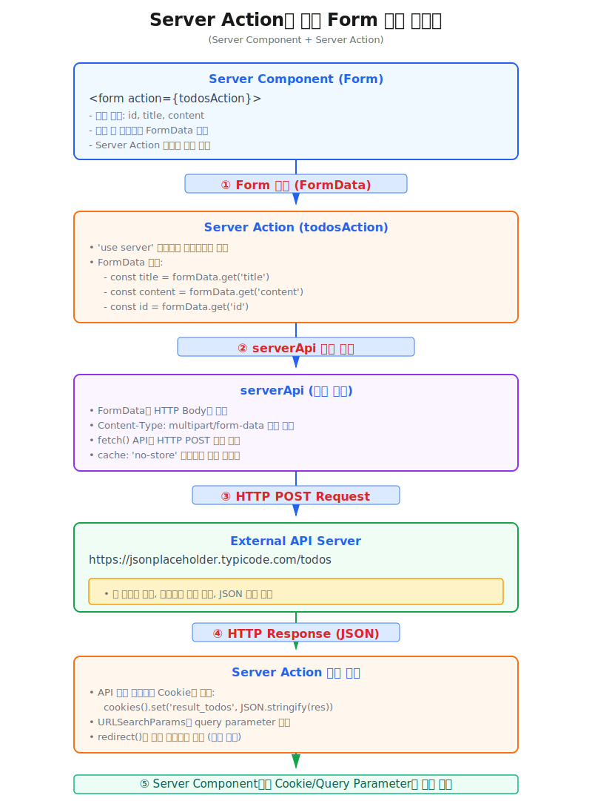

# Form 전송 (Server Component + Server Action)

**Server Component**에서 FormData를 전송할 때 **Server Action** 을 호출하여 데이터를 처리하는 방법입니다.  
* **Server Component**에서 FormData를 **Server Action**으로 전달하고, **Server Action**에서는 FormData를 파싱하고, `serverApi` 함수를 호출하여 REST API를 호출하는 과정을 거칩니다.





## 사용 예제
---
* [실제 동작 예제 보기: https://react-app-scaffold.vercel.app/example/docs-examples/server-form](https://react-app-scaffold.vercel.app/example/docs-examples/server-form)
```tsx
// ========================================================
// SamplePage.tsx
// 상황에 따라 쿠키를 사용하거나 query parameter를 사용하여 결과를 전달할 수 있습니다.
// ========================================================
import { serverApi } from '@fetch/api';
import { todosAction } from './todosAction'; // Server Action 파일 읽음
import { cookies } from 'next/headers';

function SamplePage({ searchParams }) {
  // 쿠키에서 결과 읽어옴 (결과 화면에서 쿠키에서 읽어옴)
  const resultTodosCookie = use(cookies()).get('result_todos');
  // Next.js 15에서 searchParams는 Promise이므로 use()로 unwrap 필요 (결과 화면에서 쿼리 파라미터를 읽어옴)
  const resolvedSearchParams = searchParams ? use(searchParams) : {};

  return (
    <div>
      // highlight-start
      <form action={todosAction as any}>
        <input name="id" defaultValue="1" />
        <input name="title" defaultValue="제목 1" />
        <textarea name="content" defaultValue="내용 1" />
        <button type="submit">POST 요청 보내기</button>
      </form>
      // highlight-end
      {/* 쿠키에서 읽어온 결과 표시 부분 */}
      <pre>
        {resultTodosCookie ? (
          (() => {
            try {
              return JSON.stringify(JSON.parse(resultTodosCookie.value), null, 2);
            } catch {
              return resultTodosCookie.value;
            }
          })()
        ) : (
          <span>결과 없음</span>
        )}
      </pre>
      {/* 쿼리 파라미터에서 읽어온 결과 표시 부분 */}
      <pre>
        {resolvedSearchParams && Object.keys(resolvedSearchParams).length > 0 ? (
          JSON.stringify(resolvedSearchParams, null, 2)
        ) : (
          <span>결과 없음</span>
        )}
      </pre>
    </div>
  );
}
```
```tsx
// ========================================================
// todosAction.ts (Server Action)
// ========================================================
'use server';

import { serverApi } from '@fetch/api';

export async function todosAction(formData: FormData) {

  // FormData를 파싱하여 값을 추출합니다.
  const title = formData.get('title') as string;
  const content = formData.get('content') as string;
  const id = formData.get('id') as string;

  // FormData를 추출하는 방법으로 Object.fromEntries() 함수를 사용할 수도 있습니다.
  // const formDataObject = Object.fromEntries(formData.entries());
  // console.log('formDataObject:::', formDataObject);

  // serverApi 호출
  // formData를 직접 전달하면 serverApi가 자동으로 Content-Type: multipart/form-data를 설정합니다.
  const res = await serverApi<any>('https://jsonplaceholder.typicode.com/todos', {
    method: 'POST',
    body: formData,
    cache: 'no-store',
  });

  // api 호출 결과 성공 처리
  if (res.data) {
    // 쿠키에 결과 저장하여 전달 방법 (결과 화면에서 쿠키에서 읽어옴)
    (await cookies()).set('result_todos', JSON.stringify(res), { maxAge: 60 });

    // query parameter 포함을 위한 URLSearchParams 객체 생성 
    // (결과 화면에서 쿼리 파라미터를 읽어옴)
    const params = new URLSearchParams({
      success: 'true',
      message: '할일이 추가되었습니다.',
      status: res?.status?.toString() || '',
      id: res.data.id?.toString() || '',
    });

    // 캐시 무효화 (필요시 주석 해제)
    // 캐시 무효화는 데이터가 변경된 후, 해당 경로의 캐시를 무효화하여 최신 데이터로 페이지를 리렌더링하기 위해서 사용됩니다.
    // revalidatePath('/example/docs/server-form');
    // revalidateTag('todos'); // tag가 등록 되어 있을 경우. tag로 캐시 무효화 방법

    // redirect 함수로 페이지 이동 (query parameter 포함)
    // 다음 코드는 자기 자신의 페이지로 이동하면서 query parameter를 포함하여 이동합니다.
    redirect(`/example/docs-examples/server-form?{`${params.toString()}`}`);
  }
}
```


## Server Component에서 API 응답 처리 관련
---

**Server Action**에서 API 응답 후 결과를 화면에 전달하는 두 가지 방법이 있습니다.

### 1. 쿠키(Cookie)를 사용한 응답 처리

**사용 방법:**
```tsx
// Server Action에서 쿠키 설정
import { cookies } from 'next/headers';

export async function myAction(formData: FormData) {
  const res = await serverApi('https://api.example.com/data', {
    method: 'POST',
    body: formData,
  });
  
  // 결과를 쿠키에 저장 (maxAge: 60초)
  (await cookies()).set('result_data', JSON.stringify(res), { maxAge: 60 });
  
  redirect('/current-page');
}

// Server Component에서 쿠키 읽기
import { cookies } from 'next/headers';

function MyPage() {
  const resultCookie = use(cookies()).get('result_data');
  
  return <pre>{resultCookie?.value}</pre>;
}
```

**장점:**
- URL이 깔끔하게 유지됩니다 (query parameter가 노출되지 않음)
- 많은 양의 데이터를 전달할 수 있습니다 (URL 길이 제한 없음)
- 복잡한 객체 데이터를 JSON으로 직렬화하여 전달 가능합니다

**단점:**
- 쿠키 크기 제한이 있습니다 (일반적으로 4KB)
- 서버 측에서만 접근 가능합니다 (브라우저에서 직접 읽기 어려움)
- 별도로 삭제하지 않으면 maxAge 동안 유지됩니다
- 북마크나 URL 공유 시 결과가 포함되지 않습니다

**사용 권장 사례:**
- API 응답 결과가 크거나 복잡한 경우
- URL에 민감한 정보가 노출되면 안 되는 경우
- 임시로 결과를 전달하고 자동으로 만료시키고 싶은 경우

---

### 2. Query Parameter를 사용한 응답 처리

**사용 방법:**
```tsx
// Server Action에서 query parameter로 redirect
import { redirect } from 'next/navigation';

export async function myAction(formData: FormData) {
  const res = await serverApi('https://api.example.com/data', {
    method: 'POST',
    body: formData,
  });
  
  // URLSearchParams로 query parameter 생성
  const params = new URLSearchParams({
    success: 'true',
    message: '성공적으로 처리되었습니다.',
    id: res.data.id?.toString() || '',
    status: res.status?.toString() || '',
  });
  
  redirect(`/current-page?${params.toString()}`);
}

// Server Component에서 searchParams로 읽기
function MyPage({ searchParams }) {
  // Next.js 15에서 searchParams는 Promise
  const resolvedParams = searchParams ? use(searchParams) : {};
  
  return (
    <div>
      {resolvedParams.success && (
        <p>성공: {resolvedParams.message}</p>
      )}
    </div>
  );
}
```

**장점:**
- URL에 결과가 포함되어 북마크나 공유가 가능합니다
- 브라우저 히스토리에 기록됩니다
- 새로고침 시에도 결과가 유지됩니다
- 디버깅이 쉽습니다 (URL에서 직접 확인 가능)

**단점:**
- URL 길이 제한이 있습니다 (일반적으로 2048자)
- URL에 정보가 노출됩니다 (민감한 데이터 부적합)
- 복잡한 객체 데이터 전달이 어렵습니다 (문자열만 가능)
- URL이 길어지면 가독성이 떨어집니다

**사용 권장 사례:**
- 간단한 성공/실패 메시지를 전달하는 경우
- 상태 정보(success, error)나 ID 같은 간단한 값을 전달하는 경우
- URL 공유나 북마크가 필요한 경우
- 페이지 새로고침 후에도 결과가 유지되어야 하는 경우

---

### 선택 가이드

| 상황 | 권장 방법 |
|------|----------|
| 복잡한 API 응답 데이터 전달 | **쿠키** |
| 간단한 성공/실패 메시지 | **Query Parameter** |
| 민감한 정보 포함 | **쿠키** |
| URL 공유 필요 | **Query Parameter** |
| 많은 양의 데이터 | **쿠키** |
| 디버깅 편의성 | **Query Parameter** |
| 새로고침 시 유지 필요 | **Query Parameter** |
| 임시 데이터 (자동 만료) | **쿠키** |

두 방법을 함께 사용할 수도 있습니다. 예를 들어, 상세 데이터는 쿠키로 전달하고, 성공/실패 상태는 query parameter로 전달하여 URL에서 쉽게 확인할 수 있도록 할 수 있습니다.

