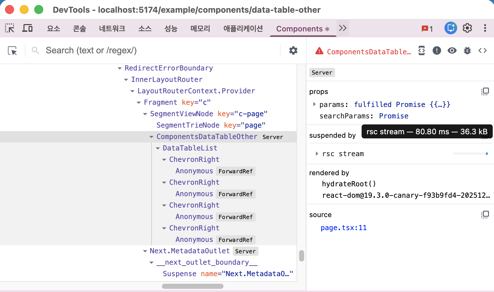
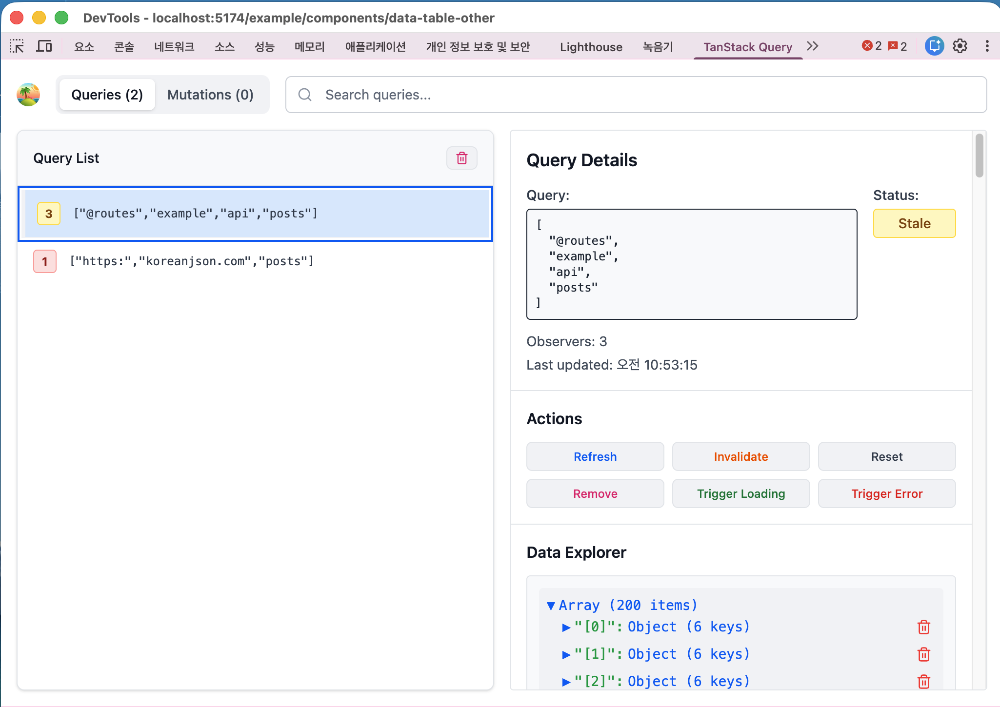
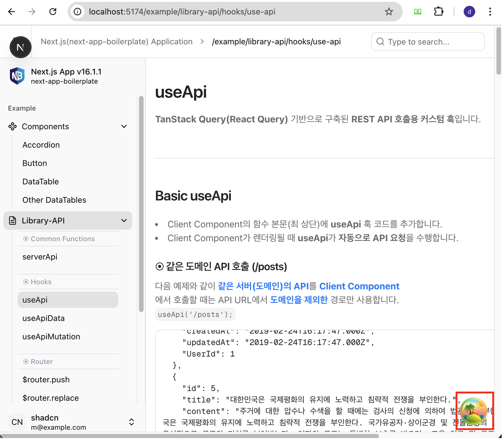
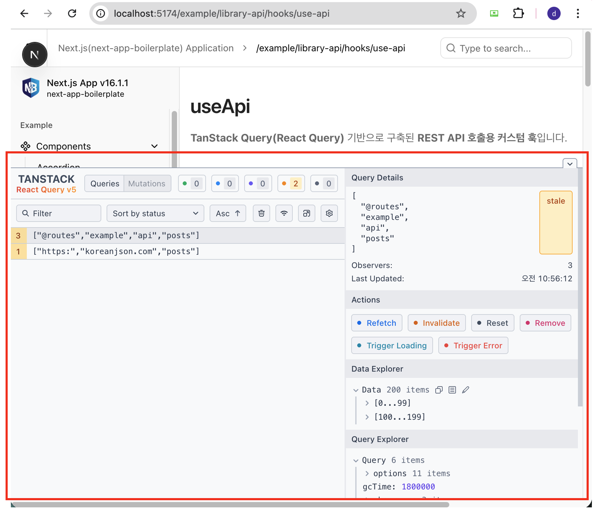
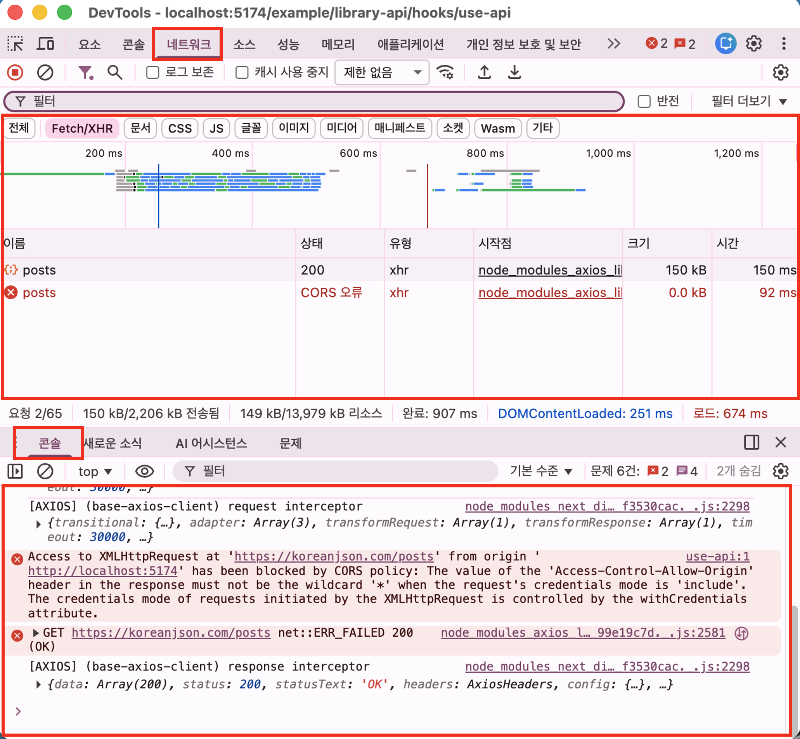

# 디버깅

## 디버깅 확장팩 설치

1. **React Developer Tools 설치**
   - 크롬 브라우저 확장 프로그램 React Developer Tools를 통해 컴포넌트 트리, props/state, hooks 정보를 쉽게 확인할 수 있습니다.
   - 확인하고 싶은 컴포넌트를 선택하면 아래와 같이 컴포넌트 정보를 확인할 수 있습니다.
   

2. **TanStack Query DevTools 설치**
   - 크롬 브라우저 확장 프로그램 TanStack Query(React Query)를 사용할 경우, TanStack Query DevTools를 통해 Query 상태, 캐시 정보를 쉽게 확인할 수 있습니다.
   - 확인하고 싶은 Query를 선택하면 아래와 같이 Query 정보를 확인할 수 있습니다.
   

3. **TanStack Query DevTools 화면에서 직접 활용**
   - TanStack Query DevTools 화면에서 직접 활용하여 Query 상태, 캐시 정보를 확인할 수 있습니다.
   
   

## **크롬 브라우저 개발자 도구 활용**
   - **콘솔(Console) 탭**에 `console.log()`를 활용하여 변수 값이나 흐름을 추적합니다.
   - **Network 탭**으로 API 요청 및 응답 정보를 확인할 수 있습니다.
   - **요소(Elements) 탭**에서 DOM 구조와 스타일을 점검할 수 있습니다.
   

