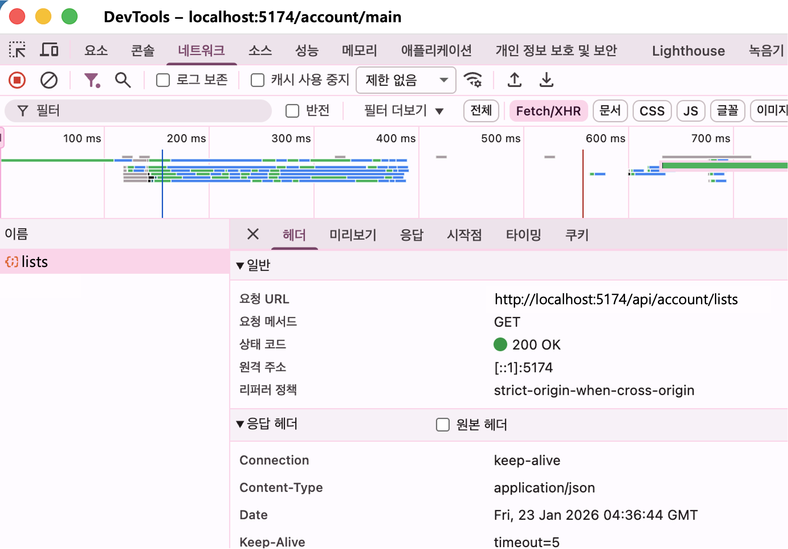
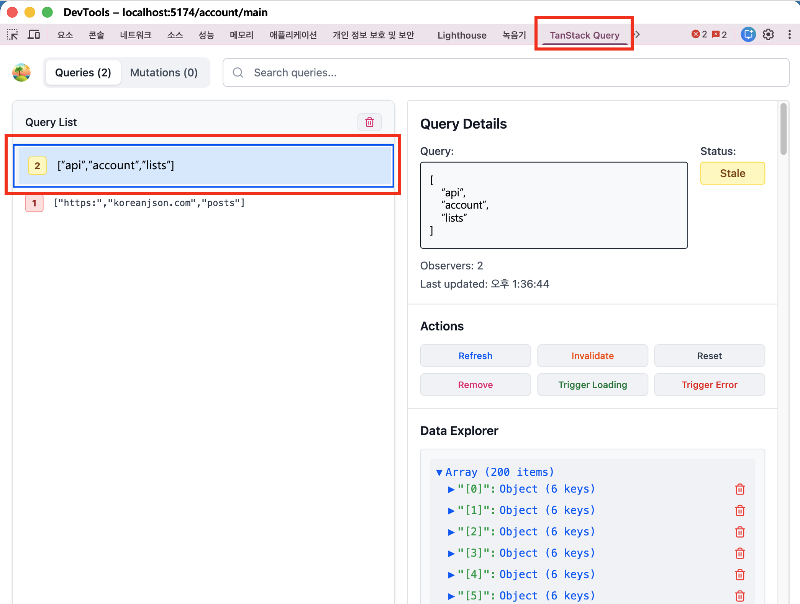

# 데이터 가져오기

:::info 작업 내용
* 각 업무(domain) 화면 컴포넌트에서 **next-app-boilerplate**가 제공하는 **클라이언트 환경용** **useApi()** hook과 **서버 환경용** **serverApi()** 함수를 통해 **REST API**를 호출하고 결과 데이터를 활용하는 방법을 설명합니다.
* **useApi()** 와 **serverApi()** 함수는 어떤 차이가 있고, 어떤 상황에서 사용하면 되는지 알아보겠습니다.
:::

:::tip <span class="admonition-title">Server, Client환경</span>에 대하여
* **Next.js**는 풀스택 프레임워크로, React 개발 시 **SSR**과 **CSR**을 각각 **Server Component**와 **Client Component**로 구분하여 개발할 수 있습니다.
* **Server Component**는 서버에서 실행되는 컴포넌트로, **CSR**과 달리 브라우저에서 실행되지 않습니다. 따라서 데이터를 조회할 때 `serverApi()` 함수를 사용하여 **서버에서 데이터를 조회**합니다. `serverApi()` 함수는 내부적으로 **fetch**를 통해 **REST API**를 호출하고 결과 데이터를 활용합니다.
* **Client Component**는 클라이언트에서 실행되는 컴포넌트로, **브라우저에서 실행**됩니다. 따라서 데이터를 조회할 때 `useApi()` 함수를 사용하여 **클라이언트에서 데이터를 조회**합니다. `useApi()` 함수는 내부적으로 **Axios**를 통해 **REST API**를 호출하고 결과 데이터를 활용합니다. 또한 **TanStack Query(React Query)** 를 통해 데이터를 캐싱하고 관리합니다.   또한 브라우저에서 호출하는 훅 함수 이므로 **REST API 호출 도메인이 다르면** **CORS 이슈**가 발생할 수 있으며, Component가 모두 렌더링된 후 API 요청이 발생하므로 **SEO**(검색엔지노출) 최적화에 부적합합니다.
:::

:::tip 데이터 조회, 업데이트 방법의 차이
* **useApi()** 함수는 **클라이언트 환경**에서 `GET, POST` method 타입으로 **데이터를 조회**하고 결과 데이터를 활용하는 용도로 사용합니다. 그 외 `POST, PUT, PATCH, DELETE` method 타입으로 서버의 **데이터를 변경, 업데이트하는 용도**로 사용할 때는 **useApiMutation()** 함수를 사용해야 합니다. 이와 같이 데이터 조회, 업데이트 방법의 차이가 있는것은 **TanStack Query(React Query)** 의 특성을 그대로 반영한 것입니다.
* **serverApi()** 함수는 **서버 환경**에서 `GET, POST, PUT, PATCH, DELETE` method 타입으로 **데이터를 조회, 업데이트** 모두 사용할 수 있습니다.
:::


## 클라이언트 환경에서 <span class="text-blue-normal">데이터 조회</span> 방법
---
🔗 [**useApi()** API 문서 바로가기](../../assets-api/global-function/hooks/use-api)

클라이언트 환경 즉 브라우저에서 실행되는 화면 컴포넌트에서 **데이터를 조회**하는 방법이기 때문에 `useApi()` 함수를 사용합니다.

### account(계좌)업무 폴더 구조
* 개발해야할 업무가 "**계좌(account)**" 업무라고 가졍 했을 때 다음과 같이 폴더구조를 구성하고, 그 하위 구조를 만듭니다.
  - **account** 업무 폴더가 생성되면 하위 폴더로 <span class="text-blue-normal">**_action, _hooks, _styles, _components, _common, (pages), api, _types**</span>폴더를 가질 수 있습니다. 물론 사용되지 않는 폴더는 없어도 상관없습니다.
  - 폴더 구성에 대한 자세한 설명은 [개발구조및규칙](../config/dev-convention#next-app-boilerplate-폴더-구조) 가이드를 참조하세요.

  ```sh
  # 내가 작업할 업무가 "계좌(account)" 업무라고 가정한다면
  # 아래와 같은 기본 구조를 가진다.
  src
  ├── app
  │   ├── (domains)
  │   │   ├── ...
  // highlight-start
  │   │   └── account # account 업무 폴더
  │   │       ├── (pages)       
  │   │       │   ├── main              # 계좌메인화면
  │   │       │   │   ├── page.tsx    
  │   │       │   │   └── ...         
  │   │       │   └── usage-history     # 계좌이용내역화면
  │   │       │       ├── page.tsx    
  │   │       │       └── ...         
  │   │       ├── _action       
  │   │       ├── _hooks         
  │   │       ├── _styles         
  │   │       ├── _common       
  │   │       ├── _components   
  │   │       ├── api           
  │   │       └── _types        
  // highlight-end
  │   └── ...    
  └── ...
  ```


### 계좌메인에서 데이터 조회
* 아래와 같은 방법으로 데이터를 조회하면 화면에 진입 시 바로 데이터를 조회합니다. 만약 화면에 진입 시 데이터를 조회하지 않고, 특정 이벤트가 발생했을 때 데이터를 조회하고 싶다면, `useApi()` 훅의 `enabled` 옵션을 사용하면 됩니다. `enabled` 옵션 사용 방법은 아래쪽에 따로 설명합니다.
```tsx showLineNumbers
// src/app/(domains)/account/(pages)/main/page.tsx

'use client';

import { JSX } from 'react';
// highlight-start
import { useApi } from '@hooks/api';
// highlight-end
// IAccountLists(계좌목록). response 타입을 _types 폴더에 선언하고 사용합니다.
import type { IAccountLists } from '@/app/(domains)/account/_types';

// 페이지 컴포넌트의 Props 타입 정의
export interface IAccountMainProps {
  // test?: string;
}

// 페이지 컴포넌트 함수 (계좌메인)
export default function AccountMain({}: IAccountMainProps): JSX.Element {
  // 내부 API 호출(/api/account/lists)
  // highlight-start
  const {
    data: accountListsData,
    error: accountListsError,
    isLoading: accountListsLoading,
  } = useApi<IAccountLists[]>('/api/account/lists');
  // highlight-end
  return (
    <div>
      {
        accountListsLoading
          ? 'Loading...'
          : accountListsError
            ? 'Error: ' + JSON.stringify(accountListsError)
            : JSON.stringify(accountListsData || [], null, 2) || 'No data'
      }
    </div>
  );
}
```
:::info 설명
* 클라이언트 환경이기 때문에 `'use client';` 코드를 최상위에 입력합니다.
* `useApi` hook을 **import** 합니다.
  ```tsx
  import { useApi } from '@hooks/api';
  ```
* 사용할 API가 `/api/account/lists` 라고 가정했을 때, `useApi()` 훅을 함수 컴포넌트 최상위에서 호출합니다.
  - `useApi()` 훅의 response 타입을 제네릭으로 전달하여 반환값의 타입을 정의할 수 있습니다.
  - 같은 도메인의 API 서버에서 제공하는 API url이면 도메인은 빼고 하위 url만 입력합니다.
  - 도메인(https://app.domain.com)은 추후 공통 영역(공통 개발자)에서 따로 설정합니다.
  - 만약 외부 API 서버에서 제공하는 API를 사용할 경우에는 도메인을 포함하여 전체 url을 입력합니다.
  ```tsx
  export default function AccountMain() {
    // highlight-start
    const {
      data: accountListsData,
      error: accountListsError,
      isLoading: accountListsLoading,
    } = useApi<IAccountLists[]>('/api/account/lists');
    // highlight-end
    // ... 추가 코드
  }
  ```
* `useApi()` 훅의 반환값은 **TanStack Query(React Query)** 의 `useQuery` 훅의 반환값과 사용법과 내용이 동일합니다. 따라서 `useQuery` 훅의 사용법을 참조하면 됩니다.
  - [TanStack Query - useQuery 반환값 참조](https://tanstack.com/query/latest/docs/framework/react/reference/useQuery)
  - 결과 데이터에는 `data`, `error`, `isLoading` 등의 값이 있으며, 이 값들을 활용하여 화면에 표시합니다.
  ```tsx
  export default function AccountMain() {
    // ... 추가 코드
    return (
      <div>
    // highlight-start
        {
          accountListsLoading
            ? 'Loading...'
            : accountListsError
              ? 'Error: ' + JSON.stringify(accountListsError)
              : JSON.stringify(accountListsData || [], null, 2) || 'No data'
        }
        // highlight-end
      </div>
    );
  }
  ```
:::


### 개발자툴의 '네트워크' 탭에서 데이터 조회 확인
* 위와 같이 `useApi` hook을 사용하여 데이터를 조회하면 개발자 도구의 '네트워크' 탭에서 데이터 조회를 확인할 수 있습니다.
  - 이는 **클라이언트 환경**이기 때문에 브라우저의 네트워크 탭에서 확인할 수 있는 것입니다.
  


### TanStack Query DevTools 에서 캐싱 데이터 확인
* 위와같이 `useApi` hook을 사용하여 데이터를 조회하면, TanStack Query의 전역 샹태에도 캐싱되므로, TanStack Query DevTools 에서 캐싱 데이터를 확인할 수 있습니다.
  


### 버튼 클릭 시 데이터 조회 방법
* 페이지 진입 시 바로 데이터를 조회하지 않고, 버튼 클릭 시 데이터를 조회하고 싶다면, 다음과 같이 `useApi()` 훅의 `queryOptions` 옵션에 `enabled` 옵션을 `false`로 설정하면 됩니다.
* `refetch` 함수를 버튼 클릭 시 호출하여 데이터를 조회합니다.
```tsx
export default function AccountMain() {
  const {
    data: accountListsData,
    error: accountListsError,
    isLoading: accountListsLoading,
    refetch: accountListsRefetch,
    // highlight-start
  } = useApi<IAccountLists[]>(
      '/api/account/lists',
      { queryOptions: { enabled: false } }
    );
  // highlight-end

  return (
    <div>
      <button onClick={() => {
        // highlight-start
        accountListsRefetch();
        // highlight-end
      }}>데이터 조회</button>
    </div>
  );
}
```


## 서버 환경에서 <span class="text-blue-normal">데이터 조회</span> 방법
---
🔗 [**serverApi()** API 문서 바로가기](../../assets-api/global-function/common/server-api)

서버 환경 즉 서버에서 실행되는 화면 컴포넌트에서 **데이터를 조회**하는 방법이기 때문에 `serverApi()` 함수를 사용합니다.

### 계좌메인에서 데이터 조회
* **Server Component**는 SSR(서버에서 모두 렌더링)이기 때문에 화면 컴포넌트 함수 최상단에서 바로 데이터를 조회(`serverApi()`)하고, 데이터를 화면에 표시합니다.
```tsx showLineNumbers
import { JSX } from 'react';
// highlight-start
import { serverApi } from '@fetch/api';
// highlight-end
// IAccountLists(계좌목록). response 타입을 _types 폴더에 선언하고 사용합니다.
import type { IAccountLists } from '@/app/(domains)/account/_types';

// 페이지 컴포넌트의 Props 타입 정의
export interface IAccountMainProps {
  // test?: string;
}

export default async function AccountMain(): Promise<JSX.Element> {
  // 가져온 데이터 바로 활용
  // highlight-start
  const accountListsData = await serverApi<IAccountLists[]>(
    '/api/account/lists',
    { method: 'GET' },
  );
  // highlight-end
  return (
    <div>
      {JSON.stringify(accountListsData || [], null, 2) || 'No data'}
    </div>
  );
}
```


### 데이터 로그
* 서버 환경에서 데이터를 조회하면 **클라이언트 환경** 처럼 브라우저의 개발자 도구의 '네트워크' 탭에서 데이터 호출 내용을 확인할 수 없고, 로컬서버를 띄운 터미널 창에서만 확인할 수 있습니다.