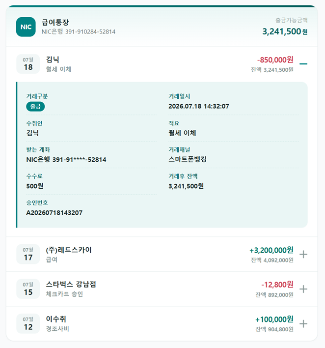

{/* import AutoHeightStorybookIframe from '../../../src/components/AutoHeightStorybookIframe'; */}
{/* import { DOC_CONFIG } from '../../../src/config/doc-config'; */}

{/*
## Accordion 인터랙티브 예제
---
<AutoHeightStorybookIframe
  src={`${DOC_CONFIG.STORYBOOK_URL}?path=/docs/ui-components-accordion--docs&nav=0&hideDocsToc=1`}
  title="Accordion 인터랙티브 예제"
  minHeight={600}
/>
---
*/}

# Accordion 컴포넌트

`react-app-scaffold`가 `@axiom/components/ui`로 제공하는 아코디언 컴포넌트입니다.  
여러 정보를 한 화면에 접어서 정리하고, 필요한 항목만 펼쳐 보여줄 때 사용합니다.

**언제 쓰나요?**

* FAQ·약관 동의처럼 **제목만 훑고 필요한 것만 펼쳐 읽는** 목록
* 설정 패널·상세 정보처럼 **한 화면에 다 펼치면 길어지는** 콘텐츠를 접어둘 때
* 마스터-디테일(목록에서 한 건을 펼쳐 상세를 보는) 패턴

> 한 항목을 열면 다른 항목이 닫혀야 한다면 `type="single"`, 여러 개를 동시에 열어둘 수 있어야 한다면 `type="multiple"`을 씁니다. (아래 [동작 옵션](#동작-옵션) 참고)

---


## Import
---

```tsx
import {
  Accordion,
  AccordionItem,
  AccordionTrigger,
  AccordionContent,
} from '@axiom/components/ui';
```

Accordion은 **4개의 파트를 조합해서** 쓰는 합성(compound) 컴포넌트입니다. 각 파트의 역할은 [구성(Anatomy)](#구성-anatomy)에서 설명합니다.

---


## 기본 사용법
---

가장 기본적인 형태입니다. `type="single" collapsible` 이면 **한 번에 하나만 열리고, 열린 항목을 다시 클릭하면 닫힙니다.**

---


```tsx
<Accordion type="single" collapsible>
  <AccordionItem value="item-1">
    <AccordionTrigger>배송 옵션은 어떻게 되나요?</AccordionTrigger>
    <AccordionContent>
      일반 배송(5~7일), 빠른 배송(2~3일), 당일 배송을 제공합니다.
    </AccordionContent>
  </AccordionItem>
  <AccordionItem value="item-2">
    <AccordionTrigger>반품 정책이 어떻게 되나요?</AccordionTrigger>
    <AccordionContent>
      구매 후 30일 이내에 반품 신청이 가능합니다.
    </AccordionContent>
  </AccordionItem>
  <AccordionItem value="item-3">
    <AccordionTrigger>고객 지원에 어떻게 연락하나요?</AccordionTrigger>
    <AccordionContent>
      이메일, 전화, 채팅으로 24시간 지원받을 수 있습니다.
    </AccordionContent>
  </AccordionItem>
</Accordion>
```

:::tip `value`는 왜 필요한가
각 `AccordionItem`의 `value`는 **어떤 항목이 열렸는지 식별하는 고유 키**입니다. `defaultValue`·`value`·`onValueChange`가 모두 이 키로 항목을 가리키므로 **항목마다 서로 다른 값**을 반드시 지정하세요.
:::

---


## 구성 (Anatomy)
---

Accordion은 아래 4개 파트를 중첩해서 구성합니다.

```tsx
<Accordion>               {/* 루트 — 열림 모드(single/multiple)와 상태를 관리 */}
  <AccordionItem>         {/* 항목 하나 — value로 식별 */}
    <AccordionTrigger />  {/* 클릭해서 여닫는 헤더 버튼(제목 + 아이콘) */}
    <AccordionContent />  {/* 펼쳐지는 내용 */}
  </AccordionItem>
  {/* AccordionItem 을 필요한 만큼 반복 */}
</Accordion>
```

| 파트 | 역할 |
| --- | --- |
| `Accordion` | 루트. `type`으로 열림 모드를 정하고 열림 상태를 관리합니다. |
| `AccordionItem` | 한 개의 접이식 항목. `value`(고유 키)를 가집니다. |
| `AccordionTrigger` | 여닫는 헤더 버튼. 자식으로 제목을, `icon`으로 아이콘을 받습니다. |
| `AccordionContent` | 펼쳐질 내용 영역. |

:::note
`AccordionTrigger`는 내부적으로 접근성용 헤더(`<h3>` 성격) 안에 버튼을 렌더합니다. 따라서 헤더 마크업을 직접 작성할 필요 없이 **위 4개 파트만** 조합하면 됩니다.
:::

---


## 동작 옵션
---
여닫는 **동작**은 루트 `Accordion`의 prop으로 결정됩니다. 원하는 UX에 맞춰 아래에서 고르세요.


### 1. 단일 / 다중 — `type`

```tsx
// 한 번에 하나만 (열면 나머지는 닫힘)
<Accordion type="single" collapsible> … </Accordion>

// 여러 개 동시에 열기 허용
<Accordion type="multiple"> … </Accordion>
```

* `type="single"` — 항상 **최대 1개**만 열립니다. FAQ처럼 하나씩 읽는 흐름에 적합.
* `type="multiple"` — 여러 항목을 **동시에** 열어둘 수 있습니다. 설정 패널처럼 비교하며 보는 흐름에 적합.

---


### 2. 다시 닫기 허용 — `collapsible`

`type="single"` 전용 옵션입니다.

```tsx
// collapsible: 열린 항목을 다시 클릭하면 닫힘 (모두 닫힌 상태 허용)
<Accordion type="single" collapsible> … </Accordion>

// collapsible 생략: 항상 하나는 열려 있어야 함 (열린 항목 재클릭해도 안 닫힘)
<Accordion type="single"> … </Accordion>
```

* 대부분의 FAQ는 `collapsible`을 **켜서** "모두 닫힘"이 가능하게 합니다.
* 탭처럼 **항상 하나는 열려 있어야** 하는 UI라면 `collapsible`을 뺍니다.


### 3. 처음부터 열어두기 — `defaultValue`

```tsx
// 첫 항목을 처음부터 펼친 상태로 시작
<Accordion type="single" collapsible defaultValue="item-1">
  <AccordionItem value="item-1"> … </AccordionItem>
  <AccordionItem value="item-2"> … </AccordionItem>
</Accordion>

// multiple 이면 배열로 여러 개 지정
<Accordion type="multiple" defaultValue={['item-1', 'item-3']}> … </Accordion>
```

`defaultValue`는 **비제어(uncontrolled)** 초기값입니다. 이후 열고 닫는 상태는 컴포넌트가 알아서 관리합니다.


### 4. 외부에서 제어 — `value` / `onValueChange`
열린 항목을 **바깥 상태로 직접 제어**하려면 `value` + `onValueChange`를 씁니다. (버튼으로 특정 항목을 열거나, 다른 UI와 연동할 때)

---


```tsx
import { useState } from 'react';

function Example() {
  const [openValue, setOpenValue] = useState(''); // '' = 모두 닫힘

  return (
    <>
      <button onClick={() => setOpenValue('item-2')}>2번 항목 열기</button>
      <button onClick={() => setOpenValue('')}>모두 닫기</button>

      <Accordion
        type="single"
        collapsible
        // highlight-start
        value={openValue}
        onValueChange={setOpenValue}
        // highlight-end
      >
        <AccordionItem value="item-1">
          <AccordionTrigger>스타터 플랜</AccordionTrigger>
          <AccordionContent>개인 프로젝트에 적합한 기본 플랜입니다.</AccordionContent>
        </AccordionItem>
        <AccordionItem value="item-2">
          <AccordionTrigger>프로 플랜</AccordionTrigger>
          <AccordionContent>팀 협업과 고급 분석이 포함됩니다.</AccordionContent>
        </AccordionItem>
      </Accordion>
    </>
  );
}
```
* `type="multiple"`이면 `value`/`onValueChange`가 **문자열 배열**(`string[]`)을 다룹니다.
* `value`를 넘기면 **제어 모드**가 되므로, 반드시 `onValueChange`로 상태를 갱신해야 여닫힘이 동작합니다.


### 5. 항목 비활성화 — `disabled`

특정 항목만(또는 전체를) 열 수 없게 막습니다.

```tsx
<Accordion type="single" collapsible>
  <AccordionItem value="item-1">
    <AccordionTrigger>계정 내역 조회</AccordionTrigger>
    <AccordionContent>지난 12개월의 활동 내역을 확인할 수 있습니다.</AccordionContent>
  </AccordionItem>

  {/* 이 항목만 비활성화 */}
  <AccordionItem value="item-2" disabled>
    <AccordionTrigger>프리미엄 기능 (비활성화)</AccordionTrigger>
    <AccordionContent>프리미엄 플랜에서만 이용 가능합니다.</AccordionContent>
  </AccordionItem>
</Accordion>
```

* 개별 항목: `AccordionItem`에 `disabled`.
* 전체: 루트 `Accordion`에 `disabled`.

---


## API 레퍼런스
---

Accordion·Item·Content는 **Radix Accordion** 기반이라, 아래 표에 없는 Radix 표준 prop도 그대로 전달됩니다. 자주 쓰는 것만 정리합니다.

### `Accordion` (루트)

| Prop | 타입 | 기본값 | 설명 |
| --- | --- | --- | --- |
| `type` | `"single" \| "multiple"` | — *(필수)* | 동시에 열 수 있는 항목 수 |
| `collapsible` | `boolean` | `false` | `single`에서 열린 항목을 다시 닫기 허용 |
| `defaultValue` | `string \| string[]` | — | 초기 열림 항목(비제어). `single`=string, `multiple`=string[] |
| `value` | `string \| string[]` | — | 현재 열림 항목(제어). `onValueChange`와 함께 사용 |
| `onValueChange` | `(value) => void` | — | 열림 항목 변경 콜백. 인자 타입은 `type`을 따름 |
| `disabled` | `boolean` | `false` | 전체 항목 비활성화 |
| `orientation` | `"vertical" \| "horizontal"` | `"vertical"` | 방향(키보드 탐색에 영향) |
| `dir` | `"ltr" \| "rtl"` | `"ltr"` | 텍스트 방향 |
| `className` | `string` | — | 루트에 추가할 클래스 |

### `AccordionItem`

| Prop | 타입 | 기본값 | 설명 |
| --- | --- | --- | --- |
| `value` | `string` | — *(필수)* | 항목을 식별하는 고유 키 |
| `disabled` | `boolean` | `false` | 이 항목만 비활성화 |
| `className` | `string` | — | 항목에 추가할 클래스 |

### `AccordionTrigger`

| Prop | 타입 | 기본값 | 설명 |
| --- | --- | --- | --- |
| `children` | `ReactNode` | — | 헤더에 표시할 제목 |
| `icon` | `ReactNode` | 기본 Chevron | 닫힘 상태 아이콘. **단독 지정 시** 열릴 때 회전 |
| `expandedIcon` | `ReactNode` | — | 열림 상태 전용 아이콘. 지정 시 `icon`과 서로 교체 렌더(예: ＋↔－) |
| `className` | `string` | — | 트리거 버튼에 추가할 클래스 |

> `icon` / `expandedIcon`의 실전 활용은 [8. 아이콘 적용 방법](#8-아이콘-적용-방법-기본--애니메이션)에서 단계별로 다룹니다.

### `AccordionContent`

| Prop | 타입 | 기본값 | 설명 |
| --- | --- | --- | --- |
| `children` | `ReactNode` | — | 펼쳐질 내용 |
| `className` | `string` | — | 내부 콘텐츠 영역에 추가할 클래스 |
| `forceMount` | `boolean` | — | 닫힘 상태에서도 DOM 유지(SEO·전환 제어용) |

---


## 접근성 / 키보드
---

Radix 기반이라 **키보드 조작과 ARIA 속성이 기본 내장**되어 있습니다. 별도 설정 없이 아래가 동작합니다.

| 키 | 동작 |
| --- | --- |
| `Enter` / `Space` | 포커스된 항목 열기/닫기 |
| `Tab` | 다음 초점 가능 요소로 이동 |
| `↓` (Arrow Down) | 다음 트리거로 포커스 이동 |
| `↑` (Arrow Up) | 이전 트리거로 포커스 이동 |
| `Home` | 첫 트리거로 이동 |
| `End` | 마지막 트리거로 이동 |

* 트리거는 `<button>`으로 렌더되며 `aria-expanded`, `aria-controls`가 자동 연결됩니다.
* 열림 상태는 트리거에 `aria-expanded="true"`로 표시되므로, 스타일도 이 상태를 기준으로 잡습니다(아래 참고).
* 포커스 링은 디자인 토큰 `--ring`을 따릅니다.

---


## 스타일링 & 테마
---

Accordion은 여러 방법으로 모양을 바꿀 수 있습니다. **바꾸려는 대상에 따라 적합한 방법이 다릅니다.** 아래 순서(쉬운 것 → 세밀한 것)로 접근하세요.

| 바꾸려는 것 | 방법 |
| --- | --- |
| 펼침/닫힘 아이콘 | `icon` / `expandedIcon` **prop** |
| 아이콘 회전·크기, 펼침 속도 | **공개 CSS 변수**(테마 계약) |
| 색상(아이콘·구분선·텍스트) | **디자인 토큰**(`--muted-foreground`, `--border` 등) |
| 이 인스턴스만 패딩·폰트 등 | 각 파트의 **`className`** |
| 세밀한 겉모습 전체 교체 | **`data-slot` 선택자 + CSS Module** |

:::tip 핵심 원칙
* **자주 바꾸는 노브는 prop·CSS 변수**로, **색은 토큰**으로, **예외는 className/CSS Module**로.
* 회전 각도·속도처럼 **열림 상태에 묶인 값**은 `className`으로 닿기 어렵기 때문에 **공개 CSS 변수**로 노출되어 있습니다.
:::


### 1. 아이콘 교체 — `icon` / `expandedIcon`

`AccordionTrigger`에 아이콘을 넘겨 기본 셰브론을 교체합니다. 아무것도 넘기지 않으면 기본 Chevron이 사용됩니다(하위호환).

```tsx
// 단일 아이콘 — 열릴 때 자동으로 회전 (대부분의 "셰브론 교체" 요구)
<AccordionTrigger icon={<ChevronDown />}>제목</AccordionTrigger>

// 두 아이콘 — 열림/닫힘에 서로 다른 모양으로 교체 (예: ＋ ↔ －)
<AccordionTrigger icon={<Plus />} expandedIcon={<Minus />}>제목</AccordionTrigger>
```

* **방향만 바뀌는 아이콘**(회전으로 표현) → `icon` **1개**면 충분합니다.
* **완전히 다른 모양**(＋↔－ 등) → `icon` + `expandedIcon` **2개**를 넘깁니다.


### 2. 테마 계약 — 공개 CSS 변수

아이콘 회전/크기, 펼침 속도는 **공개 CSS 변수**로 노출되어 있습니다. 컴포넌트 내부 구조를 몰라도 **변수만 세팅**하면 됩니다. 아코디언을 감싼 임의의 상위 요소(또는 페이지 스코프)에 선언하면 하위로 상속됩니다.

```css
.myAccordion {
  --accordion-icon-rotate: 45deg;      /* 열림 시 아이콘 회전 각도  (기본 180deg) */
  --accordion-icon-duration: 250ms;    /* 아이콘 회전 속도          (기본 200ms) */
  --accordion-icon-size: 1.25rem;      /* 트리거 아이콘 크기        (기본 1rem)  */
  --accordion-content-duration: 250ms; /* 펼침/접힘 애니메이션 속도 (기본 0.2s)  */
}
```

| CSS 변수 | 역할 | 기본값 |
| --- | --- | --- |
| `--accordion-icon-rotate` | 열림 시 아이콘 회전 각도 | `180deg` |
| `--accordion-icon-duration` | 아이콘 회전 전환 속도 | `200ms` |
| `--accordion-icon-size` | 트리거 아이콘 크기 | `1rem` |
| `--accordion-content-duration` | 펼침/접힘 애니메이션 속도 | `0.2s` |

:::info 예시 — ＋ 아이콘을 45° 돌려 ×로 바꾸기
`icon={<Plus />}`(단일 아이콘)로 두고 `--accordion-icon-rotate: 45deg`만 주면, 열릴 때 `＋`가 부드럽게 `×`로 회전합니다. 회전 '동작'은 컴포넌트가 `aria-expanded`로 제공하고, **각도·속도는 이 변수로** 조정하는 구조입니다.
:::


### 3. 색상은 디자인 토큰으로

아이콘·구분선·텍스트 색은 accordion 전용 변수가 아니라 **전역 디자인 토큰**을 따릅니다. 색을 바꾸려면 테마 토큰(`--muted-foreground`, `--border`, `--ring` 등)을 조정하세요. (accordion 전용 색 변수를 새로 만들면 토큰 체계가 분열됩니다.)


### 4. 세밀한 겉모습 교체 — `data-slot` + CSS Module

기본 톤과 전혀 다른 디자인을 입히려면, 컴포넌트가 노출하는 **`data-slot`** 을 CSS Module에서 선택자로 오버라이드합니다.

| data-slot | 대상 |
| --- | --- |
| `[data-slot="accordion"]` | 루트 |
| `[data-slot="accordion-item"]` | 각 항목 |
| `[data-slot="accordion-trigger"]` | 헤더 버튼 (열림 시 `aria-expanded="true"`) |
| `[data-slot="accordion-trigger-icon"]` | 아이콘 |
| `[data-slot="accordion-content"]` | 펼침 콘텐츠 |

```css
/* 래퍼(.wrap) 아래에서 슬롯을 재정의. 래퍼+슬롯 2~3단계로 감싸 Tailwind 유틸리티보다 명시도를 높인다. */
.wrap :global([data-slot='accordion']) :global([data-slot='accordion-item']) {
  border-bottom: 1px solid var(--border);
}
.wrap :global([data-slot='accordion']) :global([data-slot='accordion-trigger']):hover {
  text-decoration: none;
}
```

:::tip 명시도 주의
기본 스타일은 Tailwind 유틸리티(낮은 명시도)입니다. `.wrap [data-slot=...] [data-slot=...]`처럼 **래퍼+슬롯을 여러 단계로 감싸** 명시도를 확보해야 안정적으로 덮어씁니다. CSS Module 배치 규칙은 [컴포넌트 전용 스타일(css) 만들기](../../documents/dev/create-module-css) 문서를 참고하세요.
:::


### 5. 그 외 — `className` / `asChild`

* **인스턴스 단위 조정**: 각 파트가 `className`을 받습니다. 예: `<AccordionTrigger className="py-4 text-base">`.
* **렌더 요소 교체·구조 합성**: 상위 컴포넌트 패턴은 Radix 기반이므로, 필요 시 `asChild` 합성을 활용할 수 있습니다.

---


## 아이콘 적용 방법 (기본 → 애니메이션)
---

트리거 아이콘 하나만 놓고도 여러 단계로 표현할 수 있습니다. **원하는 결과에 맞춰 아래 방법 중 하나를 고르세요.** 위에서 아래로 갈수록 정교해집니다.

| # | 방법 | 핵심 도구 | 애니메이션 |
| --- | --- | --- | --- |
| 1 | 아이콘만 교체 | `icon` prop | 열림 시 회전(기본) |
| 2 | 아이콘 색·크기 | `currentColor` + `--accordion-icon-size` | – |
| 3 | 아이콘 회전 애니메이션 | `--accordion-icon-rotate` | ✅ 회전 |
| 4 | 두 아이콘 교체 (＋↔－ 등) | `icon` + `expandedIcon` | ✱ 즉시 교체 |
| 5 | 스트로크 모프 (＋가 －로 변형) | CSS 선 아이콘 + `aria-expanded` | ✅ 모핑 |

:::info 공통 전제
아래 예시의 `<AccordionTrigger>`는 모두 `react-app-scaffold`의 Accordion을 그대로 사용합니다. 아이콘의 **색은 `currentColor`** 로 흐르고, **크기는 `--accordion-icon-size`(기본 1rem)** 를 따릅니다.
:::


### 방법 1 — 아이콘만 교체

가장 단순한 형태. `AccordionTrigger`에 원하는 아이콘을 넘깁니다.

```tsx
import { ChevronDown } from 'lucide-react';

<AccordionTrigger icon={<ChevronDown />}>제목</AccordionTrigger>
```

* 단일 아이콘 모드는 **열릴 때 기본 180° 회전**합니다(셰브론이 위/아래로 뒤집힘).
* 회전 없이 **완전히 정적인 아이콘**을 원하면 회전 각도를 0으로 끕니다 → `--accordion-icon-rotate: 0deg;`


### 방법 2 — 아이콘 색·크기 바꾸기

아이콘은 `currentColor`를 쓰므로, **아이콘 슬롯의 `color`** 만 바꾸면 됩니다. 크기는 공개 변수로 조정합니다.

```css
/* 크기: 공개 변수 (감싼 상위 요소나 페이지 스코프에 선언) */
.myAccordion { --accordion-icon-size: 1.25rem; }

/* 색: 닫힘=muted, 열림=primary */
.myAccordion :global([data-slot='accordion-trigger-icon']) {
  color: var(--muted-foreground);
}
.myAccordion
  :global([data-slot='accordion-trigger'][aria-expanded='true'])
  :global([data-slot='accordion-trigger-icon']) {
  color: var(--primary);
}
```

* 색은 accordion 전용 변수를 만들지 않고 **디자인 토큰**(`--muted-foreground`, `--primary`)을 그대로 씁니다.


### 방법 3 — 아이콘 회전 애니메이션

회전 '동작'은 컴포넌트가 `aria-expanded`로 제공합니다. 각도·속도만 **공개 변수**로 지정하면 됩니다.

```tsx
import { Plus } from 'lucide-react';

<AccordionTrigger icon={<Plus />}>제목</AccordionTrigger>
```
```css
/* ＋ 를 열림 시 45° 돌려 × 로 전환 */
.myAccordion {
  --accordion-icon-rotate: 45deg;   /* 기본 180deg */
  --accordion-icon-duration: 250ms; /* 회전 속도 */
}
```

* 셰브론이면 `180deg`(위/아래 반전), ＋면 `45deg`(× 로 전환)가 자연스럽습니다.


### 방법 4 — 두 아이콘 교체 (＋ ↔ －)

열림/닫힘에 **완전히 다른 모양**을 쓰려면 아이콘 2개를 넘깁니다.

```tsx
import { Plus, Minus } from 'lucide-react';

<AccordionTrigger icon={<Plus />} expandedIcon={<Minus />}>제목</AccordionTrigger>
```

* 닫힘 → `icon`(＋), 열림 → `expandedIcon`(－)로 **즉시 교체**됩니다(전환 애니메이션 없음).
* 교체 과정을 **애니메이션**으로 보이고 싶으면 → 방법 5.


### 방법 5 — 스트로크 모프 (＋가 －로 부드럽게 변형)

서로 다른 SVG 아이콘을 CSS만으로 "모핑"할 수는 없습니다. 대신 **＋/－를 두 개의 선(가로·세로 바)으로 직접 그려서**, 세로 바만 눕히면 진짜 `＋`가 `－`로 변형됩니다.

```tsx
// lucide 아이콘 대신 CSS 로 그린 스팬을 넘긴다
<AccordionTrigger icon={<span className={styles.plusMinus} aria-hidden />}>제목</AccordionTrigger>
```
```css
/* 겉 아이콘 회전은 끄고(모프는 세로 바가 담당) */
.myAccordion { --accordion-icon-rotate: 0deg; }

/* ＋/－ 를 선 두 개로 그림 */
.plusMinus { position: relative; display: inline-block;
  width: var(--accordion-icon-size, 1rem); height: var(--accordion-icon-size, 1rem); }
.plusMinus::before,
.plusMinus::after {
  content: ''; position: absolute; top: 50%; left: 50%;
  width: 100%; height: 2px; border-radius: 2px; background: currentColor;
  transform: translate(-50%, -50%);
}
/* 세로 바: 닫힘 상태에서 90° 로 세워 ＋ 완성 */
.plusMinus::after {
  transform: translate(-50%, -50%) rotate(90deg);
  transition: transform var(--accordion-icon-duration, 200ms) ease;
}
/* 열림: 세로 바를 0° 로 눕혀 가로 바와 겹침 → － */
.myAccordion
  :global([data-slot='accordion-trigger'][aria-expanded='true'])
  .plusMinus::after {
  transform: translate(-50%, -50%) rotate(0deg);
}
```

* 세로 바가 `90° → 0°` 로 접히며 `＋` 가 `－` 로 **부드럽게 변형**됩니다.
* 색은 `currentColor` 라 방법 2의 색 규칙을 그대로 따르고, 속도는 `--accordion-icon-duration` 을 씁니다.

:::tip 어떤 방법를 고를까
* 방향 표시(펼침/접힘) → **방법 1·3**(셰브론 회전)
* +/- 토글 느낌, 애니메이션 불필요 → **방법 4**
* +/- 토글을 매끄러운 애니메이션으로 → **방법 5**
* CSS Module 배치·명시도 규칙은 [컴포넌트 전용 스타일(css) 만들기](../../documents/dev/create-module-css) 참고.
:::

---


## 실전 예제
---

제공 Accordion을 그대로 쓰되 `*.module.css`로 완전히 다른 톤을 입혀, 실무에서 바로 쓸 만한 형태로 구성한 예제입니다. 전체 소스는 scaffold의 예제 컴포넌트에서 확인하세요.

### 1. 거래내역 상세 (마스터-디테일)

리스트에서 한 건을 펼치면 수취인·수수료·잔액·승인번호 등 상세가 나오는 패턴입니다.

---


**포인트**

* 제공 `Accordion`을 **그대로** 쓰고(`type="single" collapsible defaultValue`), 동작·접근성은 컴포넌트에 맡깁니다.
* 트리거 안에 날짜 배지 / 상대방·적요 / 금액·잔액을 **3열 그리드**로 배치했습니다.
* 아이콘은 [방법 5 — 스트로크 모프](#방법-5--스트로크-모프-가--로-부드럽게-변형)를 그대로 적용(`--accordion-icon-rotate: 0deg`).
* 겉모습은 전부 `*.module.css`에서 **`data-slot` 선택자**로 오버라이드했습니다.

<details>
<summary><b>TransactionDetailAccordion.tsx</b> — 전체 소스 보기</summary>

```tsx title="src/domains/example/components/ui-components/TransactionDetailAccordion.tsx"
import { Accordion, AccordionContent, AccordionItem, AccordionTrigger } from '@axiom/components/ui';
import styles from './TransactionDetailAccordion.module.css';

/** 거래 한 건의 상세 데이터 */
interface ITransaction {
  id: string;
  month: string; // 예: '07'
  day: string; // 예: '18'
  dateTime: string; // 거래일시
  counterparty: string; // 상대방(수취인/입금자)
  memo: string; // 적요
  type: '입금' | '출금';
  amount: number; // 거래금액
  afterBalance: number; // 거래후 잔액
  fee: number; // 수수료
  bankAccount: string; // 상대 은행/계좌
  channel: string; // 거래 채널
  approvalNo: string; // 승인/거래번호
}

const TRANSACTIONS: ITransaction[] = [
  {
    id: 'tx-1',
    month: '07',
    day: '18',
    dateTime: '2026.07.18 14:32:07',
    counterparty: '김닉',
    memo: '월세 이체',
    type: '출금',
    amount: 850000,
    afterBalance: 3241500,
    fee: 500,
    bankAccount: 'NIC은행 391-91****-52814',
    channel: '스마트폰뱅킹',
    approvalNo: 'A20260718143207',
  },
  // … 나머지 거래 데이터 생략
];

function won(value: number): string {
  return value.toLocaleString('ko-KR');
}

export default function TransactionDetailAccordion(): React.ReactNode {
  return (
    <div className={styles.wrap}>
      <div className={styles.card}>
        <div className={styles.brandBar} />

        {/* 계좌 요약 헤더(아코디언 외부) */}
        <div className={styles.accountHead}>
          <div className={styles.accountInfo}>
            <div className={styles.accountMark}>NIC</div>
            <div>
              <div className={styles.accountAlias}>급여통장</div>
              <div className={styles.accountNo}>NIC은행 391-910284-52814</div>
            </div>
          </div>
          <div className={styles.balanceBox}>
            <div className={styles.balanceLabel}>출금가능금액</div>
            <div className={styles.balanceValue}>
              3,241,500<small>원</small>
            </div>
          </div>
        </div>

        {/* scaffold 제공 Accordion — 스타일만 CSS Module로 오버라이드 */}
        // highlight-next-line
        <Accordion type="single" collapsible defaultValue="tx-1">
          {TRANSACTIONS.map((tx) => {
            const isIn = tx.type === '입금';
            return (
              <AccordionItem key={tx.id} value={tx.id}>
                {/* 아이콘: CSS로 그린 ＋/－ 모프 스팬(방법 5) */}
                // highlight-next-line
                <AccordionTrigger icon={<span className={styles.plusMinus} aria-hidden />}>
                  <span className={styles.triggerInner}>
                    <span className={styles.dateBadge}>
                      <span className={styles.m}>{tx.month}월</span>
                      <span className={styles.d}>{tx.day}</span>
                    </span>

                    <span className={styles.summary}>
                      <span className={styles.counterparty}>{tx.counterparty}</span>
                      <span className={styles.memo}>{tx.memo}</span>
                    </span>

                    <span className={styles.amountBox}>
                      <span className={`${styles.amount} ${isIn ? styles.amountIn : styles.amountOut}`}>
                        {isIn ? '+' : '-'}
                        {won(tx.amount)}원
                      </span>
                      <span className={styles.afterBalance}>잔액 {won(tx.afterBalance)}원</span>
                    </span>
                  </span>
                </AccordionTrigger>

                <AccordionContent>
                  <div className={styles.detail}>
                    <div className={styles.detailGrid}>
                      <div className={styles.field}>
                        <span className={styles.fieldLabel}>거래구분</span>
                        <span className={styles.tag}>{tx.type}</span>
                      </div>
                      <div className={styles.field}>
                        <span className={styles.fieldLabel}>거래일시</span>
                        <span className={styles.fieldValue}>{tx.dateTime}</span>
                      </div>
                      <div className={styles.field}>
                        <span className={styles.fieldLabel}>{isIn ? '입금자' : '수취인'}</span>
                        <span className={styles.fieldValue}>{tx.counterparty}</span>
                      </div>
                      <div className={styles.field}>
                        <span className={styles.fieldLabel}>적요</span>
                        <span className={styles.fieldValue}>{tx.memo}</span>
                      </div>
                      {/* … 계좌 / 채널 / 수수료 / 잔액 필드 동일 패턴 */}
                      <div className={`${styles.field} ${styles.fieldFull}`}>
                        <span className={styles.fieldLabel}>승인번호</span>
                        <span className={styles.fieldValue}>{tx.approvalNo}</span>
                      </div>
                    </div>
                  </div>
                </AccordionContent>
              </AccordionItem>
            );
          })}
        </Accordion>
      </div>
    </div>
  );
}
```

</details>

<details>
<summary><b>TransactionDetailAccordion.module.css</b> — 스타일링 소스 보기</summary>

```css title="src/domains/example/components/ui-components/TransactionDetailAccordion.module.css"
.wrap {
  /* 이 예제 전용 색 토큰 */
  --nic-teal: #008485;
  --nic-teal-deep: #00625f;
  --nic-teal-soft: #eaf6f5;
  --nic-teal-line: #cfe7e5;
  --nic-ink: #1b2b2a;
  --nic-muted: #8a9998;
  --nic-card: #ffffff;
  --nic-border: #e4ecec;
  --nic-in: #007a6e;
  --nic-out: #cf4657;
  --nic-badge-bg: #f2f7f7;

  /* scaffold Accordion 테마 계약 — 공개 CSS 변수만 세팅(내부 구조 몰라도 됨).
   * 아이콘은 ＋/－ 스트로크 모프(.plusMinus)로 처리하므로 겉 아이콘 회전은 끈다(0deg). */
  /* highlight-start */
  --accordion-icon-rotate: 0deg;
  --accordion-icon-duration: 250ms;
  --accordion-content-duration: 250ms;
  /* highlight-end */

  color: var(--nic-ink);
}

/* 다크 모드는 토큰만 교체 */
:global(.dark) .wrap {
  --nic-teal: #38b2a7;
  --nic-ink: #e8f1f0;
  --nic-card: #0f1a1a;
  --nic-border: #223434;
  /* … 이하 동일 패턴 */
}

/* =========================================================================
 * scaffold Accordion 슬롯 오버라이드
 * (래퍼 + 슬롯 2~3단계 선택자로 Tailwind 유틸리티보다 명시도를 확보)
 * ========================================================================= */

/* 항목 구분선 */
.wrap :global([data-slot='accordion']) :global([data-slot='accordion-item']) {
  border-bottom: 1px solid var(--nic-border);
}
.wrap :global([data-slot='accordion']) :global([data-slot='accordion-item']):last-child {
  border-bottom: none;
}

/* 헤더 버튼(트리거) — 기본 여백/hover 밑줄/정렬을 덮어씀 */
.wrap :global([data-slot='accordion']) :global([data-slot='accordion-trigger']) {
  padding: 14px 20px;
  border-radius: 0;
  font-weight: 600;
  align-items: center;
}
.wrap :global([data-slot='accordion']) :global([data-slot='accordion-trigger']):hover {
  text-decoration: none;
  background: var(--nic-badge-bg);
}
.wrap :global([data-slot='accordion']) :global([data-slot='accordion-trigger']):focus-visible {
  outline: 2px solid var(--nic-teal);
  outline-offset: -2px;
}

/* 아이콘 색상만 조정 (회전 각도·속도는 위 공개 변수 담당) */
.wrap :global([data-slot='accordion-trigger']) :global([data-slot='accordion-trigger-icon']) {
  color: var(--nic-muted);
  align-self: center;
  margin-left: 12px;
}
.wrap
  :global([data-slot='accordion-trigger'][aria-expanded='true'])
  :global([data-slot='accordion-trigger-icon']) {
  color: var(--nic-teal);
}

/* ＋/－ 스트로크 모프 아이콘 — 가로 바(::before) + 세로 바(::after) */
.plusMinus {
  position: relative;
  display: inline-block;
  width: var(--accordion-icon-size, 1rem);
  height: var(--accordion-icon-size, 1rem);
}
.plusMinus::before,
.plusMinus::after {
  content: '';
  position: absolute;
  top: 50%;
  left: 50%;
  width: 100%;
  height: 2px;
  border-radius: 2px;
  background: currentColor;
  transform: translate(-50%, -50%);
}
/* 닫힘: 세로 바를 90°로 세워 ＋ */
.plusMinus::after {
  transform: translate(-50%, -50%) rotate(90deg);
  transition: transform var(--accordion-icon-duration, 200ms) ease;
}
/* 열림: 세로 바를 0°로 눕혀 － */
.wrap :global([data-slot='accordion-trigger'][aria-expanded='true']) .plusMinus::after {
  transform: translate(-50%, -50%) rotate(0deg);
}

/* 콘텐츠 기본 패딩 제거(내부 .detail 이 자체 여백을 가짐) */
.wrap :global([data-slot='accordion']) :global([data-slot='accordion-content']) > div {
  padding: 0;
}

/* ── 트리거 내부 커스텀 레이아웃 (날짜 | 요약 | 금액) ───────── */
.triggerInner {
  display: grid;
  grid-template-columns: 48px 1fr auto;
  align-items: center;
  gap: 12px;
  flex: 1;
  min-width: 0;
}

/* ── 펼침 상세 패널 ─────────────────────────────────────── */
.detail {
  margin: 2px 20px 16px;
  border-left: 3px solid var(--nic-teal);
  background: var(--nic-teal-soft);
  border-radius: 0 12px 12px 0;
}
.detailGrid {
  display: grid;
  grid-template-columns: repeat(2, minmax(0, 1fr));
  gap: 2px 24px;
  padding: 14px 18px;
}

/* 좁은 화면에서는 상세를 1열로 */
@media (max-width: 520px) {
  .triggerInner {
    grid-template-columns: 44px 1fr auto;
  }
  .detailGrid {
    grid-template-columns: 1fr;
  }
}
```

</details>

:::tip 이 예제에서 가져갈 것
동작(열림 모드·키보드·애니메이션)은 **컴포넌트에 그대로 맡기고**, 바꾸는 건 ①공개 CSS 변수(`--accordion-*`) ②`data-slot` 오버라이드 ③트리거/콘텐츠 안에 넣는 **내 마크업** 세 가지뿐입니다. 컴포넌트를 복사해서 고치지 마세요.
:::


### 2. 약관 동의 화면

회원 가입 시 자주 쓰는 약관 동의 플로우입니다. 전체 동의 / 개별 체크 / 필수 미동의 시 버튼 비활성화까지 동작합니다.

---


**포인트**

* 여러 약관을 동시에 펼쳐 비교할 수 있도록 `type="multiple"`을 씁니다.
* 동의 상태(`agreed`)는 **아코디언과 별개인 자체 state**입니다. 펼침 상태는 컴포넌트가, 체크 상태는 화면이 관리합니다.
* Accordion 외에 `Checkbox` · `Badge` · `Button`도 전부 scaffold 제공 컴포넌트를 그대로 쓰고, `data-slot`으로만 재스타일링했습니다.

:::caution 체크박스는 트리거 '밖'에 둡니다
scaffold `Checkbox`는 내부적으로 `<button>`이라, 같은 `<button>`인 `AccordionTrigger` **안에 넣으면 button 중첩**이 되어 마크업이 깨집니다. 그래서 체크박스를 트리거의 **형제**로 두고 `.itemHead` 그리드로 나란히 배치했습니다 — 클릭 영역이 물리적으로 분리되므로 `stopPropagation` 없이도 "체크 = 동의 토글 / 트리거 = 펼침"이 깔끔하게 나뉩니다.
:::

<details>
<summary><b>TermsAgreementAccordion.tsx</b> — 전체 소스 보기</summary>

```tsx title="src/domains/example/components/ui-components/TermsAgreementAccordion.tsx"
import { useState } from 'react';
import {
  Accordion,
  AccordionContent,
  AccordionItem,
  AccordionTrigger,
  Badge,
  Button,
  Checkbox,
} from '@axiom/components/ui';
import styles from './TermsAgreementAccordion.module.css';

/** 약관 한 건 */
interface ITerm {
  id: string;
  required: boolean;
  title: string;
  body: string;
}

const TERMS: ITerm[] = [
  {
    id: 'age',
    required: true,
    title: '만 19세 이상입니다',
    body: '본 서비스는 만 19세 이상의 실명 확인된 고객에 한하여 가입 및 이용이 가능합니다. …',
  },
  {
    id: 'marketing',
    required: false,
    title: '마케팅 정보 수신 동의',
    body: '신규 상품, 이벤트, 혜택 안내를 이메일·SMS·앱 푸시 등으로 받아보실 수 있습니다. …',
  },
  // … 서비스 이용약관 / 개인정보 / 전자금융거래 항목 생략
];

export default function TermsAgreementAccordion(): React.ReactNode {
  // 동의 상태는 아코디언 열림 상태와 무관한 별도 state
  const [agreed, setAgreed] = useState<Record<string, boolean>>({});

  const toggle = (id: string): void => setAgreed((prev) => ({ ...prev, [id]: !prev[id] }));

  const allChecked = TERMS.every((t) => agreed[t.id]);
  const requiredAllChecked = TERMS.filter((t) => t.required).every((t) => agreed[t.id]);

  const toggleAll = (): void => {
    const next = !allChecked;
    setAgreed(Object.fromEntries(TERMS.map((t) => [t.id, next])));
  };

  return (
    <div className={styles.wrap}>
      <div className={styles.sheet}>
        <div className={styles.head}>
          <h3 className={styles.title}>약관에 동의해 주세요</h3>
          <p className={styles.subtitle}>서비스 가입을 위해 아래 약관 확인이 필요합니다.</p>
        </div>

        {/* 전체 동의 히어로 — scaffold Checkbox 사용(아코디언 외부) */}
        <div className={`${styles.allAgree} ${allChecked ? styles.allAgreeOn : ''}`}>
          <Checkbox
            className={styles.checkLg}
            checked={allChecked}
            onCheckedChange={toggleAll}
            aria-label="전체 동의"
          />
          <div className={styles.allAgreeText} role="presentation" onClick={toggleAll}>
            <span className={styles.allAgreeTitle}>전체 동의</span>
            <span className={styles.allAgreeDesc}>필수 및 선택 약관에 모두 동의합니다.</span>
          </div>
        </div>

        {/* scaffold 제공 Accordion — 스타일만 CSS Module로 오버라이드 */}
        // highlight-next-line
        <Accordion type="multiple" className={styles.list}>
          {TERMS.map((t) => {
            const on = !!agreed[t.id];
            return (
              <AccordionItem key={t.id} value={t.id}>
                {/* 체크박스(형제) + 트리거를 그리드로 나란히 둔다 — button 중첩 회피 */}
                // highlight-start
                <div className={styles.itemHead}>
                  <Checkbox
                    checked={on}
                    onCheckedChange={() => toggle(t.id)}
                    aria-label={`${t.title} 동의`}
                  />
                  <AccordionTrigger>
                // highlight-end
                    <span className={styles.row}>
                      <Badge
                        variant={t.required ? 'destructive' : 'secondary'}
                        className={t.required ? styles.badgeReq : styles.badgeOpt}
                      >
                        {t.required ? '필수' : '선택'}
                      </Badge>
                      <span className={styles.rowTitle}>{t.title}</span>
                    </span>
                  </AccordionTrigger>
                </div>

                <AccordionContent>
                  <div className={styles.body}>{t.body}</div>
                </AccordionContent>
              </AccordionItem>
            );
          })}
        </Accordion>

        <div className={styles.footer}>
          {/* 필수 약관 미동의면 CTA 비활성화 */}
          <Button type="button" disabled={!requiredAllChecked}>
            {requiredAllChecked ? '동의하고 계속하기' : '필수 약관에 동의해 주세요'}
          </Button>
        </div>
      </div>
    </div>
  );
}
```

</details>

<details>
<summary><b>TermsAgreementAccordion.module.css</b> — 스타일링 소스 보기</summary>

```css title="src/domains/example/components/ui-components/TermsAgreementAccordion.module.css"
.wrap {
  /* 이 예제 전용 색 토큰 — 인디고 컨센트 톤 */
  --tc-brand: #4f46e5;
  --tc-brand-deep: #4338ca;
  --tc-brand-soft: #eef0fe;
  --tc-ink: #1e1b2e;
  --tc-sub: #5b5870;
  --tc-muted: #8b88a0;
  --tc-card: #ffffff;
  --tc-line: #d7d5e6;
  --tc-line-soft: #eeecf6;
  --tc-body-bg: #f7f7fc;
  --tc-req: #e11d48;
  --tc-req-soft: #fdecef;
  --tc-disabled: #e4e3ee;
  --tc-disabled-text: #a5a2b8;

  color: var(--tc-ink);
}

/* 다크 모드는 토큰만 교체 */
:global(.dark) .wrap {
  --tc-brand: #7c74f0;
  --tc-ink: #ece9fb;
  --tc-card: #14121f;
  --tc-line: #322d4c;
  /* … 이하 동일 패턴 */
}

/* =========================================================================
 * scaffold Checkbox 슬롯 오버라이드
 * (radix Checkbox는 켜지면 data-checked / data-state="checked" 를 노출)
 * ========================================================================= */
.wrap :global([data-slot='checkbox']) {
  width: 22px;
  height: 22px;
  border-radius: 7px;
  border: 2px solid var(--tc-line);
  background: var(--tc-card);
  transition: background 0.18s ease, border-color 0.18s ease;
}
/* highlight-start */
.wrap :global([data-slot='checkbox'])[data-checked],
.wrap :global([data-slot='checkbox'])[data-state='checked'] {
  border-color: var(--tc-brand);
  background: var(--tc-brand);
  color: #fff;
}
/* highlight-end */
.wrap :global([data-slot='checkbox']):focus-visible {
  outline: 2px solid var(--tc-brand);
  outline-offset: 2px;
}
/* 전체 동의용 큰 체크박스 — 슬롯 + 내 클래스를 겹쳐 명시도 확보 */
.wrap :global([data-slot='checkbox']).checkLg {
  width: 26px;
  height: 26px;
  border-radius: 9px;
}

/* =========================================================================
 * scaffold Accordion 슬롯 오버라이드
 * ========================================================================= */

/* 체크박스(형제) + 트리거를 한 줄에 나란히 두는 그리드 */
/* highlight-start */
.itemHead {
  display: grid;
  grid-template-columns: auto 1fr;
  align-items: center;
  gap: 12px;
  padding: 0 6px;
}
/* highlight-end */

.wrap :global([data-slot='accordion']) :global([data-slot='accordion-item']) {
  border-bottom: 1px solid var(--tc-line-soft);
}
.wrap :global([data-slot='accordion']) :global([data-slot='accordion-item']):last-child {
  border-bottom: none;
}

/* 헤더 버튼(트리거): 좌우 여백은 .itemHead 가 담당하므로 위아래만 */
.wrap :global([data-slot='accordion']) :global([data-slot='accordion-trigger']) {
  padding: 14px 0;
  border-radius: 0;
  font-weight: 600;
  align-items: center;
}
.wrap :global([data-slot='accordion']) :global([data-slot='accordion-trigger']):hover {
  text-decoration: none;
}
.wrap :global([data-slot='accordion']) :global([data-slot='accordion-trigger']):focus-visible {
  outline: 2px solid var(--tc-brand);
  outline-offset: -2px;
  border-radius: 8px;
}

/* 셰브론 아이콘 색 (닫힘=muted / 열림=brand). 회전은 기본 180deg 그대로 사용 */
.wrap :global([data-slot='accordion-trigger']) :global([data-slot='accordion-trigger-icon']) {
  color: var(--tc-muted);
  align-self: center;
  margin-left: 8px;
}
.wrap
  :global([data-slot='accordion-trigger'][aria-expanded='true'])
  :global([data-slot='accordion-trigger-icon']) {
  color: var(--tc-brand);
}

/* 콘텐츠 기본 패딩 제거(내부 .body 가 자체 여백을 가짐) */
.wrap :global([data-slot='accordion']) :global([data-slot='accordion-content']) > div {
  padding: 0;
}

/* scaffold Badge 슬롯 오버라이드 — 알약형을 사각 태그로 */
.wrap :global([data-slot='badge']) {
  height: auto;
  padding: 2px 7px;
  border: none;
  border-radius: 6px;
  font-size: 11px;
  font-weight: 800;
}
.wrap :global([data-slot='badge']).badgeReq {
  color: var(--tc-req);
  background: var(--tc-req-soft);
}

/* 약관 본문 — 길면 내부 스크롤 */
.body {
  margin: 0 6px 14px 40px;
  padding: 14px 16px;
  font-size: 12.5px;
  line-height: 1.7;
  color: var(--tc-sub);
  background: var(--tc-body-bg);
  border-radius: 10px;
  max-height: 168px;
  overflow-y: auto;
}

/* scaffold Button(하단 CTA) 슬롯 오버라이드 — 풀폭 인디고 버튼 */
.wrap :global([data-slot='button']) {
  width: 100%;
  height: auto;
  padding: 15px;
  border-radius: 14px;
  font-size: 15px;
  font-weight: 800;
  color: #fff;
  background: var(--tc-brand);
}
.wrap :global([data-slot='button']):disabled {
  background: var(--tc-disabled);
  color: var(--tc-disabled-text);
  opacity: 1;
  cursor: not-allowed;
  pointer-events: auto;
}
```

</details>

:::tip 두 예제를 비교해 보세요
같은 Accordion으로 [거래내역 상세](#1-거래내역-상세-마스터-디테일)(청록·`single`·＋/－ 모프)와 약관 동의(인디고·`multiple`·셰브론)가 나옵니다. **컴포넌트는 손대지 않고** ①`type` 등 prop ②`data-slot` 오버라이드 ③트리거/콘텐츠 안의 내 마크업만 바꾼 결과입니다.
:::

---
