# axiom-ai RAG 적용 흐름
## 최초 RAG 구성 플랜



---
현재 구현된 전체 RAG 흐름을 파일별로 상세히 설명합니다.

## 전체 흐름 다이어그램



---

## 단계별 상세 흐름

### 1단계: 사용자 입력 → Webview 전송
**파일:** `src/webview/chat/hooks/useChat.ts`

```
52:96:src/webview/chat/hooks/useChat.ts
```

사용자가 채팅창에 텍스트를 입력하고 전송하면 `sendMessage(text)` 가 호출됩니다.

```ts
// 95:96:src/webview/chat/hooks/useChat.ts
      vscode.postMessage({ type: 'sendMessage', text });
    },
```

`vscode.postMessage()`를 통해 Webview → Extension Host로 메시지를 보냅니다. 타입은 `WebviewToHostMessage`(`src/types/messages.ts`)로 정의되어 있습니다.

---

### 2단계: Extension Host 메시지 수신
**파일:** `src/providers/ChatViewProvider.ts`

```ts
// 43:58:src/providers/ChatViewProvider.ts
    webviewView.webview.onDidReceiveMessage(async (msg: WebviewToHostMessage) => {
      switch (msg.type) {
        case 'ready':
          this._postStatus(ExtensionConfig.getLlmConfig().model);
          break;
        case 'sendMessage':
          await this._handleMessage(msg.text);
          break;
        case 'stopMessage':
          this._abortController?.abort();
          break;
        case 'clearHistory':
          this._history = [];
          break;
      }
    });
```

`sendMessage` 타입이 오면 `_handleMessage(msg.text)`가 호출됩니다.

---

### 3단계: 에디터 컨텍스트 수집
**파일:** `src/ai/EditorContextCollector.ts`

```ts
// 105:106:src/providers/ChatViewProvider.ts
      const editorCtx = this._editorCollector.collect();
      const systemPrompt = await this._scaffoldBuilder.buildSystemPrompt(editorCtx, text);
```

`EditorContextCollector.collect()`이 현재 VS Code에서 열린 파일 정보를 수집합니다.

- `filePath`: 현재 파일 경로 (상대 경로)
- `language`: 언어 ID (typescript, typescriptreact 등)
- `content`: 파일 내용 (최대 200줄)
- `selectedText`: 드래그 선택된 텍스트 (있을 경우)

---

### 4단계: 하이브리드 RAG 실행
**파일:** `src/ai/ScaffoldContextBuilder.ts` → `src/ai/HybridRagEngine.ts`

`buildSystemPrompt(editorCtx, userQuery)` 내에서 `HybridRagEngine.buildContext()`가 호출됩니다.

```ts
// 37:41:src/ai/ScaffoldContextBuilder.ts
      const ragCtx = await this._engine.buildContext(
        userQuery,
        ctx.filePath ?? '',
        ctx.content ?? ''
      );
```

`HybridRagEngine` 내부에서 3가지 방법이 순서대로 동작합니다.

**Method 1 — 키워드 라우팅** (`src/ai/KeywordRetriever.ts`)
- `.rag/_index.md`에서 `keywords: [...]` → `files: [...]` 매핑을 파싱
- 사용자 질문을 소문자화 후 키워드 배열과 매칭
- 예: 질문에 "api", "useApi", "통신" 등이 있으면 `patterns/api-call.md` 반환

**Method 3 — 파일 컨텍스트 분석** (`src/ai/FileContextRetriever.ts`)
- 현재 파일 경로 분석: `domains/` → `domain-structure.md`, `hooks/` → `api-call.md`
- import 구문 파싱: `Button` import → `components/Button.md`, `useForm` → `form-handling.md`

**Method 2 폴백 — 임베딩 유사도** (`src/ai/RagRetriever.ts`)
- Method 1 + 3 결과가 3개 미만일 때만 실행
- `.rag/` 하위 전체 `.md` 파일을 청킹 + `@xenova/transformers` 임베딩 벡터화
- 코사인 유사도 topK 검색으로 보충

---

### 5단계: 시스템 프롬프트 조립
**파일:** `src/ai/ScaffoldContextBuilder.ts`

```65:79:src/ai/ScaffoldContextBuilder.ts
    return `당신은 Axiom AI입니다. react-app-scaffold 전용 코딩 어시스턴트입니다.

## 핵심 규칙
- 모든 코드는 아래 scaffold 문서의 패턴을 따라야 합니다
...
${scaffoldSection}${fileSection}`;
```

최종 프롬프트 구조:

```
[시스템 역할 + 핵심 규칙 + 프로젝트 스택]
  +
[Scaffold 문서 (RAG로 선택된 최대 3개 .md 파일 내용)]
  +
[현재 열린 파일 코드 + 선택된 텍스트]
```

---

### 6단계: LLM 스트리밍 요청
**파일:** `src/ai/LlmService.ts`

```ts
// 108:121:src/providers/ChatViewProvider.ts
      const messages: ChatMessage[] = [
        { role: 'system', content: systemPrompt },
        ...this._history,
      ];
      let fullResponse = '';

      for await (const token of this._llm.streamChat(
        messages,
        config,
        this._abortController.signal,
      )) {
        fullResponse += token;
        this._post({ type: 'token', content: token });
      }
```

`LlmService.streamChat()`이 OpenAI 호환 `/v1/chat/completions` 엔드포인트에 SSE 스트리밍 POST 요청을 보냅니다. (현재 설정: `qwen2.5-coder:14b` 모델, Cloudflare 터널 경유 Ollama 서버)

토큰이 도착할 때마다 즉시 `{ type: 'token', content: token }`을 Webview로 전송합니다.

---

### 7단계: Webview에서 스트리밍 수신 및 렌더링
**파일:** `src/webview/chat/hooks/useChat.ts`

```ts
// 26:42:src/webview/chat/hooks/useChat.ts
        case 'token': {
          if (!streamingIdRef.current) {
            const id = Date.now().toString();
            streamingIdRef.current = id;
            setIsStreaming(true);
            setMessages((prev) => [
              ...prev,
              { id, role: 'assistant', content: msg.content, isStreaming: true },
            ]);
          } else {
            const id = streamingIdRef.current;
            setMessages((prev) =>
              prev.map((m) => (m.id === id ? { ...m, content: m.content + msg.content } : m)),
            );
          }
```

- 첫 token: 새 메시지 항목을 `isStreaming: true`로 생성
- 이후 token: 해당 메시지에 `.content`를 누적 (타이핑 효과)
- `done` 수신: `isStreaming: false`로 변경하고 대화 히스토리에 저장

---

## 한 눈에 보는 데이터 흐름 요약

| 순서 | 파일 | 동작 |
|------|------|------|
| 1 | `InputBar.tsx` → `useChat.ts` | 사용자 텍스트 입력 |
| 2 | `vscodeApi.ts` | `postMessage({ type: 'sendMessage', text })` |
| 3 | `ChatViewProvider.ts` | 메시지 수신 → `_handleMessage()` |
| 4 | `EditorContextCollector.ts` | 현재 파일 정보 수집 |
| 5 | `ScaffoldContextBuilder.ts` | `buildSystemPrompt()` 호출 |
| 6 | `HybridRagEngine.ts` | Method 1 + 3 + 2(폴백) 병렬 실행 |
| 7 | `KeywordRetriever.ts` | `_index.md` 키워드 매칭 → `.md` 파일 로드 |
| 8 | `FileContextRetriever.ts` | 경로·import 분석 → `.md` 파일 로드 |
| 9 | `RagRetriever.ts` | (폴백) 임베딩 코사인 유사도 검색 |
| 10 | `ScaffoldContextBuilder.ts` | 시스템 프롬프트 문자열 조립 |
| 11 | `LlmService.ts` | SSE 스트리밍 POST → Ollama 서버 |
| 12 | `ChatViewProvider.ts` | 토큰마다 `postMessage({ type: 'token' })` |
| 13 | `useChat.ts` | `messages` 상태 누적 업데이트 |
| 14 | `MessageList.tsx` | React 리렌더링 → 화면에 타이핑 효과 표시 |