# RAG란?

RAG는 **Retrieval-Augmented Generation**의 줄임말로, LLM이 답변을 만들 때 **외부 지식을 먼저 검색해서 참조**하는 방식입니다.

기본 LLM의 문제는 학습된 지식 외에는 모른다는 겁니다. 예를 들어 "우리 프로젝트의 컴포넌트 구조"나 "내부 API 스펙"같은 건 절대 알 수가 없죠. RAG는 이걸 해결합니다.

## RAG 기본 동작 흐름
---
