# 디자인 시스템 가이드

> 이 문서는 **두 파트**로 구성됩니다.
> - **PART 1. 구조 이해** — 디자인 시스템이 어떻게 연결되어 동작하는지 (전체 지도)
> - **PART 2. 작업 가이드** — 퍼블리셔·디자이너가 실제로 무엇을 어떻게 만지는지 (작업 순서)
>
> 핵심 원칙: **"토큰 한 벌 → 자동 빌드 → 테마 브리지 → 컴포넌트"** 파이프라인은 그대로 두고,
> 프로젝트마다 **색/브랜드 값만** 교체한다.
> 기술 스택: **Style Dictionary**(토큰) + **Tailwind v4**(유틸) + **shadcn/ui**(컴포넌트)

---
---

# PART 1. 구조 이해 (먼저 읽어보세요)

## 전체 구조도



> 위 SVG가 안 보이면 [design-system-architecture.svg](../assets/design-system-architecture.svg) 를 직접 연다.

```
[① 토큰 원본 JSON]  →  npm run build:tokens  →  [② 생성 CSS]  →  [③ 테마 브리지]
        design-tokens/        (Style Dictionary)      styles/tokens/        styles/themes/
                                                                                  │
                                                                                  ▼
                              [⑤ shadcn 컴포넌트]  ←  [④ app.css 진입점(@import 순서)]
                                  shared/lib/shadcn/         styles/app.css
                                                                                  │
                                                                                  ▼
                                                            화면 (domains / publishing)
```

**한 줄 요약:** 내가 손대는 건 ① JSON과 ③ 테마 파일뿐. 나머지(②)는 전부 자동생성된다.

---

## ① 토큰 원본 — `src/design-tokens/` (사람이 편집)

DTCG 표준 JSON으로 디자인 값을 정의하는 **유일한 진실 공급원(SSOT)**. **2계층**으로 관리한다.

```
primitive (원시값)            semantic (의미값)
─────────────────            ──────────────────
color.brand.500 = #6259ca  →  color.primary = {color.brand.500}   ← 라이트
                           →  color.primary = {color.brand.400}   ← 다크
```

| 폴더/파일 | 역할 | 예시 |
|---|---|---|
| `primitive/color.json` | 색상 raw 값 | `color.brand.500 = #6259ca` |
| `primitive/typography.json` | 폰트·브레이크포인트 raw 값 | |
| `primitive/shadow.json` | 그림자 raw 값 | |
| `primitive/spacing.json` | 간격·z-index raw 값 | |
| `semantic/light.json`·`dark.json` | **의미 기반** 토큰(primitive 참조) | `primary = {color.brand.500}` `status.active = {color.emerald.500}` |
| `style-dictionary.config.js` | 4개 플랫폼 빌드 규칙 | primitive→`@theme`, light→`:root`, dark→`.dark`, ts→타입 |

- **primitive** — 실제 hex·px 값. 브랜드 무관 팔레트·스케일.
- **semantic** — primitive를 참조해 "primary", "success", "status.active" 같은 *의미*를 부여. 라이트/다크가 서로 다른 primitive를 가리킨다.

---

## ② 생성물 — `src/assets/styles/tokens/` ⚠️ **직접 편집 금지**

`npm run build:tokens` 실행 시 자동 생성된다 (`npm run dev` 가 자동 호출). **직접 수정해도 빌드 시 덮어써진다.**

| 파일 | 출력 형태 | 용도 |
|---|---|---|
| `tokens/primitive.css` | `@theme { --color-brand-500 … }` | Tailwind 유틸 생성 (`bg-brand-500` 등) |
| `tokens/theme-light.css` | `:root { --color-primary … }` | 라이트 시맨틱 변수 |
| `tokens/theme-dark.css` | `.dark { --color-primary … }` | 다크 시맨틱 변수 |
| `design-tokens/types.d.ts` | TS 선언 | 자동완성·타입 |

---

## ③ 테마 / 브랜드 브리지 — `src/assets/styles/themes/`

**프로젝트별로 교체되는 핵심 지점.**

- **`theme-default.css`** — 기본 템플릿.
  - `:root` / `.dark` 에 shadcn 시맨틱 변수(`--primary`, `--background` …) 정의
  - `@theme inline` 으로 **shadcn 변수 ↔ Tailwind 유틸**을 연결하는 *브리지* 역할
- **`theme-example-project.css`** — SI 투입 시 참고용 예시
- **`theme-peoplify.css`** ★ — `default`를 복사해 브랜드 색으로 override한 **현재 활성 테마**

> 활성 테마는 `app.css` 의 `③ Theme` import 한 줄로 결정된다. (현재 `theme-peoplify.css` 활성, `theme-default.css` 는 주석 처리)

---

## ④ 진입점 — `src/assets/styles/app.css`

선언 없이 **@import 순서(= 우선순위)** 만 관리한다.

```
1. External   Tailwind v4 · tw-animate-css · shadcn/tailwind.css · 폰트(Outfit, Geist)
2. Tokens     tokens/primitive.css · theme-light.css · theme-dark.css   (자동생성)
3. Theme      themes/theme-peoplify.css                                 (브랜드 브리지)
4. Base       base/reset · typography · layout · utilities
5. Layout     layout/default/layout.css                                 (서드파티 오버라이드만)
+  @custom-variant dark (&:is(.dark *))   ← 반드시 루트에 직접 선언
```

> `@custom-variant dark` 를 import된 파일 안에 넣으면 `dark:` variant가 생성되지 않으므로 **루트(app.css)에 직접** 선언해야 한다.
> `base/utilities.css` 의 `@utility`(예: `menu-item`)와 `@theme` 변수가 합쳐져 Tailwind 유틸리티 클래스로 컴파일된다.

---

## ⑤ 컴포넌트 레이어 — `src/shared/lib/shadcn/`

- **`ui/`** — shadcn/ui 원본 컴포넌트(button · input · select · table · card · calendar …)
  - `ui/index.ts` **한 곳에서 export 관리**
  - 스타일이 시맨틱 변수(`bg-primary` 등)를 참조하므로 → **테마만 바꿔도 컴포넌트가 자동 리브랜딩**
- **`shared/utils/cn.ts`** — `clsx + tailwind-merge` 클래스 병합
  - import 경로는 **`@/shared/utils/cn`** (⚠️ `@/lib/utils` 아님)
- **`components.json`** — shadcn CLI 설정 (`style: radix-nova`, alias 매핑)

---
---

# PART 2. 작업 가이드 (퍼블리셔·디자이너용)

> 이런 상황에서 이 파트를 읽으세요.
> - 색상·그림자·폰트 등 **디자인 토큰 값을 수정**해야 할 때
> - SI 프로젝트에 **브랜드 색상을 적용(override)** 해야 할 때
> - 토큰을 수정하고 **화면에 반영**하는 방법을 모를 때
> - 퍼블리싱 작업 후 **Storybook으로 팀에 공유**하고 싶을 때

---

## 작업 A. 토큰 값 수정하기

**예시: brand 색상의 500 값을 `#6259ca` → `#3355ee` 로 바꾸기**

**1단계.** `src/design-tokens/primitive/color.json` 을 연다.

```json
{
  "color": {
    "brand": {
      "500": { "$value": "#3355ee", "$type": "color" }
    }
  }
}
```

**2단계.** 저장 후 터미널에서 빌드한다.

```bash
npm run build:tokens
```

**3단계.** 브라우저 DevTools 콘솔에서 확인한다.

```js
getComputedStyle(document.documentElement).getPropertyValue('--color-brand-500')
// 결과: #3355ee
```

> ⭐ `npm run dev` 를 실행 중이라면 빌드가 자동으로 선행된다. 별도로 `build:tokens` 를 실행할 필요 없다.

---

## 작업 B. 새 토큰 추가하기

### B-1. 색상 팔레트 추가

**예시: 테마 전용 색상 `theme-green` 추가**

`src/design-tokens/primitive/color.json` 에 항목을 추가한다.

```json
{
  "color": {
    "theme-green": {
      "400": { "$value": "#4ade80", "$type": "color" },
      "500": { "$value": "#22c55e", "$type": "color" }
    }
  }
}
```

빌드 후 Tailwind 클래스와 CSS var로 바로 사용할 수 있다.

```html
<!-- Tailwind 클래스 -->
<div class="bg-theme-green-500 text-white">...</div>

<!-- CSS var -->
<style>
  .my-element { background-color: var(--color-theme-green-500); }
</style>
```

### B-2. 시맨틱 토큰 추가 (라이트/다크 대응)

**예시: 새 semantic 토큰 `color.info` 추가**

`semantic/light.json` 에 추가:

```json
{ "color": { "info": { "$value": "{color.blue-light.500}", "$type": "color" } } }
```

`semantic/dark.json` 에도 다크 대응값을 추가:

```json
{ "color": { "info": { "$value": "{color.blue-light.400}", "$type": "color" } } }
```

빌드하면 `:root { --color-info: … }` 와 `.dark { --color-info: … }` 가 자동 생성된다.

---

## 작업 C. SI 프로젝트에 브랜드 색상 적용하기

스캐폴드에는 기본 테마(`theme-default.css`)가 있다. SI 투입 시 **별도 테마 파일을 만들어 override**한다. 기본 파일은 건드리지 않는다.

**1단계.** `themes/theme-example-project.css` 를 복사해 프로젝트 이름으로 파일을 만든다.

```
# 예시: 프로젝트명이 "acme"인 경우
src/assets/styles/themes/theme-acme.css
```

**2단계.** `theme-acme.css` 에 브랜드 색상을 override한다. (바꿀 항목만 작성하면 나머지는 기본값 유지)

```css
/* theme-acme.css — acme 프로젝트 브랜드 override */
:root {
  --primary: var(--color-brand-500);        /* 토큰에서 가져오기 */
  --primary-foreground: var(--color-white);
  --ring: var(--color-brand-500);
}
.dark {
  --primary: var(--color-brand-400);
}
```

**3단계.** `src/assets/styles/app.css` 의 `③ Theme` 에서 해당 파일로 교체한다.

```css
/* 3. Theme */
/* @import './themes/theme-default.css'; */
@import './themes/theme-acme.css';   /* ← 이 줄로 교체 */
```

> 💡 `--primary`, `--background` 등 shadcn 시맨틱 변수의 **전체 목록**은 `theme-default.css` 에 있다.
> 💡 디자인 토큰 CSS var(`--color-brand-500` 등) 전체 목록은 Storybook의 *Getting Started / Design Tokens* 에서 확인한다.

---

## 작업 D. 화면에서 토큰 사용하기

빌드된 토큰은 **Tailwind 클래스**와 **CSS 변수** 두 가지로 쓸 수 있다.

### D-1. Tailwind 클래스 (권장)

토큰 이름의 `--` 접두사를 제거하고 케밥케이스로 쓴다.

```html
<div class="bg-brand-500">       <!-- --color-brand-500 -->
<div class="text-success-600">   <!-- --color-success-600 -->
<div class="shadow-theme-md">    <!-- --shadow-theme-md -->
<div class="font-outfit">        <!-- --font-outfit -->
```

### D-2. CSS 변수 직접 사용

```css
.my-card {
  background-color: var(--color-brand-500);
  box-shadow: var(--shadow-theme-md);
  color: var(--color-primary);   /* semantic 토큰 — 다크모드 자동 대응 */
}
```

### ⚠️ 다크모드 대응 규칙

- `--color-brand-500` 처럼 **primitive** 토큰은 다크모드에서도 값이 **고정**된다.
- `--color-primary` 처럼 **semantic** 토큰은 `.dark` 클래스가 붙으면 **자동으로 값이 바뀐다.**
- **다크모드 대응이 필요한 색상은 반드시 semantic 토큰을 사용한다.**

### 현재 사용 가능한 토큰 확인

```bash
npm run storybook
```

Storybook의 *Getting Started / Design Tokens* 에서 색상·타이포·그림자 전체 목록을 볼 수 있다.

---

## 작업 E. 퍼블리싱 컴포넌트 작업 + 핸드오프

`src/publishing/` 은 퍼블리셔가 디자인 토큰을 활용해 React 컴포넌트를 만드는 작업 공간이다. 완료되면 개발자가 `src/domains/` 또는 `src/shared/` 로 가져간다. (업무는 도메인별 폴더로 구성)

### E-1. 컴포넌트 파일 만들기

```
src/publishing/
└── [domain]/
    └── components/
        └── my-card/
            ├── MyCard.tsx
            └── MyCard.stories.tsx
```

`MyCard.tsx` — Tailwind 유틸 클래스와 `cn()` 으로 작성한다.

```tsx
import { cn } from '@/shared/utils/cn';   // ⚠️ @/lib/utils 아님

interface IMyCardProps {
  title: string;
  variant?: 'default' | 'primary';
}

export default function MyCard({ title, variant = 'default' }: IMyCardProps) {
  return (
    <div
      className={cn(
        'rounded-lg p-4 shadow-theme-md',
        variant === 'primary' && 'bg-brand-500 text-white',
        variant === 'default' && 'bg-white text-gray-900',
      )}
    >
      <h3 className="text-theme-xl font-semibold">{title}</h3>
    </div>
  );
}
```

**작업 규칙**
- raw CSS 파일(`.css`)을 새로 만들지 않는다. **Tailwind 유틸 + `cn()`** 을 사용한다.
- import 경로는 `@/` alias를 사용한다. (예: `@/shared/utils/cn`, `@/assets/styles/...`)
- React Router에 등록하지 않는다. 팀 공유는 **Storybook**으로 한다.

### E-2. Storybook 스토리 작성

```tsx
import type { Meta, StoryObj } from '@storybook/react';
import MyCard from './MyCard';

const meta: Meta<typeof MyCard> = {
  title: 'Publishing/MyCard',
  component: MyCard,
};
export default meta;
type Story = StoryObj<typeof MyCard>;

export const Default: Story = { args: { title: '기본 카드' } };
export const Primary: Story = { args: { title: '주요 카드', variant: 'primary' } };
```

```bash
npm run storybook   # 작성 후 Storybook에서 확인
```

---

## 전체 작업 흐름 요약

```
토큰 값 수정
  └─ design-tokens/primitive/*.json  또는  semantic/light.json·dark.json 수정
  └─ npm run build:tokens  (dev 실행 중이면 자동)
  └─ 브라우저·Storybook에서 확인

SI 브랜드 적용
  └─ themes/theme-[project].css 생성 (theme-example-project.css 복사)
  └─ app.css 의 ③ Theme import 교체
  └─ 브라우저에서 색상 확인

퍼블리싱 컴포넌트 작업
  └─ publishing/[domain]/components/[name]/ 폴더 생성
  └─ [Name].tsx 작성 (Tailwind + cn, import @/shared/utils/cn)
  └─ [Name].stories.tsx 작성
  └─ npm run storybook 으로 팀 공유
  └─ 핸드오프 → 개발자가 domains/ 또는 shared/ 로 이동
```

---

## 부록. 변경 지점 & 스크립트 요약

| 작업 | 변경 위치 | 절대 금지 |
|---|---|---|
| 색·스케일 변경 | `design-tokens/*.json` → `npm run build:tokens` | `tokens/` 폴더 직접 편집 |
| 브랜드 교체 | `themes/theme-[project].css` → `app.css` ③ 교체 | `theme-default.css` 수정 |
| 컴포넌트 추가 | shadcn CLI → `ui/index.ts` export 추가 | |

| 스크립트 | 동작 |
|---|---|
| `npm run build:tokens` | Style Dictionary로 토큰 CSS·타입 생성 |
| `npm run dev` | `build:tokens` 후 Vite 개발 서버 |
| `npm run build` | `tsc -b` 후 Vite 프로덕션 빌드 |
| `npm run storybook` | Storybook 실행 (컴포넌트·토큰 카탈로그) |
