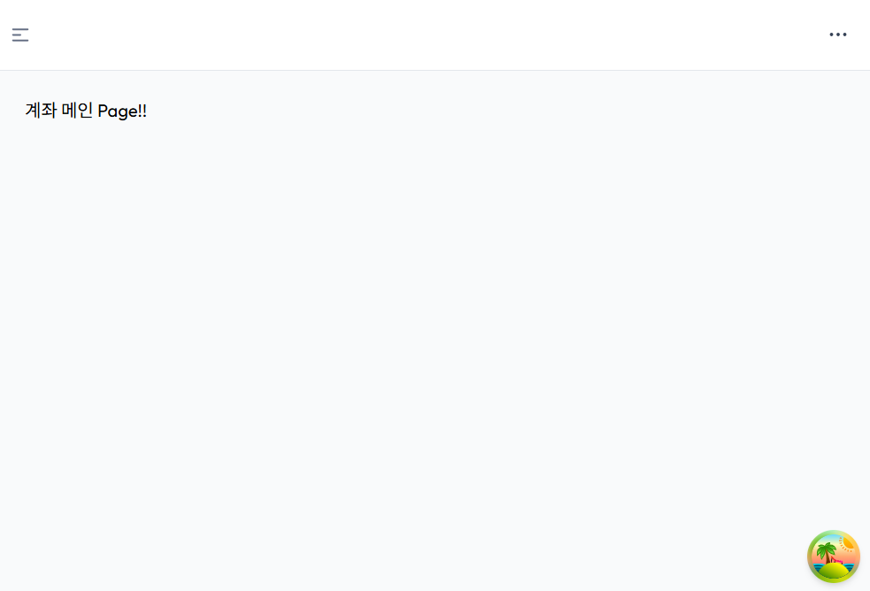
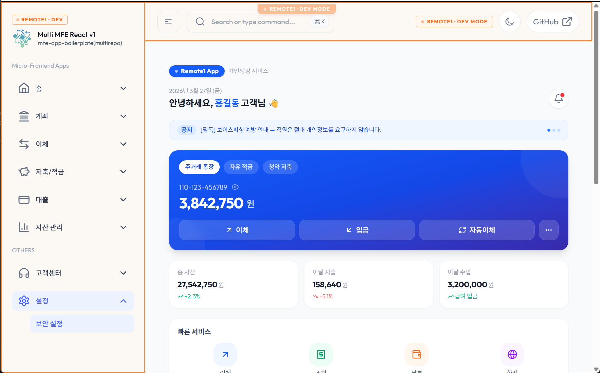

# 업무(domain) 페이지 만들기

:::info 작업 내용
* 각 업무(domain) 담당 개발자는 자신의 담당 영역(폴더)에서 개발을 진행합니다.
* 최초 **화면 컴포넌트**를 생성하는 방법을 설명합니다.
* 화면 컴포넌트를 **라우터에 연결**하는 방법을 설명합니다.
* 화면 컴포넌트와 라우터를 만들었으면 **브라우저에서 확인**합니다.
:::




## 업무(domain) 폴더 구조 만들기
---
* 모든 업무(domain)는 **domains**폴더 아래 생성하여 작업합니다.
* 개발해야 할 업무가 **"계좌(account)"** 라고 가정 했을 때 다음과 같이 폴더 구조를 생성하고, 하위 구조를 만듭니다.
* **account** 폴더가 생성되면 하위에 **api**, **components**, **common**, **pages**, **router**, **store**, **types** 폴더를 포함할 수 있습니다. 필요하지 않은 폴더는 생성하지 않아도 됩니다.  
* 자세한 내용은 [개발구조 및 규칙](../../started/getting-started/dev-convention) 내용을 참조 하세요.
```sh
# 내가 작업할 업무가 "계좌(account)" 업무라고 가정한다면
# 아래와 같은 account 기본 폴더구조를 가진다.
src
  ├─ ...
  ├─ ...
  ├─ domains
  │  ├─ ...
  │  ├─ account # account폴더를 생성
  │  │  ├─ api
  │  │  │  └─ url.ts
  │  │  ├─ components
  │  │  │  └─ AccountList.tsx # 계좌 리스트 컴포넌트(가정)
  │  │  ├─ pages
  │  │  │  ├─ AccountIndex.tsx  # 계좌메인화면(가정)
  │  │  │  └─ AccountUsage.tsx  # 계좌이용내역화면(가정)
  │  │  ├─ router
  │  │  │  └─ index.tsx
  │  │  ├─ store
  │  │  └─ types
  │  │     └─ index.ts
  │  └─ ...
```
:::info 설명
* 각 업무 폴더구조 생성은 내려받은 소스 코드의 **/src/domains/example** 폴더의 예제 코드를 참조 합니다.
* 내가 작업하는 업무가 **account**라고 가정합니다.
* **account**업무의 하위에는 **api, components, common, pages, router, store, types**폴더를 가질 수 있습니다.
* 각 폴더는 업무 상황에 따라 생성하여 사용합니다. 사용하지 않는 폴더는 생성하지 않아도 상관없습니다. (필요시에만 생성해서 사용)
* **router, store, types** 폴더는 기본적으로 진입 파일인 **index(index.ts 또는 index.tsx)** 파일을 가집니다.
:::


## 업무 화면 만들기
---
* 업무 폴더 구조가 완성되면 원하는 화면 컴포넌트를 만들어 봅니다.
* 화면 컴포넌트는 **pages** 폴더 내부에 ***.tsx** 파일로 생성합니다.(좀 더 세부적으로 업무 상황에 맞게 폴더를 나눠서 화면 컴포넌트를 생성해도 상관없습니다.)
* 화면 컴포넌트 ***.tsx**파일의 **기본 구조**는 다음과 같습니다.
```tsx showLineNumbers
import React, { useEffect } from 'react';

interface IAccountIndexProps {
	test?: string;
}

export default function AccountIndex({}: IAccountIndexProps): React.ReactNode {
  // useEffect hooks
  useEffect(() => {
    // ...
  }, []);

  return (
    <>
      <div>계좌 메인 Page!!</div>
    </>
  );
}
```
:::info React 개발 관련 안내
* React 공식 문서를 사전에 충분히 숙지하여, 최신 문법과 개발 패러다임에 대한 이해를 갖추는 것이 중요합니다. [React 공식 문서: https://react.dev/](https://react.dev/)
* 프론트엔드 개발 시 **TypeScript** 및 **ES6 이상의 JavaScript 문법**에 대한 숙련도가 필수적입니다.
  - [JavaScript 공식 문서: https://developer.mozilla.org/ko/docs/Web/JavaScript](https://developer.mozilla.org/ko/docs/Web/JavaScript)
  - [TypeScript 공식 문서: https://www.typescriptlang.org/ko/](https://www.typescriptlang.org/ko/)
:::


## 만든 화면컴포넌트 라우터 연결
---
* **src/domains/account/pages/AccountIndex.tsx** 라는 화면 컴포넌트를 만들었다고 가정합니다.
* 업무폴더에서(account폴더) **router/index.tsx** 파일을 생성하고, **index.tsx** 파일을 열어 기본 **router**코드를 작성합니다.
* 만든 화면 컴포넌트가 **AccountIndex.tsx**파일이므로 다음과 같이 `import`해서 가져옵니다.
* <span class="text-color-red">상황에 따라 lazy\(\) 와 \<Suspense\>를 사용하는 방법도 고려해 볼 필요가 있음.</span>


:::info <span class="admonition-title">@loadable/component</span> 설치 관련
* **@loadable/component** 패키지는 **코드 스플리팅(Code Splitting)** 을 쉽게 구현할 수 있게 해주는 React용 동적 임포트 라이브러리입니다.
* 모든 리모트 앱에서 모두 사용하려면 모든 프로젝트 다 설치를 각각 해야합니다.
	```sh
	# 프로젝트 루트 디렉토리에서 실행
	npm install @loadable/component
    npm install -D @types/loadable__component
	```

* Vite 중복로드 에러 발생 시 `[vite] (client) [Unhandled rejection] TypeError: Cannot read properties of undefined (reading 'S')`
    ```sh
    # .vite 캐시 삭제 후 재시작

    rm -rf node_modules/.vite
    npm run dev
    ```
:::
* `src/domains/account/router/index.tsx` 파일 작업
```typescript showLineNumbers
import type { TAppRoute } from '@axiom/mfe-lib-shared/types';
import loadable from '@loadable/component';

// 라우터에 연결할 페이지를 import 한다.
// loadable 라이브러리는 react에서 Code Spliting를 제공해주는 라이브러리 이다.
const AccountIndex = loadable(() => import('@/domains/account/pages/AccountIndex'));

const routes: TAppRoute[] = [
  {
    path: 'account-page', // 라우터 path를 원하는 이름으로 정하여 작성한다.
    element: <AccountIndex />,  // 위에서 가져온 페이지 컴포넌트를 element에 연결한다.
    name: '계좌 메인',  // 페이지 name을 원하는 이름으로 정하여 입력한다.
  },
];

export default routes;
```
:star: account업무의 **router/index.tsx** 파일 작업이 완료 되면 해당 업무 라우터를 전체 router에도 연결 해줘야 합니다.
* **src/shared/router/index.tsx**파일에 **추가된 account 업무 라우터**를 연결합니다.
  ```tsx showLineNumbers
  import type { TAppRoute } from '@axiom/mfe-mf-shared-library/types';
  
  // root layout 가져오기 -----------
  import RootLayout from '@/shared/components/layout/RootLayout';
  // main router 가져오기 ----------------
  import MainRouter from '@/domains/main/router';
  // account 업무 router 가져오기 ----------------
  // highlight-start
  import accountRouter from '@/domains/account/router';
  // highlight-end

  const routes: TAppRoute[] = [
    {
      path: '/',
      element: <RootLayout />,
      children: mainRouter,
    },
    // 새롭게 생성된 domain업무의 라우터를 여기에 계속 추가한다.
    // account관련 라우터를 연결한다.
    // highlight-start
    {
      path: '/account', // 원하는 path명을 정하여 입력.
      element: <RootLayout />,  // 레이아웃 공통 컴포넌트를 연결.
      children: accountRouter,  // import 해온 업무 라우터를 children에 연결.
    },
    // highlight-end
  ];

  export default routes;
  ```


## account 화면 브라우저에서 확인
---
* 위에서 만든 **account**업무관련 화면과 라우터 연결이 되었으면, 로컬(Frontend)서버를 띄우고 브라우저로 확인해 봅니다.  
* 로컬(Frontend)서버 띄우는 방법은 [Frontend 개발 환경 구성/VSCode에서 Frontend 서버 띄우고 브라우저로 확인해 보기 ](../../started/getting-started/set-dev-env-config#vscode에서-로컬-서버-띄우고-브라우저로-확인해-보기수정필요) 부분을 참조 하세요.
* 브라우저를 열고 **localhost:포트/\{리모트앱\}/account/account-page**를 입력하면 생성한 계좌메인 화면이 보입니다.

* 만약 페이지 컴포넌트 HTML 코드를 디테일하게 작업한다면 다음과 같은 구체적인 화면을 만들 수 있습니다.

:star: 여기까지 했으면 해당 업무의 코딩 준비가 완료 되었습니다. 필요에 따라 기능을 추가하고 페이지 작업을 진행하면 됩니다.


### 여러 페이지 간 라우터 이동 방법
---
* 라우터를 이용하여 페이지 이동을 위해서 **$router** 전역 객체를 사용합니다.
  - 자세한 내용은 [공통함수 $router 가이드]() 내용을 참조 하세요.

