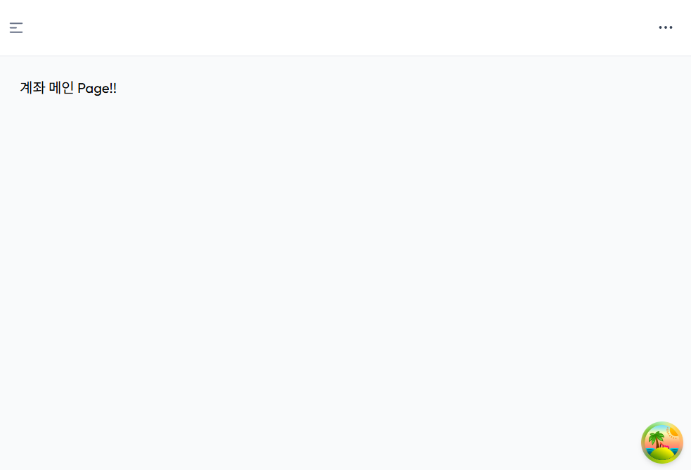

# 업무(domain) 페이지 만들기

:::info 작업 내용
* 각 업무(domain) 담당 개발자는 자신의 담당 영역(폴더)에서 개발을 진행합니다.
* 최초 **화면 컴포넌트**를 생성하는 방법을 설명합니다.
* 화면 컴포넌트를 **라우터에 연결**하는 방법을 설명합니다.
* 화면 컴포넌트와 라우터를 만들었으면 **브라우저에서 확인**합니다.
:::



:::info 요약 설명
* STEP 1 : 업무 폴더 구조 생성.
* STEP 2 : `pages` 폴더에 페이지 생성.
* STEP 3 : 라우터 연결.
* STEP 4 : 브라우저로 생성한 페이지 확인.
:::


## STEP 1 : 업무(domain) 폴더 구조 만들기
---
* 모든 업무(domain)는 **domains**폴더 아래 생성하여 작업합니다.
* 개발해야 할 업무가 **"계좌(account)"** 라고 가정 했을 때 다음과 같이 폴더 구조를 생성하고, 하위 구조를 만듭니다.
* **account** 폴더가 생성되면 하위에 **api**, **components**, **common**, **hooks**, **pages**, **router**, **store**, **types** 폴더를 포함할 수 있습니다. 필요하지 않은 폴더는 생성하지 않아도 됩니다.  
* 이미 업무 폴더가 생성되어 있다면 폴더 구조 생성은 생략합니다.
* 자세한 내용은 [개발구조 및 규칙](../../started/getting-started/dev-convention) 내용을 참조 하세요.
```sh
# 내가 작업할 업무가 "계좌(account)" 업무라고 가정한다면
# 아래와 같은 account 기본 폴더구조를 가진다.
src
  ├─ ...
  ├─ ...
  ├─ domains
  │  ├─ ...
  │  ├─ account # account폴더를 생성
  │  │  ├─ api
  │  │  │  └─ url.ts
  │  │  ├─ components
  │  │  │  └─ AccountList.tsx # 계좌 리스트 컴포넌트(가정)
  │  │  ├─ pages
  │  │  │  ├─ AccountIndex.tsx  # 계좌메인화면(가정)
  │  │  │  └─ AccountUsage.tsx  # 계좌이용내역화면(가정)
  │  │  ├─ router
  │  │  │  └─ index.tsx
  │  │  ├─ store
  │  │  └─ types
  │  │     └─ index.ts
  │  └─ ...
```
:::info 설명
* 각 업무 폴더구조 생성은 내려받은 소스 코드의 **/src/domains/example** 폴더의 예제 코드를 참조 합니다.
* 내가 작업하는 업무가 **account**라고 가정합니다.
* **account**업무의 하위에는 **api, components, common, hooks, pages, router, store, types**폴더를 가질 수 있습니다.
* 각 폴더는 업무 상황에 따라 생성하여 사용합니다. 사용하지 않는 폴더는 생성하지 않아도 상관없습니다. (필요시에만 생성해서 사용)
* **router, store, types** 폴더는 기본적으로 진입 파일인 **index(index.ts 또는 index.tsx)** 파일을 가집니다.
:::
:::tip 업무 폴더 구조를 더 세밀하게...
* 업무 폴더는 내부적으로 더 세밀하게 구분하여 생성할 수도 있습니다.
```sh
# 기본 구조
src
  ├─ ...
  ├─ domains
  │  ├─ account # account폴더를 생성
  │  │  ├─ ...
  │  │  └─ ...
  │  └─ ...
```
```sh
# 계좌 업무를 더 세밀하게...
src
  ├─ ...
  ├─ domains
  │  ├─ account        # account폴더를 생성
  │  │  ├─ transfer     # 입출금,이체 
  │  │  │  ├─ ...
  │  │  │  └─ ...
  │  │  ├─ inquiry      # 조회
  │  │  │  ├─ ...
  │  │  │  └─ ...
  │  │  └─ linkage      # 연계, 부가 업무  
  │  │  │  ├─ ...
  │  │  │  └─ ...
  │  └─ ...
```
:::


## STEP 2 : 업무 화면 만들기
---
* 업무 폴더 구조가 완성되면 원하는 화면 컴포넌트를 만들어 봅니다.
* 화면 컴포넌트는 **pages** 폴더 내부에 ***.tsx** 파일로 생성합니다.(좀 더 세부적으로 업무 상황에 맞게 폴더를 나눠서 화면 컴포넌트를 생성해도 됩니다.)
* 화면 컴포넌트 ***.tsx**파일의 **기본 구조**는 다음과 같습니다.
```tsx showLineNumbers
import React, { useEffect } from 'react';

// 현재 페이지의 Props 타입 지정(Props가 없으면 만들지 않아도 됨)
interface IAccountIndexProps {
  test?: string;
}

// 페이지 컴포넌트 본체 Props 타입과 리턴 타입을 세팅합니다.
// 본체 페이지 컴포넌트는 항상 export default 로 만듭니다.
export default function AccountIndex({}: IAccountIndexProps): React.ReactNode {
  // JavaScript(TypeScript) 화면 코드 영역 ---------

  // useEffect hooks
  useEffect(() => {
    // ...
  }, []);

  // 화면 JSX 영역 --------------------------------
  return (
    <>
      <div>계좌 메인 Page!!</div>
    </>
  );
}
```
:::info React 개발 관련 안내
* React 공식 문서를 사전에 충분히 숙지하여, 최신 문법과 개발 패러다임에 대한 이해를 갖추는 것이 중요합니다. [React 공식 문서: https://react.dev/](https://react.dev/)
* 프론트엔드 개발 시 **TypeScript** 및 **ES6 이상의 JavaScript 문법**에 대한 숙련도가 필수적입니다.
  - [JavaScript 공식 문서: https://developer.mozilla.org/ko/docs/Web/JavaScript](https://developer.mozilla.org/ko/docs/Web/JavaScript)
  - [TypeScript 공식 문서: https://www.typescriptlang.org/ko/](https://www.typescriptlang.org/ko/)
:::


## STEP 3 : 라우터 연결(페이지 라우트, 업무 라우트)
---
:::tip url 전체의 라우트 관련 예시
* 라우트는 크게 2가지로 분리해서 세팅합니다. 각 업무에 해당하는 **업무라우트**와 페이지 자체에 해당하는 **페이지 라우트**입니다.
* 상황에 따라 더 분리될 수도 있지만 되도록이면 2개 정도로 유지합니다.

:::
* **src/domains/account/pages/AccountIndex.tsx** 라는 화면 컴포넌트를 만들었다고 가정합니다.
* 업무폴더에서(domains/account/) **router/index.tsx** 파일을 생성하고, **index.tsx** 파일을 열어 기본 **router**코드를 작성합니다.
* 만든 화면 컴포넌트가 **AccountIndex.tsx**파일이므로 다음과 같이 `import`해서 가져옵니다.


:::info <span class="admonition-title">@loadable/component</span> 설치 관련
* **@loadable/component** 패키지는 **코드 스플리팅(Code Splitting)** 을 쉽게 구현할 수 있게 해주는 React용 동적 임포트 라이브러리입니다.
* 모든 컴포넌트는 되도록이면 이 **loadable**을 사용하여 `import` 합니다.
* <span class="text-color-red">상황에 따라 lazy\(\) 와 \<Suspense\>를 사용하는 방법도 고려해 볼 필요가 있음.</span>
:::
* `src/domains/account/router/index.tsx` 파일 작업
```typescript showLineNumbers
import type { TAppRoute } from '@/types/router';
import loadable from '@loadable/component';

// 라우터에 연결할 페이지를 import 한다.
// loadable 라이브러리는 react에서 Code Spliting를 제공해주는 라이브러리 이다.
const AccountIndex = loadable(() => import('@/domains/account/pages/AccountIndex'));

const routes: TAppRoute[] = [
  {
    path: 'account-page', // 라우터 path를 원하는 이름으로 정하여 작성한다. kebab-case로 입력.
    element: <AccountIndex />,  // 위에서 가져온 페이지 컴포넌트를 element에 연결한다.
    name: '계좌 메인',  // 페이지 name을 원하는 이름으로 정하여 입력한다.
  },
];

export default routes;
```
:star: account업무의 **페이지 라우트**인 **router/index.tsx** 파일 작업이 완료 되면 해당 페이지 라우트를 전체 router(업무 라우트)에도 연결 해줘야 합니다. **업무 라우트**는 최초 한번만 연결하면 됩니다.
* **src/shared/router/index.tsx**파일에 **추가된 account 업무 라우트**를 연결합니다.
  - <span class="text-color-red">업무 라우트 연결 전 확인할 사항:</span>
    - 인증 필요 라우트(로그인 필요): <span class="text-color-red">ProtectedRoute</span> 컴포넌트를 사용한 라우트 영역내부에 업무 라우터를 추가합니다.
    ```tsx showLineNumbers
    import type { TAppRoute } from '@axiom/mfe-mf-shared-library/types';
    // 인증 컴포넌트 ------------------------------
    import ProtectedRoute from '@/shared/components/router/ProtectedRoute';

    // root layout 가져오기 -----------
    import RootLayout from '@/shared/components/layout/RootLayout';
    
    // account 업무 router 가져오기 ----------------
    // highlight-start
    import accountRouter from '@/domains/account/router';
    // highlight-end

    const routes: TAppRoute[] = [
      {
        element: <ProtectedRoute />,
        children: [
          { path: '/', element: <RootLayout />, children: MainRouter },
          // 로그인 인증이 필요한 domain업무의 라우터를 여기에 계속 추가한다.
          // account관련 라우터를 연결한다.
          // highlight-start
          {
            path: '/account', // 원하는 path명을 정하여 입력.
            element: <RootLayout />,  // 레이아웃 공통 컴포넌트를 연결.
            children: accountRouter,  // import 해온 업무 라우터를 children에 연결.
          },
          // highlight-end
        ],
      },
      //...
    ];

    export default routes;
    ```
    - 인증 불필요한 라우트(로그인 불필요):<span class="text-color-red">ProtectedRoute</span> 컴포넌트를 사용한 라우트 영역 외부에 업무 라우터를 추가합니다.
    ```tsx showLineNumbers
    import type { TAppRoute } from '@axiom/mfe-mf-shared-library/types';
    // 인증 컴포넌트 ------------------------------
    import ProtectedRoute from '@/shared/components/router/ProtectedRoute';
    
    // root layout 가져오기 -----------
    import RootLayout from '@/shared/components/layout/RootLayout';
    
    // account 업무 router 가져오기 ----------------
    // highlight-start
    import accountRouter from '@/domains/account/router';
    // highlight-end

    const routes: TAppRoute[] = [
      {
        element: <ProtectedRoute />,
        children: [
          //... 인증 필요한 라우트 영역
        ],
      },
      // 로그인 인증이 필요없는는 domain업무의 라우터를 여기에 계속 추가한다.
      // account관련 라우터를 연결한다.
      // highlight-start
      {
        path: '/account', // 원하는 path명을 정하여 입력.
        element: <RootLayout />,  // 레이아웃 공통 컴포넌트를 연결.
        children: accountRouter,  // import 해온 업무 라우터를 children에 연결.
      },
      // highlight-end
    ];

    export default routes;
    ```
  :::tip <span class="admonition-title">ProtectedRoute</span> 컴포넌트 관련
  * 인증 과정을 거쳐서 라우트 이동을 처리하는 로직이 들어있습니다.
  * 내부 로직은 상황에 따라 수정하여 프로젝트에 맞게 적용하면 됩니다.
  :::


## STEP 4 : account 화면 브라우저에서 확인
---
* 위에서 만든 **account**업무관련 화면과 라우터 연결이 되었으면, 로컬(Frontend)서버를 띄우고 브라우저로 확인해 봅니다.  
* 로컬(Frontend)서버 띄우는 방법은 [Frontend 개발 환경 구성/VSCode에서 Frontend 서버 띄우고 브라우저로 확인해 보기 ](../../started/getting-started/set-dev-env-config#vscode에서-로컬-서버-띄우고-브라우저로-확인해-보기) 부분을 참조 하세요.
* 브라우저를 열고 **localhost:포트/#/account/account-page**를 입력하면 생성한 계좌메인 화면이 보입니다.


:star: 지금까지 해당 업무의 코딩 준비가 완료 되었습니다. 필요에 따라 기능을 추가하고 페이지 작업을 진행하면 됩니다.


## 페이지 간 화면 이동 방법
---
* 라우터를 이용하여 페이지 이동을 위해서 **$router** 전역 객체를 사용합니다.
  - 자세한 내용은 [공통함수 $router 가이드](./navigating-pages) 내용을 참조 하세요.

