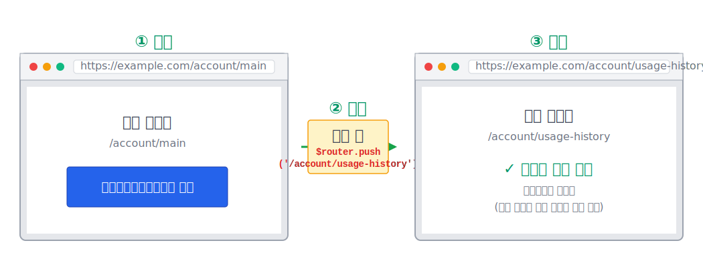

# 페이지 이동하기

:::info 작업 내용
* 페이지 이동을 위한 `$router` 전역 객체의 **push()**, **replace()**, **back()** 메서드를 사용하여 페이지 이동을 합니다. 
* **클라이언트환경**에서 **push()**, **replace()**, **back()** 메서드 사용 방법.
:::


## 페이지 이동 함수 특징
---
* **`$router.push(라우터url, [옵션])`**
  - 페이지 이동 후 **브라우저 히스토리 스택**에 추가됩니다.
  - [$router.push() API 문서 바로가기]()
* **`$router.replace(라우터url, [옵션])`**
  - 페이지 이동 후 **브라우저 히스토리 스택**의 이전 페이지를 덮어씌웁니다.
  - [$router.replace() API 문서 바로가기]()
* **`$router.back()`**
  - **브라우저 히스토리 스택**에서 이전 페이지로 이동합니다.
  - [$router.back() API 문서 바로가기]()


## 페이지 이동 예제
---
* 다음과 같은 **account** 업무 폴더 구조가 있다고 가정합니다.
```sh
src
├── app
│   ├── domains
│   │   ├── ...
│   │   └── account # account 업무 폴더
│   │       ├── pages      
│   │       │   ├── AccountIndex.tsx      # 계좌메인화면       
│   │       │   └── UsageHistory.tsx      # 계좌이용내역화면                                         
│   └── ...    
└── ...
```

* **계좌메인화면(AccountIndex.tsx)** 페이지에서 **계좌이용내역화면(UsageHistory.tsx)** 페이지로 이동하는 작업을 진행해 봅니다.
  ```tsx
  import { Button } from '@axiom/components/ui';

  export default function AccountIndex() {
    return (
      <div>
        <h1>계좌메인화면</h1>
        // highlight-start
        <Button onClick={() => $router.push('/account/usage-history')}>
          계좌이용내역화면으로 이동
        </Button>
        // highlight-end
      </div>
    );
  }
  ```



:::info 설명
* `$router.push()` 함수는 **계좌메인화면** 페이지에서 **계좌이용내역화면** 페이지로 이동할 때 **브라우저 히스토리 스택**에 추가 하면서 이동합니다.
  ```ts
  // 이동 후 히스토리 스택
  ['/account/main', '/account/usage-history']
  ```
* 만약 페이지 이동하면서 **브라우저 히스토리 스택**에 추가 하지 않고 이동하려면 `$router.replace()` 함수를 사용합니다.
  ```ts
  // 이동 후 히스토리 스택 ('/account/main' 페이지는 삭제됩니다.)
  ['/account/usage-history']
  ```
:::


## $router.back() 함수 사용 예제
---
* `$router.back()` 함수는 **히스토리 스택**에서 이전 페이지로 이동합니다.
  ```tsx
  import { Button } from '@axiom/components/ui';

  export default function AccountIndex() {
    return (
      <div>
        <h1>계좌메인화면</h1>
        <Button onClick={() => $router.back()}>
          이전 페이지로 이동
        </Button>
      </div>
    );
  }
  ```