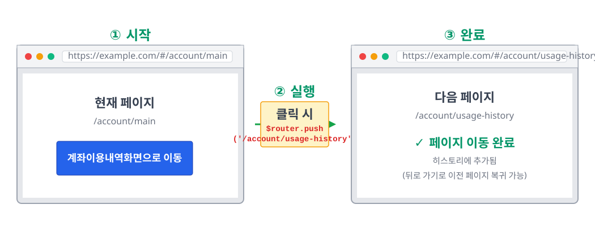

# 페이지 이동하기

:::info 작업 내용
* 페이지 이동을 위한 `$router` 전역 객체의 **push()**, **replace()**, **back()** 등 메서드를 사용하여 페이지 이동을 합니다. 
* **클라이언트환경**에서 **push()**, **replace()**, **back()** 등 메서드 사용 방법.
:::


## 페이지 이동 함수 특징
---
* **`$router.push(라우터경로, [옵션])`**
  - 페이지 이동 후 **브라우저 히스토리 스택**에 추가됩니다.
  - [$router.push() API 문서 바로가기]()
* **`$router.replace(라우터경로, [옵션])`**
  - 페이지 이동 후 **브라우저 히스토리 스택**의 이전 페이지를 덮어씌웁니다.
  - [$router.replace() API 문서 바로가기]()
* **`$router.back()`**
  - **브라우저 히스토리 스택**에서 이전 페이지로 이동합니다.
  - [$router.back() API 문서 바로가기]()
* **`$router.forward()`**
  - **브라우저 히스토리 스택**에서 이후 페이지로 이동합니다.
  - [$router.forward() API 문서 바로가기]()
* **`$router.go(delta)`**
  - **브라우저 히스토리 스택**에서 delta 칸 이동 (음수=뒤로, 양수=앞으로).합니다.
  - [$router.go() API 문서 바로가기]()


## 페이지 이동 예제
---
* 다음과 같은 **account** 업무 폴더 구조가 있다고 가정합니다.
```sh
src
├── app
│   ├── domains
│   │   ├── ...
│   │   └── account # account 업무 폴더
│   │       ├── pages      
│   │       │   ├── AccountIndex.tsx      # 계좌메인화면       
│   │       │   └── UsageHistory.tsx      # 계좌이용내역화면                                         
│   └── ...    
└── ...
```

* **계좌메인화면(AccountIndex.tsx)** 페이지에서 **계좌이용내역화면(UsageHistory.tsx)** 페이지로 이동하는 작업을 진행해 봅니다.
  ```tsx
  import { Button } from '@axiom/components/ui';

  export default function AccountIndex() {
    return (
      <div>
        <h1>계좌메인화면</h1>
        // highlight-start
        <Button onClick={() => $router.push('/account/usage-history')}>
          계좌이용내역화면으로 이동
        </Button>
        // highlight-end
      </div>
    );
  }
  ```



:::info 설명
* `$router.push()` 함수는 **계좌메인화면** 페이지에서 **계좌이용내역화면** 페이지로 이동할 때 **브라우저 히스토리 스택**에 추가 하면서 이동합니다.
  ```ts
  // 이동 후 히스토리 스택
  ['/account/main', '/account/usage-history']
  ```
* 만약 페이지 이동하면서 **브라우저 히스토리 스택**에 추가 하지 않고 이동하려면 `$router.replace()` 함수를 사용합니다.
  ```ts
  // 이동 후 히스토리 스택 ('/account/main' 페이지는 삭제됩니다.)
  ['/account/usage-history']
  ```
:::


## $router.back() 함수 사용 예제
---
* `$router.back()` 함수는 **히스토리 스택**에서 이전 페이지로 이동합니다.
  ```tsx
  import { Button } from '@axiom/components/ui';

  export default function AccountIndex() {
    return (
      <div>
        <h1>계좌메인화면</h1>
        <Button onClick={() => $router.back()}>
          이전 페이지로 이동
        </Button>
      </div>
    );
  }
  ```


## `$router.replace()`를 사용하여 화면 이동하기
---
* `$router.replace()` 함수는 페이지를 이동할 때 **새 히스토리를 추가하지 않고 현재 페이지를 덮어씌우면서** 이동합니다.
* `$router.push()`와의 가장 큰 차이는 **이동 후 히스토리 스택**입니다.
  ```ts
  // 현재 히스토리 스택
  ['/login']

  // $router.push('/main')  → 로그인 화면이 스택에 남습니다.
  ['/login', '/main']

  // $router.replace('/main') → 로그인 화면이 삭제되고 덮어씌워집니다.
  ['/main']
  ```

* **왜 `replace()`를 사용하나요?**
  * `replace()`로 이동한 페이지는 **뒤로가기(`$router.back()`, 브라우저 뒤로가기 버튼)로 이전 화면에 돌아갈 수 없습니다.**
  * 즉, 사용자가 **다시 돌아오면 안 되는 화면**에서 다음 화면으로 넘어갈 때 사용합니다. 이전 화면을 히스토리에서 제거함으로써 잘못된 재진입을 원천적으로 막습니다.

* **어떤 때 `replace()`를 사용하나요?**
  * **로그인/인증 완료 후 이동** — 로그인 성공 후 메인으로 이동할 때. 메인에서 뒤로가기를 눌러도 로그인 화면으로 돌아가지 않습니다.
  * **스플래시/인트로 화면 → 메인** — 처음 한 번만 보여주는 화면에서 다음 화면으로 넘어갈 때. 인트로로 되돌아가는 것을 방지합니다.
  * **처리 완료/결과 화면으로 이동** — 결제·이체·신청 완료 화면으로 이동할 때. 뒤로가기로 인한 **중복 제출·중복 처리**를 방지합니다.
  * **접근 권한이 없어 리다이렉트할 때** — 권한이 없는 페이지 접근을 다른 화면으로 되돌릴 때. 차단된 경로가 히스토리에 남지 않도록 합니다.

* 사용 예제
  * **로그인화면(Login.tsx)** 에서 로그인 성공 후 **메인화면(Main.tsx)** 으로 이동하는 예제입니다.
  ```tsx
  import { Button } from '@axiom/components/ui';

  export default function Login() {
    const handleLogin = async () => {
      // ... 로그인 처리 로직
      // highlight-start
      // 로그인 성공 후 메인으로 이동하되, 로그인 화면은 히스토리에서 제거합니다.
      $router.replace('/main');
      // highlight-end
    };

    return (
      <div>
        <h1>로그인화면</h1>
        <Button onClick={handleLogin}>로그인</Button>
      </div>
    );
  }
  ```

:::tip 정리
* **다음 화면에서 뒤로가기로 돌아와도 되는 경우** → `$router.push()`
* **다음 화면에서 이전 화면으로 돌아오면 안 되는 경우** → `$router.replace()`
:::


## 옵션 사용하기
---
* `$router.push()`와 `$router.replace()`는 두 번째 인자로 **옵션 객체**를 받을 수 있습니다. 이 옵션은 내부적으로 react-router의 `NavigateOptions`로 그대로 전달됩니다.
  ```ts
  // core 내부 구현 (src/core/utils/router)
  push(to, options)    { router.navigate(to, options); }
  replace(to, options) { router.navigate(to, { ...options, replace: true }); }
  ```

* 사용할 수 있는 주요 옵션은 다음과 같습니다.

| 옵션 | 타입 | 설명 |
| --- | --- | --- |
| `state` | `any` | 이동할 화면으로 **데이터를 함께 전달**합니다. URL에 노출되지 않으며, 이동한 화면에서 `$router.getState()`로 받습니다. |
| `replace` | `boolean` | `true`면 히스토리에 추가하지 않고 현재 페이지를 덮어씌웁니다. `$router.replace()`는 이 값을 항상 `true`로 강제합니다. |
| `preventScrollReset` | `boolean` | `true`면 페이지 이동 후 스크롤 위치를 맨 위로 초기화하지 않고 **현재 스크롤 위치를 유지**합니다. |
| `relative` | `'route' \| 'path'` | 상대 경로를 해석하는 기준을 지정합니다. (기본값: `'route'`) |

:::warning `replace` 옵션 주의
* `$router.replace()`는 내부에서 `replace: true`를 강제하므로, `$router.replace()`에 `{ replace: false }`를 넘겨도 무시됩니다.
* 히스토리 대체 여부를 옵션으로 제어하고 싶다면 `$router.push(경로, { replace: true })` 형태로 `push()`에 넘기면 됩니다. (`$router.replace(경로)`와 동일하게 동작합니다.)
:::

### `state`로 화면 간 데이터 전달하기
* **계좌메인화면(AccountIndex.tsx)** 에서 **계좌이용내역화면(UsageHistory.tsx)** 으로 이동하면서 조회 조건을 함께 전달하는 예제입니다.
  ```tsx
  // AccountIndex.tsx (보내는 화면)
  import { Button } from '@axiom/components/ui';

  export default function AccountIndex() {
    return (
      <div>
        <h1>계좌메인화면</h1>
        // highlight-start
        <Button
          onClick={() =>
            $router.push('/account/usage-history', {
              state: { accountNo: '123-456-789', period: '3M' },
            })
          }
        >
          계좌이용내역화면으로 이동
        </Button>
        // highlight-end
      </div>
    );
  }
  ```
  ```tsx
  // UsageHistory.tsx (받는 화면)
  export default function UsageHistory() {
    // highlight-start
    // 전역 $router.getState() 로 전달된 state 를 바로 읽습니다. (react-router import 불필요)
    const state = $router.getState<{ accountNo: string; period: string }>();
    const accountNo = state?.accountNo; // '123-456-789'
    const period = state?.period;       // '3M'
    // highlight-end

    return (
      <div>
        <h1>계좌이용내역화면</h1>
        <p>계좌번호: {accountNo}</p>
      </div>
    );
  }
  ```

:::info `state` 사용 시 참고
* `state`로 넘긴 값은 **URL에 노출되지 않으므로** 쿼리스트링과 달리 화면에 조건이 그대로 드러나지 않습니다.
* 단, `state`는 **브라우저 히스토리에 저장**되므로 새로고침·뒤로가기 시에도 유지됩니다. 민감정보(비밀번호 등)는 담지 않는 것이 좋습니다.
* 사용자가 **URL을 직접 입력**하거나 **새 탭으로 진입**하면 `state`는 `null`이 됩니다. 항상 `state?.값` 형태로 안전하게 접근하고, 값이 없을 때의 처리를 함께 작성하세요.
* `$router.getState<T>()`는 **호출 시점의 스냅샷**을 반환하는 전역 메서드로, 컴포넌트 밖(이벤트 핸들러·유틸 등)에서도 쓸 수 있습니다. 화면 진입 시 `state`를 한 번 읽는 용도에는 그대로 사용하면 됩니다. 단, 마운트된 컴포넌트가 URL 변화에 **자동으로 리렌더**돼야 하는 경우에는 `import { useLocation } from 'react-router'`의 `useLocation()` 훅을 사용하세요.
:::