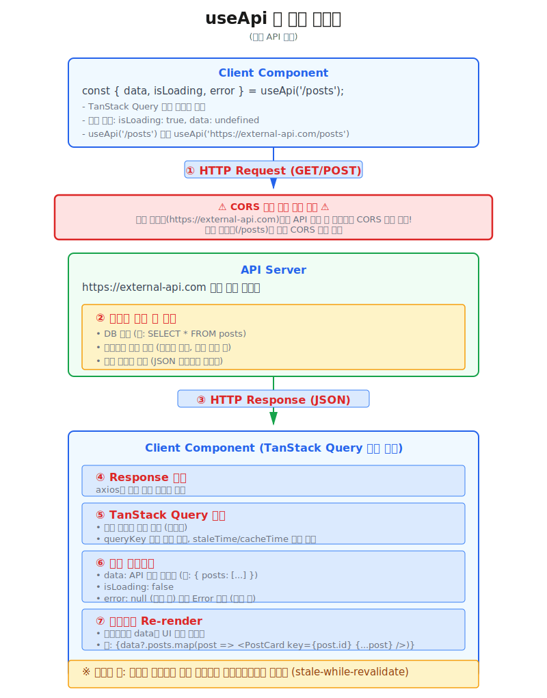

# 데이터 가져오기

:::info 작업 내용
* 각 업무(domain) **화면 컴포넌트**에서 **react-app-scaffold**가 제공하는 **useApi()** 훅을 통해 **REST API**를 호출하여 데이터를 가져오는 방법을 설명합니다.
:::

:::tip 데이터 조회, 업데이트 방법의 차이
* **useApi()** 함수는 **클라이언트 환경**에서 `GET, POST` method 타입으로 **데이터를 조회**하고 결과 데이터를 활용하는 용도로 사용합니다. 그 외 `POST, PUT, PATCH, DELETE` method 타입으로 서버의 **데이터를 변경, 업데이트하는 용도**로 사용할 때는 **useApi()** 함수의 `type: 'mutation'`옵션을 사용해야 합니다. 이와 같이 데이터 조회, 업데이트 방법의 차이가 있는것은 **TanStack Query(React Query)** 의 특성을 그대로 반영한 것입니다.
:::


## 데이터 조회
---

🔗 [**useApi()** API 문서 바로가기](../../apis/global-function/hooks/use-api)

* `useApi()` 함수는 `GET, POST` method 타입으로 **데이터를 조회**하고 결과 데이터를 활용하는 용도로 사용합니다.


### Basic useApi() 사용
* 화면 컴포넌트가 마운트되면 **useApi()** 함수가 자동으로 요청을 실행합니다.
```tsx
// highlight-start
import { useApi } from '@axiom/hooks';
// highlight-end

interface IPost {
	userId: number;
	id: number;
	title: string;
	body: string;
}

export default function SampleComponent(): React.ReactNode {
  // GET 요청 – 컴포넌트 마운트 시 자동 실행
  // highlight-start
  const { data, isLoading, isError, error } = useApi<IPost[]>('/posts');
  // highlight-end

  return (
    <div>
      <h1>Sample Component</h1>
    </div>
  );
}
```
:::info 설명
* `useApi()` 훅 함수를 공유 라이브러리(`@axiom/hooks`)에서 임포트 합니다.
* `useApi()` 함수를 화면 컴포넌트 최 상단에 선언하면 화면 컴포넌트가 마운트되면서 자동으로 요청을 실행합니다.
* `useApi()` 함수의 첫 번째 인자로 **REST API URL**을 전달합니다.
* `useApi()` 함수의 결과 데이터는 `data` 속성에 담겨서 반환됩니다. `data` 속성을 통해 response 데이터를 활용할 수 있습니다.
:::


### `useApi()` 훅 흐름도
- `useApi()` 훅은 다음 그림과 같은 흐름으로 동작합니다.



### `useApi()` 훅의 **매개변수**
* **첫번째 매개변수** `url`: **REST API URL**을 전달합니다.
  - 예시: `/api/account/lists` : 도메인 없이 endpoint만 전달하면, 현재 프로젝트의 location.origin과 같은 주소로 요청을 보냅니다. 일반적인 경우 사용하는 방법입니다.
  - 예시: `http://example.com/api/account/lists` : (외부 API 서버)도메인 주소를 포함하여 전체 URL을 전달할 수 있습니다. 특별한 경우 외에는 사용하지 않습니다.
* **두번째 매개변수** `options`: `useApi()` 훅의 옵션을 전달합니다.
  * `type`: 'query' 또는 'mutation' 중 하나를 선택합니다. 'query'는 데이터를 조회하는 용도로 사용하고, 'mutation'는 데이터를 변경, 업데이트하는 용도로 사용합니다. 기본값은 'query'입니다.
  * `queryOptions` 또는 `mutationOptions` 또는 `IUseApiBaseOptions`: 'query' 또는 'mutation' 중 하나를 선택하면, 해당 옵션을 전달할 수 있습니다.
    - `queryOptions`: **tanstack query (useQuery)** 의 **queryOptions** 옵션을 전달합니다. 
      - [**useQuery** 문서 바로가기](https://tanstack.com/query/latest/docs/framework/react/reference/useQuery#options)
    - `mutationOptions`: **tanstack query (useMutation)** 의 **mutationOptions** 옵션을 전달합니다.
      - [**useMutation** 문서 바로가기](https://tanstack.com/query/latest/docs/framework/react/reference/useMutation)
    - `IUseApiBaseOptions`: **useApi()** 훅의 기본 옵션을 전달합니다.
      ```ts
      interface IUseApiBaseOptions {
        /** HTTP Method (기본값: 'GET') */
        method?: THttpMethod;
        /** Query string parameters */
        params?: QueryParams;
        /** Request body */
        body?: Record<string, unknown>;
        /** Custom headers */
        headers?: Record<string, string>;
        /** Request timeout (ms) */
        timeout?: number;
      }
      ```


### params 옵션으로 쿼리스트링 전달
* `params` 옵션을 사용하여 쿼리스트링을 전달할 수 있습니다.
```tsx
// highlight-start
import { useApi } from '@axiom/hooks';
// highlight-end

interface IPost {
	userId: number;
	id: number;
	title: string;
	body: string;
}

export default function SampleComponent(): React.ReactNode {
  const [userId, setUserId] = useState<number>(1);
  // GET 요청 – 컴포넌트 마운트 시 자동 실행
  // 쿼리스트링 예시: /posts?userId=1&_limit=4
  // highlight-start
  const { data, isLoading, isError, error } = useApi<IPost[]>('/posts', {
		params: { userId, _limit: 4 },
	});
  // highlight-end

  return (
    <div>
      <h1>Sample Component</h1>
    </div>
  );
}
```


### `enabled` 옵션으로 API 호출 제어
* `enabled` 옵션이 **false**이면 API를 호출하지 않습니다. 이벤트 발생 시점에 fetch를 실행할 수 있습니다. 또는 다른 방법으로 `enabled: false`로 설정하고 `refetch()` 메서드를 호출하여 호출할 수 있습니다.
```tsx
// enabled 옵션을 사용하여 버튼 클릭 시에만 API 요청 실행
const [enabled, setEnabled] = useState(false);

const { data, isLoading, isFetching } = useApi<Post[]>(
  '/posts',
  {
    params: { _limit: 5 },
    queryOptions: { enabled },
  }
);

// 버튼 클릭 시 enabled = true 로 변경 → 즉시 fetch 실행
<button onClick={() => setEnabled(true)}>Fetch</button>
```


## 데이터 업데이트
---


### POST mutation — 데이터 생성, 업데이트
* type: 'mutation' 옵션으로 useMutation 기반의 수동 실행 POST 요청을 수행합니다.
이것은 useApi() 훅의 type 옵션을 'mutation'으로 설정하여 간단하게 사용할 수 있습니다.
```tsx
// type: 'mutation' 으로 POST 요청 수동 실행
const { mutate, isPending, data, isSuccess } = useApi<
  Post,
  Omit<Post, 'id'>
>('/posts', {
  type: 'mutation',
  method: 'POST',
});

// 실행
// highlight-start
mutate({ userId: 1, title: '새 포스트', body: '내용...' });
// highlight-end
```