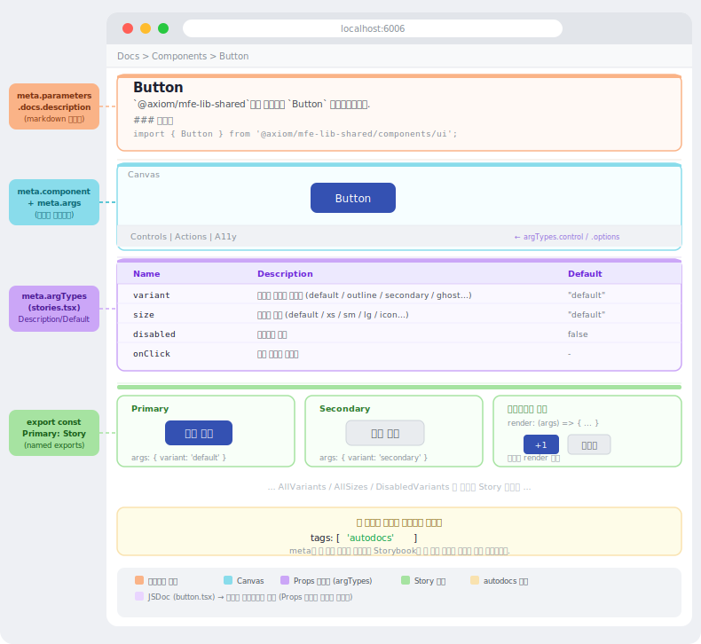
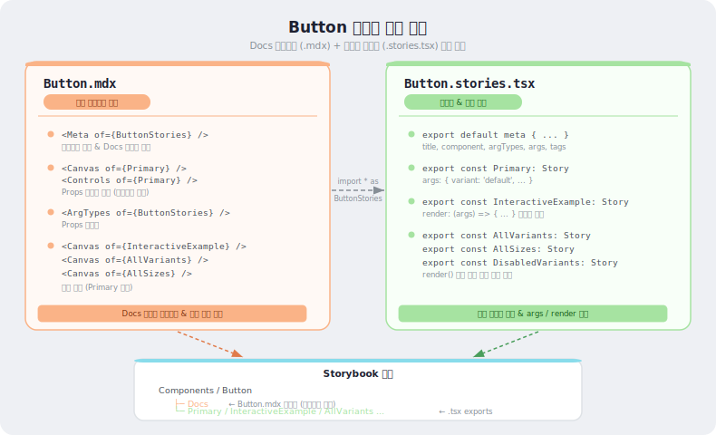

# Storybook 작성방법
---
* UI Component, Utils Function, Hooks Function, API Function 등 모든 함수에 대한 인터랙티브 예시 UI를 작성할 때 `*.stories.tsx` 파일을 작성합니다. 
* `*.stories.tsx` 파일 작성 구조 및 방법에 대해 설명합니다.


## Storybook 페이지 구성
---
* Storybook 으로 **가이드 페이지를 구성하는 방법**은 크게 **두가지 방법**이 있습니다.


### **방법 1**: `*.stories.tsx` 파일을 작성하여 가이드 페이지를 구성합니다. (기본 방법)
* `*.stories.tsx` 파일 meta 정보에 `tags: ['autodocs']` 속성을 추가하여 자동으로 가이드 페이지를 구성하는 방법입니다.



:::info <span class="admonition-title">storybook</span> 페이지 구성 요약
* stories.tsx 페이지 (autodocs가 자동 생성)
    - **제목 + 컴포넌트 설명**: 출처: `parameters.docs.description.component`
    - **Canvas (인터랙티브 예시 UI)**: 출처: `meta.component`(Button) + `meta.args`로 렌더링. Controls 패널의 위젯 타입·선택지는 `argTypes.control` / `argTypes.options`에서 정의
    - **Props 테이블 (ArgsTable)**: 출처: `Button.stories.tsx`의 `meta.argTypes`. Description은 `argTypes[prop].description`, Default 값은 `argTypes[prop].table.defaultValue`에서 직접 명시. JSDoc(button.tsx)은 에디터 인텔리센스 전용이며, 기본 파싱 엔진(`react-docgen`)이 `keyof typeof` 등 복잡한 TypeScript 타입의 JSDoc을 자동 추출하지 못함
    - **각 Story 목록**: 출처: 각 export들 - 첫번째 export가 기본 Story 예제로 설정되어 Props 테이블의 Controls 변경 시 실시간으로 반영됩니다.
:::


### **방법 2**: `*.mdx` + `*.stories.tsx` 파일 함께 가이드 페이지 구성.
```sh
components/
  ├── button/
  │     ├── Button.mdx
  │     └── Button.stories.tsx
  ├── input/
  │     ├── Input.mdx
  │     └── Input.stories.tsx
  └── modal/
        ├── Modal.mdx
        └── Modal.stories.tsx
```

:::info <span class="admonition-title">mdx + stories.tsx</span> 페이지 구성 요약
* **stories.tsx**: 데이터 창고역할.
* **MDX**: 그 데이터를 화면에 어떻게 배치할지 결정하는 레이아웃 역할.

사이드바에서 `Docs` 탭을 클릭하면 MDX 파일이 렌더링되며, 나머지(인터랙티브 예시, Primary 등)를 클릭하면 MDX가 아닌 stories.tsx의 각 export가 직접 Canvas 뷰로 열립니다.
:::