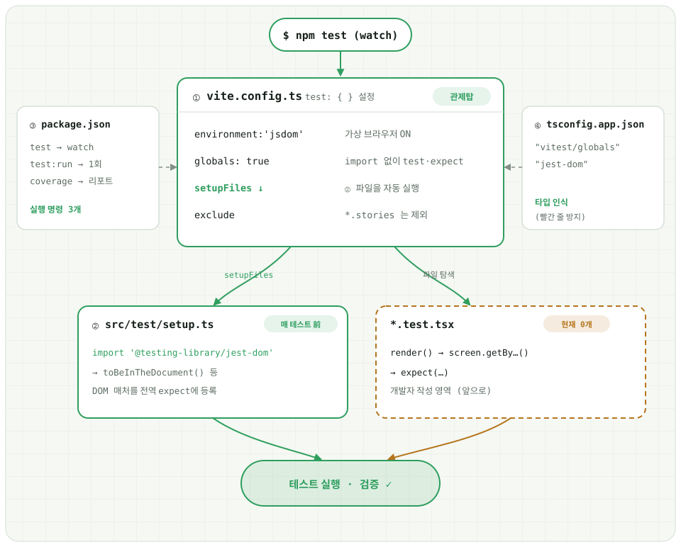
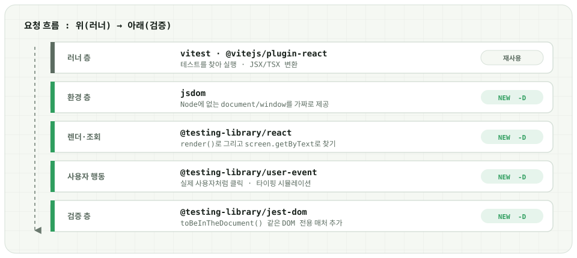

# React 컴포넌트 테스트 자동화
* Vite 기반 React  →  Vitest  +  @testing-library/react  +  @testing-library/user-event

:::info 이 문서의 구성
* **1부 — 인프라(배선)**: `npm test` 한 번이 어떤 경로로 흘러 검증까지 도달하는지, 그리고 그 흐름을 만든 **설정 4곳**과 **실행 명령어**를 정리합니다. (이미 세팅 완료 — 다시 건드릴 일 없음)
* **2부 — 개발자 작성법**: 실제로 `*.test.tsx` 파일을 만들어 컴포넌트·상호작용·스토어를 검증하는 방법을 단계별로 설명합니다.
:::


## ◉1부 · 테스트 인프라 (배선)


### 1. 인프라 한눈에 보기 — 배선도
---

`npm test` 한 번이 흘러가는 경로와, 그 흐름을 만들기 위해 건드린 **설정 4곳**이 서로 어떻게 연결되는지를 한 장으로 정리했습니다.



* **초록 선** = 자동으로 흐르는 경로 / 이미 세팅 완료
* **앰버 점선** = 아직 사람이 작성할 영역 (테스트 파일) → 2부에서 다룹니다.

:::info 흐름 요약 — 4단계
1. **`$ npm test`** 를 실행하면 Vitest가 **① `vite.config.ts` 의 `test.projects`** 설정을 관제탑으로 삼아 켜집니다.
2. 관제탑은 파일 이름 규칙으로 테스트를 **두 묶음(`unit`=jsdom · `browser`=실제 Chromium)** 으로 가르고, `globals: true`(import 없이 `test`·`expect`)를 켠 뒤 **`setupFiles` 로 ② `src/test/setup.ts` 를 매 테스트 전에 자동 실행**합니다.
3. 동시에 `*.test.tsx`(jsdom) 와 `*.browser.test.tsx`(브라우저) **테스트 파일을 탐색**합니다. (`*.stories.*` 는 `exclude` 로 제외)
4. 셋업이 끝난 상태에서 각 테스트가 `render() → screen.getBy…() → expect(…)` 로 **실행·검증**됩니다.
:::

:::tip 곁다리 설정 2곳은 무슨 역할?
* **③ `package.json`** — 실행 명령 3개(`test` / `test:run` / `coverage`)를 정의합니다. (아래 [4. 실행 명령어](#4-실행-명령어))
* **④ `tsconfig.app.json`** — `types` 에 `"vitest/globals"`·`"@testing-library/jest-dom"` 를 등록해, 전역 `test`·`expect`·`toBeInTheDocument()` 에 **빨간 줄이 안 뜨게** 타입을 인식시킵니다.
:::


### 2. 라이브러리 계층 — 누가 무슨 일을 하나
---

하나의 테스트 요청이 위 **러너**에서 아래 **검증**까지 층층이 협력합니다. 맨 위 러너는 **Storybook이 딸려 깔아둔 것을 재사용**하고, jsdom 계열 4개와 브라우저 모드 2개를 새로 설치(`-D`)했습니다.



| 계층 | 패키지 | 하는 일 |
|---|---|---|
| 러너 | `vitest` · `@vitejs/plugin-react` | 테스트를 찾아 실행 · JSX/TSX 변환 (**재사용**) |
| 환경 | `jsdom` | Node에 없는 `document`/`window`를 가짜로 제공 |
| 렌더·조회 | `@testing-library/react` | `render()`로 그리고 `screen.getByText`로 찾기 |
| 사용자 행동 | `@testing-library/user-event` | 실제 사용자처럼 클릭 · 타이핑 시뮬레이션 |
| 검증 | `@testing-library/jest-dom` | `toBeInTheDocument()` 같은 DOM 전용 매처 추가 |
| 브라우저 모드 | `@vitest/browser-playwright` · `playwright` | jsdom 대신 **실제 Chromium**을 띄워 `*.browser.test.tsx` 실행 |

:::info 브라우저 모드는 왜 있나
`jsdom`(가짜 DOM)만으로 부정확한 것 — 실제 레이아웃·크기 계산(`getBoundingClientRect`), CSS·hover, 레이아웃에 민감한 라이브러리(캐러셀·애니메이션) — 만 진짜 Chromium으로 검증하기 위해 함께 구성해뒀습니다. 대부분은 jsdom(위 5계층)으로 충분하고, 브라우저 모드는 **필요한 파일만** `*.browser.test.tsx` 로 올려 씁니다. → 자세한 사용법은 [2부 브라우저 모드 절](#browser-mode)
:::

<!-- :::info 새로 설치한 패키지 (이미 설치됨 — 참고용)
```sh
npm i -D jsdom @testing-library/react @testing-library/user-event @testing-library/jest-dom
npm i -D @vitest/browser-playwright playwright
npx playwright install chromium
```
::: -->


### 3. 설정 4곳 — 실제 코드 (참고용)
---

인프라는 **이미 세팅되어 있습니다.** 아래는 "무엇이 어떻게 연결됐는지" 확인용이며, 새로 만들 필요는 없습니다.

**① `vite.config.ts`** — 별도 `jest.config` 없이 Vite 설정 안에 `test.projects` 만 추가했습니다. **환경이 다른 두 묶음(`unit`=jsdom / `browser`=실제 Chromium)** 을 파일 이름 규칙으로 가릅니다. alias(`@`·`@axiom/*`)는 `extends: true` 로 두 묶음 모두에 그대로 통합니다.

```ts title="vite.config.ts"
/// <reference types="vitest/config" />       // TS에게 test 옵션 타입을 알려주는 줄
import { playwright } from '@vitest/browser-playwright';
// ...
export default defineConfig(({ mode }) => {
	return {
		plugins: [react(), tailwindcss()],
		resolve: { alias: { /* @, @axiom/* … 테스트에서도 동일하게 적용 */ } },
		// highlight-start
		// 단위테스트(Vitest) 설정 — 환경별 두 묶음
		test: {
			projects: [
				{
					extends: true,                      // 상위 vite 설정(alias·플러그인) 상속
					test: {
						name: 'unit',
						environment: 'jsdom',             // 가짜 DOM (빠름, 대부분 여기서)
						globals: true,                    // import 없이 test·expect 전역 사용
						setupFiles: './src/test/setup.ts',
						include: ['src/**/*.test.{ts,tsx}'],
						// 브라우저 전용 파일과 스토리북은 제외
						exclude: ['**/node_modules/**', '**/*.stories.*', 'src/**/*.browser.test.{ts,tsx}'],
					},
				},
				{
					extends: true,
					test: {
						name: 'browser',
						globals: true,
						setupFiles: './src/test/setup.ts',
						include: ['src/**/*.browser.test.{ts,tsx}'],
						exclude: ['**/node_modules/**', '**/*.stories.*'],
						browser: {
							enabled: true,
							provider: playwright(),         // 설치한 @vitest/browser-playwright 연결
							headless: true,                 // 창 없이 백그라운드로 Chromium 실행
							instances: [{ browser: 'chromium' }],
							api: { host: '127.0.0.1', port: 5199 }, // ⚠ Windows 예약 포트 회피
						},
					},
				},
			],
		},
		// highlight-end
	};
});
```

:::warning ⚠ Windows 예약 포트 함정 (`api.port` 를 고정한 이유)
브라우저 모드는 내부적으로 로컬 서버를 하나 띄우는데, 기본값이 하필 **Windows 예약 포트 대역**을 잡으려다 `EACCES: permission denied` 로 실패하는 경우가 있습니다. (Windows가 Hyper-V/WinNAT용으로 특정 포트 대역을 예약)
* 확인: `netsh interface ipv4 show excludedportrange protocol=tcp`
* 해결: `browser.api: { host: '127.0.0.1', port: 5199 }` 처럼 **IPv4 + 예약 대역 바깥의 고정 포트**를 지정. 다른 PC에서 또 `EACCES`가 나면 위 명령으로 예약 대역을 확인하고 `port` 값만 안전한 값으로 바꾸면 됩니다.
:::

**② `src/test/setup.ts`** — 각 테스트 파일마다 반복할 공통 셋업을 여기 한 번만 모아둡니다.

```ts title="src/test/setup.ts"
// @testing-library/jest-dom 을 import 하면 toBeInTheDocument() 같은
// DOM 전용 매처(matcher)가 expect()에 추가된다.
import '@testing-library/jest-dom';
```

**③ `package.json`** 의 실행 스크립트, **④ `tsconfig.app.json`** 의 타입 등록:

```jsonc title="package.json (scripts)"
"test": "vitest",                    // watch 모드
"test:run": "vitest run",            // 1회 실행 후 종료
"coverage": "vitest run --coverage"  // 커버리지 리포트
```

```jsonc title="tsconfig.app.json (compilerOptions)"
"types": ["vite/client", "vitest/globals", "@testing-library/jest-dom"]
```

:::tip 핵심 4가지
1. **Vite 설정 재사용** — 별도 러너 설정 파일 없이 `vite.config.ts` 안에 `test.projects` 만. alias도 `extends: true` 로 그대로 통함.
2. **`setupFiles` = 자동 준비물** — `setup.ts`에서 jest-dom 매처를 한 번만 등록 → 두 묶음(unit·browser) 각 테스트 파일에서 매번 import 안 해도 됨.
3. **인프라는 끝** — 설정은 다시 안 건드림. 파일 옆에 `xxx.test.tsx` 를 만들면 Vitest가 자동으로 찾아 실행.
4. **브라우저가 필요하면** — 파일명을 `xxx.browser.test.tsx` 로 지으면 실제 Chromium(Playwright)에서 실행. 전환은 파일명만 바꾸면 끝.
:::


### 4. 실행 명령어
---

| 명령 | 언제 |
|---|---|
| `npm test` | **watch 모드** — 저장하면 관련 테스트만 자동 재실행 (개발 중 상시) |
| `npm run test:run` | **1회 실행 후 종료** — CI / 커밋 전 확인용 |
| `npm run coverage` | 어느 코드가 테스트됐는지 **커버리지 리포트** |
| `npx vitest --project unit` | **jsdom 묶음만** — 평소 개발 중 빠르게 |
| `npx vitest --project browser` | **브라우저(Chromium) 묶음만** |

```sh
# 개발 중 — 파일을 저장할 때마다 관련 테스트가 자동 재실행됩니다.
npm test

# 커밋/CI 전 — 전체를 한 번 돌리고 종료(성공/실패 코드 반환).
npm run test:run

# 커버리지 확인 — 테스트가 닿지 않은 코드를 리포트로 확인.
npm run coverage

# 특정 묶음만 골라 실행 (프로젝트 이름으로)
npx vitest --project unit      # jsdom 만 (평소 개발 중 빠르게)
npx vitest --project browser   # 브라우저(Chromium) 만
```

:::info `npm test` 는 두 묶음을 모두 돕니다
위 `npm test` / `test:run` 은 **unit + browser 두 묶음을 모두** 실행합니다. 평소엔 `npx vitest --project unit` 로 빠르게 돌리고, 커밋 전이나 CI에서만 전체를 돌리는 운영도 가능합니다.
:::

:::info watch 모드 필터
`npm test` 실행 중 키를 눌러 대상을 좁힐 수 있습니다. `p` → 파일명으로 필터, `t` → 테스트명으로 필터, `a` → 전체 재실행, `q` → 종료.
:::


---
## ◉2부 · 개발자 작성법

여기서부터는 **직접 작성하는 영역**입니다. (배선도의 앰버 점선 박스) 인프라는 다시 건드리지 않고, `*.test.tsx` 파일만 추가하면 됩니다.

:::info 이 문서만 보고 대부분의 케이스를 작성할 수 있게
처음 테스트를 써보는 사람 기준으로, **순수 함수 → 순수 컴포넌트 → 상호작용 → 훅/스토어 → (나중에) API** 순으로 난이도를 올려가며 설명합니다. 쉬운 것부터 하나씩 따라 하면 됩니다.
:::


### 5. 시작 전 3가지 약속
---

1. **파일은 옆에** — 테스트할 파일 **바로 옆**에 `이름.test.tsx`(컴포넌트) / `이름.test.ts`(순수 함수·훅) 로 만듭니다. 이름에 `.test.` 만 있으면 Vitest가 자동으로 찾습니다. (별도 `__tests__` 폴더로 모으지 않고, **설정도 건드릴 필요 없음**) → 이건 **jsdom(가짜 DOM)** 에서 도는 기본 테스트입니다. 실제 브라우저가 필요하면 → [브라우저 모드](#browser-mode)
2. **watch 를 켜둔다** — 개발 중엔 터미널에 `npm test`(watch 모드)를 켜두면 저장할 때마다 관련 테스트만 자동 재실행됩니다.
3. **AAA 3단계로 생각한다** — 모든 테스트는 **준비 → 행동 → 검증(Arrange → Act → Assert)** 흐름으로 씁니다.

```sh
src/domains/example/
  ├── pages/                             # 화면(페이지) 컴포넌트도 테스트 대상
  │     └── store/
  │           ├── FavoriteList.tsx
  │           └── FavoriteList.test.tsx  # ← 페이지 옆에 나란히
  ├── components/                        # 부분 컴포넌트
  │     ├── Counter.tsx
  │     └── Counter.test.tsx
  ├── common/utils/                      # 순수 함수
  │     ├── number.ts
  │     └── number.test.ts               # ← 순수 함수는 .test.ts
  ├── hooks/                             # 커스텀 훅
  │     ├── useCounter.ts
  │     └── useCounter.test.ts           # ← 훅은 .test.ts
  └── store/                             # 전역 스토어
        ├── favoritesStore.ts
        └── favoritesStore.test.ts
```

:::info 특정 폴더만 되는 게 아닙니다
위는 예시일 뿐, **co-location 원칙은 도메인 안의 모든 폴더에 동일하게 적용**됩니다. `pages/` · `components/` · `hooks/` · `common/utils/` · `store/` 어디든, 테스트할 파일 **바로 옆**에 `.test.*` 를 두면 Vitest가 자동으로 찾습니다.
:::

:::tip `describe` / `test` / `expect` / `vi` 는 import 안 합니다
`globals: true` 라서 `test`, `expect`, `describe`, `beforeEach`, `vi` 등은 **전역으로 바로 사용**합니다. (Jest처럼) 매 파일 상단에서 `import { test, expect } from 'vitest'` 를 쓸 필요가 없습니다.
:::


### 6. 가장 기본 — 순수 컴포넌트 (props → 렌더링)
---

props를 넣으면 그대로 그려주는 컴포넌트가 제일 쉽습니다. **① `render()` 로 그리고 → ② `screen` 으로 찾고 → ③ `expect` 로 검증**하는 3박자가 전부입니다.

`SectionHeader`(title 필수, description 선택)를 예로 봅니다.

```tsx title="src/domains/example/components/SectionHeader.test.tsx"
import { render, screen } from '@testing-library/react';
import SectionHeader from './SectionHeader';

describe('SectionHeader', () => {
	// highlight-start
	test('title을 넘기면 제목이 보인다', () => {
		render(<SectionHeader title="사용자 목록" />);              // 준비: 그린다
		expect(screen.getByText('사용자 목록')).toBeInTheDocument(); // 검증: 찾는다
	});
	// highlight-end

	test('description을 안 넘기면 설명은 렌더되지 않는다', () => {
		render(<SectionHeader title="제목만" />);
		// queryByText: 못 찾으면 에러 대신 null → "없음"을 검증할 때 사용
		expect(screen.queryByText('부가 설명')).not.toBeInTheDocument();
	});
});
```

:::info 핵심 3개 API
* **`render(<컴포넌트 />)`** — jsdom에 그립니다.
* **`screen`** — 그려진 화면 전체. 여기서 요소를 찾습니다.
* **`expect(...).matcher()`** — 검증합니다.
:::


### 7. 요소 찾기 — `getBy` / `queryBy` / `findBy`
---

같은 요소라도 **"찾는 목적"에 따라 접두사를 바꿉니다.**

| 접두사 | 못 찾으면 | 언제 쓰나 |
|---|---|---|
| `getBy...` | **에러(테스트 실패)** | "있어야 한다"를 검증 (기본) |
| `queryBy...` | `null` 반환 | **"없어야 한다"** 를 검증할 때만 |
| `findBy...` | (기다렸다) 에러 | **비동기** — 잠시 후 나타나는 것 (`await` 필수) |

**무엇으로 찾을까 — 우선순위 (Testing Library 권장 순서):**

1. `getByRole('button', { name: '저장' })` — **1순위.** 접근성 기준 = 실제 사용자가 인식하는 방식
2. `getByLabelText('이메일')` — 폼 입력
3. `getByText('...')` — 버튼·링크가 아닌 일반 텍스트
4. `getByTestId('...')` — **최후의 수단.** 위로 못 찾을 때만. 컴포넌트에 `data-testid="..."` 부착 필요

:::tip 왜 role 우선인가
"class 이름"이나 "div 구조"로 찾으면 스타일만 바꿔도 테스트가 깨집니다. role/text로 찾으면 **"사용자가 보는 것"이 그대로면 안 깨집니다** → 좋은 테스트.
:::


### 8. 상호작용 — `user-event` (클릭·타이핑)
---

버튼을 누르거나 입력하는 순간엔 `@testing-library/user-event` 를 씁니다.

```tsx title="src/domains/example/components/Counter.test.tsx"
import { render, screen } from '@testing-library/react';
import userEvent from '@testing-library/user-event';
import Counter from './Counter';

test('+1 버튼을 누르면 카운트가 올라간다', async () => {
	// highlight-start
	const user = userEvent.setup();       // ① 테스트 시작에 한 번 setup
	render(<Counter />);

	await user.click(screen.getByRole('button', { name: '+1' }));  // ② 행동 (await 필수)

	expect(screen.getByText('1')).toBeInTheDocument();             // ③ 검증
	// highlight-end
});
```

:::tip 주의 3가지
* user-event는 **전부 비동기** → `await` 안 붙이면 검증이 먼저 실행돼 실패합니다. `test(async () => ...)` 형태로 씁니다.
* 입력은 `await user.type(input, '홍길동')`, 선택은 `await user.selectOptions(...)`, 키 입력은 `await user.keyboard('{Enter}')`.
* 콜백 prop이 잘 불렸는지 볼 땐 `vi.fn()`(가짜 함수)을 넣습니다. → 다음 절
:::


### 9. 콜백 검증 — `vi.fn()` (mock 함수)
---

"이 버튼 누르면 `onSave` 가 불렸나?"는 **가짜 함수를 넣어** 확인합니다.

```tsx title="src/domains/example/components/Form.test.tsx"
test('저장 버튼을 누르면 onSave가 호출된다', async () => {
	const user = userEvent.setup();
	// highlight-start
	const onSave = vi.fn();                        // 가짜 함수
	render(<Form onSave={onSave} />);

	await user.click(screen.getByRole('button', { name: '저장' }));

	expect(onSave).toHaveBeenCalledTimes(1);                 // 1번 불렸나
	expect(onSave).toHaveBeenCalledWith({ name: '홍길동' }); // 이 인자로 불렸나
	// highlight-end
});
```

:::info `vi` 는 import 없이
`vi` 는 Vitest가 주는 전역 객체(Jest의 `jest` 에 해당)입니다. `globals: true` 덕분에 import 없이 바로 씁니다.
:::


### 10. 커스텀 훅 테스트 — `renderHook`
---

컴포넌트 없이 훅만 단독으로 테스트할 땐 `renderHook` 을 씁니다.

```tsx title="src/domains/example/hooks/useCounter.test.ts"
import { renderHook, act } from '@testing-library/react';
import { useCounter } from './useCounter';

test('increment 하면 count가 1 증가한다', () => {
	const { result } = renderHook(() => useCounter());

	expect(result.current.count).toBe(0);

	// highlight-start
	act(() => {                     // 상태를 바꾸는 코드는 act()로 감싼다
		result.current.increment();
	});
	// highlight-end

	expect(result.current.count).toBe(1);
});
```

:::info 두 가지만 기억
* **`result.current`** — 훅이 지금 반환한 값.
* **`act(...)`** — 상태를 바꾸는 호출은 이걸로 감싸야 리렌더가 반영됩니다.
:::


### 11. 순수 함수 / 유틸 테스트 (제일 쉬움)
---

React가 없는 순수 함수는 `render` 도 필요 없습니다. 넣고 → 결과 비교가 전부입니다.

```ts title="src/domains/example/common/utils/number.test.ts"
import { formatWon } from './number';

test('숫자를 원화 포맷으로 바꾼다', () => {
	expect(formatWon(1000)).toBe('1,000원');
	expect(formatWon(0)).toBe('0원');
});
```

:::tip `utils` 같은 로직은 여기서부터 시작하면 감 잡기 가장 좋습니다.
:::


### 12. "감싸개(wrapper)"가 필요한 경우 — router / react-query / zustand
---

`react-router` 의 `<Link>`, `react-query` 의 `useQuery`, 전역 스토어를 쓰는 컴포넌트는 **그냥 `render` 하면 "Provider 없음" 에러**가 납니다. 이땐 필요한 Provider로 감싸서 렌더합니다.

```tsx title="테스트 헬퍼 예시"
import { render } from '@testing-library/react';
import { QueryClient, QueryClientProvider } from '@tanstack/react-query';
import { MemoryRouter } from 'react-router';

function renderWithProviders(ui: React.ReactNode) {
	const queryClient = new QueryClient();     // 테스트마다 새 인스턴스 (캐시 격리)
	return render(
		<QueryClientProvider client={queryClient}>
			<MemoryRouter>{ui}</MemoryRouter>
		</QueryClientProvider>,
	);
}

// 사용
test('목록 페이지가 렌더된다', () => {
	renderWithProviders(<UserListPage />);
	// ...
});
```

:::info Zustand 스토어를 쓰는 컴포넌트
* **대부분 Provider가 필요 없습니다**(스토어가 전역). 단, 테스트 간 상태가 새어나가지 않게 각 테스트 전에 **스토어를 초기화**해줘야 합니다.
```ts
// 각 테스트 전에 초기 상태로 리셋 (모듈 전역이라 잔여 상태 방지)
beforeEach(() => {
	useFavoritesStore.setState({ items: [] });
});
```
* 실제 스토어 만들기는 → [업무 스토어(Store) 만들기](../dev/create-global-state) 참고.
:::

:::tip wrapper 헬퍼는 필요해질 때 빼세요
이 `renderWithProviders` 를 여러 파일에서 쓰게 되면 그때 `src/test/` 에 헬퍼로 빼서 재사용합니다. (미리 만들지 말고, 반복이 생긴 시점에)
:::


### 13. API 호출 컴포넌트 — 지금은 보류 (필요할 때 `msw`)
---

`axios` 로 서버를 부르는 컴포넌트는 **실제 서버 없이** 테스트해야 합니다. 이땐 `msw`(모의 서버)를 설치해 "이 주소로 요청 오면 이 응답을 준다"를 가짜로 정의합니다.

:::info 아직 설치 안 함
* **`msw` 는 아직 설치하지 않았습니다.** 실제로 API 컴포넌트를 테스트할 때가 오면 그때 세팅합니다.
* 그 전까지는 6~12절 범위(순수 컴포넌트/함수/훅/상호작용)로 충분히 연습할 수 있습니다.
:::


### 14. 브라우저 모드 — 실제 Chromium이 필요할 때 (`*.browser.test.tsx`) {#browser-mode}
---

지금까지(6~13절)는 전부 **jsdom(가짜 DOM)** 에서 도는 `*.test.tsx` 였습니다. 대부분은 이걸로 충분하지만, **jsdom이 부정확한 영역**이 있습니다.

* 실제 요소의 크기·위치 계산(`getBoundingClientRect` 등)
* CSS가 실제 적용된 모습, `hover`/스크롤/포커스 같은 진짜 브라우저 동작
* 레이아웃에 민감한 라이브러리 (캐러셀 `embla`/`swiper`, 애니메이션 등)

이런 것만 **진짜 Chromium을 띄우는 "브라우저 모드"** 로 테스트합니다.

**쓰는 법 — 파일 이름만 바꾸면 끝.** 파일명을 `이름.test.tsx` 대신 **`이름.browser.test.tsx`** 로 지으면, 그 파일만 자동으로 브라우저에서 돕니다. (설정은 이미 돼 있음 — 1부 **3. 설정 4곳** 참고)

```tsx title="src/domains/example/components/SectionHeader.browser.test.tsx"
// 파일명이 .browser.test.tsx 라서 브라우저(Chromium)에서 실행됩니다.
import { render } from '@testing-library/react';
import { page } from 'vitest/browser';         // 브라우저 로케이터 (jsdom의 screen 대신)
import SectionHeader from './SectionHeader';

test('제목이 실제 브라우저 화면에 보인다', async () => {
	render(<SectionHeader title="제목" description="설명" />);

	// expect.element(...).toBeVisible() : 요소가 나타날 때까지 자동 재시도 +
	// jsdom과 달리 "실제로 보이는지"를 진짜 렌더링 기준으로 판정
	await expect.element(page.getByText('제목')).toBeVisible();
	await expect.element(page.getByText('설명')).toBeVisible();
});
```

**jsdom 테스트와 다른 점 3가지:**

| | jsdom (`*.test.tsx`) | 브라우저 (`*.browser.test.tsx`) |
|---|---|---|
| 요소 조회 | `screen.getByText(...)` (동기) | `page.getByText(...)` + `expect.element(...)` (자동 재시도) |
| 검증 예 | `expect(...).toBeInTheDocument()` | `await expect.element(...).toBeVisible()` |
| 속도 | 빠름 | 느림 (브라우저 구동) |

:::tip 언제 쓰나 (판단 기준)
* **먼저 jsdom(`*.test.tsx`)으로 시도합니다.** 대부분 여기서 끝납니다.
* "브라우저에선 되는데 jsdom 테스트에선 자꾸 안 맞는다" → 그 파일만 `.browser.test.tsx` 로 올립니다.
* **남용하지 말 것.** 느려서 전체를 브라우저로 돌리면 개발 흐름이 끊깁니다.
:::

:::info 화면이 뜨는 건 아닙니다
`headless: true` 라 Chromium이 백그라운드로 돌고, 결과는 jsdom과 똑같이 **터미널 pass/fail** 로만 나옵니다. jsdom과 브라우저 모드의 차이는 "컴포넌트가 어디서 그려져 검사받느냐"일 뿐입니다.
:::


### 15. 자주 쓰는 매처(matcher) 모음
---

| 매처 | 의미 |
|---|---|
| `toBe(x)` | 원시값(숫자/문자/불리언) 같은가 (`===`) |
| `toEqual(obj)` | 객체/배열 내용이 같은가 (깊은 비교) |
| `toHaveLength(n)` | 배열·문자열 길이 |
| `toBeInTheDocument()` | (jest-dom) 화면에 있는가 |
| `toHaveTextContent('...')` | (jest-dom) 그 텍스트를 포함하는가 |
| `toHaveValue('...')` | (jest-dom) 입력칸 값 |
| `toBeDisabled()` / `toBeEnabled()` | (jest-dom) 비활성/활성 상태인가 |
| `toHaveBeenCalledTimes(n)` / `toHaveBeenCalledWith(...)` | mock 함수 호출 횟수 / 인자 |
| `not.` | 앞에 붙여 부정 (`expect(x).not.toBe(y)`) |


### 정리 — 좋은 테스트 원칙과 연습 순서
---

:::tip 좋은 테스트를 위한 원칙
1. **사용자 관점으로 검증한다.** "state가 3이다"가 아니라 "화면에 3이 보인다".
2. **구현이 아니라 동작을 테스트한다.** 내부 함수 이름이 바뀌어도 안 깨지게.
3. **한 테스트 = 한 가지 검증.** 실패했을 때 뭐가 문제인지 바로 보이게.
4. **test 설명은 "무엇을 하면 무엇이 된다"** 로. (`'저장 버튼을 누르면 onSave가 호출된다'`)
5. **먼저 쉬운 것부터.** 순수 함수 → 순수 컴포넌트 → 상호작용 → 훅/스토어 → (나중에) API.
:::

**연습 추천 순서** — 이 프로젝트에서 실제로 테스트해보며 감 잡기 좋은 순서입니다.

1. `src/domains/example/` 안의 **순수 컴포넌트** (props만 받는 것) — 6·7절
2. **utils 계열 순수 함수** — 11절
3. 버튼/입력 있는 컴포넌트 — 8·9절 (user-event)
4. **커스텀 훅** — 10절
5. **Zustand 스토어**를 쓰는 컴포넌트 — 12절
6. (마지막) API 붙은 페이지 — 13절 (`msw` 세팅 후)

> jsdom으로 검증이 자꾸 안 맞는 컴포넌트(실제 레이아웃·CSS·hover 등)를 만나면 그때 **브라우저 모드** — 14절 로 그 파일만 올립니다.


## ◉부록 · 자주 묻는 질문


### Q1. 일반 SI 프로젝트에서 이런 테스트 시스템을 많이 쓰나?
---

솔직히 말하면 — **전통적인 SI에서는 아직 적습니다.** 다만 영역별 편차가 매우 큽니다.

**왜 SI에서 적었나 (현실적 이유):**

* **납기 우선 문화** — 테스트 코드는 "추가 공수"로 인식됩니다. 견적/WBS에 테스트 작성 공수가 안 잡히는 경우가 대부분.
* **갑을 구조** — 발주처가 "동작하는 화면"을 검수하지, 테스트 커버리지를 검수하지 않습니다.
* **인수인계 단절** — 구축팀과 유지보수팀이 분리돼서, 테스트 자산을 관리할 주체가 애매합니다.
* **요구사항 변동** — 화면/로직이 자주 바뀌어서 "테스트를 짜도 금방 깨진다"는 인식.

그래서 실제로는 **수동 QA + 통합테스트 시나리오(엑셀 기반 테스트 케이스)** 로 대체하는 곳이 많습니다.

**반대로 늘고 있는 영역:**

* **금융/공공/대형 플랫폼** — 품질 게이트, 감리, 보안심사가 있어서 단위테스트를 요구하기 시작합니다. (이 스캐폴드가 향하는 폐쇄망 금융권 `axiom-ai` 환경이 딱 이 방향입니다.)
* **제품회사·자사서비스·핀테크·빅테크** — 여기선 사실상 표준입니다.
* 전반적으로 트렌드는 **우상향.** "SI도 이제 품질을 봐야 한다"는 압력이 커지는 중입니다.

:::tip 정리
이 스캐폴드가 채택한 방식이 아직 "SI 표준"은 아니지만, **"품질을 요구하는 SI(특히 금융권)로 갈수록 필수가 되는 방향"** 입니다. 그래서 **react-app-scaffold**에 미리 넣어둔 건 전략적인 선택입니다.
:::
