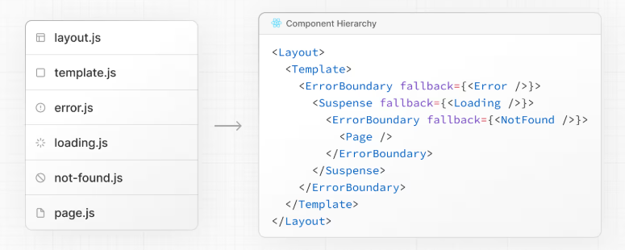

# 폴더 및 파일 규칙

* [폴더, 파일 규칙 공식문서: https://nextjs.org/docs/app/getting-started/project-structure#folder-and-file-conventions](https://nextjs.org/docs/app/getting-started/project-structure#folder-and-file-conventions)

## 최상위 폴더
---
프로젝트 최상위에는 다음과 같은 정해진 폴더들이 있습니다. 

| 폴더명                                               | 설명                  |
| :------------------------------------------------- | :------------------- |
| <span class="text-blue-normal ">`app`</span>       | **Next.js 13부터 도입된 App Router(앱 라우터) 기능을 구현하는 폴더입니다.**<br />이곳에서 페이지, 레이아웃, 서버 컴포넌트 등을 구조적으로 관리하며, 폴더 구조에 따라 자동으로 라우팅이 설정됩니다. 다양한 레이아웃, 중첩 라우트, 서버/클라이언트 컴포넌트 관리 등 최신 Next.js 기능을 활용할 수 있습니다. |
| <span class="text-blue-normal ">`pages`</span>     | **기존 Next.js(13 이전)에서 사용하던 라우팅을 위한 폴더입니다.(<span class="text-color-red">App Router를 사용한다면 필요없음.</span>)**<br />`pages` 폴더 안에 파일을 생성하면 파일명과 폴더 구조에 맞춰 URL이 자동 매핑(라우팅)됩니다.<br />예를 들어, `pages/about.tsx` 파일은 `/about` 경로의 페이지가 생성됩니다.<br />이 방식은 기존 CSR(Client Side Rendering), SSR(Server Side Rendering), SSG(Static Site Generation)에 모두 대응합니다.<br />Next.js 13 이후에는 권장 방식이 `app` 폴더로 바뀌었지만, `pages` 폴더도 여전히 호환 가능합니다. 구 프로젝트 마이그레이션이나 기존 방식의 유지가 필요할 때 사용합니다. |
| <span class="text-blue-normal ">`public`</span>     | **정적 파일(Static Assets)을 보관하는 폴더입니다.**<br />이미지, 폰트, favicon, robots.txt 등 프로젝트에서 사용할 모든 정적 파일을 이곳에 위치시킵니다.<br />`public` 폴더에 있는 파일들은 별도의 import 없이 바로 루트 경로(`/`)를 통해 접근할 수 있습니다. 예를 들어, `public/logo.png` 파일은 사이트에서 `/logo.png`로 접근할 수 있습니다.<br />빌드 시 해당 폴더의 파일들은 그대로 출력(dist) 디렉터리에 복사되어 배포됩니다. <br />※ `public` 폴더는 Next.js 최상위(프로젝트 루트)에 위치해야 하며, 주로 웹에서 고정적으로 필요한 자산 관리에 사용됩니다. |
| <span class="text-blue-normal ">`src`</span>       | **Next.js 프로젝트의 실제 소스 코드(코어 코드)를 구성하는 최상위 폴더입니다.**<br />Next.js에서는 기본적으로 최상위에 `pages`, `app`, `public` 폴더를 둘 수 있지만, 최근에는 프로젝트 구조의 명확성과 관리 편의성을 위해 `src` 폴더 하위에 주요 폴더와 파일들을 모아두는 방식을 권장합니다.<br />`src` 폴더 내부에는 `app`(또는 `pages`) 라우트 폴더, `components`(컴포넌트), `styles`(스타일), `lib`(유틸리티/라이브러리), `hooks`(커스텀 훅), `assets`(이미지 등 정적 자산) 등 다양한 하위 폴더가 위치하여, 프로젝트의 실제 비즈니스 로직과 UI 코드가 이곳에 체계적으로 관리됩니다.<br />이로 인해 폴더 구조가 명확해지고, 루트 폴더가 정돈되는 장점이 있습니다. <br /><span class="text-blue-normal">&#8251; `src` 폴더는 필수는 아니지만, 규모가 있는 프로젝트나 팀 작업 환경에서는 사용을 적극 추천합니다. **redsky-next-assets** 프로젝트는 `src`폴더를 사용합니다.</span> |


## 라우팅 파일
---

**특정 경로(URL)에 해당하는 페이지를 정의하는 파일들**을 의미합니다.  
(app 또는 pages) 라우터 방식에 따라 라우팅 파일의 종류와 역할은 조금 다릅니다. 하지만 여기서는 **App Router** 방식을 기준으로 정리합니다.


### 1. app 폴더 기반(App Router) 라우팅 파일

**Next.js 13부터 도입된 App Router(App Directory) 방식에서는 다음과 같은 파일들이 라우팅에 핵심 역할을 합니다.**

| 파일명               | 위치 예시                            | 역할/설명 |
|---------------------|--------------------------------------|-----------|
| `page.tsx`          | `src/app/about/page.tsx`             | `src/app` 폴더 밑에 **URL**에 해당하는 폴더(예시에서는 `about`)를 생성합니다. 생성한 폴더 까지가 **URL**에 해당되며, `page.tsx`는 **화면 컴포넌트**를 의미합니다.  |
| `layout.tsx`        | `src/app/layout.tsx`                 | 루트 레이아웃(헤더, 네비게이션, 푸터 등)(반드시 `html`, `body` 태그를 포함) 역할을 합니다. 하위에 여러 중첩 폴더 각각에 존재할 수도 있으며, 트리 구조로 중첩되어 적용됩니다. |
| `template.tsx`      | `src/app/dashboard/template.tsx`     |  `layout.tsx` 파일과 유사하지만, `template.tsx`는 해당 URL의 페이지가 렌더링될 때마다 리렌더링 됩니다.(`layout.tsx`는 처음 한번만 렌더링 됨.) 또한 상태값을 유지하지 않습니다. 주로 페이지 전환 애니메이션 효과를 주거나 페이지 진입 시마다 실행되는 로깅 및 분석(analytics) 등에 사용됩니다. |
| `loading.tsx`       | `src/app/posts/loading.tsx`          | 페이지의 콘텐츠가 불러와지는 동안 화면에 보여줄 대기 화면 UI 컴포넌트입니다. React의 **Suspense** 기반으로 동작됩니다. SSR 및 클라이언트 트랜지션에서 활성화됩니다. |
| `error.tsx`         | `src/app/dashboard/error.tsx`        | 해당 경로에서 에러가 발생했을 때 보여줄 에러 UI를 정의합니다. try/catch 자동 핸들링이 됩니다. |
| `global-error.tsx`  | `src/app/global-error.tsx`           | 전역 범위(앱 전체)에서 발생한 처리되지 않은 에러를 잡아 전체 에러 화면으로 보여주는 전역 에러(boundary) 컴포넌트입니다. 앱 루트(app/)에 1개만 정의하면 됩니다.|
| `not-found.tsx`     | `src/app/not-found.tsx`              | 존재하지 않는 경로(404)일 때 보여줄 컴포넌트입니다. 각 라우트 또는 전역의 not-found 분기 처리 등에 활용할 수 있습니다. |
| `default.tsx`       | `src/app/dashboard/default.tsx`      | 선택적(optional catch-all) 라우팅에서 사용되며, 현재 경로에 해당하는 하위 라우트가 없을 때 보여줄 "기본" 컴포넌트를 정의합니다. nested routes에서 특별히 유용합니다. |
| `route.ts`       | `src/app/api/user/route.ts`          | Route Handler를 정의할 때 사용합니다. node.js 서버 핸들러(`GET`/`POST` 등)를 작성할 수 있습니다.   (`src/app/api` 폴더 내 정의하는 전체 공통 Route Handler 파일 과 각 업무 Domain 내에 정의하는 Route Handler 파일로 나눌 수 있습니다.) |

**기타 파일**
- `head.tsx` : 특정 페이지의 `<head>`(title, meta 등) 요소를 정의할 때 사용
- `[dynamic]/page.tsx` : 동적 라우트(파라미터) 지정 ex) `src/app/products/[id]/page.tsx`

**실제 라우팅 파일 계층구조 예시**


<br/>

### 2. pages 폴더 기반 라우팅 파일 (구 방식) - <span class="text-color-red">App Router를 사용하면 필요없음.</span>
**&#8251; 최신 Next.js에서는 `app` 폴더 기반의 라우팅 방식을 권장합니다.**
- `src/pages/index.tsx` : `/` 경로의 페이지(홈)
- `src/pages/about.tsx` : `/about` 경로의 페이지
- `src/pages/blog/[slug].tsx` : `/blog/123`와 같이 동적 라우트
- `src/pages/api/hello.ts` : API 라우트

- **특징**: 폴더와 파일명 구조에 따라 URL이 자동 결정되며, `_app.tsx`, `_document.tsx`, `_error.tsx` 등 특수 파일로 전체 레이아웃/에러/커스텀 문서 설정을 지원합니다.


## 중첩 URL (Nested Routes)
---
Next.js에서 **중첩 URL**(혹은 Nested Routes)은 여러 depth의 경로가 계층적으로 연결될 때(예: `/dashboard/settings/profile`) 각 경로마다 별도의 페이지, 레이아웃, UI 상태를 가진 화면을 쉽게 구현할 수 있게 해주는 라우팅 구조입니다.

#### 1. 폴더 구조 = URL 구조
<span class="text-blue-normal">Next.js(특히 `app` 디렉토리 기반)에서는 폴더 구조가 곧 URL이 됩니다.</span>

예시:
```
src/app/
├── page.tsx                 // /
├── dashboard/
│   ├── layout.tsx           // /dashboard 이하에 공통 레이아웃
│   ├── page.tsx             // /dashboard
│   ├── settings/
│   │   ├── page.tsx         // /dashboard/settings
│   │   └── profile/
│   │       └── page.tsx     // /dashboard/settings/profile
│   └── analytics/
│       └── page.tsx         // /dashboard/analytics
```

- `/dashboard/settings/profile` 라는 중첩 URL은 위와 같이 `folder/folder/page.tsx` 형태로 자연스럽게 생성됩니다.

#### 2. 중첩 레이아웃

`layout.tsx`를 폴더별로 중첩하여, 각각의 URL 구간에 따라 공통 UI(사이드바, 헤더 등)를 계층적으로 적용할 수 있습니다.

- 예를 들어, `/dashboard/layout.tsx` 내부에 사이드바를 넣으면 `/dashboard` 이하의 모든 하위 경로에서 해당 사이드바가 공통 적용됩니다.

#### 3. 중첩 URL의 장점
- 각 경로별로 파일을 분리하여 **유지보수**가 쉽다.
- 상위/하위 경로에 **중첩된 레이아웃**을 손쉽게 정의 가능하다.
- 사용자 흐름에 따라 **복잡한 UI 계층**을 효율적으로 구성할 수 있다.

#### 4. 실제 URL과 매칭 관계 예시

| 폴더/파일 경로                                  | 매핑되는 실제 URL               |
|-------------------------------------------------|---------------------------------|
| `src/app/page.tsx`                              | `/`                             |
| `src/app/products/page.tsx`                     | `/products`                     |
| `src/app/products/[id]/page.tsx`                | `/products/123`, `/products/abc`|
| `src/app/dashboard/settings/profile/page.tsx`   | `/dashboard/settings/profile`   |
| `src/app/dashboard/settings/page.tsx`           | `/dashboard/settings`           |

<br/>

#### 5. 동적 파라미터와도 결합 가능

동적 경로(`[id]` 등) 및 중첩을 활용해 `/post/[postId]/comments/[commentId]` 같이 복잡한 경로도 생성할 수 있습니다.

---

**정리:**  
폴더와 파일 구조에 따라 URL이 계층적으로(중첩되어) 자동 매핑되고, 폴더별로 `layout.tsx`(레이아웃)이나 `page.tsx`(화면 컴포넌트)를 적절히 두어 강력하고 유연한 라우팅을 구현할 수 있습니다.


## 동적 경로 (Dynamic routes)
---
Next.js의 파일 기반 라우팅 시스템에서는 폴더/파일의 이름에 **[대괄호]**(eg. `[id]`)를 사용해서 *동적 세그먼트*를 만들 수 있습니다.  
이는 URL 일부가 "변수"처럼 작동하도록 하여, 다양한 경로에서 동일한 컴포넌트/페이지를 재사용할 수 있게 해줍니다.

#### 1. 기본 예시

폴더/파일 구조:
```
src/app/products/[id]/page.tsx
```

이 경우, `[id]`는 **동적 파라미터**로 처리되어  
다음과 같은 URL들이 모두 해당 페이지로 매핑됩니다.
- `/products/123`
- `/products/shoes`
- `/products/hello-world`
- 등등...

#### 2. 실제 코드 예시
* ⚠️ 공식적인 Next.js 방식은 서버 컴포넌트에서 params를 props로 받는 방법입니다.
```tsx
// src/app/products/[id]/page.tsx

// [중요 설명]
// Next.js App Router에서 "/products/[id]/page.tsx" 파일의 컴포넌트는 **기본적으로 "서버 컴포넌트"**입니다.
// 이때 동적 경로에 해당하는 `params`는 프레임워크가 **props로 자동 전달**합니다. (Promise<{ id: string }> 형태로 전달됩니다.)
// (-> 즉, useParams 훅을 서버 컴포넌트에서는 쓸 수 없습니다. useParams는 "클라이언트 컴포넌트"에서만 사용!)

/**
 * 서버 컴포넌트(권장 방식) - params는 프레임워크가 props로 전달합니다.
 */
import { use } from 'react';

interface Props {
  params: Promise<{ id: string }>
}

export default async function ProductDetailPage({ params }: Props) {
  const { id } = await params;
  // 또는 React의 'use'를 사용합니다.
  const { id } = use(params);
  // params의 id는 '/products/[id]'에서 [id]에 해당하는 값입니다.
  return <div>Product ID: {id}</div>;
}


/**
 * 클라이언트 컴포넌트(Client Component)
 * 만약 useParams()를 쓰고 싶다면 "클라이언트 컴포넌트"로 마크해야 합니다.
 */
"use client";
import { useParams } from "next/navigation";

export default function ProductDetailPage() {
  const params = useParams(); // { id: "123" }
  return <div>Product ID: {params.id}</div>;
}

```


#### 3. 중첩된 동적 경로

```
src/app/blog/[postId]/comments/[commentId]/page.tsx
```

- `/blog/7/comments/503`
- `/blog/hello/comments/world`
- `/blog/abc/comments/xyz`
등 다양한 동적 경로를 지원합니다.

함수형 서버 컴포넌트에서는 다음과 같이 받을 수 있습니다:
```tsx
export default function CommentPage({ params }: { params: { postId: string; commentId: string } }) {
  return (
    <div>
      Post ID: {params.postId}, Comment ID: {params.commentId}
    </div>
  );
}
```

#### 4. 동적 경로의 장점
- **코드 재사용**: 하나의 컴포넌트로 여러 경로 관리 가능
- **URL-매개변수 전달**: 경로에서 직접 파라미터 추출
- **복잡한 URL 설계**: 계층적·동적 라우팅 구조 설계


## URL그룹, 개인폴더(Route groups, private folders)
---

Next.js의 **App Router** 구조에서는 폴더 기반으로 라우팅이 이루어집니다. 이때, **URL에 노출되지 않는 가상 경로**(route group)와 **개인 폴더/private folder**(`_folder` 형태)가 존재합니다.

**참고 링크**
- [공식문서 - Route Groups](https://nextjs.org/docs/app/api-reference/file-conventions/route-groups)
- [공식문서 - Private Folders](https://nextjs.org/docs/app/getting-started/project-structure#route-groups-and-private-folders)

---

### 1. Route Groups (`(group)`)

- `(group)` 으로 감싸진 폴더는 **경로(URL)에는 나타나지 않고**, 파일 및 **구조 정리/구분용**으로만 사용됩니다.
- 즉, **공통 레이아웃 제공** 또는 **폴더 구조 정리**에 사용합니다.
- **Route Group**폴더도 `layout.tsx` 파일은 가질 수 있습니다.

**예시**
```
src
└── app
    └── (dashboard)           // Route Group (URL에 노출되지 않음)
        ├── users
        │   └── page.tsx      // /users
        └── products
            └── page.tsx      // /products
```
:::info 설명
- 실제 URL:
  - `/users`
  - `/products`
- `(dashboard)`은 주소창에 보이지 않음!
- **redsky-next-assets** 프로젝트에서는 `(domains)` 폴더를 업무 그룹으로 나누기 위한 용도로 사용합니다.
:::

**장점**
- 코드상 구조화, 레이아웃별 분리
- URL에는 노출되지 않아 깔끔

---

### 2. 개인 폴더 / Private folders (`_folder`)

- 밑줄(언더스코어)로 시작하는 폴더: 예) `_lib`, `_utils`
- 개인 폴더 또한 **경로(URL)에서 무시**됨 → URL 경로에 포함되지 않고, 라우트로 인식되지 않음.
- **유틸 함수**나 **컴포넌트 보관** 등의 용도로 사용합니다.

**예시**
```
src
└── app
    ├── _utils // 유틸 함수 보관
    │   └── my-helper.ts
    ├── _components // 컴포넌트 보관
    │   └── Sidebar.tsx
    └── blog
        └── page.tsx
```
:::info 설명
- `/blog` 만 라우트로 취급됨.
- `_utils`, `_components` 폴더 안의 파일들은 라우터에 영향 X
:::

---

#### 정리

| 폴더이름        | URL 노출? | 용도                      |
| --------------- | --------- | ------------------------- |
| `(group)`       | ❌        | 파일구조·레이아웃 구분    |
| `_folder`       | ❌        | 유틸/공통 컴포넌트 관리   |
| 일반 폴더       | ⭕ | 페이지·라우트 경로       |


## 병렬, 인터셉팅 라우트 (Parallel, Intercepted Routes)
---
Next.js(app router)의 강력한 폴더 컨벤션 중 하나는 **병렬(parallel) 라우트 폴더 `@폴더명`** 과 **인터셉팅(intercepted) 라우트 폴더 `.폴더명`** 입니다.  
이 두가지 방식은 복잡한 UI/UX, 대시보드, 다중 모달, 덮어쓰기 페이지 등에 굉장히 유용하게 사용됩니다.


### 1.병렬 라우트(Parallel Routes) - **@폴더명**
- **`@`** 로 시작하는 폴더명 (`@tabs`, `@products` 등)
- 하나의 페이지에서 **여러 개의 서브 라우트(UI 조각)** 를 동시에 렌더링해야 할 때 사용
- 각 병렬 라우트는 서로 독립적으로 구성
- layout.tsx에서 **슬롯(slots) 방식**으로 여러 자식 라우트를 동시에 수용

한마디로 설명했을 때 **병렬 라우트**는 하나의 페이지에서 여러 개의 서브 페이지를 각각 슬롯(slots) 방식으로 렌더링하는 방식입니다. 각각 독립적으로 데이터 패칭, 로딩 상태를 관리할 수 있습니다. 그렇기 때문에 특정 서브 화면의 데이터가 늦더라도 다른 서브 화면의 데이터는 영향을 받지 않고 미리 렌더링됩니다.

**예시**
```
src
└── app
    └── dashboard
        ├── layout.tsx
        ├── @activity
        │   └── page.tsx
        └── @teams
            └── page.tsx
```
```tsx
// src/app/dashboard/layout.tsx
export default function Layout({ children, activity, teams }) {
  return (
    <div>
      <aside>{activity}</aside>
      <main>{children}</main>
      <section>{teams}</section>
    </div>
  );
}
```
- `/dashboard` 접근 시, `@activity`, `@teams` 폴더의 라우트가 **동시에** 렌더링됨  
- 각 슬롯 slot (activity, teams)이 layout의 props로 전달

:::info 좋은 사용 사례
✔️ 대시보드 좌측 메뉴/오른쪽 패널/서브 탭 등 **동시 표시**가 필요한 경우
:::

---

### 2.인터셉팅 라우트(Intercepted Routes) - **`.`(dot)폴더명**, 다양한 패턴들

- **`.`(dot)** 으로 시작하는 폴더명 (예: `(.)modal`, `(.)preview` 등)을 사용하면 **현재 context(화면) 위에 라우트를 겹쳐서(intercept)** 보여줄 수 있습니다.
- 리스트-상세처럼 기존 화면의 context를 유지한 채 UI를 오버레이/모달 등으로 확장할 때 매우 유용합니다.

---

**기본 (.) 폴더 사용 예시**
```
src
└── app
    └── feed
        ├── page.tsx
        ├── [id]
        │   └── page.tsx
        └── (.)modal
            └── [id]
                └── page.tsx
```
- `/feed`에서 리스트를 보고 있다가,  
- `/feed/[id]`(글 상세)로 이동은 일반적인 full replace 라우팅  
- `/feed/(.)modal/[id]`를 추가하면,  
    - `/feed/[id]`로 이동 시 기존 리스트 context UI 위에 모달 형태로 상세를 띄울 수 있습니다.
    - Drawer, Modal, Preview 등 다양한 오버레이 UI 구현에 사용  
    - 브라우저 뒤로 가기도 자연스러움

---

**(..) 폴더 사용 예시**  
상위(parent)의 context를 유지하면서, 서브 라우트를 오버레이로 처리할 수 있습니다.

```
src
└── app
    └── feed
        ├── [id]
        │   └── page.tsx
        └── (..)modal
            └── [id]
                └── page.tsx
```
- `(..)modal` 폴더는 **한 단계 상위**(부모 폴더)의 context(예: `/feed`)에 인터셉트합니다.
- 예를 들어, `/feed/[id]`에서 `/feed/(..)modal/[id]`를 띄우면, 실제 route context는 `/feed`의 레이아웃을 기반으로 모달이 뜹니다.

---

**(..)(..) 폴더 사용 예시**  
더 상위(n단계 조상)의 context를 유지하며 오버레이 구현이 가능합니다.

```
src
└── app
    └── dashboard
        └── feed
            ├── [id]
            │   └── page.tsx
            └── (..)(..)modal
                └── [id]
                    └── page.tsx
```
- `(..)(..)modal`은 **두 단계 상위**(예: `/dashboard`)의 context에서 라우트를 인터셉트하여, 그 context 위에 오버레이를 띄웁니다.

---

**(...) 폴더 (루트 context 인터셉팅) 예시**  
점 3개로 시작하는 폴더(`(...)modal`)는 **앱 루트의 context**에 인터셉트합니다.

```
src
└── app
    └── feed
        ├── [id]
        │   └── page.tsx
        └── (...)modal
            └── [id]
                └── page.tsx
```
- `(...)modal` 폴더의 라우트는 **앱 전체(최상위 context)** 위에 오버레이를 띄우고 싶을 때 사용합니다.  
- 어떤 라우트이든, 항상 root layout context를 사용하여 모달 오버레이를 구현합니다.

---

:::info 좋은 사용 사례
✔️ 게시물 미리보기/사진 미리보기 Modal, Bottom Sheet, Drawer, 오버레이 상세 등  
✔️ UX에서 **이전 화면을 기억하거나 뒤로 가기/forward가 자연스러워야 할 때**  
✔️ 여러 단계 상위의 context(대시보드 전체, 앱 전체 등)를 베이스로 오버레이 UI를 만들어야 할 때
:::

---

#### 표로 정리

| 폴더 이름            | URL 노출 | 역할                                 | 대표 용도 예시                           |
| -------------------- | -------- | ------------------------------------ | ----------------------------------------- |
| `@폴더명`            | ❌       | 병렬 라우트 (슬롯)                   | 대시보드, 탭, 패널 등                     |
| `(.)폴더명`            | ❌       | 인터셉팅(1단계 상위 context 유지)    | 미리보기, 모달, 오버레이 상세 등           |
| `(..)폴더명`           | ❌       | 인터셉팅(2단계 상위 context 유지)    | 한 단계 더 상위 context에서 모달/오버레이  |
| `(...)폴더명`          | ❌       | 인터셉팅(최상위 context, root 유지)  | 앱 전체 레이아웃 상에서 띄우는 오버레이    |


---


