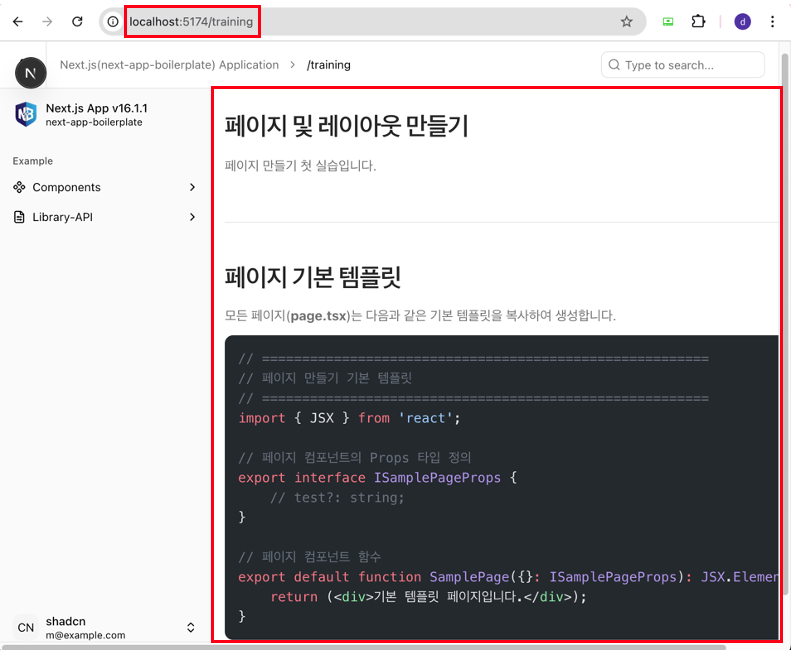
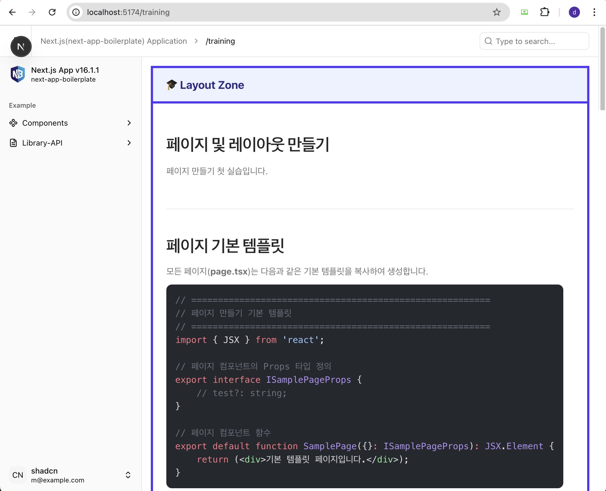

# 레이아웃 및 페이지 만들기

* 실습용 소스 코드는 ['training 시작하기'](/docs/nextjs-training/)에서 먼저 각자 PC에 설치한 후 시작합니다.

:::info 실습 내용
* `src/app/(domains)/training` 업무폴더에서 페이지(`page.tsx`)를 만듭니다.
* `src/app/(domains)/training` 업무폴더에 training 전용 레이아웃(`layout.tsx`)을 만듭니다.
* 만든 **페이지**와 **레이아웃**을 브라우저에서 확인합니다.
:::

:::info 실습 목표
* **App Router** 구조의 이해.
  - Next.js 폴더 및 파일 규칙 이해
  - 페이지(`page.tsx`)의 이해
  - 레이아웃(`layout.tsx`)의 이해
:::

:::tip 페이지(<span class="admonition-title">page.tsx</span>) 기본 구조
* 모든 페이지(`page.tsx`)는 다음과 같은 기본 코드 구조를 가집니다.
  ```tsx
  // ========================================================
  // 페이지 만들기 기본 템플릿
  // ========================================================
  import { JSX } from 'react';

  // 페이지 컴포넌트의 Props 타입 정의
  export interface ISamplePageProps {
    // test?: string;
  }
  
  // 페이지 컴포넌트 함수
  export default function SamplePage({}: ISamplePageProps): JSX.Element {
    return (<div>기본 템플릿 페이지입니다.</div>);
  }
  ```
:::


## 실습 폴더 위치
---
* 프로젝트 폴더의 다음 위치에서 작업을 시작합니다.
```sh
react-app-scaffold
├── src
│   └── app
│       └── (domains)
// highlight-start
│           └── training
// highlight-end
└── ...
```


## `page.tsx` 파일 퍼블리싱 코드
---
퍼블리셔에게서 다음과 같은 퍼블리싱된 페이지 코드를 받았다고 가정합니다.
```tsx
import { JSX } from 'react';
import { Separator } from '@/core/components/shadcn/ui/separator';
import UiCodeBlock from '../_components/UiCodeBlock';

export interface ICreatePageProps {
	// test?: string;
}

export default async function CreatePage({}: ICreatePageProps): Promise<JSX.Element> {
  return (
    <>
      <div className="flex min-w-0 flex-1 flex-col">
        <div className="h-(--top-spacing) shrink-0" />
        <div className="mx-auto flex w-full  min-w-0 flex-1 flex-col gap-8 px-4 py-6 text-neutral-800 md:px-0 lg:py-8 dark:text-neutral-300">
          <div className="flex flex-col gap-2">
            <div className="flex items-start justify-between">
              <h1 className="scroll-m-20 text-4xl font-semibold tracking-tight sm:text-3xl xl:text-4xl">
                페이지 및 레이아웃 만들기
              </h1>
              <div className="docs-nav bg-background/80 border-border/50 fixed inset-x-0 bottom-0 isolate z-50 flex items-center gap-2 border-t px-6 py-4 backdrop-blur-sm sm:static sm:z-0 sm:border-t-0 sm:bg-transparent sm:px-0 sm:pt-1.5 sm:backdrop-blur-none">
                &nbsp;
              </div>
            </div>
            <p className="text-muted-foreground text-[1.05rem] text-balance sm:text-base">
              페이지 만들기 첫 실습입니다.
            </p>
          </div>
          <div className="w-full flex-1 *:data-[slot=alert]:first:mt-0">
            <Separator className="my-6" />
            {/* example 블럭요서 START */}
            <div className="flex flex-col gap-2 pt-6">
              <div className="flex items-start justify-between">
                <h2
                  data-shorcut="true"
                  className="scroll-m-20 text-3xl font-semibold tracking-tight sm:text-3xl xl:text-3xl mb-2"
                >
                  페이지 기본 템플릿
                </h2>
              </div>
              <p className="text-muted-foreground text-[1.05rem] text-balance sm:text-base">
                모든 페이지(<strong>page.tsx</strong>)는 다음과 같은 기본 템플릿을 복사하여 생성합니다.
              </p>
              <div className="flex justify-start py-1">
                <UiCodeBlock
                  code={`// ========================================================
// 페이지 만들기 기본 템플릿
// ========================================================
import { JSX } from 'react';

// 페이지 컴포넌트의 Props 타입 정의
export interface ISamplePageProps {
// test?: string;
}

// 페이지 컴포넌트 함수
export default function SamplePage({}: ISamplePageProps): JSX.Element {
return (<div>기본 템플릿 페이지입니다.</div>);
}`}
                  lang="tsx"
                />
              </div>
            </div>
            {/* example 블럭요서 END */}
          </div>
        </div>
      </div>
    </>
  );
}
```


## `layout.tsx` 파일 퍼블리싱 코드
---
퍼블리셔에게서 다음과 같은 퍼블리싱된 레이아웃 코드를 받았다고 가정합니다.
```tsx
import { JSX } from 'react';
import type { ReactNode } from 'react';

export interface ITrainingLayoutProps {
	children: ReactNode;
}

export default function TrainingLayout({ children }: ITrainingLayoutProps): JSX.Element {
  return (
    <div className="min-h-screen border-4 border-indigo-600 dark:border-indigo-500">
      {/* Training 헤더 */}
      <div className="border-b-4 border-indigo-600 bg-indigo-50 px-6 py-4 dark:border-indigo-500 dark:bg-indigo-950">
        <h1 className="text-xl font-bold text-indigo-900 dark:text-indigo-100">🎓 Layout Zone</h1>
      </div>

      {/* Training 컨텐츠 */}
      <div className="p-6">{children}</div>
    </div>
  );
}
```


## 페이지(page.tsx) 만들기 challenge
---
:::info 작업 내용
* **`src/app/(domains)/training` 폴더**에서 `(pages)` 폴더를 생성하고 내부에 페이지(`page.tsx`)를 생성합니다.
  - `page.tsx` 파일에 퍼블리셔가 제공한 코드를 복사하여 붙여넣습니다.
  - `page.tsx`파일에 퍼블코드 붙여넣기 내용 중에 오류가 없는지 확인하고 수정합니다. 
  ```sh
  react-app-scaffold
  ├── src
  │   └── app
  │       └── (domains)
  │           └── training
  // highlight-start
  │               └── (pages)
  │                   └── page.tsx
  // highlight-end
  └── ...
  ```
* PC에서 로컬 개발 서버를 띄웁니다. `npm run dev` 명령어를 실행합니다.
* 만든 페이지를 브라우저에서 `http://localhost:포트번호(포트는 다를 수 있음)/training`으로 접속하여 확인합니다.
:::
:::tip <span class="admonition-title">challenge</span> 확인
* App Router 구조에서 그룹 폴더(`(domains)`, `(pages)`)가 실제 브라우저 주소창에는 어떻게 표시되는지 확인하기.
* 코드상에 어떤 오류가 있는지 찾아보기.
:::

### 결과



### 설명
* App Router 구조에서 그룹 폴더(`(domains)`, `(pages)`)가 포함된 실제 파일 경로는 `src/app/(domains)/training/(pages)/page.tsx` 입니다. 하지만 브라우저 주소창에 표시되는 URL은 `/training` 입니다.
  - `src/app`은 **App Router** 구조의 최상위 폴더이고, 표시되는 URL의 시작점이라고 할 수 있습니다.
  - `(domains)`는 업무 그룹을 의미하며, 실제 브라우저 주소창에는 표시되지 않습니다.
  - `(pages)`는 페이지들을 모아놓은 그룹을 의미하며, 실제 브라우저 주소창에는 표시되지 않습니다.
  - `page.tsx`는 **화면 컴포넌트**를 의미하며, 실제 브라우저 창에 보여지는 화면을 담당합니다.


## 레이아웃(layout.tsx) 만들기 challenge
---
:::info 작업 내용
* **`src/app/(domains)/training` 폴더**의 내부에 레이아웃(`layout.tsx`)를 생성합니다.
  - `layout.tsx` 파일에 퍼블리셔가 제공한 코드를 복사하여 붙여넣습니다.
  - `layout.tsx`파일에 퍼블코드 붙여넣기 내용 중에 오류가 없는지 확인하고 수정합니다. 
  ```sh
  redsky-next-assets-training
  ├── src
  │   └── app
  │       └── (domains)
  │           └── training
  // highlight-start
  │               └── layout.tsx
  // highlight-end
  └── ...
  ```
* PC에서 로컬 개발 서버를 띄웁니다. `npm run dev` 명령어를 실행합니다.
* 추가된 레이아웃을 확인하기 위하여 브라우저에서 `http://localhost:포트번호(포트는 다를 수 있음)/training`으로 접속하여 확인합니다.
:::
:::tip <span class="admonition-title">challenge</span> 확인
* 코드상에 어떤 오류가 있는지 찾아보기.
* 레이아웃이 적용된 페이지를 브라우저에서 확인하고 레이아웃이 적용되었는지 확인하기.
:::

### 결과



### 설명
* Training 업무에서만 보여지는 공통 레이아웃이 필요 없다면 `layout.tsx` 파일은 생성하지 않아도 됩니다.
* App Router 구조에서 그룹 폴더(`(domains)`)가 포함된 실제 파일 경로는 `src/app/(domains)/training/layout.tsx` 입니다. 하지만 브라우저 주소창에 표시되는 URL은 `/training` 입니다.
* 레이아웃(`layout.tsx`)은 페이지(`page.tsx`)의 상위 계층에 위치하며, 페이지(`page.tsx`)을 감싸는 랩핑 역할의 공통 레이아웃을 담당합니다.
* Training 전용 레이아웃(`layout.tsx`)은 페이지(`page.tsx`)와 **같은 경로 또는 상위 경로**에 위치해 있어야합니다.

:::tip <span class="admonition-title">레이아웃</span>의 특징
* **자동 중첩**: 레이아웃(`layout.tsx`)은 상위 폴더의 레이아웃이 자동으로 하위를 감쌉니다.
* **children Props**: 레이아웃(`layout.tsx`)은 `children` Props를 통해 하위 페이지(`page.tsx`)를 감싸서 렌더링하기 때문에 꼭 필요합니다.
* **루트 레이아웃**: 최상위에 위치한 루트 레이아웃(`src/app/layout.tsx`)은 `<html>`, `<body>` 태그를 반드시 포함하고 있어야 하지만 Training 전용 레이아웃(`layout.tsx`)과 하위 모든 레이아웃은 포함하지 않아도 됩니다.
* **상태 유지**: 페이지 이동 시 레이아웃(`layout.tsx`)은 리렌더링 되지 않아 상태가 유지됩니다.
:::