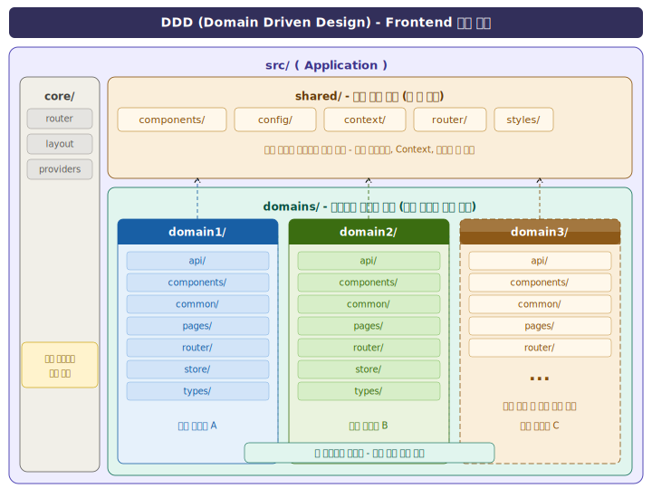

# 개발 구조 및 규칙


## Folder Structure
---
:::tip DDD(<span class="admonition-title">Domain Driven Design</span>) 설계
* Frontend 개발의 기본 폴더 구조는 <span class="text-blue-normal">[DDD(Domain Driven Design)](https://en.wikipedia.org/wiki/Domain-driven_design)</span> 설계 방법론을 따릅니다.  
* **DDD**에서 말하는 Domain은 **비즈니스 도메인**을 의미합니다. 즉, 유사하거나 관련된 업무 기능(프로젝트의 각각의 서비스/모듈)을 하나의 도메인 단위로 분리하여 관리합니다. 이렇게 하면 모듈 간 불필요한 의존성을 줄이고 도메인별로 코드를 응집시켜 유지보수성과 확장성이 높아집니다.
* 업무가 복잡한 대형 프로젝트에 적합한 구조입니다.
* `domains`폴더에 각각 업무(**domain**)별로 분리되어 영향도와 의존성이 적고 확장성이 용이해서 유지보수가 쉽습니다.
* 각 업무 담당 개발자는 **자신이 맡은 업무 영역에서만 코딩** 작업을 진행하며, 서로 다른 업무간에 충돌 가능성이 적어집니다.
* 부득이하게 자신의 업무 외 상위 업무나 공통 업무에 접근 해야하는 상황이라면 Frontend공통 개발자와 상의하여 **shared**를 통해 공유 하거나 app공통 객체를 통해 소통합니다.
:::




### react-app-scaffold 전체 폴더 구조
```sh
react-app-scaffold
├── src/
│   ├── core/                   # 앱 전체 공통 영역 (공통 개발자 관리 영역)
│   ├── assets/                 # 정적 파일 (fonts, images, css)
│   ├── domains/                # 업무 도메인별 분리 (DDD) — 업무 개발자 작업 영역
│   │   ├── home/                 # 홈 도메인
│   │   │   ├── api/                  # REST API URL 및 request/response 타입 정의
│   │   │   ├── components/           # 도메인 전용 컴포넌트
│   │   │   ├── pages/                # 화면 파일 (*.tsx)
│   │   │   ├── router/               # 도메인 라우팅
│   │   │   ├── store/                # 도메인 상태 관리
│   │   │   └── types/                # 도메인 타입 정의
│   │   └── [domain]/             # 업무 도메인 추가·확장
│   ├── shared                  # 전역 공유 코드
│   │   ├── components                # 공유 컴포넌트
│   │   ├── config                    # 앱 설정 (navigation 등)
│   │   ├── context                   # 전역 Context
│   │   └── router                    # 공유 라우터
│   ├── types                   # TypeScript 전역 타입 정의 (.d.ts)
│   ├── App.tsx                 # 루트 App 컴포넌트
│   ├── main.tsx                # 앱 진입점
├── package.json                # 독립 의존성 관리 (pnpm)
├── vite.config.ts              # Vite + Module Federation 설정
└── ...                         # ESLint, Prettier, tsconfig 등 (Shared Library에서 extend)
```

* &#8251; 업무 개발자가 작업할 공간은 각 앱의 `src/domains` 폴더입니다. 그 외 폴더 및 파일들은 설정 파일이므로 `src` 폴더 구조에 대해서만 설명합니다.

:::info 설명
* **각 앱(Host, Remote) 내부 폴더 구조**
	* <span class="text-green-bold">src/assets</span>폴더는 모든 정적 파일들(이미지, CSS 파일 등)을 모아놓은 폴더입니다.
	* <span class="text-green-bold">src/core</span>폴더는 앱 핵심 공통 코어 로직(라우터 설정 등) 폴더입니다. 공통개발자 이 외 업무개발자는 작업하지 않는 공간입니다.
	* <span class="text-green-bold">src/shared</span>폴더는 해당 앱 내 전역 공유 코드 폴더입니다. 상황에 따라 수정이 발생할 수 있고, 다른 업무(domain)개발자와 함께 작업할 수 있는 공통 컴포넌트, 레이아웃, Context, 라우터 등이 위치합니다.
	* <span class="text-green-bold">src/bridge.tsx</span>는 Remote 앱에서 Module Federation으로 노출되는 컴포넌트의 진입점입니다. Host 앱이 Remote 앱을 로드할 때 이 파일을 통해 연결됩니다.
	* <span class="text-green-bold">src/domains</span>폴더에는 각 domain 업무들(domain1, domain2, domain3, ...)이 있고, 그 하위에는 일률적으로 <span class="text-blue-normal">**api, components, common, pages, router, store, types**</span>폴더를 가집니다. 각 개별 폴더는 업무 상황에 따라 생성하여 사용합니다.
		- <span class="text-blue-normal">api</span> : REST API URL과 request, response의 type을 정의합니다.
		- <span class="text-blue-normal">common</span> : 해당 업무에서 사용하는 javascript 공통함수나 공통적인 요소의 모듈을 모아놓은 폴더.
		- <span class="text-blue-normal">components</span> : 업무 화면에서 사용하는 컴포넌트들을 모아놓은 폴더.
		- <span class="text-blue-normal">pages</span> : 해당 도메인 업무의 페이지 컴포넌트 폴더. 화면을 구성하는 React 컴포넌트를 모아놓습니다.
		- <span class="text-blue-normal">router</span> : 해당 도메인 업무의 라우터 설정 폴더. React Router 기반의 라우트를 정의합니다.
		- <span class="text-blue-normal">store</span> : 해당 업무에서 사용하는 상태관리 모듈을 모아놓은 폴더.
		- <span class="text-blue-normal">types</span> : 해당 업무에서 사용하는 type을 모아놓은 폴더.
:::


## Code Convention
---
많은 개발자들의 협업으로 인하여 개발자 개개인 마다 코딩 스타일이 달라서 유지보수가 어려워지고 코드의 품질이 떨어질 수 있습니다. 그래서 다음과 같은 [코딩 스타일](./react-style-guide)을 정의하여 따르도록 합니다.


### Folder convention(<span class="text-blue-normal">폴더명</span>)
* 모든 폴더명은 **kebab-case**로 생성합니다.
* **camelCase**보다 가독성이 좋고 node_modules의 모든 프로젝트들도 **kebab-case**를 사용하므로 그대로 따르기로 합니다.
```sh
# 폴더명 적용 예시
 src
 ├── app    
 ├── assets  
 ├── core              
 │   ├── components    
 │   │   └── ui-components      # 폴더명 kebab-case
 │   └── types         
 └── shared            
     ├── components
     │    ├─ header-left        # 폴더명 kebab-case
     │    │  └─DefaultLeft.tsx
     │    ├─ header-right       # 폴더명 kebab-case
     │    └─ header-center      # 폴더명 kebab-case    
     └── constants     
         └── nav-utils          # 폴더명 kebab-case
             └── nav-utils.ts
```


### File convention (<span class="text-blue-normal">파일명</span>)
* <span class="text-blue-normal">*.tsx</span>파일, 모든 컴포넌트 파일명은 **PascalCase**로 만듭니다.
* HTML 엘리먼트와의 차별성과 충돌 방지 차원.
* 되도록이면 **컴포넌트 명**은 두 단어가 합쳐진 **합성어를 사용**합니다.
```sh
# 컴포넌트 *.tsx 파일명 예시
TodoItem.tsx
```
* <span class="text-blue-normal">*.ts, *.js, *.scss, *.css</span> 등 일반 파일명은 **kebab-case**로 만듭니다.
```sh
todo-system.ts
todo-style.css
```


### Function Names(<span class="text-blue-normal">함수명</span>)
* 함수명은 **camelCase**로 만듭니다.
```ts
// ✅ 좋음
function fetchUserData() { }
async function getUserById(id: string) { }
const handleSubmit = () => { }
const calculateTotal = (items: Item[]) => { }

// ❌ 나쁨
function FetchUserData() { }
function get_user_by_id() { }
```
* 동사로 시작
```ts
// ✅ 좋음
function createUser() { }
function validateEmail() { }
function handleClick() { }
function fetchProducts() { }
function isAuthenticated() { }
function hasPermission() { }

// ❌ 나쁨
function user() { }
function email() { }
function click() { }
```
* 이벤트 핸들러 함수명은 **handle** 또는 **on** 접두사를 붙입니다.
```ts
// ✅ 좋음
function handleClick() { }
function handleSubmit() { }
function handleInputChange() { }
function onUserLogin() { }

// ❌ 나쁨
function click() { }
function submit() { }
function change() { }
```


### Variable Names(<span class="text-blue-normal">변수명</span>)
* 변수명은 **camelCase**로 만듭니다.
```ts
// ✅ 좋음
const userName = 'John';
const isLoading = false;
const productList = [];
let currentPage = 1;

// ❌ 나쁨
const UserName = 'John';
const is_loading = false;
const PRODUCTLIST = [];
```
* 상수는 **UPPER_SNAKE_CASE**로 만듭니다.
```ts
// ✅ 좋음
const MAX_RETRY_COUNT = 3;
const API_BASE_URL = 'https://api.example.com';
const DEFAULT_PAGE_SIZE = 10;

// 설정 객체는 camelCase
const config = {
  maxRetryCount: 3,
  apiBaseUrl: 'https://api.example.com'
};
```
* Boolean 변수는 **is, has, can, should** 접두사를 붙입니다.
```ts
// ✅ 좋음
const isLoading = false;
const hasError = true;
const canEdit = false;
const shouldUpdate = true;

// ❌ 나쁨
const loading = false;
const error = true;
const edit = false;
```


### TypeScript convention
* Frontend개발 시  **Typescript**를 사용하므로 관련 convention을 정의합니다.
* **Interface**명은 관례적으로 앞에 '**I**'를 붙이고 **PascalCase**로 만듭니다.
```js
// TypeScript의 Interface명
interface ITodoList {
  id: number;
  content: string;
  completed: boolean;
}
```
* **type, enum**명은 앞에 '**T, E**'을 붙이고 **PascalCase**로 만듭니다.
```js
// TypeScript의 Enum명
enum EDirection {
  Up = 1,
  Down,
  Left,
  Right,
}
// Type명
type TPerson = {
  name: string;
  age: number;
}
```


### Router convention
* **path**는 **kebab-case**로 만듭니다.
* **element, children**은 **PascalCase**로 만듭니다.
```tsx
{
  path: '/ui-button',
  element: <LayoutIndex />,
},
```