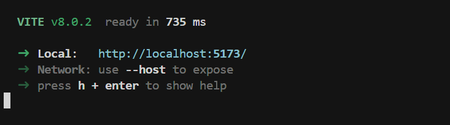
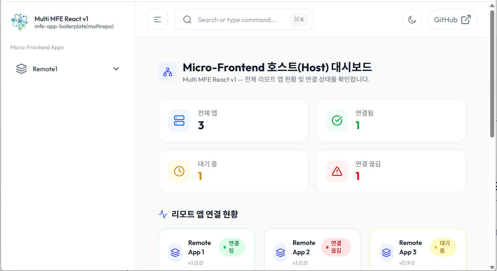

# react-app-scaffold 설치

**react-app-scaffold** 프로젝트를 로컬 개발 환경에 설치하고 실행하는 방법을 단계별로 안내합니다.


## 목차
---

1. [전제 조건](#전제-조건)
2. [시스템 요구사항](#시스템-요구사항)
3. [프로젝트 클론](#프로젝트-클론)
4. [의존성 설치](#의존성-설치)
5. [개발 서버 실행](#개발-서버-실행)
6. [설치 검증](#설치-검증)
7. [문제 해결](#문제-해결)


## 전제 조건
---

**react-app-scaffold** 프로젝트를 설치하기 전에 다음 사항을 확인하세요:

### 필수 소프트웨어
* 기본 개발 환경 구성이 되어 있지 않다면 [react-app-scaffold 개발 환경 구성]() 을 참조하여 기본 개발 환경을 구성하세요.
- **Node.js**: 버전 20.0 이상이 설치되어 있어야 합니다
- **npm**: Node.js와 함께 설치되며, 버전 10.0 이상 권장
- **Git**: 소스 코드를 클론하기 위해 필요합니다
- **코드 에디터**: VSCode 또는 다른 IDE (선택사항)
- **Chrome Browser**: Chrome 브라우저 및 확장프로그램이 설치되어 있어야 합니다

### 접근 권한

:::info <span class="admonition-title">Git</span> 레포지토리 접근 권한
- **레포지토리 URL**: [https://github.com/redsky-project/react-app-scaffold](https://github.com/redsky-project/react-app-scaffold)
- 개발 코드를 내려받기 위해서는 **Git 계정 및 레포지토리 접근 권한**이 필요합니다
- 권한이 없는 경우 프로젝트 담당자에게 접근 권한을 요청하세요
:::


## 시스템 요구사항
---

### 최소 요구사항

| 항목 | 최소 버전 | 권장 버전 |
|------|----------|----------|
| Node.js | 20.0.0 | 20.x LTS 이상 |
| npm | 10.0.0 | 최신 버전 |
| Git | 2.0.0 | 최신 버전 |
| 운영체제 | Windows 10, macOS 10.15 | 최신 버전 |

### 시스템 확인

다음 명령어로 현재 시스템 환경을 확인할 수 있습니다.

```bash
# Node.js 버전 확인
node --version

# npm 버전 확인
npm --version

# Git 버전 확인
git --version
```

예상 출력:
```bash
node --version
# v20.x.x 이상

npm --version
# 10.x.x 이상

git --version
# git version 2.x.x 이상
```


## 프로젝트 클론
---

### 1단계: 작업 디렉토리 생성

로컬 PC에 프로젝트를 저장할 작업 폴더를 생성합니다. `frontend-next`라는 폴더명은 상황에 맞게 자유롭게 정하면됩니다.

```bash
# Windows 예시 (C:\my\ 디렉토리 기준)
mkdir frontend-next
cd frontend-next

# macOS/Linux 예시
mkdir -p ~/projects/frontend-next
cd ~/projects/frontend-next
```

:::tip
프로젝트 경로에 한글이나 공백이 포함되지 않도록 주의하세요. 이는 일부 빌드 도구에서 문제를 일으킬 수 있습니다.
:::

### 2단계: Git 레포지토리 클론

생성한 작업 폴더에서 Git을 사용하여 프로젝트를 클론합니다.

```bash
git clone git@github.com:redsky-project/react-app-scaffold.git
```

클론이 완료되면 `react-app-scaffold` 폴더가 생성됩니다.

### 3단계: 클론된 프로젝트 디렉토리로 이동

```bash
cd react-app-scaffold
```

### 4단계: 프로젝트 구조 확인

클론된 프로젝트의 기본 구조를 확인합니다:

```bash
# Windows
dir

# macOS/Linux
ls -la
```

디렉토리 구조:
```sh
react-app-scaffold
├── @types                # TypeScript 전역 타입 정의 (.d.ts 파일)
├── public                # 정적 파일 (이미지, 폰트 등, / 경로로 접근)
├── src
│   ├── app               # Next.js App Router 핵심 폴더
│   │   ├── (domains)     # 프로젝트 업무(domain) 그룹 (URL에 영향 없이 구조화)
│   │   │   ├── example   # example 도메인 업무
│   │   │   ├── main      # main 도메인 업무
│   │   │   └── ...       # 도메인 업무를 계속 추가할 수 있음
│   │   ├── favicon.ico   # 사이트 파비콘
│   │   └── layout.tsx    # 전역 레이아웃 컴포넌트
│   ├── assets            # 정적 리소스 관리
│   │   └── styles        # 스타일 파일
│   │       └── app.css   # 전역 CSS
│   ├── core              # 프로젝트 핵심 비즈니스 로직
│   │   ├── components    # 공통 컴포넌트
│   │   │   ├── ui        # 공통 UI 컴포넌트 (Button, Input 등)
│   │   │   └── ...
│   │   └── types         # 공통 비즈니스 로직 타입 정의
│   └── shared            # 전역 공유 코드
│       ├── components    # 전역 공유 공통 컴포넌트
│       └── constants     # 전역 상수 (API 엔드포인트, 설정값 등)
├── tsconfig.json         # TypeScript 컴파일러 설정
├── eslint.config.mjs     # ESLint 린팅 규칙
├── next.config.ts        # Next.js 프레임워크 설정
├── tailwind.config.ts    # Tailwind CSS 설정
├── postcss.config.mjs    # PostCSS 설정
├── package.json          # 의존성 및 스크립트 관리
└── prettier.config.js    # 코드 포매팅 규칙
```

:::warning
이 시점에서는 아직 `node_modules` 폴더가 존재하지 않습니다. 이는 정상이며, 다음 단계에서 의존성을 설치하면 자동으로 생성됩니다.
:::


## 의존성 설치
---

### 1단계: 네트워크 연결 확인

의존성 라이브러리를 설치하기 위해서는 **인터넷 연결**이 필요합니다. npm은 공개 레지스트리에서 패키지를 다운로드합니다.

### 2단계: npm 설치 실행

프로젝트 루트 디렉토리에서 다음 명령어를 실행합니다:

```bash
npm install
```

또는 짧은 버전:

```bash
npm i
```

:::info 의존성 설치 과정 설명

`npm install` 명령어는 다음 작업을 수행합니다:

1. **package.json 읽기**: 프로젝트에 필요한 모든 의존성 패키지 목록을 확인합니다
2. **의존성 다운로드**: npm 레지스트리에서 필요한 패키지들을 다운로드합니다
3. **node_modules 생성**: 다운로드한 패키지들을 `node_modules` 폴더에 설치합니다
4. **package-lock.json 생성/업데이트**: 정확한 버전 정보를 기록하여 재현 가능한 빌드를 보장합니다
:::

### 설치 시간

- **초기 설치**: 인터넷 속도에 따라 3-10분 정도 소요될 수 있습니다
- **재설치**: `package-lock.json`이 있는 경우 더 빠르게 진행됩니다

### 설치 완료 확인

설치가 완료되면 다음을 확인하세요:

```bash
# node_modules 폴더 확인
ls node_modules  # macOS/Linux
dir node_modules  # Windows

# package-lock.json 파일 확인
ls package-lock.json  # macOS/Linux
dir package-lock.json  # Windows
```

:::important
**중요**: `node_modules` 폴더가 없으면 개발 서버를 실행할 수 없습니다. 반드시 `npm install`이 성공적으로 완료되어야 합니다.
:::

## 개발 서버 실행

### 1단계: 개발 서버 시작

의존성 설치가 완료되면 개발 서버를 실행할 수 있습니다:

```bash
npm run dev
```

### 2단계: 서버 실행 확인

명령어 실행 후 터미널에 다음과 유사한 메시지가 표시됩니다:

```
> react-app-scaffold@0.1.0 dev
> next dev -p 5174

   ▲ Next.js 16.0.10 (Turbopack)
   - Local:         http://localhost:5174
   - Network:       http://10.127.7.147:5174
   - Environments: .env.local, .env

 ✓ Starting...
 ✓ Ready in 492ms
```

<!--  -->

### 3단계: 브라우저에서 확인

개발 서버가 실행되면 다음 단계를 수행하세요:

1. **웹 브라우저 열기**: Chrome 브라우저 사용
2. **주소 입력**: 주소창에 `http://localhost:5174` 입력
3. **페이지 확인**: 애플리케이션이 정상적으로 로드되는지 확인

<!--  -->

:::info 개발 서버 특징

- **Hot Module Replacement (HMR)**: 코드 변경 시 자동으로 브라우저가 새로고침됩니다
- **빠른 컴파일**: Turbopack을 사용하여 매우 빠른 개발 서버를 제공합니다
- **TypeScript 지원**: TypeScript 파일이 자동으로 컴파일됩니다
:::

### 서버 중지

개발 서버를 중지하려면 터미널에서 `Ctrl + C` (Windows/Linux) 또는 `Cmd + C` (macOS)를 누르세요.


## 설치 검증
---

설치가 올바르게 완료되었는지 확인하기 위해 다음을 검증하세요.

### 1. 프로젝트 구조 확인

```bash
# 주요 파일 및 폴더 확인
ls -la  # macOS/Linux
dir     # Windows
```

확인해야 할 항목:
- ✅ `node_modules/` 폴더 존재
- ✅ `package.json` 파일 존재
- ✅ `src/` 디렉토리 존재
- ✅ `next.config.ts` 파일 존재

### 2. 의존성 설치 확인

```bash
# 설치된 패키지 목록 확인
npm list --depth=0
```


### 3. 빌드 테스트

프로덕션 빌드가 정상적으로 작동하는지 확인:

```bash
npm run build
```

빌드가 성공하면 `.next/` 폴더가 생성되며, 다음 명령어로 프로덕션 서버를 실행할 수 있습니다:

```bash
npm run start
```

브라우저에서 `http://localhost:3001`으로 접속하여 프로덕션 빌드를 확인할 수 있습니다. (url port와 화면 결과물은 다를 수 있음.)


<!-- 
## 문제 해결
---

### 일반적인 문제 및 해결 방법

#### 문제 1: Node.js 버전이 맞지 않음

**증상**:
```
Error: The engine "node" is incompatible with this module
```

**해결 방법**:
- Node.js 버전을 20.0 이상으로 업그레이드하세요
- [Node.js 공식 웹사이트](https://nodejs.org/)에서 LTS 버전을 다운로드하세요
- 또는 `nvm` (Node Version Manager)을 사용하여 버전을 관리하세요

#### 문제 2: npm install 실패

**증상**:
```
npm ERR! network timeout
npm ERR! code ETIMEDOUT
```

**해결 방법**:
1. 인터넷 연결을 확인하세요
2. npm 레지스트리 미러를 사용하세요:
   ```bash
   npm config set registry https://registry.npmjs.org/
   ```
3. npm 캐시를 클리어한 후 재시도:
   ```bash
   npm cache clean --force
   npm install
   ```

#### 문제 3: 권한 오류 (Permission Denied)

**증상**:
```
npm ERR! EACCES: permission denied
```

**해결 방법**:
- `sudo`를 사용하지 마세요 (권장하지 않음)
- npm의 기본 디렉토리 권한을 수정하세요:
  ```bash
  mkdir ~/.npm-global
  npm config set prefix '~/.npm-global'
  ```
- 또는 프로젝트를 권한이 있는 디렉토리에 클론하세요

#### 문제 4: 포트 5173이 이미 사용 중

**증상**:
```
Error: listen EADDRINUSE: address already in use :::5173
```

**해결 방법**:
1. 다른 프로세스가 포트를 사용 중인지 확인:
   ```bash
   # macOS/Linux
   lsof -i :5173
   
   # Windows
   netstat -ano | findstr :5173
   ```
2. 해당 프로세스를 종료하거나
3. 다른 포트를 사용하도록 설정:
   ```bash
   npm run dev -- --port 3000
   ```

#### 문제 5: Git 클론 실패

**증상**:
```
fatal: repository 'http://...' not found
```

**해결 방법**:
1. Git 레포지토리 URL이 정확한지 확인하세요
2. 레포지토리 접근 권한이 있는지 확인하세요
3. 네트워크 연결을 확인하세요
4. Git 인증 정보를 확인하세요:
   ```bash
   git config --global user.name "Your Name"
   git config --global user.email "your.email@example.com"
   ```

#### 문제 6: node_modules가 생성되지 않음

**증상**:
- `npm install` 실행 후에도 `node_modules` 폴더가 없음

**해결 방법**:
1. 터미널에서 에러 메시지를 확인하세요
2. `package.json` 파일이 올바른지 확인하세요
3. 다음 명령어로 재시도:
   ```bash
   rm -rf node_modules package-lock.json  # macOS/Linux
   rmdir /s node_modules & del package-lock.json  # Windows
   npm install
   ```
 -->

