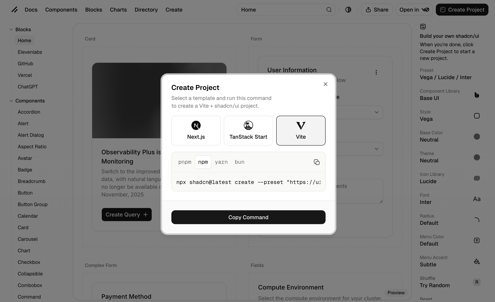
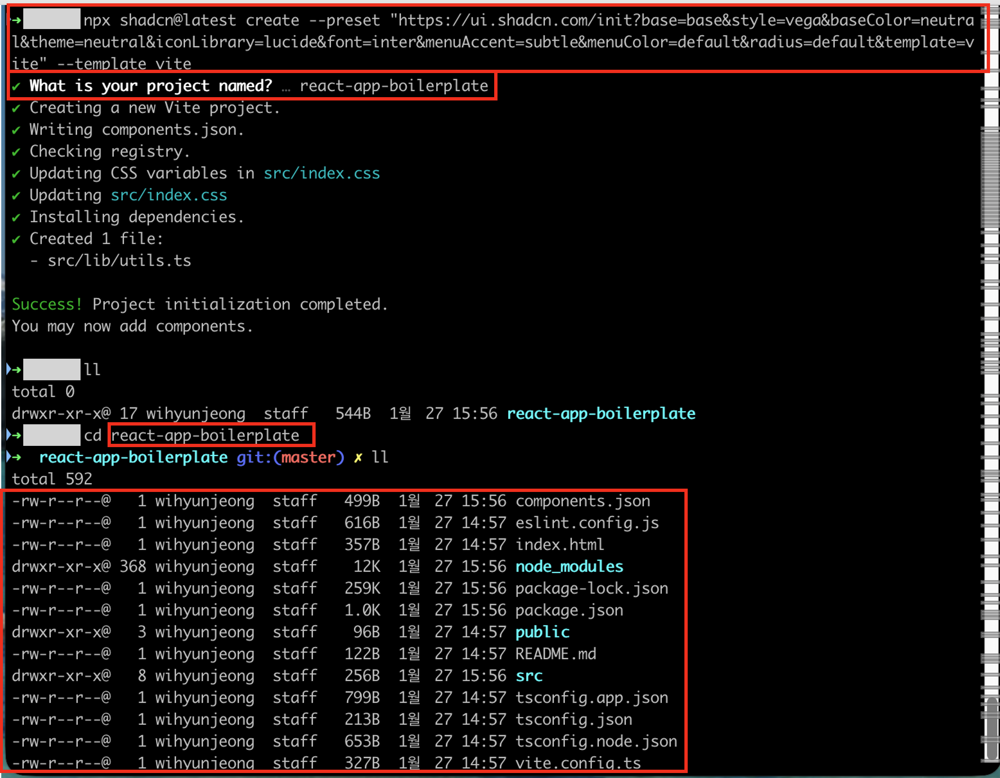
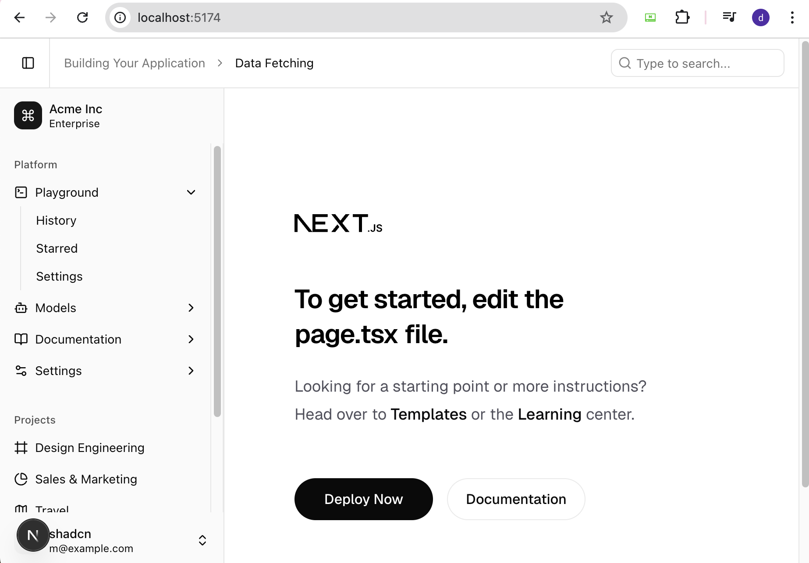
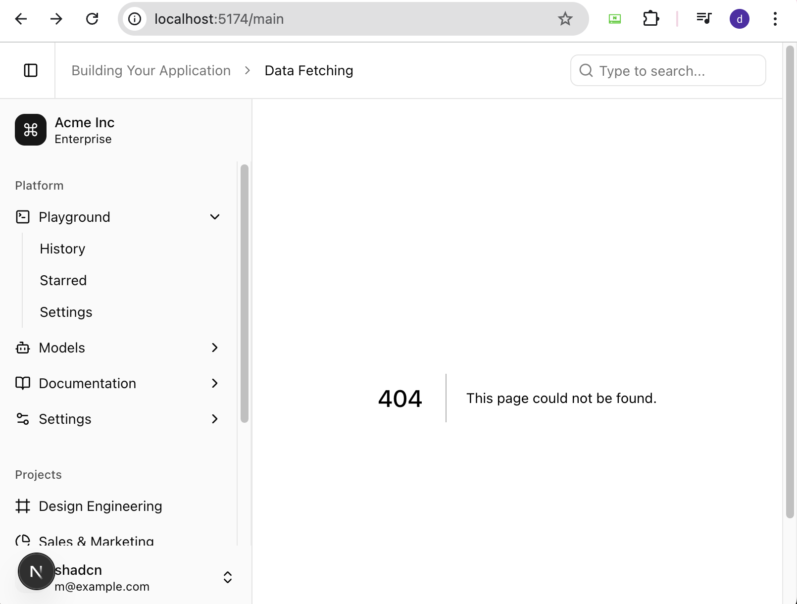

# react-app-boilerplate 세팅과정정리

- react-app-boilerplate 프로젝트 셋팅과정을 정리합니다.


## React 프로젝트 (shadcn)생성하기
- 앱 최초 셋팅시작은 [Shadcn UI 사이트의 create 페이지](https://ui.shadcn.com/create)에서 시작합니다.
- 이 페이지에서 원하는 프로젝트 템플릿을 선택하고 셋팅을 시작합니다.
- 셋팅 과정은 다음과 같습니다.
  - preset : Vega / Lucide / Inter
  - Component Library : Base UI
  - Style : Vega
  - 나머지는 모두 기본 세팅값으로 두고 최종 **Create Project** 버튼을 클릭합니다.
- Create Project 팝업창에서 **Vite**를 선택하고 `npm` 명령어로 프로젝트 생성 값을 복사합니다.
  
- 작업하려고 하는 폴더 위치로 이동하여 복사한 명령어를 실행하여 다음과 같이 프로젝트를 생성합니다.
  - 생성과정에 **프로젝트 명(react-app-boilerplate)** 을 입력하고 최종 생성된 프로젝트 폴더로 이동하면 프로젝트 파일들이 생성되어 있습니다.
  


## Git 연결하기
---

- 생성한 프로젝트를 Git 저장소에 연결합니다. 저장소는 `http://211.208.101.192:4043/2026react/react-app-boilerplate.git` 입니다.
  - 연결 명령어
  ```sh
  git init # 초기화
  git add . # 스테이징
  git commit -m "initial commit" # 커밋
  git branch -M main # 브랜치 명 변경
  git remote add origin http://211.208.101.192:4043/2026react/react-app-boilerplate.git # 저장소 연결
  git push -u origin main # 푸시
  ```
  - 연결 과정에 Git push 버퍼가 작아 push가 안되는 상황이 생겨서 버퍼를 늘려주고 push 했습니다.
  ```sh
  # 버퍼 524MB로 설정
  git config --global http.postBuffer 524288000
  # 재시도
  git push origin main
  ```


## 로컬 서버 띄우기
---
- 최종 설치 완료된 프로젝트를 띄우기 위해 `npm run dev`명령어를 실행하여 로컬 서버를 띄웁니다. 
  - **port**를 변경하려면 `package.json`파일에서 포트 설정을 합니다.
  ```json
  {
    "scripts": {
      "dev": "vite --port 5175",
      // ...
    },
  }
  ```
  - 또는 **cross-env** 패키지를 사용하여 포트 설정, 다음 명령어로 설치 후 `package.json` 파일에 설정합니다.
  ```sh
  # cross-env 설치
  npm install -D cross-env
  ```
  ```json
  {
    "scripts": {
      "dev": "cross-env PORT=5175 vite",
      // ...
    },
  }
  ```
  ```ts
  // vite.config.ts 파일에서 port 설정을 합니다.
  server: {
    port: Number(process.env.PORT) || 5173,
  },
  ```
  


## VSCode(Visual Studio Code) 설정
---

### settings.json 셋팅 (VSCode 설정)

<span class="react-color">Frontend (React)</span> 개발을 위해 **VSCode**를 활용할 것입니다. 따라서 개발자의 통일된 코드 작성을 위하여 **VSCode**의 환경설정을 **settings.json**파일에 적용합니다.

#### settings.json 설정

> - **settings.json 파일열기** : f1 ⤍ settings 입력 ⤍ Preferences: Open Workspace Settings (JSON) 클릭.  
>   위와같이 열면 프로젝트 루트에 **.vscode** 디렉토리가 생성되고 **settings.json**파일이 생성됩니다.
> - **settings(설정)가 적용되는 우선 순위** : .vscode settings.json ⤇ settings.json ⤇ defaultSetting.json(<span class="text-color-red">수정하지 않는 파일.</span>)  
>   <span class="text-color-red">defaultSetting.json은 모든 설정내용이 다 들어있는 기본 설정 파일입니다. 수정은 하지 않는 파일입니다.</span>
> - **.vscode** 디렉토리에 생성된 **settings.json** 파일에 아래 내용 입력합니다.

```json
{
  "editor.formatOnSave": true,
  "editor.codeActionsOnSave": {
    "source.fixAll.eslint": "explicit"
  },
  "editor.tabSize": 2,
  "editor.detectIndentation": false,
  "editor.insertSpaces": false,
  "editor.renderWhitespace": "all",
  "editor.comments.insertSpace": false,
  "files.associations": {
    "*.json": "jsonc"
  },
  "eslint.validate": [
    "javascript",
    "javascriptreact",
    "typescript",
    "typescriptreact"
  ],
  "eslint.workingDirectories": [{ "mode": "auto" }],
  "editor.defaultFormatter": "esbenp.prettier-vscode",
  "eslint.useFlatConfig": true,
  "css.lint.unknownAtRules": "ignore",
  "scss.lint.unknownAtRules": "ignore",
  "less.lint.unknownAtRules": "ignore"
}
```

:star: 이렇게 `settings.json` 파일로 **VSCode** 설정을 하면 **메뉴(File ⤍ Preferences ⤍ Settings)** 로 설정한것 보다 우선순위가 높게 적용됩니다.

:::info 설명
- **"editor.formatOnSave"** : 파일 저장 시 자동으로 코드 서식을 정리합니다.
- **"editor.codeActionsOnSave" ⤍ "source.fixAll.eslint"** : 파일 저장 시 ESLint가 감지한 모든 문제를 자동으로 수정합니다.
- **"editor.tabSize"** : 탭 크기를 몇칸으로 설정할지 지정합니다.
- **"editor.detectIndentation"** : VSCode가 파일의 들여쓰기를 자동으로 감지하는 기능을 활용할지 여부 입니다.
- **"editor.insertSpaces"** : 탭 키를 누를 때 공백 대신 탭 문자를 삽입합니다.
- **"editor.renderWhitespace"** : 공백 문자를 시각적으로 표시합니다.
- **"editor.comments.insertSpace"** : 주석 기호(//, /\*) 뒤에 자동으로 공백을 삽입할지 여부 입니다.
- **"files.associations" ⤍ "\*.json": "jsonc"** : .json 파일을 jsonc(주석이 있는 JSON) 형식으로 인식하도록 설정합니다.
- **"eslint.validate": \["javascript", "javascriptreact", "typescript", "typescriptreact"\]** : ESLint가 TypeScript, React, JavaScript 파일을 검사하도록 설정합니다.
- **"eslint.workingDirectories"** : \[\{"mode":"auto"\}\] : ESLint 작업 디렉토리를 자동으로 감지하도록 설정합니다.
- **"editor.defaultFormatter": "esbenp.prettier-vscode"** : VSCode의 기본 코드 포맷터로 Prettier를 사용합니다.
- **"eslint.useFlatConfig"** : ESLint의 설정방식이 `v8.21.0` 부터 **Flat Config**를 지원하면서, 구성 형식을 **Flat Config**으로 할지 여부 설정.

- **"css.lint.unknownAtRules": "ignore"** : VSCode에서 CSS의 "Unknown At Rules" 경고를 무시하도록 설정.
- **"scss.lint.unknownAtRules": "ignore"** : VSCode에서 scss의 "Unknown At Rules" 경고를 무시하도록 설정.
- **"less.lint.unknownAtRules": "ignore"** : VSCode에서 less의 "Unknown At Rules" 경고를 무시하도록 설정.
:::

:::tip <span class="admonition-title">Tailwind CSS</span>사용 시 다음 설정 적용.
* **Tailwind CSS**의 @apply, @layer 등으로 인한 경고라면 위 설정(**css.lint.unknownAtRules : "ignore"**)으로 해결됩니다. 그리고 **Tailwind CSS IntelliSense** VSCode 확장(Extensions)을 설치하면 더 나은 지원을 받을 수 있습니다.
:::

:::tip <span class="admonition-title">ESLint</span> 설정방식에 대하여

- **ESLint**가 `v8.21.0` 부터 새로운 구성방식인 플랫 구성(Flat Config) 시스템을 지원합니다. 기존 방식은 `.eslintrc` 파일을 이용한 구성 방식이었습니다.
- `v9.0.0`부터는 기본 구성방식이 플랫 구성(Flat Config) 시스템으로 바뀌게 됩니다.
:::


## ESLint 설정
---

**ESLint**는 **JavaScript/TypeScript** 코드에서 **문법적 오류, 스타일 규칙, 버그 가능성** 등을 찾아내는 **정적 코드 분석 도구** 입니다. 코드의 품질 유지와 스타일의 일관성을 위하여 사용됩니다.
* 현재 **react**프로젝트 에서는 **ESLint**가 기본 설치 되고, 프로젝트 루트에 `eslint.config.js`파일이 생성되어 있습니다.

:::tip <span class="admonition-title">ESLint</span> 설정방식의 변경!
- **ESLint v8.21.0**부터 소개된 새로운 구성 형식으로 `eslint.config.js` 파일을 사용할 수 있습니다.
- 기존에는 **.eslintrc** 파일을 사용하는 형식이었습니다.
:::

:::tip <span class="admonition-title">ESLint 플랫 구성(Flat Config)</span> 시스템에 대하여
- **ESLint**의 플랫 구성(Flat Config) 시스템은 ESLint v8.21.0부터 도입되고 v9.0.0에서 완전히 기본이 될 새로운 구성 방식입니다. 이 시스템은 기존의 구성 방식에 비해 여러 가지 개선점을 제공합니다.

- **플랫 구성의 주요 특징**

  1. **표준 JavaScript 모듈 사용**

  - ESM(ECMAScript 모듈) 형식을 사용
  - eslint.config.js 파일에 배열로 구성 내보내기
  - 객체 확장 대신 배열 연결 사용

  2. **간소화된 구성 구조**

  - 계층적인 특수 키워드(extends, overrides 등) 제거
  - 플러그인 직접 가져오기(import)
  - 단순한 배열 기반 병합 메커니즘

  3. **명확한 파일 매칭**

  - 글로브 패턴 기반 파일 매칭(files, ignores 속성)
  - 기본 무시 패턴의 명시적 제어 가능

  4. **향상된 성능**

  - 더 효율적인 구성 로딩 및 캐싱
  - 더 빠른 규칙 확인

- **주요 변경 사항**

  1. **플러그인 처리 방식**  
     기존: 문자열로 참조 (plugins: ['react'])  
     플랫: 직접 가져와서 사용 (import reactPlugin from 'eslint-plugin-react')
  2. **확장 방식**  
     기존: extends 속성으로 상속  
     플랫: 배열에 직접 추가 또는 스프레드 연산자 사용
  3. **파일별 설정**  
     기존: overrides 배열 안에 설정  
     플랫: 배열의 각 항목에 files 속성 추가
  4. **언어 옵션**  
      기존: parserOptions, env 등으로 설정  
      플랫: languageOptions 객체 내에서 통합 관리  
:::

- **package.json** 파일에 lint `scripts`를 추가합니다.

  ```json
  "lint": "eslint . --ext .js,.jsx,.ts,.tsx",
  "lint:fix": "eslint . --ext .js,.jsx,.ts,.tsx --fix",
  ```

  -> `npm run lint`을 실행하면 현재 eslint로 체크한 오류 결과를 표시해줍니다.

- **ESLint**의 추가 **rules**를 각 프로젝트 상황에 맞게 설정해봅니다.  
  ⤍ 여러가지 추가 **rules**는 [ESLint Rules Reference](https://eslint.org/docs/latest/rules/) 와 [typescript-eslint rules](https://typescript-eslint.io/rules/) 에서 참조할 수 있습니다.  
  ⤍ 현재 프로젝트에서는 아래와 같이 `eslint.config.js`설정 파일에 **rules**옵션에 추가 하였습니다.

  ```javascript
  //.....
  rules: {
    "@typescript-eslint/no-explicit-any": "off",
    "jsx-quotes": ["error", "prefer-double"],
    semi: ['error', 'always'],
  },
  //.....
  ```

  :::info 설명
  - "@typescript-eslint/no-explicit-any" ⤍ "off" : typescript의 any 타입을 허용합니다.
  - "jsx-quotes" ⤍ \["error", "prefer-double"\] : jsx코드에는 double quotes를 사용하게 적용합니다.
  - semi ⤍ \['error', 'always'\] : 소스코드 문장 마지막에 항상 세미콜론을 사용합니다.
  :::

  - 최근 사용한 rules
  ```js
  {
    // 커스텀 규칙 추가
    rules: {
      '@typescript-eslint/no-explicit-any': 'off',
      'jsx-quotes': ['error', 'prefer-double'],
      semi: ['error', 'always'],
      '@typescript-eslint/no-empty-object-type': 'off',
      'react/jsx-max-props-per-line': ['error', { maximum: 1 }],
      'react-hooks/exhaustive-deps': 'off',
      'react-hooks/incompatible-library': 'off',
      // "no-unused-vars": "warn", 옵션은 사용되지 않는 변수에 대해 eslint가 경고를 표시하도록 설정합니다.
      // TypeScript를 사용할 때는 "@typescript-eslint/no-unused-vars"를 대신 사용하는 것이 더 좋습니다.
      //"no-unused-vars": "warn",
      '@typescript-eslint/no-unused-vars': 'warn', 
      'react-hooks/set-state-in-effect': 'off',
      'react/no-unescaped-entities': 'off',
      "import/no-anonymous-default-export": ["warn", { // export default 할 때 익명 사용 금지 (new 함수만 허용함)
        "allowArray": false,
        "allowArrowFunction": false,
        "allowAnonymousClass": false,
        "allowAnonymousFunction": false,
        "allowCallExpression": true, // The true value here is for backward compatibility
        "allowNew": true,
        "allowLiteral": false,
        "allowObject": false
      }],
      //'no-restricted-imports': ['error', {
      //	patterns: [
      //		'@/app/(domains)/*/_*', // 다른 도메인의 private 폴더 접근 금지
      //	],
      //}],
    },
  },
  ```

  :::tip react프로젝트에서 Next.js 프로젝트로 마이그레이션 과정 팁
  * `nextVitals`와 `nextTs`에 이미 `eslint-plugin-react`가 포함되어 있으므로, React 관련 규칙은 별도 설치 없이 바로 사용 가능합니다! 따라서 다음 내용은 **Next.js** 프로젝트에서는 필요없습니다.
  * `react/*`로 시작하는 **React Rules**를 적용하기 위해서는 `eslint-plugin-react` 패키지를 설치해야합니다.

    ```sh
    npm i -D eslint-plugin-react
    ```

    ⤍ `eslint.config.js`에 불러와 플러그인으로 세팅합니다.

    ```JavaScript
    import react from "eslint-plugin-react";

    // ...
    plugins: {
      react: react,
    },
    // ...
    ```

    ⤍ 이제 **React Rules**를 적용합니다.

    ```javascript
    //.....
    rules: {
      "react/jsx-max-props-per-line": ["error", { maximum: 1 }],
    },
    //.....
    ```

    * **설명** : "react/jsx-max-props-per-line" ⤍ \["error", \{ maximum: 1 \}\] : jsx 엘리먼트의 속성이 하나일 때만 한 줄로 표시합니다.

  :::


## Prettier 설정
---
:::tip <span class="admonition-title">Prettier</span> 참조 내용
* **Prettier**는 작성된 JS 코드의 스타일을 중점적으로 수정해주는 코드 스타일링 도구입니다.
* **ESLint**와 차이점
  * **ESLint**는 Formatting, Code Quality등 코드의 전반적인 에러 방지 및 수준을 높여주는 역할을 하고, **Prettier**는 코드의 스타일링에 특화 되어 있어, Formatter 역할 만 합니다.
* 사용이유
  * 개발자 마다 다른 코드 스타일을 가지고 협업을 진행할 경우, 코드의 일관성이 떨어지고 유지보수 측면에도 좋지 않은 결과를 초래하므로 작성된 코드의 일관성을 지정하기 위함입니다.
:::
:::warning 주의할 점
* **ESLint**에도 Formatting 기능이 있기 때문에 ESLint와 함께 사용하게 되면 상호 간의 충돌이 발생하는 경우가 있습니다. 그래서 **Prettier**와 함께 **ESLint**를 사용할 때는 ESLint의 Formatting Rule을 전부 Disabled 처리 합니다.
* 아래 두가지 라이브러리를 설치하여 적용 해 줍니다.
  * `eslint-config-prettier`는 Prettier와 충돌 가능성이 있는 옵션을 전부 Off 해줍니다.
  * `eslint-plugin-prettier`는 eslintrc의 plugins에 포함하고 rules에 prettier/prettier를 설정할 수 있습니다.(<span class="text-color-red">현재 프로젝트에서는 사용하지 않습니다.</span>)
:::

* 필요한 패키지를 설치합니다.
```sh
npm install -D prettier eslint-config-prettier
```
* **Prettier** 설정 파일인 `.prettierrc`, `.prettierrc.cjs`, `prettier.config.js` 파일과 같이 여러가지 형식의 설정파일을 생성하여 사용할 수 있습니다.
* 파일을 프로젝트 루트에 생성하고 다음과 같이 **설정** 및 **rules** 옵션을 작성합니다.

:::info <span class="admonition-title">.prettierrc 설정 파일 관련</span> [<span class="admonition-title">https://prettier.io/docs/configuration</span>](https://prettier.io/docs/configuration)
* .prettierrc 파일은 `.prettierrc`, `.prettierrc.cjs`, `prettier.config.js` 등과 같이 여러가지 파일 형식으로 생성할 수 있습니다.
  * `.prettierrc` : 순수 **json** 형태로 단순하게 값을 설정하는 방식.
  * `.prettierrc.cjs` : JavaScript 형식으로 디테일하게 설정하기위한 방식.
  * `prettier.config.js` : JavaScript 형식으로 설정할 수 있는 방식.
* **prettier** 의 다양한 옵션은 [https://prettier.io/docs/options](https://prettier.io/docs/options) 에서 참조합니다.
:::
```javascript
const prettierOptions = {
  /**
   * @template: printWidth: <int>
   * @description: 코드 한줄의 개수
   * 추천) 가독성을 위해 80자 이상을 사용하지 않는 것이 좋습니다.
   * 추천) 코드 스타일 가이드에서 최대 줄 길이 규칙은 종종 100 또는 120으로 설정됩니다.
   */
  printWidth: 120,

  /**
   * @template: tabWidth: <int>
   * @description: 들여쓰기 너비 수(탭을 사용할 경우 몇칸을 띄워줄지)
   */
  tabWidth: 2,

  /**
   * @template: useTabs: <bool>
   * @description: 탭 사용 여부 (미사용 시 스페이스바로 간격조정을 해야함.)
   */
  useTabs: true,

  /**
   * @template: semi: <bool>
   * @description: 명령문의 끝에 세미콜론(;)을 인쇄합니다.
   * true: (;)를 추가함
   * false: (;)를 지움
   */
  semi: true,

  /**
   * @template: singleQuote: <bool>
   * @description: 큰따옴표("") 대신 작은따옴표('')를 사용여부
   * true: 홀따옴표로 사용
   * false: 큰따옴표로 사용
   */
  singleQuote: true,

  /**
   * @template: jsxSingleQuote: <bool>
   * @description: JSX내에서 큰따옴표("") 대신 작은따옴표('')를 사용여부
   * true: 홀따옴표로 사용
   * false: 큰따옴표로 사용
   */
  jsxSingleQuote: false,

  /**
   * @template: trailingComma: "<es5|none|all>"
   * @description: 객체나 배열을 작성하여 데이터를 넣을때, 마지막에 후행쉼표를 넣을지 여부
   * es5: 후행쉼표 제외
   * none: 후행쉼표 없음
   * all: 후행쉼표 포함
   */
  trailingComma: "all",

  /**
   * @template: jsxBracketSameLine: <bool> [Deprecated](대신 bracketSameLine 사용)
   * @description: ">" 다음 줄에 혼자 있는 대신 여러 줄 JSX 요소를 마지막 줄 끝에 넣습니다
   * true: 줄넘김하지 않음
   * false: 줄넘김을 수행
   */
  //jsxBracketSameLine: false,
  bracketSameLine: false,

  /**
   * @template: bracketSpacing: <bool>
   * @description: 개체 리터럴에서 대괄호 사이의 공백을 넣을지 여부
   * true: 공백을 넣음 { foo: bar }
   * false: 공백을 제외 {foo: bar}
   */
  bracketSpacing: true,
  /**
   * @template: singleAttributePerLine: <bool>
   * @description: HTML, Vue 및 JSX에서 한 줄에 하나의 속성을 적용할지 여
   * true: 속성이 한개 이상일경우 multi속성 적용
   * false: 적용하지 않음
   */
  singleAttributePerLine: true,
  endOfLine: "auto",
};

export default prettierOptions;
```

* **VSCode** 설정 추가
  * 기본 포멧터를 Prettier로 하고, 저장 시 포멧을 적용한다는 의미 입니다.
  * 이미 적용 되어 있다면 건너뜁니다.
  ```javascript
  "editor.defaultFormatter": "esbenp.prettier-vscode",
  "editor.formatOnSave": true
  ```
  * 이와같이 작성하면 파일 수정 후 저장 시 Prettier형식에 맞게 포멧팅이 자동 변경되어 저장 됩니다.  
만약 저장 시 포맷 자동 적용을 빼고 싶다면 `editor.formatOnSave: false` 로 적용하면 됩니다. 대신 파일 저장 시 자동 포멧팅이 되지 않으므로 직접 일일이 수정 해주어야 합니다.  
이 부분은 프로젝트 상황에 따라 자동 저장을 할것인지, 아닌지 정하여 설정합니다.

* **package.json**에 Prettier 스트립트를 추가합니다.
  * 이미 적용 되어 있다면 건너뜁니다.
  * `package.json`파일의 `scripts` 섹션에 다음과 같이 추가 합니다.
  * Prettier 포멧을 체크하고, 적용하는 스크립트 입니다.
  ```javascript
  "format": "prettier --check ./src",
  "format:fix": "prettier --write ./src"
  ```

* `.prettierignore`(선택사항) 파일을 프로젝트 루트 위치에 생성합니다.
  * `.prettierignore` 파일은 포맷팅을 적용하지 않을 파일이나 디렉토리를 지정하는 파일입니다. 상황에 따라 내용을 추가 할 수 있습니다.
  ```sh
  node_modules
  dist
  build
  ```
  * 참조 문서 : [https://prettier.io/docs/ignore#ignoring-files-prettierignore](https://prettier.io/docs/ignore#ignoring-files-prettierignore)

* **Prettier** 포멧 체크 해보기
  ```sh
  npm run format
  ```
  * 실행하면 아래와 같이 Pretter 설정 포멧에 어긋나는 파일 리스트를 확인할 수 있습니다.
  ```sh
  Checking formatting...
  [warn] jsxBracketSameLine is deprecated.
  [warn] src/App.css
  [warn] src/App.tsx
  [warn] src/index.css
  [warn] src/main.tsx
  [warn] Code style issues found in 4 files. Run Prettier with --write to fix. 
  ```
* **Prettier** 포멧 적용하기
  ```sh
  npm run format:fix
  ```
  * 실행하면 아래와 같이 Prettier 설정 포멧에 맞게 적용 되었다는 리스트가 나옵니다.
  ```sh
  [warn] jsxBracketSameLine is deprecated.
  src/App.css 29ms
  src/App.tsx 51ms
  src/index.css 6ms
  src/main.tsx 4ms
  src/vite-env.d.ts 3ms (unchanged)
  ```
:::danger ESLint와 Prettier 설정의 충돌
* **ESLint**와 **Prettier**는 모두 포멧팅 룰이 있어서 서로 겹치는 설정 값이 있습니다.  이것을 각각 옵션을 따로 설정 하다 보면 충돌이 발생하는 경우가 있습니다. 이럴때는 같은 기능을 하는 옵션을 서로 같은 결과가 나오게 수정해 주어야 합니다.
* 예를 들어 ESLint의 `semi`값은 `'never'`이고, Prettier의 `semi`값은 `true`라고 설정하면 서로 충돌이 발생합니다.
:::


:::tip <span class="admonition-title">[MODULE_TYPELESS_PACKAGE_JSON] Warning</span> 경고
* **Next.js** 프로젝트 셋팅중 모듈 타입이 명확하지 않다는 경고가 발생할 수 있습니다. 그럴경우 `package.json`파일에 **type : 'module'** 옵션을 추가해줍니다. 이것은 Node.js가 ES Module 문법 관련하여 혼란스러워하는 상황이므로 명확하게 설정 해주는것입니다.
:::


## VSCode에 `ESLint`,`Prettier` Extensions 설치
---
* VSCode 코드편집기 자체에서 ESLint, Prettier를 사용하고 적용할 수 있는 EXtensions가 있습니다. 이것을 설치하면 VSCode에서 파일 수정 후 저장 시 코드 포멧팅이 적용 됩니다.
* VSCode Extensions 설치 방법은 [여기(아직링크없음)](./first-set-proj.md)를 참조합니다.
  * **ESLint**
  * **Prettier - Code formatter**
  
* 이미 **VSCode**의 `settings.json`파일에 아래 내용이 적용 되어 있기 때문에, 파일 수정, 저장 시 자동으로 ESLint, Pretter 가 작동 됩니다.
```javascript
 "editor.formatOnSave" : true,
  "editor.codeActionsOnSave": {
    "source.fixAll.eslint": "explicit",
  },
  "eslint.validate": ["javascript", "javascriptreact", "typescript", "typescriptreact"],
  "editor.defaultFormatter": "esbenp.prettier-vscode",
  "eslint.useFlatConfig": true
```


## @types폴더 사용법 (Typescript 관련) (<span class="text-color-red">현재 사용하지 않음</span>)
---
* 프로젝트 루트에 **@types**폴더를 생성한다. 폴더 내부에는 기본 **index.d.ts**파일을 생성합니다.
* **index.d.ts**파일의 용도는 전체 **App**의 전역 type을 설정하는 용도의 파일입니다. 나중에 전역 컴포넌트, 전역함수를 만들고 타입을 설정할때 **index.d.ts**파일에 전역 타입 설정을 하게 됩니다.
* 그 외 써드파티 라이브러리 중 **@types/...** 가 제공되지 않는 경우에 **@types**폴더 안에 해당 라이브러리 ***.d.ts**파일을 선언해주는 용도로 사용하면 됩니다.
* 만약 **prismjs** 라이브러리의 ***.d.ts**파일을 선언한다고 가정했을 때 아래와 같이 생성하여 만들어 줍니다.
```sh
// 'prismjs'라는 라이브러리 types를 선언한 예시
...
@types
  ├─ index.d.ts
  ├─ prismjs.d.ts  // prismjs.d.ts파일을 생성한다.
...
```
* prismjs.d.ts파일의 소스 예제
```ts
declare module 'prismjs';
```
:::tip <span class="admonition-title">tsconfig.json</span> 설정
* tsconfig.json에는 **typeRoots**를 아래와 같이 설정합니다.
```js
"compilerOptions": {
  // ...
  // highlight-start
  "typeRoots": ["./node_modules/@types", "./@types"] // type 루트 설정
  // highlight-end
  // ...
},
"include": [
  "next-env.d.ts",
  "**/*.ts",
  "**/*.tsx",
  ".next/types/**/*.ts",
  ".next/dev/types/**/*.ts",
  "**/*.mts",
  // highlight-start
  "@types/**/*.d.ts" // 컴파일 할 파일 경로
  // highlight-end
],
```
* 내가 만든 `@types` 타입 루트를 인식하기 위해 tsconfig.json의 **typeRoots**옵션에 설정해줘야 합니다.
* './node_modules/@types'는 원래 기본 타입루트이며, 내가 설정한 새로운 타입루트가 설정되면 명시적으로 함께 넣어줘야 합니다.
:::
:::tip <span class="admonition-title">Next.js 프로젝트 typeRoots 설정 시 baseUrl</span>설정 관련
* **baseUrl** 생략 가능: 최신 Next.js는 자동으로 처리하므로 생략해도 무방
* 명시적 선호: IDE 자동완성이 더 잘 작동하길 원한다면 "baseUrl": "."를 추가
* 일관성 유지: 프로젝트 생성 시 자동으로 설정된 구조를 그대로 사용하는 것이 가장 안전

결론: tsconfig.json (또는 jsconfig.json)에 paths만 설정하면 충분하며, baseUrl은 선택사항입니다.
:::


## @types폴더 사용하지 않고 src/vite-env.d.ts 파일 사용
---
* @types폴더 사용하지 않고 src/vite-env.d.ts 파일 사용하는 방법으로 적용하였습니다.
* 이 방식이 표준 방식입니다.
* src/vite-env.d.ts 파일 생성
```sh
src
├── vite-env.d.ts
```
* src/vite-env.d.ts 파일 내용
```ts
/// <reference types="vite/client" />
//import type { IRouter } from '@/app/types/router';
//import type { IUtils } from '@/app/types/common';
//import type { IUI } from '@/app/types/components';

export {};

declare global {
	interface Window {
		//$router: IRouter;
		//$util: IUtils;
		//$ui: IUI;
	}

	//const $router: IRouter;
	//const $util: IUtils;
	//const $ui: IUI;
}
```


## cross-env 사용 (필요한 경우에만 사용)
---
:::tip <span class="admonition-title">cross-env</span> 란?
* cross-env 모듈은 프로젝트 참여자 각각이 MacOS, Windows, Linux 등 다양한 OS 마다 환경변수를 설정하는 방법이 다르기 때문에 이것에 대한 대책을 마련한 모듈입니다.  
그래서 **corss-env** 패키지를 사용하면 동적으로 `process.env`(환경 변수)를 변경할 수 있으며 모든 운영체제에서 동일한 방법으로 환경 변수를 변경할 수 있게 됩니다.
:::
* **OS**상관없이 동일하게 커맨드 명령어로 환경설정을 할 수 있습니다.(필요한 경우에만 사용)
* `npm install -D cross-env` 설치 후 아래와 같이 사용.
```js
cross-env NODE_ENV=production ... ...
```
* package.json `scripts`에 작성 예시
```js
{
  "scripts": {
    ...
    "serve": "cross-env NODE_ENV=development node server",
    ...
  }
}
```


## src 폴더 '@'별칭 만들기
---
* 최초 설치 시 이미 설정했다면 다음 과정은 하지 않아도됩니다.
* 코드 작성 시 좀 더 편의를 제공하기 위해 **src**폴더의 위치를 **'@'** 별칭으로 만들어 사용할 수 있습니다.
* **tsconfig.json** **'@'** 별칭 세팅 (TypeScript용 별칭)
```json
// tsconfig.json 파일의 baseUrl옵션과 paths옵션을 설정 한다.
{
  "compilerOptions": {
    "baseUrl": ".",
    "paths": {
      "@/*": ["./src/*"]
    }
  }
}
```
* **vite.config.ts** @ 별칭 세팅 (번들링 시 사용되는 별칭)
* 최초 설치 시 이미 설정했다면 다음 과정은 하지 않아도됩니다.
  - **fileURLToPath**와 **URL**을 사용하기 위해 먼저 `@types/node`를 설치 하고 아래 코드를 작성합니다.
  ```sh
  npm i -D @types/node
  ```
  ```ts
  import { fileURLToPath, URL } from 'node:url';

  // vite.config.ts 파일의 alias옵션을 설정한다.
  export default definConfig({
    resolve: {
      alias: {
        '@': fileURLToPath(new URL('./src', import.meta.url)),
      }
    }
  });
  ```


## TailwindCSS + shadcn/ui 설정
---
* TailwindCSS 란?
  * Utility-first CSS 프레임워크로, 미리 정의된 작은 CSS 클래스들을 조합하여 스타일링합니다.
* Utility-first CSS 프레임워크 의 의미는?
  * Utility-first CSS 프레임워크는 미리 정의된 작은 단위의 유틸리티 클래스들을 조합하여 스타일을 구성하는 방식을 의미합니다.
  * 핵심 개념
    * 전통적인 CSS 프레임워크(예: Bootstrap)는 .btn, .card, .navbar 같은 완성된 컴포넌트 클래스를 제공합니다. 반면 Utility-first 방식(예: Tailwind CSS)은 m-4 (margin), text-lg (폰트 크기), bg-blue-500 (배경색) 같은 원자적 단위의 클래스를 제공합니다.
:::info <span class="admonition-title">TailwindCSS + Shadcn/ui</span>의 장점 요약
| 장점        | 설명                        |
| :--------- | :------------------------- |
| 개발 속도    | 빠른 UI 개발, 코드 작성 최소화   |
| 번들 크기    | 사용하지 않는 스타일 자동 제거     | 
| 유지보수     | 컴포넌트 코드 직접 소유, 쉬운 수정 | 
| 접근성      | Radix UI 기반으로 WCAG 표준 준수 | 
| TypeScript | 완벽한 타입 안정성             | 
| 커뮤니티     | 빠르게 성장하는 커뮤니티         | 
| 자유도      | 완전한 커스터마이징 가능         |
:::

### TailwindCSS 설치
* **react-app-boilerplate** 프로젝트는 최초 설치 시 이미 **TailwindCSS**가 설치 되어있습니다. 따라서 별도의 설정이 필요없습니다.


### shadcn/ui 설치
  ```sh
  npx shadcn@latest init

  # 각자의 취향것 고릅니다.
  Which color would you like to use as base color? › Neutral
  # 이 후 작업은 자동으로 설치됨.
  ✔ Writing components.json.
  ✔ Checking registry.
  ✔ Updating CSS variables in src\app\globals.css
  ✔ Installing dependencies.
  ```
  * **react-app-boilerplate** 프로젝트는 최초 설치 시 이미 **Shadcn/ui**가 설치 되어있습니다. 따라서 위와같이 최초 프로젝트 설치 과정은 하지 않아도 됩니다.
  
  :::info <span class="admonition-title">src/index.css 대신 app.css</span> 파일을 프로젝트 루트 스타일 파일로 수정
  * 현재 프로젝트는 기본으로 `src/index.css` 파일이 기본 루트 스타일파일로 생성됩니다. 이것을 **app.css** 파일로 수정하여 `/src/assets/styles/app.css` 위치에 `app.css` 파일을 생성하고 `src/index.css`에 있는 내용을 모두 옮깁니다. `src/index.css`파일은 이제 삭제해도 됩니다.
  :::
* **shadcn** 설치 후 루트에 생성된 `components.json` 설정파일을 수정합니다.
  - **shadcn** 컴포넌트를 관리 할 폴더를 재정의 해서 원하는 폴더 위치로 세팅합니다. **react-app-boilerplate** 프로젝트에서는 다음과 같은 위치로 **shadcn** 경로를 `components.json`파일에서 변경하였습니다.
    ```js
    {
      "$schema": "https://ui.shadcn.com/schema.json",
      "style": "base-vega",
      "rsc": false, // react server component로 사용 가능하게 생성할지 여부 (현재 프로젝트는 CSR이므로 false로 변경)
      "tsx": true,
      "tailwind": {
        "config": "",
        // highlight-start
        "css": "src/assets/styles/app.css",
        // highlight-end
        "baseColor": "neutral",
        "cssVariables": true,
        "prefix": ""
      },
      "iconLibrary": "lucide",
      "aliases": {
        // highlight-start
        "components": "@/core/components/shadcn",
        "utils": "@/core/components/shadcn/lib/utils",
        "ui": "@/core/components/shadcn/ui",
        "lib": "@/core/components/shadcn/lib",
        "hooks": "@/core/components/shadcn/hooks"
        // highlight-end
      },
      "menuColor": "default",
      "menuAccent": "subtle",
      "registries": {}
    }
    ```
* 최초 설치 시 **lib**폴더 또한 프로젝트 루트에 생성되어 있을 것입니다. 이 폴더 또한 위 설정 내용과 같이 `src/core/components/shadcn` 폴더 아래쪽으로 옮깁니다.

* **shadcn** 사용
  * **accordion** 컴포넌트를 사용한다고 했을 때 다음 명령어를 실행합니다.
    ```sh
    npx shadcn@latest add accordion
    ```
  * 실행하면 `src/core/components/shadcn/ui/accordion.tsx` 파일이 생성될 것입니다.
  * 생성된 **accordion.tsx**파일을 복사한 컴포넌트를 한 곳에서 관리(퍼블 수정 등)하기 위하여 다음과 같이 따로 컴포넌트를 생성합니다.
    - `src/shared/components/ui`폴더 아래에 복사한 **accordion** 컴포넌트를 만듭니다. 모든 커스텀 컴포넌트는 같은 방법으로 생성하여 관리합니다.
    - 위에서 설치한 **accordion** 컴포넌트를 관리할 accordion폴더를 생성합니다.
    - `src/shared/components/ui/accordion/Accordion.tsx` 파일을 생성하 구현합니다. (실제 개발시 사용되는 컴포넌트)
  * 화면을 사용할 때는 다음과 같이 사용합니다.
    ```tsx
    // highlight-start
    import { Accordion } from '@components/ui'; // 컴포넌트 별칭 사용
    // highlight-end

    interface ISamplePageProps {
      // test?: string;
    }

    export default function SamplePage() {
      return (
        <>
          // highlight-start
          <Accordion>...</Accordion>
          // highlight-end
        </>
      );
    };
    ```

* 현재 프로젝트는 Shadcn 에서 **Create Project**로 설치 했고, UI 컴포넌트를 **Base UI**를 선택하여 설치 했습니다.
:::warning <span class="admonition-title">shadcn/ui </span>사용 시 주의사항 (2025.12.22 기준)
* shadcn/ui를 설치하면 내부적으로 사용하는 UI 라이브러리가 **Radix UI(default)** 또는 **BASE UI** 중 하나를 사용합니다.
  - **Radix UI**는 WorkOS가 Radix를 인수한 후 충분한 투자를 하지 않아 팀이 떠났고, 기술 부채가 쌓였습니다. 따라서 유지보수가 소극적이고 좋지않은 상황임.
  - 따라서 새로운 프로젝트 셋팅 시에는 **BASE UI**를 사용하는 것을 추천합니다.
* `npx shadcn@latest init` 명령어로는 **BASE UI**를 선택하는 옵션이 현재는(2025.12.22) 없습니다. 따라서 `npx shadcn create` 명령어로 설치하는 방법으로 **BASE UI**를 선택하고, 내부적으로 세밀한 설정을 수동으로 설정합니다.
:::


## 현재까지 폴더 구조
---
```sh
# 현재까지의 폴더구조 입니다. react-app-boilerplate에 맞게 구조를 변경할 것입니다.
react-app-boilerplate
├── README.md
├── components.json
├── eslint.config.js
├── index.html
├── node_modules
├── package-lock.json
├── package.json
├── prettier.config.js
├── public
│   ├── logo.ico
│   ├── logo.png
│   └── vite.svg
├── src
│   ├── App.tsx
│   ├── assets
│   ├── core
│   ├── main.tsx
│   └── vite-env.d.ts
├── tsconfig.app.json
├── tsconfig.json
├── tsconfig.node.json
└── vite.config.ts
```
:::info 폴더 구조 <span class="admonition-title">tip</span>

* `node_modules` 폴더는 `npm install` 명령어를 통해서 의존성 라이브러리가 설치 되었을 때 생성됩니다.
* 최근 Vite 버전에서 `vite-env.d.ts`파일이 기본으로 생성되지 않는 이유는 **TypeScript**의 타입 정의 방식이 개선되고 표준화되었기 때문입니다.
  - 최근변경된방식 : `tsconfig.app.json`의 `compilerOptions.types`에 `vite/client` 값이 설정됩니다.
  - 필요하다면 수동으로 프로젝트 루트에 `vite-env.d.ts`파일을 생성하고 다음내용을 추가하면 됩니다.
* 현재 **react-app-boilerplate** 프로젝트는 `vite-env.d.ts`파일을 생성해놓은 상태이며, 예전 `@types`폴더 사용 방식은 사용하지 않습니다.
  ```ts
  /// <reference types="vite/client" />
  //import type { IRouter } from '@/app/types/router';
  //import type { IUtils } from '@/app/types/common';
  //import type { IUI } from '@/app/types/components';

  export {};

  declare global {
    interface Window {
      //$router: IRouter;
      //$util: IUtils;
      //$ui: IUI;
    }
  }
  ```
:::


### react-app-boilerplate 프로젝트 폴더 구조 만들기
* 최초 프로젝트 기본 폴더 구조를 생성하기 위해 필요없는 폴더, 파일들을 삭제하고 가장 기본이 되는 다음과 같은 폴더 구조로 레이아웃을 만듭니다. **src** 폴더 구조만 설명합니다.
* **router, redux** 등 기본으로 필요한 라이브러리는 아래쪽 기본 코드 진행 하면서 설치 합니다.

### src 폴더 구조 (최종 수정 폴더 구조)
```sh
//... 기타 기본 프로젝트 파일들
src
  ├─ App.tsx
  ├─ main.tsx
  ├─ core
  │  ├─ api
  │  ├─ common
  │  ├─ components
  │  ├─ hooks
  │  ├─ router
  │  ├─ store
  │  └─ types
  ├─ assets
  │  ├─ fonts
  │  ├─ images
  │  └─ styles
  │     └─ app.css // APP 루트 스타일 파일
  ├─ shared // 각 업무 domain 개발로 인해 유동적으로 공통관련 코드를 수정해야하는 경우 shared 폴더에서 작성합니다.
  │  ├─ components
  │  ├─ constants
  │  └─ router
  ├─ domains
  │  ├─ main  // main 업무 도메인
  │  │  ├─ api
  │  │  ├─ components
  │  │  ├─ pages
  │  │  ├─ router
  │  │  ├─ store
  │  ├─ example  // example 업무 도메인
  │  │  ├─ api
  │  │  ├─ components
  │  │  ├─ pages
  │  │  ├─ router
  │  │  ├─ store
  │  ├─ // 각 업무 상황에 따라 domain을 추가/삭제 할 수 있음.
//... 기타 기본 프로젝트 파일들
```
* <span class="text-green-bold">core</span>폴더는 Frontend 애플리케이션 전체 공통 관련 파일들이 있습니다. 공통개발자 이 외 업무개발자는 작업하지 않는 공간입니다.
* <span class="text-green-bold">assets</span>폴더는 모든 정적 파일들(font, image, css파일 등)을 모아놓은 폴더입니다.
* <span class="text-green-bold">shared</span>폴더는 각 업무 domain 개발 시 유동적으로 공통관련 코드를 수정해야하는 경우 shared 폴더에서 작성합니다.
* <span class="text-green-bold">domains</span>폴더에는 각 업무별 domain들이 있고, 그 하위에는 일률적으로 <span class="text-blue-normal">api, components, pages, router, store, types</span>폴더를 가질 수 있습니다. 각 개별 폴더는 업무 상황에 따라 생성하여 사용합니다. 사용하지 않는 폴더는 없어도 상관없습니다.  
  - <span class="text-blue-normal">api</span> : REST API URL과 request, response의 type을 정의합니다.
  - <span class="text-blue-normal">components</span> : 업무 화면에서 사용하는 컴포넌트들을 모아놓은 폴더.
  - <span class="text-blue-normal">pages</span> : 해당 도메인의 업무화면 *.tsx파일들.
  - <span class="text-blue-normal">router</span> : 업무화면의 라우터를 작성하는 폴더.
  - <span class="text-blue-normal">store</span> : api를 통하여 화면에 보여줄 데이타를 사용할 swr관련(전역 데이터), 정리를 하는 폴더.
  - <span class="text-blue-normal">types</span> : 해당 업무에서 사용하는 모든 type을 정리하는 폴더.


## Sass 설치
---
* **react-app-boilerplate** 프로젝트는 최초 설치 시 이미 **TailwindCSS**가 설치 되어있습니다.
* 하지만 상황에 따라 Tailwind CSS를 사용하지 않고 Sass, Emotion, CSS Modules 등 원하는 어떤 스타일링 기술을 사용하든 쉽게 적용 가능합니다. 
* 프로젝트에서 `.scss`, `.sass` 파일을 사용하기 위해서 **Sass** npm 패키지를 설치합니다.
  ```sh
  npm i -D sass
  ```
  :::tip <span class="admonition-title">sass 와 sass-embedded</span> 패키지 설명
  * sass
    - Node.js 바인딩으로 작동하는 순수 JavaScript 구현
    - 설치 시 바이너리를 다운로드하지 않음
    - 더 가볍고 설치가 빠름
    - 호환성이 좋고 가장 널리 사용됨
    - 번들 크기가 다소 클 수 있음
  * sass-embedded
    - Dart Sass의 최적화된 버전
    - C++ 바인딩으로 컴파일 성능이 더 빠름
    - 초기 설치 시 플랫폼별 바이너리 다운로드 (용량이 더 큼)
    - 성능이 더 좋지만 설치가 느릴 수 있음
    - 더 최신 기술 스택
  * 선택 기준
    - 성능이 중요한 큰 프로젝트: sass-embedded 추천
    - 빠른 설치, 간단한 프로젝트: sass 추천
    - 대부분의 일반적인 프로젝트: sass면 충분함
  :::
* **react-app-boilerplate** 프로젝트에서는 `sass`를 설치할 것입니다. 설치도 빠르고 성능 차이도 실무에서 체감하기 어렵기 때문입니다.
* **Sass**는 프로젝트 상황에 따라 사용할 수도 있고 사용하지 않아도 상관없습니다. **TailwindCSS + shadcn/ui** 사용으로 `.scss` `.sass`이 아닌. `.css`를 우선 사용할 것입니다.


## Router 설정
---
* **React Router**는 React 애플리케이션에서 페이지 네비게이션 처리와 URL 관리를 처리하는 라이브러리입니다.
* [React Router 공식문서: https://reactrouter.com/home](https://reactrouter.com/home)
:::info <span class="admonition-title">Router 모드</span>에 대하여
* React Router는 3가지 모드를 지원합니다.
  * **Declarative(선언적) 모드** : React Router의 가장 기본적이고 전통적인 방식입니다. `<Routes>`와 `<Route>` 컴포넌트를 사용하며, **UI구조**에 라우팅 로직이 직접 포함됩니다.
    ```tsx
    <BrowserRouter>
      <Routes>
        <Route path="/" element={<Home />} />
        <Route path="/about" element={<About />} />
      </Routes>
    </BrowserRouter>
    ```
  * **Data(데이터 중심) 모드** : 라우트 설정을 배열이나 객체 형태로 따로 정의하고, 데이터 로딩을 분리합니다. `loader`와 `action`함수를 사용하여 라우트 전환에 필요한 데이터를 미리 로드할 수 있습니다.
    ```ts
    // route를 따로 배열로 선언
    const routes = [
      {
        path: "/",
        element: <Home />,
        loader: async () => {
          const data = await fetchHomeData();
          return data;
        }
      }
    ];
    ```
  * **Framework 모드** : React Router를 Next.js나 Remix 같은 풀 스택 프레임워크처럼 사용하는 방식입니다.
:::

### 설치
* **react-app-boilerplate** 에서는 라우터를 **Data 모드** 형식으로 **RouterProvider** 와 **createBrowserRouter, createHashRouter**를 사용할 것입니다.
  ```sh
  npm i react-router
  ```
  :::info
  * **RouterProvider** : 라우터 구성을 애플리케이션에 제공하는 가장 최상위 컴포넌트 입니다.  
   최상위 루트(보통 index.ts 또는 main.ts)에 RouterProvider를 추가하고, router객체를 등록합니다.
  * **createBrowserRouter** : 기본 웹 프로젝트 라우터 객체 형식.
    * 동적인 페이지에 적합
    * 검색엔진 최적화(SEO)
  * **createHashRouter** : 전체 URL이 아닌 #(hash)를 사용하는 라우터 객체 형식.
    * 정적인 페이지에 적합(개인 포트폴리오)
    * 검색 엔진으로 읽지 못함(#값 때문에 서버가 읽지 못하고 서버가 페이지의 유무를 모름)
  :::

  :::tip <span class="admonition-title">TypeScript를 사용하는 React Component 선언 시 React.FC</span> 타입을 사용하지 않는 이유
  * **불필요한 children 속성**: FC 타입은 자동으로 children 속성을 포함합니다. 그러나 모든 컴포넌트가 children을 필요로 하는 것은 아니며, 명시적으로 children을 사용할 때만 타입에 포함하는 것이 더 명확합니다.
  * **제네릭 지원 문제**: 이전 버전의 React TypeScript 정의에서는 FC와 제네릭을 함께 사용할 때 문제가 있었습니다.
  * **명시적인 반환 타입**: 일반 함수 선언으로 컴포넌트를 정의하면 JSX.Element 또는 React.ReactNode 등의 반환 타입을 명시적으로 지정할 수 있어 타입 안전성이 향상됩니다.
  * **React 팀의 권장사항**: React 팀은 더 이상 FC 타입 사용을 권장하지 않으며, 일반 함수 선언을 선호합니다.
  :::

### `App.tsx`에 Router연결(RouterProvider를 이용하여 router 연결)
  ```tsx
  import { RouterProvider } from 'react-router';
  import router from '@/core/router';

  export default function App(): React.ReactNode {
    return (
      <>
        {/* TODO: 추가 html 요소가 있으면 추가. */}
        <RouterProvider router={router} />
      </>
    );
  }
  ```
* 위와같이 설정한 `RouterProvider`에 연결할 **루트 라우터(@/core/router)** 가 현재는 없으므로 **@/core/router**에 라우터 생성합니다.
`src/core/router/index.ts` 파일을 생성하고 다음과 같이 코드를 작성합니다.
```javascript
// 프로젝트 상황에 맞게 createBrowserRouter, createHashRouter 두 개중에 하나를 사용합니다.
import { createAppRouter } from './app-common-router.ts';
import routes from '@/shared/router';

const router = createAppRouter(routes, {
  basename: import.meta.env.VITE_ROUTER_BASENAME,
});

export * from './app-common-router.ts';
export default router;

```
:::info 설명
* `import { createAppRouter } from './app.common.router.ts';`
  - `app.common.router.ts`파일을 생성하고 다음 코드를 작성합니다. 프로젝트 상황에 맞게 createBrowserRouter, createHashRouter 두 개중에 하나를 사용하여 라우터를 생성하는 `createAppRouter`함수입니다.
  ```js
  import { createHashRouter, matchPath, type DOMRouterOpts } from 'react-router';
  import type { TAppRoute, IRouter, TCustomRoute } from '@/core/types/router';
  import router from '@/core/router';

  export const createAppRouter = (routes: TAppRoute[], opts?: DOMRouterOpts) => {
    // createBrowserRouter는 서버 설정이 필요 (모든 경로를 index.html로 리다이렉트)하기 때문에 사용하지 않는다.
    //return createBrowserRouter(routes, opts);
    return createHashRouter(routes, opts);
  };
  ```
* **createBrowserRouter**로 라우터를 설정했다면 나중에 Frontend 빌드 후 웹서버에 배포하는 위치의 **웹서버 루트 설정**이 되어 있어야 합니다. 그렇지 않다면  **createHashRouter**를 사용하여 라우터 설정을 해야합니다.
* `const router = createAppRouter(routes ...`
  - `createAppRouter` 함수를 이용하여 전체 라우터를 생성합니다.
:::
* 전체 라우터 배열인 선언된 `src/shared/router/index.tsx`파일이 없으므로 생성합니다.
  :::tip <span class="admonition-title">*.tsx 파일과 *.ts</span> 확장자 파일의 차이
  * 파일 내부 소스 코드에 **JSX** 코드가 있는지 여부에 따라서 확장자를 다르게 선언 해줍니다.
  :::
  - `src/shared/router/index.tsx`파일을 **shared** 폴더 아래 따로 생성하는 이유는 **domain(업무)** 이 유동적으로 계속 생성/추가 되면서 라우터 또한 계속 새롭게 생성/추가 되므로, 수정이 자주 일어날 소지가 많기 때문에 **shared** 폴더 내부의 router폴더에 생성 하였습니다.
  ```tsx
  import type { TAppRoute } from '@/core/types/router';

  // root layout 가져오기 -----------
  import RootLayout from '@/shared/components/layout/RootLayout';

  // example router 가져오기 -------------
  //import ExampleRouter from '@/domains/example/router';
  // main router 가져오기 ----------------
  import MainRouter from '@/domains/main/router';

  const routes: TAppRoute[] = [
    {
      path: '/',
      element: <RootLayout />,
      children: MainRouter,
    },
    // 추 후 추가될 domain(업무) 라우터를 같은 방법으로 추가합니다.
    //{
    //	path: '/example',
    //	element: <RootLayout />,
    //	children: ExampleRouter,
    //},
    {
      path: '*',
      element: (
        <RootLayout
          message="죄송합니다. 현재 시스템에 일시적인 문제가 발생했습니다."
          subMessage="잠시 후 다시 접속해주세요.
                    <br />
                    문제가 지속되면 아래 고객센터로 문의해주세요."
        />
      ),
    },
  ];

  export default routes;
  ```
* `RootLayout.tsx` 레이아웃 컴포넌트 파일의 생성.
  * 애플리케이션 전체 레이아웃을 설정하는 `src/shared/components/layout/RootLayout.tsx` 파일이 없으므로 생성해줍니다.
  * 레이아웃의 구조는 각 프로젝트에 맞게 퍼블리싱 하여 작업 합니다.
  ```tsx
  import { Outlet, useLocation, useNavigate } from 'react-router';
  import { useEffect, useState } from 'react';

  // RootLayout 컴포넌트 인터페이스 정의
  interface IRootLayoutProps {
    message?: string;
    subMessage?: string;
  }

  export default function RootLayout({
    message = '',
    subMessage = '',
  }: IRootLayoutProps): React.ReactNode {
    return (
      <>
        {/* 레이아웃 구조 작성 */}
        <div className="[--header-height:calc(--spacing(14))]">
          {message ? `${message} ${subMessage}` : <Outlet />}
        </div>
      </>
    );
  }
  ```
* **MainRouter**를 연결하기 위하여 **Main업무**의 라우터를 `src/domains/main/router/index.tsx`에 파일 생성 후 Main업무의 라우터를 설정합니다.
  * **path**속성에 **MainIndex**업무의 라우터를 작성합니다.(최초 홈 화면이므로 '/'로 설정).
  * 진입 페이지인 **MainIndex.tsx**페이지 컴포넌트를 `src/domains/main/pages`폴더에 만들고 **element**속성에 바인딩 합니다.
  * **loadable** 패키지를 사용하므로 설치해줍니다.
    ```sh
    npm i @loadable/component
    npm i -D @types/loadable__component
    ```
  ```tsx
  import type { TAppRoute } from '@/core/types/router';
  import loadable from '@loadable/component';

  // main 도메인 업무 페이지 가져오기
  const MainIndex = loadable(() => import('@/domains/main/pages/MainIndex'));

  const routes: TAppRoute[] = [
    {
      path: '/',
      element: <MainIndex />,
      name: 'MainIndex',
    },
  ];

  export default routes;
  ```
  ```tsx
  // src/domains/main/pages/MainIndex.tsx 
  export default function MainIndex(): React.ReactNode {
    return (
      <>
        <h1>MainIndex</h1>
      </>
    );
  }
  ```


## base url 설정
---
* 만약 사이트의 루트 URL이 하위 폴더라면, base url 설정을 위해 `vite.config.ts` 파일을 수정해야 합니다.
* `defineConfig` 함수에 현재는 객체 **JSON** 형식으로 설정하고 있는데, 이것을 함수 형식으로 수정합니다.
  ```ts
  import { defineConfig } from 'vite';

  // 이 부분을 함수 형식으로 수정
  export default defineConfig({
    plugins: [react(), tailwindcss()],
    resolve: {
      alias: {
        '@': path.resolve(__dirname, './src'),
        '@app-types': path.resolve(__dirname, './src/core/types'),
      },
    },
    server: {
      port: Number(process.env.PORT) || 5173,
    },
  });
  ```
  * 함수 형식으로 수정한 코드
    - `env` 환경변수 값을 가져오기 위해서 입니다.
  ```ts
  import { defineConfig, loadEnv } from 'vite';

  export default defineConfig(({ mode }) => {
    // highlight-start
    const env = loadEnv(mode, process.cwd(), '');
    // highlight-end
    return {
      // highlight-start
      base: env.VITE_BASE_URL,
      // highlight-end
      plugins: [react(), tailwindcss()],
      resolve: {
        alias: {
          '@': path.resolve(__dirname, './src'),
          '@app-types': path.resolve(__dirname, './src/core/types'),
        },
      },
      server: {
        port: Number(process.env.PORT) || 5173,
      },
    };
  });
  ```


## provider 통합설정
---
* **react-app-boilerplate** 프로젝트에서는 **provider**를 통합하여 관리하기 위하여 `src/core/common/providers` 폴더를 생성하고 다음과 같이 `AppProviders.tsx` 파일을 생성하여 관리 합니다.
  - `src/main.tsx`
  ```tsx
  import { createRoot } from 'react-dom/client';
  // highlight-start
  import { AppProviders } from '@/core/common/providers/AppProviders';
  // highlight-end
  import App from './App.tsx';
  import '@/assets/styles/app.css';

  createRoot(document.getElementById('root')!).render(
    // highlight-start
    <AppProviders>
      <App />
    </AppProviders>,
    // highlight-end
  );
  ```
  - `src/core/common/providers/AppProviders.tsx`
    - 현재는 provider가 비어있지만 추 후 여기에 추가할 것입니다.
  ```tsx
  import type { ReactNode } from 'react';

  interface AppProvidersProps {
    children: ReactNode;
  }

  /**
  * 애플리케이션의 모든 Provider를 통합하는 컴포넌트
  *
  * 새로운 Provider 추가 시 이곳에서 관리합니다.
  * Provider 순서는 의존성을 고려하여 배치합니다.
  */
  export function AppProviders({ children }: AppProvidersProps) {
    return <>{children}</>;
  }
  ```


## `react-helmet-async` 설치 시 버전문제
---
* `react-helmet-async` 설치 시 버전문제가 발생하므로 다음과 같이 **overrides** 를 미리 적용하고 설치 진행함. peer dependency 검사를 무시하고 설치합니다.
  ```json
  "overrides": {
		"react-helmet-async": {
			"react": "^16.8.0 || ^17 || ^18 || ^19"
		}
	}
  ```
  - `npm i react-helmet-async` 명령어로 설치 진행합니다.

  :::info 오류 원인
  * react-helmet-async 패키지가 현재 프로젝트의 React 버전과 호환되지 않습니다:
  * 현재 프로젝트: React 19.2.0 사용 중
  * react-helmet-async@2.0.5: React 16.6.0 || 17.0.0 || 18.0.0만 지원
  * react-helmet-async의 최신 버전(2.0.5)이 아직 React 19를 공식 지원하지 않아서 npm이 설치를 거부하고 있습니다.
  :::
  :::tip 설치 해결 방법
  1. `--legacy-peer-deps` 플래그 사용 (가장 간단)
  `npm install react-helmet-async --legacy-peer-deps`
  peer dependency 검사를 무시하고 설치.
  2. `--force` 플래그 사용
  `npm install react-helmet-async --force`
  강제로 설치.
  :::


## 빌드 테스트
---
* `npm run build` 명령어로 빌드 시 오류 없이 빌드가 되는지 확인합니다.


* <span class="text-color-red">shadcn/ui의 Blocks를 이용하여 레이아웃을 구성하려고 했으나 지원이안됨. (Base UI, base-vega)</span>
* Tailwind CSS 로 만들어진 템플릿 다운 받아서 작업중... (전체 레이아웃 적용을 위함)
## 여기까지 진행함 ======================================================


## react-app-boilerplate 기본 레이아웃 구성하기
---
* 기본 레이아웃을 구성하기 위하여 https://ui.shadcn.com/blocks/sidebar 에서 다음 명령어로 **shadcn**의 **Blocks sidebar** 레이아웃을 사용할 것입니다.
  ```sh
  npx shadcn@latest add sidebar-16
  ```
* 설치가 되면 다음과 같이 파일들이 생성됩니다.
  ```sh
  ➜  next-app-boilerplate git:(main) npx shadcn@latest add sidebar-16
  ✔ Checking registry.
  ✔ Updating CSS variables in src/assets/styles/app.css
  ✔ Installing dependencies.
  ✔ Created 20 files:
    - src/core/components/shadcn/ui/separator.tsx
    - src/core/components/shadcn/ui/sheet.tsx
    - src/core/components/shadcn/ui/tooltip.tsx
    - src/core/components/shadcn/ui/input.tsx
    - src/core/components/shadcn/hooks/use-mobile.ts
    - src/core/components/shadcn/ui/skeleton.tsx
    - src/core/components/shadcn/ui/breadcrumb.tsx
    - src/core/components/shadcn/ui/collapsible.tsx
    - src/core/components/shadcn/ui/dropdown-menu.tsx
    - src/core/components/shadcn/ui/avatar.tsx
    - src/core/components/shadcn/ui/label.tsx
    - src/core/components/shadcn/ui/sidebar.tsx
    - src/app/dashboard/page.tsx
    - src/core/components/shadcn/app-sidebar.tsx
    - src/core/components/shadcn/nav-main.tsx
    - src/core/components/shadcn/nav-projects.tsx
    - src/core/components/shadcn/nav-secondary.tsx
    - src/core/components/shadcn/nav-user.tsx
    - src/core/components/shadcn/search-form.tsx
    - src/core/components/shadcn/site-header.tsx
  ℹ Skipped 1 files: (files might be identical, use --overwrite to overwrite)
    - src/core/components/shadcn/ui/button.tsx
  ```
* 이중에 `src/core/components/shadcn` 폴더 아래에 생성된 다음 7개 파일들을 `src/shared/components/layout/shadcn` 폴더를 생성해서 해당 폴더 아래로 이동합니다.
  - 루트 레이아웃과 전체 레이아웃 파일들은 퍼블리셔 및 공통 개발자가 자주 수정하므로, **shared** 폴더 아래에 위치시킵니다.
  ```sh
  -rw-r--r--@ 1 wihyunjeong  staff   3.2K  1  6 15:12 app-sidebar.tsx
  -rw-r--r--@ 1 wihyunjeong  staff   2.2K  1  6 14:58 nav-main.tsx
  -rw-r--r--@ 1 wihyunjeong  staff   2.4K  1  6 14:58 nav-projects.tsx
  -rw-r--r--@ 1 wihyunjeong  staff   929B  1  6 14:58 nav-secondary.tsx
  -rw-r--r--@ 1 wihyunjeong  staff   3.4K  1  6 14:58 nav-user.tsx
  -rw-r--r--@ 1 wihyunjeong  staff   672B  1  6 14:58 search-form.tsx
  -rw-r--r--@ 1 wihyunjeong  staff   1.4K  1  6 15:12 site-header.tsx

  # 위 파일을 src/shared/components/layout/shadcn 폴더 아래로 이동합니다.
  src/shared
  └── components
      └── layout
          ├── DefaultLayout.tsx
          // highlight-start
          └── shadcn
              ├── app-sidebar.tsx
              ├── nav-main.tsx
              ├── nav-projects.tsx
              ├── nav-secondary.tsx
              ├── nav-user.tsx
              ├── search-form.tsx
              └── site-header.tsx
          // highlight-end
  ```
### 루트 레이아웃 수정
* 루트 레이아웃(`src/app/layout.tsx`)을 다음과 같이 수정합니다.
  - 기존 코드에서 `DefaultLayout.tsx`를 추가하여 기본 레이아웃을 적용합니다.
  ```tsx
  import type { Metadata } from 'next';
  import { Geist, Geist_Mono } from 'next/font/google';
  import '@/assets/styles/app.css';

  // highlight-start
  import DefaultLayout from '@/shared/components/layout/DefaultLayout';
  // highlight-end

  const geistSans = Geist({
    variable: '--font-geist-sans',
    subsets: ['latin'],
  });

  const geistMono = Geist_Mono({
    variable: '--font-geist-mono',
    subsets: ['latin'],
  });

  export const metadata: Metadata = {
    title: 'next-app-boilerplate',
    description: 'Next.js 기반의 Frontend Assets 라이브러리',
  };
  interface IRootLayoutProps {
    children: React.ReactNode;
  }

  export default function RootLayout({ children }: IRootLayoutProps) {
    return (
      <html lang="en">
        <body className={`${geistSans.variable} ${geistMono.variable} antialiased`}>
          // highlight-start
          <DefaultLayout>{children}</DefaultLayout>
          // highlight-end
        </body>
      </html>
    );
  }
  ```

### `DefaultLayout.tsx` 생성
* 루트 레이아웃에 적용한 기본 레이아웃 컴포넌트 `src/shared/components/layout/DefaultLayout.tsx` 파일을 생성합니다.
:::info <span class="admonition-title">DefaultLayout.tsx</span> 확인
  - `DefaultLayout.tsx` 코드는 `npx shadcn@latest add sidebar-16` 명령어 실행으로 생성된 **src/app/dashboard/page.tsx** 파일의 소스코드를 복사하여 붙여넣습니다.
  - `DefaultLayout.tsx` 파일에 적용한 후에는 **src/app/dashboard** 폴더를 삭제합니다.
:::
```tsx
import { AppSidebar } from '@/shared/components/layout/shadcn/app-sidebar';
import { SiteHeader } from '@/shared/components/layout/shadcn/site-header';
import { SidebarInset, SidebarProvider } from '@/core/components/shadcn/ui/sidebar';

export const iframeHeight = '800px';
export const description = 'A sidebar with a header and a search form.';

interface IDefaultLayoutProps {
  children: React.ReactNode;
}

export default function DefaultLayout({ children }: IDefaultLayoutProps) {
  return (
    <div className="[--header-height:calc(--spacing(14))]">
      <SidebarProvider className="flex flex-col">
        <SiteHeader />
        <div className="flex flex-1">
          <AppSidebar />
          <SidebarInset>
            <div className="flex flex-1 flex-col gap-4 p-4">
              {/* next-app-boilerplate-contents 클래스를 이용해서 내부 컨텐츠의 h2, h3 태그 찾는 aside 화면 로직 때문에 추가 */}
              <div className="next-app-boilerplate-contents">{children}</div>
              <div className="bg-muted/50 min-h-screen flex-1 rounded-xl md:min-h-min" />
            </div>
          </SidebarInset>
        </div>
      </SidebarProvider>
    </div>
  );
}
```
* 적용한 **DefaultLayout** 결과 확인해보기



## 루트 페이지 수정
---
* 로컬 개발 서버(`http://localhost:5174`)를 띄웠을 때 최초 페이지는 `src/app/page.tsx` 파일입니다.
* `http://localhost:5174` 접속 첫 페이지를 `next.config.ts` 파일의 **redirects** 옵션을 이용하여 다음과 같이 변경하겠습니다.
  - **redirects** 옵션의 **source**는 최초 접속 경로, **destination**는 리다이렉트 경로, **permanent**는 리다이렉트 타입(true면 301, false면 307)입니다.

  ```ts showLineNumbers
  // next.config.ts =====================================

  import type { NextConfig } from 'next';

  const nextConfig: NextConfig = {
    reactStrictMode: false, // Strict Mode 비활성화 (useEffect 중복 실행 방지)
    // highlight-start
    async redirects() {
      return [
        {
          source: '/',
          destination: '/main', // 원하는 경로
          permanent: false, // 301 redirect (false면 307)
        },
      ];
    },
    // highlight-end
  };

  export default nextConfig;
  ```
* `next.config.ts` 파일을 수정하고 `npm run dev` 명령어를 실행하여 로컬 개발 서버를 띄우면 현재는 `/main` App Router 경로가 없기 때문에 `http://localhost:5174` 접속 시 `http://localhost:5174/main`으로 리다이렉트 되어 404 페이지가 표시됩니다.

* **main** App Router 경로를 생성하기 위해 `src/app/(domains)/main/(pages)` 폴더 생성 후 `page.tsx` 파일을 생성하고 다음과 같이 코드를 작성합니다.
  ```tsx
  // src/app/(domains)/main/(pages)/page.tsx

  'use client';

  import { Button } from '@/core/components/ui';
  import { Code2 } from 'lucide-react';

  // Props Type(Props가 있을경우 타입을 정의)
  interface IMainIndexProps {
    // test?: string;
  }

  export default function MainIndex({}: IMainIndexProps) {
    return (
      <div className="w-full py-20 px-6">
        {/* Hero Section */}
        <div className="max-w-5xl mx-auto text-center mb-24">
          <h1 className="text-5xl md:text-6xl font-light text-slate-900 mb-6 tracking-tight">
            Build faster with
            <br />
            <span className="font-semibold bg-linear-to-r from-blue-600 via-purple-600 to-pink-600 bg-clip-text text-transparent">
              ready-to-use components
            </span>
          </h1>

          <p className="text-lg text-slate-1000 mb-10 max-w-2xl mx-auto font-light leading-relaxed">
            <strong>next-app-boilerplate</strong> 라이브러리의 실제 동작 컴포넌트를 미리보기하고, 예제 코드를 복사하여
            작업 중인 프로젝트에 즉시 반영할 수 있습니다.
          </p>

          <div className="flex items-center justify-center gap-3 mb-16">
            <Button
              size="lg"
              className="h-11 px-6 bg-slate-900 hover:bg-slate-800 text-sm font-medium"
            >
              Examples
              <Code2 className="w-4 h-4 ml-2" />
            </Button>
            <Button
              size="lg"
              variant="outline"
              className="h-11 px-6 text-sm font-medium"
            >
              Documents
            </Button>
          </div>
          <div className="mb-10 flex flex-col items-center">
            <span className="inline-block rounded-full bg-blue-100 px-4 py-1 text-blue-700 font-medium text-sm mb-3 tracking-wide shadow-sm">
              Made with <span className="font-semibold text-blue-600">next-app-boilerplate</span>
            </span>
            <p className="text-slate-400 text-base">
              이 사이트는 <span className="font-semibold text-blue-600">next-app-boilerplate</span> 라이브러리를
              기반으로 제작되었습니다.
            </p>
          </div>
        </div>
      </div>
    );
  }
  ```
* `http://localhost:5174/main` 접속 시 다음과 같이 화면이 표시됩니다.

:::info <span class="admonition-title">이 후 레이아웃</span> 및 공통 컴포넌트 수정
  * 현재까지 진행된 프로젝트에서 sidebar 메뉴적용이나 예제 페이지 등 디테일한 작업은 현재 프로젝트를 바탕으로 작업을 진행합니다.
:::


## next-app-boilerplate 프로젝트 폴더구조
---
* <span class="text-color-red">폴더 구조는 좀 더 심화 작업 후 정해진 후 작성하기로 함. 현재는 여기까지 작업 됨.</span>

- 최초 폴더구조는 다음과 같습니다.

```sh
next-app-boilerplate
├── @types                # TypeScript 전역 타입 정의 (.d.ts 파일)
├── public                # 정적 파일 (이미지, 폰트 등, / 경로로 접근)
├── src
│   ├── app               # Next.js App Router 핵심 폴더
│   │   ├── (domains)     # 프로젝트 업무(domain) 그룹 (URL에 영향 없이 구조화)
│   │   │   ├── example   # example 도메인 업무
│   │   │   ├── main      # main 도메인 업무
│   │   │   └── ...       # 도메인 업무를 계속 추가할 수 있음
│   │   ├── favicon.ico   # 사이트 파비콘
│   │   └── layout.tsx    # 전역 레이아웃 컴포넌트
│   ├── assets            # 정적 리소스 관리
│   │   └── styles        # 스타일 파일
│   │       └── app.css   # 전역 CSS
│   ├── core              # 프로젝트 핵심 비즈니스 로직
│   │   ├── common        # 공통 소스코드 관리 폴더
│   │   │   ├── api       # API 통신 관리 폴더
│   │   │   ├── config    # 설정 관리 폴더
│   │   │   ├── providers # 공통 프로바이더 관리 폴더
│   │   ├── components    # 공통 컴포넌트
│   │   │   └── ...
│   │   ├── hooks         # 공통 훅
│   │   └── types         # 공통 비즈니스 로직 타입 정의
│   └── shared            # 전역 공유 코드
│       ├── components    # 전역 공유 공통 컴포넌트
│       │   ├── ui        # 공통 UI 컴포넌트 (Button, Input 등)
│       └── constants     # 전역 상수 (API 엔드포인트, 설정값 등)
├── tsconfig.json         # TypeScript 컴파일러 설정
├── eslint.config.mjs     # ESLint 린팅 규칙
├── next.config.ts        # Next.js 프레임워크 설정
├── package.json          # 의존성 및 스크립트 관리
└── prettier.config.js    # 코드 포매팅 규칙
```

:::tip

- `node_modules` 폴더는 `npm install` 명령어를 통해서 의존성 라이브러리가 설치 되었을 때 생성됩니다.
- `.env`파일은 gitignore 에 추가되어 git push 제외 되었다. 
  ```sh
  NEXT_PUBLIC_API_BASE_URL=
  NEXT_PUBLIC_ROUTE_API_URL=http://localhost:5174
  NEXT_PUBLIC_EXTERNAL_API_BASE_URL=https://jsonplaceholder.typicode.com
  NEXT_PUBLIC_EXTERNAL_API_BASE_URL2=https://hn.algolia.com
  NEXT_PUBLIC_EXTERNAL_API_BASE_URL3=https://koreanjson.com
  ```
:::


### 애플리케이션(next-app-boilerplate) 폴더구조 만들기
* 최초 프로젝트 기본 폴더 구조를 생성하기 위해 필요없는 폴더, 파일들을 삭제하고 가장 기본이 되는 다음과 같은 폴더 구조로 레이아웃을 만듭니다. **src** 폴더 구조만 설명합니다.
### 기본 폴더 구조
```sh
//... 기타 기본 프로젝트 파일들
src
├── app
│   ├── (domains)       # 프로젝트 업무(domain) 그룹
│   │   ├── example       # example 도메인 업무
│   │   ├── main          # main 도메인 업무
│   │   └── ...           # (도메인 업무를 계속 추가할 수 있음)
│   ├── favicon.ico
│   └── layout.tsx      # 루트 레이아웃
├── assets              # 정적 리소스 관리 폴더
│   ├── images
│   │   └── ex
│   └── styles
│       └── app.css
├── core                # next-app-boilerplate 프로젝트 핵심 코어 로직 폴더
│   ├── common
│   │   ├── api
│   │   ├── config
│   │   └── providers
│   ├── components
│   │   ├── shadcn
│   │   ├── shadcn-io
│   │   └── ui
│   ├── hooks
│   │   ├── api
│   │   ├── components
│   │   ├── index.ts
│   │   └── layout
│   └── types
│       ├── common
│       └── hooks
└── shared                # 전역 공유 코드 폴더
    ├── components
    │   ├── common
    │   └── layout
    └── constants
        └── nav-data.ts
//... 기타 기본 프로젝트 파일들
```
* <span class="text-green-bold">app</span>폴더는 Next.js **App Router** 핵심 폴더입니다. 여기에 각 업무(domain) 그룹 폴더가 위치하고, 각 업무 개발자는 이 폴더 내에서 작업합니다.
* <span class="text-green-bold">assets</span>폴더는 모든 정적 파일들(font, image, css파일 등)을 모아놓은 폴더입니다.
* <span class="text-green-bold">core</span>폴더는 애플리케이션 전체 공통 core 파일들이 있습니다. 공통개발자 이 외 업무개발자는 작업하지 않는 공간입니다.
* <span class="text-green-bold">shared</span>폴더는 각 업무 그룹에서 서로 공유할 수 있는 공통 코드를 모아놓은 폴더입니다. 주로 공통 컴포넌트, 공통 상수, 공통 함수 등이 위치합니다.

<!-- * <span class="text-green-bold">domains</span>폴더에는 각 업무별 domain들이 있고, 그 하위에는 일률적으로 <span class="text-blue-normal">api, components, pages, router, store, types</span>폴더를 가질 수 있습니다. 각 개별 폴더는 업무 상황에 따라 생성하여 사용합니다. 사용하지 않는 폴더는 없어도 상관없습니다.  
  - <span class="text-blue-normal">api</span> : REST API URL과 request, response의 type을 정의합니다.
  - <span class="text-blue-normal">components</span> : 업무 화면에서 사용하는 컴포넌트들을 모아놓은 폴더.
  - <span class="text-blue-normal">pages</span> : 해당 도메인의 업무화면 *.tsx파일들.
  - <span class="text-blue-normal">router</span> : 업무화면의 라우터를 작성하는 폴더.
  - <span class="text-blue-normal">store</span> : api를 통하여 화면에 보여줄 데이타를 사용할 swr관련(전역 데이터), 정리를 하는 폴더.
  - <span class="text-blue-normal">types</span> : 해당 업무에서 사용하는 모든 type을 정리하는 폴더. -->


