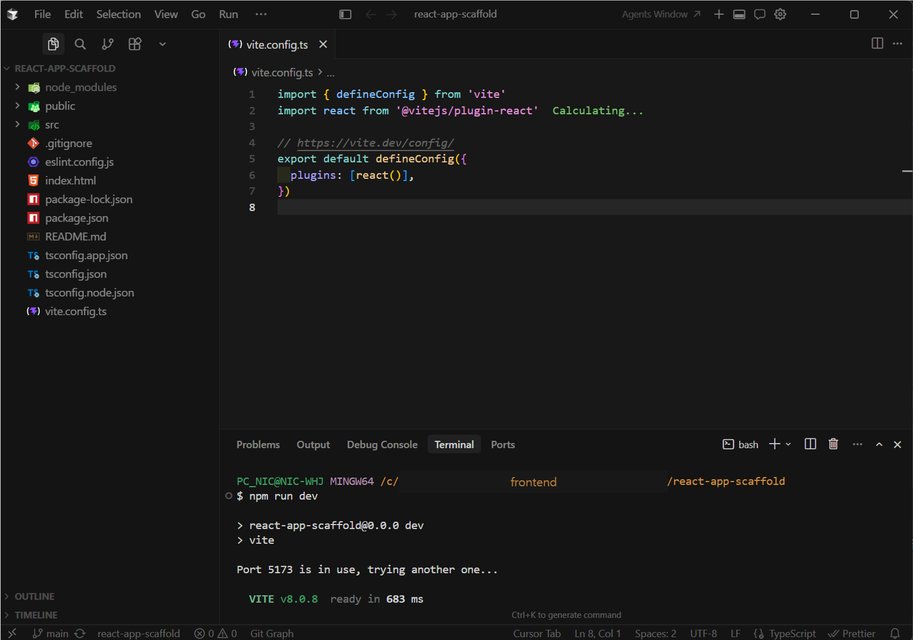
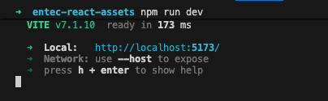
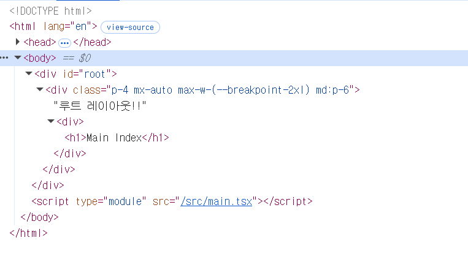
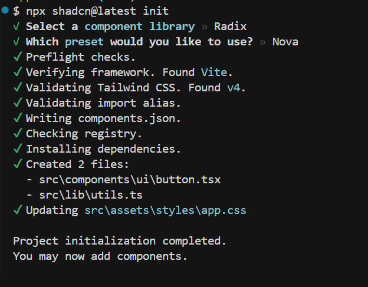
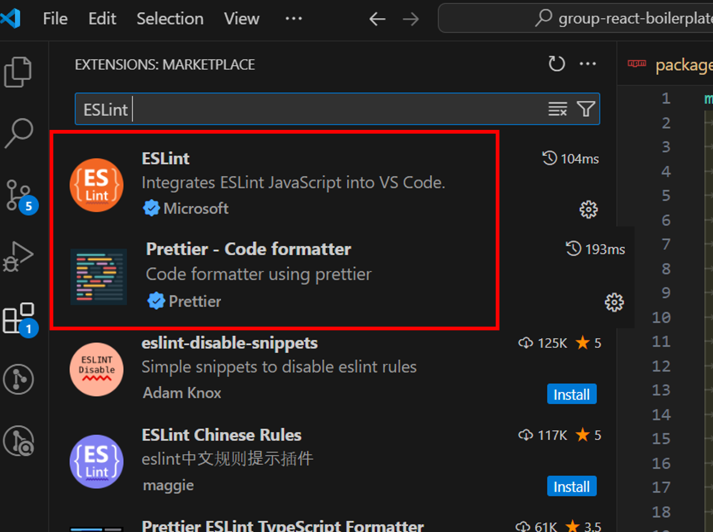

# React 초기 프로젝트 세팅

- <span class="react-color">Frontend (react-app-scaffold)</span> 프로젝트 최초 세팅 과정을 정리합니다.


## React 프로젝트 생성하기
---
:::info <span class="admonition-title">Vite</span>를 통해 프로젝트를 생성합니다.
  * [Vite공식문서: https://ko.vitejs.dev/](https://ko.vitejs.dev/)
:::
:::tip <span class="admonition-title">Frontend</span> 패키지 이름 명명 규칙
* 추 후 프로젝트를 생성한 다음 `package.json` 파일에서 패키지 이름을 다음 규칙에 맞게 변경합니다.
* 패키지 이름 예시
    - **애플리케이션 이름**: @company/react-app-\{프로젝트명\} (예: @axiom/react-app-project1)
* 네이밍 규칙
    - **@company**: 조직 스코프 (프로젝트에 맞게 변경)
    - **react**: React 프로젝트
    - **app-**: Application 앱 접두사
    - **\{프로젝트명\}**: 해당 프로젝트 도메인 명 (kebab-case)
:::

* **react-app-scaffold** Frontend 프로젝트는 **Vite React** 프로젝트로 생성합니다.  
개인 PC에서 작업할 폴더로 이동하여 다음 명령어를 실행합니다.
    ```sh
    npm create vite@latest react-app-scaffold -- --template react-ts
    ```
* 생성 후 폴더 이동:
    ```sh
    cd react-app-scaffold
    ```
* 생성된 프로젝트를 VSCode로 열어 프로젝트 파일들을 확인합니다.



## 생성된 폴더 구조
---
* 최초 생성된 폴더 구조는 다음과 같습니다.
    ```sh
    react-app-scaffold/
    ├── public/
    ├── src/
    ├── .gitignore
    ├── eslint.config.js
    ├── index.html
    ├── package.json
    ├── README.md
    ├── tsconfig.app.json
    ├── tsconfig.json
    ├── tsconfig.node.json
    └── vite.config.ts
    ```


## 패키지명 변경
---
* `package.json` 파일에 **프로젝트명**을 프로젝트 명명 규칙에 맞게 변경합니다. 아래 예제에서는 `@axiom/react-app-scaffold`로 하였습니다.
    - `@회사및조직/react-app-{업무명}`
    - 예시
    ```json
    {
        "name": "@axiom/react-app-scaffold",
    }
    ```


## 생성한 프로젝트 확인하기
---
* 최초 생성된 프로젝트에는 **의존성 라이브러리**가 설치되어 있지 않아서 **node_modules** 폴더가 없습니다. 따라서 생성한 `@axiom/react-app-scaffold` 프로젝트의 루트 디렉토리에서 `npm install` 명령어를 실행하여 의존성 라이브러리를 설치합니다.
    ```sh
    npm install
    ```
* 의존성 라이브러리 설치 후 폴더 구조는 다음과 같습니다.
    ```sh
    @axiom/react-app-scaffold/
    // highlight-start
    ├── node_modules/    # 의존성 라이브러리 설치 후 생성됨
    // highlight-end
    ├── public/
    ├── src/
    ├── .gitignore
    ├── eslint.config.js
    ├── index.html
    ├── package.json
    ├── README.md
    ├── tsconfig.app.json
    ├── tsconfig.json
    ├── tsconfig.node.json
    └── vite.config.ts
    ```
* 로컬 서버를 띄우기 위해 `npm run dev` 명령어를 실행하여 로컬 서버를 띄웁니다.
    ```sh
    npm run dev
    ```
* 로컬 서버가 띄워지면 브라우저에서 `http://localhost:5173` 접속하여 확인합니다. 포트는 다를 수 있습니다.


## Tailwind CSS 설치
---
* `@axiom/react-app-scaffold` 프로젝트는 기본으로 **Tailwind CSS**를 제공할 것입니다. 따라서 **Tailwind CSS**를 설치해야 합니다.
    ```sh
    npm install -D tailwindcss @tailwindcss/vite tw-animate-css
    ```
:::info <span class="admonition-title">Tailwind CSS</span>의 동작 원리
    - Tailwind는 런타임 CSS-in-JS 라이브러리가 아니라, **빌드 타임**에 소스코드를 **스캔**해서 실제로 사용된 유틸리티 클래스만 CSS 파일로 생성하는 방식입니다.
    ```
    소스코드 스캔 → 사용된 클래스 추출 → CSS 파일 생성
    ```
:::


* `vite.config.ts` 파일에 **Tailwind 플러그인** 추가 및 **'@' alias 구성**
    ```ts
    import { defineConfig } from 'vite'
    import react from '@vitejs/plugin-react'
    // highlight-start
    import tailwindcss from '@tailwindcss/vite'
    import { resolve } from 'path'
    // highlight-end
    export default defineConfig({
        plugins: [
            react(),
            // highlight-start
            tailwindcss(),   // ← 추가
            // highlight-end
        ],
        // highlight-start
        resolve: {
            alias: {
            '@': resolve(__dirname, 'src'),
            },
        },
        // highlight-end
        server: {
            port: 5173,
        },
    })
    ```
* CSS 파일 재구성
    - 기존 `src/index.css`와 `src/App.css`를 삭제하고, `src/assets/styles/app.css`로 통합합니다.
    - `src/assets/styles/app.css` 신규 생성
        - **핵심 포인트**: Tailwind v4는 tailwind.config.js 없이 CSS 파일의 @import 'tailwindcss' 한 줄로 동작합니다. content 경로 설정도 CSS 파일 내 @source 디렉티브로 처리합니다.
    ```css
    /* Tailwind 엔진 (v4 방식) */
    @import 'tailwindcss';
    /* tw-animate-css 사용 시 */
    @import 'tw-animate-css';
    ```
* `src/main.tsx` CSS 파일 import 경로 수정
    ```tsx
    import { StrictMode } from 'react'
    import { createRoot } from 'react-dom/client'
    // highlight-start
    import './assets/styles/app.css'   // ← index.css → assets/styles/app.css로 변경
    // highlight-end
    import App from './App.tsx'

    createRoot(document.getElementById('root')!).render(
    <StrictMode>
        <App />
    </StrictMode>,
    )
    ```
* `src/App.tsx` 파일 내 CSS 삭제
    ```tsx
    import { useState } from 'react'
    import reactLogo from './assets/react.svg'
    import viteLogo from './assets/vite.svg'
    import heroImg from './assets/hero.png'
    // highlight-start
    // import './App.css'
    // highlight-end

    // ...
    ```


## Visual Studio Code (VSCode) 코드편집기 설정
---
* **"개발자 개인 설정에 의존하지 않고, 프로젝트 코드베이스 자체가 코드 품질 기준을 강제하도록 만들기 위하여"** 다음과 같이 **VSCode** 설정을 합니다.
* 프로젝트 루트에 `.vscode/settings.json`을 두면 일관된 포맷팅 & 린팅 규칙이 자동 적용됩니다. 이는 코드 리뷰 시 불필요한 포맷 변경 diff를 줄이는 데도 매우 효과적입니다.


### settings.json 셋팅 (VSCode 설정)

<span class="react-color">Frontend (React)</span> 개발을 위해 **VSCode**를 활용할 것입니다. 따라서 개발자의 통일된 코드 작성을 위하여 **VSCode**의 환경설정을 **settings.json**파일에 적용합니다.

#### settings.json 설정

> - **settings.json 파일열기** : f1 ⤍ settings 입력 ⤍ Preferences: Open Workspace Settings (JSON) 클릭.  
>   위와같이 열면 프로젝트 루트에 **.vscode** 디렉토리가 생성되고 **settings.json**파일이 생성됩니다.
> - **settings(설정)가 적용되는 우선 순위** : .vscode settings.json ⤇ settings.json ⤇ defaultSetting.json(<span class="text-color-red">수정하지 않는 파일.</span>)  
>   <span class="text-color-red">defaultSetting.json은 모든 설정내용이 다 들어있는 기본 설정 파일입니다. 수정은 하지 않는 파일입니다.</span>
> - **.vscode** 디렉토리에 생성된 **settings.json** 파일에 아래 내용 입력합니다.

```json
{
  "editor.formatOnSave": true,
  "editor.codeActionsOnSave": {
    "source.fixAll.eslint": "explicit"
  },
  "editor.tabSize": 2,
  "editor.detectIndentation": false,
  "editor.insertSpaces": false,
  "editor.renderWhitespace": "all",
  "editor.comments.insertSpace": false,
  "files.associations": {
    "*.json": "jsonc"
  },
  "eslint.validate": [
    "javascript",
    "javascriptreact",
    "typescript",
    "typescriptreact"
  ],
  "eslint.workingDirectories": [{ "mode": "auto" }],
  "editor.defaultFormatter": "esbenp.prettier-vscode",
  "eslint.useFlatConfig": true,
  "css.lint.unknownAtRules": "ignore",
  "scss.lint.unknownAtRules": "ignore",
  "less.lint.unknownAtRules": "ignore",
  "[markdown]": {
    "editor.formatOnSave": false,
    "editor.codeActionsOnSave": {
      "source.fixAll.eslint": "never"
    }
  },
  "[mdx]": {
    "editor.formatOnSave": false,
    "editor.defaultFormatter": null
  },
  "update.mode": "none",
  "telemetry.telemetryLevel": "off",
  "extensions.autoUpdate": false,
  "extensions.autoCheckUpdates": false
}
```

:star: 이렇게 `settings.json` 파일로 **VSCode** 설정을 하면 **메뉴(File ⤍ Preferences ⤍ Settings)** 로 설정한것 보다 우선순위가 높게 적용됩니다.


:::info 설명
- **"editor.formatOnSave"** : 파일 저장 시 자동으로 코드 서식을 정리합니다.
- **"editor.codeActionsOnSave" ⤍ "source.fixAll.eslint"** : 파일 저장 시 ESLint가 감지한 모든 문제를 자동으로 수정합니다.
- **"editor.tabSize"** : 탭 크기를 몇칸으로 설정할지 지정합니다.
- **"editor.detectIndentation"** : VSCode가 파일의 들여쓰기를 자동으로 감지하는 기능을 활용할지 여부 입니다.
- **"editor.insertSpaces"** : 탭 키를 누를 때 공백 대신 탭 문자를 삽입합니다.
- **"editor.renderWhitespace"** : 공백 문자를 시각적으로 표시합니다.
- **"editor.comments.insertSpace"** : 주석 기호(//, /\*) 뒤에 자동으로 공백을 삽입할지 여부 입니다.
- **"files.associations" ⤍ "\*.json": "jsonc"** : .json 파일을 jsonc(주석이 있는 JSON) 형식으로 인식하도록 설정합니다.
- **"eslint.validate": \["javascript", "javascriptreact", "typescript", "typescriptreact"\]** : ESLint가 TypeScript, React, JavaScript 파일을 검사하도록 설정합니다.
- **"eslint.workingDirectories"** : \[\{"mode":"auto"\}\] : ESLint 작업 디렉토리를 자동으로 감지하도록 설정합니다.
- **"editor.defaultFormatter": "esbenp.prettier-vscode"** : VSCode의 기본 코드 포맷터로 Prettier를 사용합니다.
- **"eslint.useFlatConfig"** : ESLint의 설정방식이 `v8.21.0` 부터 **Flat Config**를 지원하면서, 구성 형식을 **Flat Config**으로 할지 여부 설정.

- **"css.lint.unknownAtRules": "ignore"** : VSCode에서 CSS의 "Unknown At Rules" 경고를 무시하도록 설정.
- **"scss.lint.unknownAtRules": "ignore"** : VSCode에서 scss의 "Unknown At Rules" 경고를 무시하도록 설정.
- **"less.lint.unknownAtRules": "ignore"** : VSCode에서 less의 "Unknown At Rules" 경고를 무시하도록 설정.
- **"[markdown]":** : Markdown 파일을 편집할 때 자동으로 코드 서식을 정리하지 않도록 설정.
- **"[mdx]":** : MDX 파일을 편집할 때 자동으로 코드 서식을 정리하지 않도록 설정.
- **오프라인일경우 설정 추가함**
  ```json
  "update.mode": "none",
  "telemetry.telemetryLevel": "off",
  "extensions.autoUpdate": false,
  "extensions.autoCheckUpdates": false
  ```
:::


## ESLint, Prettier 설정
---


### 1. ESLint, Prettier 관련 라이브러리 설치
```sh
# react-app-scaffold 디렉토리에서
npm install --save-dev prettier eslint-config-prettier eslint-plugin-react eslint-plugin-import-x
```


### 2. `eslint.config.js` 파일 수정
* 이미 프로젝트에 `eslint.config.js` 파일이 존재하므로 설정 내용을 다음과 같이 수정합니다.
```js
import js from '@eslint/js';
import globals from 'globals';
import reactHooks from 'eslint-plugin-react-hooks';
import reactRefresh from 'eslint-plugin-react-refresh';
import tseslint from 'typescript-eslint';
import { defineConfig, globalIgnores } from 'eslint/config';
import importPlugin from 'eslint-plugin-import-x';
import react from 'eslint-plugin-react';

import eslintConfigPrettier from 'eslint-config-prettier'; // eslint, prettier 충돌 방지

export default defineConfig([
	globalIgnores(['dist']),
	js.configs.recommended,
	tseslint.configs.recommended,
	reactHooks.configs.flat.recommended,
	reactRefresh.configs.vite,
	eslintConfigPrettier,
	{
		files: ['**/*.{js,ts,jsx,tsx}'],
		plugins: {
			react,
			import: importPlugin,
		},
		languageOptions: {
			ecmaVersion: 2020,
			globals: globals.browser,
		},
		rules: {
			'@typescript-eslint/no-explicit-any': 'off',
			semi: ['error', 'always'],
			'@typescript-eslint/no-empty-object-type': 'off',
			'@typescript-eslint/no-unused-vars': 'warn',
			'jsx-quotes': ['error', 'prefer-double'],
			'react/jsx-max-props-per-line': ['error', { maximum: 1 }],
			'react-hooks/exhaustive-deps': 'off',
			'react-hooks/incompatible-library': 'off',
			'react-hooks/set-state-in-effect': 'off',
			'react/no-unescaped-entities': 'off',
			'import/no-anonymous-default-export': [
				'warn',
				{
					// export default 할 때 익명 사용 금지 (new 함수만 허용함)
					allowArray: false,
					allowArrowFunction: false,
					allowAnonymousClass: false,
					allowAnonymousFunction: false,
					allowCallExpression: true, // The true value here is for backward compatibility
					allowNew: true,
					allowLiteral: false,
					allowObject: false,
				},
			],
			'no-empty-pattern': 'off',
		},
	},
]);
```

### 4. `prettier.config.js` 파일 생성
```js
const prettierConfig = {
	/**
	 * @template: printWidth: <int>
	 * @description: 코드 한줄의 개수
	 * 추천) 가독성을 위해 80자 이상을 사용하지 않는 것이 좋습니다.
	 * 추천) 코드 스타일 가이드에서 최대 줄 길이 규칙은 종종 100 또는 120으로 설정됩니다.
	 */
	printWidth: 120,

	/**
	 * @template: tabWidth: <int>
	 * @description: 들여쓰기 너비 수(탭을 사용할 경우 몇칸을 띄워줄지)
	 */
	tabWidth: 2,

	/**
	 * @template: useTabs: <bool>
	 * @description: 탭 사용 여부 (미사용 시 스페이스바로 간격조정을 해야함.)
	 */
	useTabs: true,

	/**
	 * @template: semi: <bool>
	 * @description: 명령문의 끝에 세미콜론(;)을 인쇄합니다.
	 * true: (;)를 추가함
	 * false: (;)를 지움
	 */
	semi: true,

	/**
	 * @template: singleQuote: <bool>
	 * @description: 큰따옴표("") 대신 작은따옴표('')를 사용여부
	 * true: 홀따옴표로 사용
	 * false: 큰따옴표로 사용
	 */
	singleQuote: true,

	/**
	 * @template: jsxSingleQuote: <bool>
	 * @description: JSX내에서 큰따옴표("") 대신 작은따옴표('')를 사용여부
	 * true: 홀따옴표로 사용
	 * false: 큰따옴표로 사용
	 */
	jsxSingleQuote: false,

	/**
	 * @template: trailingComma: "<es5|none|all>"
	 * @description: 객체나 배열을 작성하여 데이터를 넣을때, 마지막에 후행쉼표를 넣을지 여부
	 * es5: 후행쉼표 제외
	 * none: 후행쉼표 없음
	 * all: 후행쉼표 포함
	 */
	trailingComma: 'all',

	/**
	 * @template: jsxBracketSameLine: <bool> [Deprecated](대신 bracketSameLine 사용)
	 * @description: ">" 다음 줄에 혼자 있는 대신 여러 줄 JSX 요소를 마지막 줄 끝에 넣습니다
	 * true: 줄넘김하지 않음
	 * false: 줄넘김을 수행
	 */
	bracketSameLine: false,

	/**
	 * @template: bracketSpacing: <bool>
	 * @description: 개체 리터럴에서 대괄호 사이의 공백을 넣을지 여부
	 * true: 공백을 넣음 { foo: bar }
	 * false: 공백을 제외 {foo: bar}
	 */
	bracketSpacing: true,

	/**
	 * @template: singleAttributePerLine: <bool>
	 * @description: HTML, Vue 및 JSX에서 한 줄에 하나의 속성을 적용할지 여부
	 * true: 속성이 한개 이상일경우 multi속성 적용
	 * false: 적용하지 않음
	 */
	singleAttributePerLine: true,
	endOfLine: 'auto',
};

export default prettierConfig;
```
:star: 모든 설정을 완료했는데도 ESLint, Prettier 설정이 적용되지 않는다면, VSCode를 재시작 해보세요.
* ESLint, Prettier 를 테스트 및 fix할 수 있는 **scripts**를 `package.json` 파일에 추가하여 테스트 및 fix를 할 수 있습니다.
```json
{
    "scripts": {
        "lint": "eslint src/**/*.tsx",
        "lint:fix": "eslint src/**/*.tsx --fix",
        "format": "prettier --write \"src/**/*.{ts,tsx,js,jsx,json,css,md}\"",
        "format:check": "prettier --check \"src/**/*.{ts,tsx,js,jsx,json,css,md}\""
    }
}
```


## 폴더 및 파일 기본 구조 만들기
---
* 최초 프로젝트 기본 폴더 구조를 생성하기 위해 필요없는 폴더, 파일들을 삭제 또는 수정하고 가장 기본이 되는 아래 폴더 구조로 레이아웃을 만듭니다.
* **react-router, 상태관리라이브러리** 등 기본으로 필요한 라이브러리는 나중에 기본 코드 진행 하면서 설치 합니다.
```sh
react-app-scaffold/
├── src/
│   ├── core/                   # 앱 전체 공통 영역 (공통 개발자 관리 영역)
│   ├── assets/                 # 정적 파일 (fonts, images, css)
│   ├── domains/                # 업무 도메인별 분리 (DDD) — 업무 개발자 작업 영역
│   │   ├── main/                 # main 도메인
│   │   │   ├── api/                  # REST API URL 및 request/response 타입 정의
│   │   │   ├── components/           # 도메인 전용 컴포넌트
│   │   │   ├── pages/                # 화면 파일 (*.tsx)
│   │   │   ├── router/               # 도메인 라우팅
│   │   │   ├── store/                # 도메인 상태 관리
│   │   │   └── types/                # 도메인 타입 정의
│   │   └── [domain]/             # 업무 도메인 계속 추가·확장 가능
│   ├── shared                  # 전역 공유 코드
│   │   ├── components                # 공유 컴포넌트
│   │   ├── config                    # 앱 설정 (navigation 등)
│   │   ├── context                   # 전역 Context
│   │   └── router                    # 공유 라우터
│   ├── types                   # TypeScript 전역 타입 정의 (.d.ts)
│   │   └── global.d.ts               # 앱 전체에서 공유되는 전역 타입(특정 도메인에 귀속되지 않음)
│   ├── App.tsx                 # 루트 App 컴포넌트
│   ├── main.tsx                # 앱 진입점
│   └── vite-env.d.ts           # Vite 환경변수 타입 정의(필요시에만 생성)(Vite 빌드 관련 타입만 정의)
├── package.json                # 독립 의존성 관리 (pnpm)
├── vite.config.ts              # Vite + Module Federation 설정
└── ...                         # ESLint, Prettier, tsconfig 등 (Shared Library에서 extend)
```

* &#8251; 업무 개발자가 작업할 공간은 `src/domains` 폴더입니다. 그 외 폴더 및 파일들은 설정 파일이므로 `src` 폴더 구조에 대해서만 설명합니다.

:::info 설명
* **앱 폴더 구조**
	* <span class="text-green-bold">src/assets</span>폴더는 모든 정적 파일들(이미지, CSS 파일 등)을 모아놓은 폴더입니다.
	* <span class="text-green-bold">src/core</span>폴더는 앱 핵심 공통 코어 로직(라우터 설정 등) 폴더입니다. 공통개발자 이 외 업무개발자는 작업하지 않는 공간입니다.
	* <span class="text-green-bold">src/shared</span>폴더는 해당 앱 내 전역 공유 코드 폴더입니다. 상황에 따라 수정이 발생할 수 있고, 다른 업무(domain)개발자와 함께 작업할 수 있는 공통 컴포넌트, 레이아웃, Context, 라우터 등이 위치합니다.
  * <span class="text-green-bold">src/types</span>폴더는 앱 전체에서 공유되는 전역 타입을 모아놓은 폴더입니다. (특정 도메인에 귀속되지 않음)  
  * <span class="text-green-bold">src/domains</span>폴더에는 각 domain 업무들(domain1, domain2, domain3, ...)이 있고, 그 하위에는 일률적으로 <span class="text-blue-normal">**api, components, common, pages, router, store, types**</span>폴더를 가집니다. 각 개별 폴더는 업무 상황에 따라 생성하여 사용합니다.
		- <span class="text-blue-normal">api</span> : REST API URL과 request, response의 type을 정의합니다.
		- <span class="text-blue-normal">common</span> : 해당 업무에서 사용하는 javascript 공통함수나 공통적인 요소의 모듈을 모아놓은 폴더.
		- <span class="text-blue-normal">components</span> : 업무 화면에서 사용하는 컴포넌트들을 모아놓은 폴더.
		- <span class="text-blue-normal">pages</span> : 해당 도메인 업무의 페이지 컴포넌트 폴더. 화면을 구성하는 React 컴포넌트를 모아놓습니다.
		- <span class="text-blue-normal">router</span> : 해당 도메인 업무의 라우터 설정 폴더. React Router 기반의 라우트를 정의합니다.
		- <span class="text-blue-normal">store</span> : 해당 업무에서 사용하는 상태관리 모듈을 모아놓은 폴더.
		- <span class="text-blue-normal">types</span> : 해당 업무에서 사용하는 type을 모아놓은 폴더.
:::


## cross-env 사용 (필요한 경우에만 사용)
---
:::tip <span class="admonition-title">cross-env</span> 란?
* cross-env 모듈은 프로젝트 참여자 각각이 MacOS, Windows, Linux 등 다양한 OS 마다 환경변수를 설정하는 방법이 다르기 때문에 이것에 대한 대책을 마련한 모듈입니다.
그래서 **cross-env** 패키지를 사용하면 동적으로 `process.env`(환경 변수)를 변경할 수 있으며 모든 운영체제에서 동일한 방법으로 환경 변수를 변경할 수 있게 됩니다.
:::
* **OS**상관없이 동일하게 커맨드 명령어로 환경설정을 할 수 있습니다.(필요한 경우에만 사용)
* `npm install -D cross-env` 설치 후 아래와 같이 사용.
```sh
cross-env NODE_ENV=production ... ...
```
* `package.json` scripts에 작성 예시
```json
{
  "scripts": {
    ...
    "serve": "cross-env NODE_ENV=development node server",
    ...
  }
}
```


## Sass 설치
---
* **react-app-scaffold** 프로젝트는 기본 스타일로 **TailwindCSS** 를 제공합니다.
* 하지만 상황에 따라 Tailwind CSS를 사용하지 않고 Sass, Emotion, CSS Modules 등 원하는 어떤 스타일링 기술을 사용하든 쉽게 적용 가능합니다.
* 프로젝트에서 `.scss`, `.sass` 파일을 사용하기 위해서 **Sass** npm 패키지를 설치합니다.
  ```sh
  npm i -D sass
  ```
  :::tip <span class="admonition-title">sass</span> 와 <span class="admonition-title">sass-embedded</span> 패키지 설명
  * sass
    * Node.js 바인딩으로 작동하는 순수 JavaScript 구현
    * 설치 시 바이너리를 다운로드하지 않음
    * 더 가볍고 설치가 빠름
    * 호환성이 좋고 가장 널리 사용됨
    * 번들 크기가 다소 클 수 있음
  * sass-embedded
    * Dart Sass의 최적화된 버전
    * C++ 바인딩으로 컴파일 성능이 더 빠름
    * 초기 설치 시 플랫폼별 바이너리 다운로드 (용량이 더 큼)
    * 성능이 더 좋지만 설치가 느릴 수 있음
    * 더 최신 기술 스택
  * 선택 기준
    * 성능이 중요한 큰 프로젝트: sass-embedded 추천
    * 빠른 설치, 간단한 프로젝트: sass 추천
    * 대부분의 일반적인 프로젝트: sass면 충분함
  :::
* **react-app-scaffold** 프로젝트에서는 `sass`를 설치할 것입니다. 설치도 빠르고 성능 차이도 실무에서 체감하기 어렵기 때문입니다.
* **Sass**는 프로젝트 상황에 따라 사용할 수도 있고 사용하지 않아도 상관없습니다. **TailwindCSS + shadcn/ui** 사용으로 `.scss` `.sass`이 아닌. `.css`를 우선 사용할 것입니다.


## src 폴더 '@'별칭 만들기
---
* `vite.config.ts`
  ```ts
  export default defineConfig({
    // ... 기존 설정 ...
    resolve: {
      // highlight-start
      alias: {
        '@': resolve(__dirname, 'src'),
      },
      // highlight-end
    },
    // ... 기존 설정 ...
  });
  ```
* `tsconfig.app.json`
  - `npm run build` 시 오류 발생하면 `"baseUrl": ".",`를 `tsconfig.app.json`에서 코드를 삭제합니다.
  ```json
  {
    "compilerOptions": {
      // ... 기존 설정 ...
      // highlight-start
      "baseUrl": ".", // npm run build 시 오류 발생하면 "baseUrl": ".", 삭제
      "paths": {
        "@/*": ["src/*"]
      }
      // highlight-end
    }
  }
* `tsconfig.json`
  ```json
  {
    "compilerOptions": {
      // ... 기존 설정 ...
      // highlight-start
      "baseUrl": ".",
      "paths": {
        "@/*": ["src/*"]
      }
      // highlight-end
    }
  }
* 왜 `vite.config.ts`, `tsconfig.app.json` 파일 양쪽에 설정을 해야 하는지?

| 구분     |	역할      |
|----------|----------|
| Vite `resolve.alias` | 개발 서버·Rollup이 실제로 @/... 경로를 어디로 풀지 결정 |
| `compilerOptions.paths` | tsc/언어 서버가 @/...를 모듈로 인식하고, 자동완성·정의로 이동·타입 검사를 하게 함 |
* `tsconfig.json` 파일에도 설정을 해야 하는 이유
  - Shadcn CLI 가 설치 시 기본 설정파일인 `tsconfig.json`을 읽게 되어있기 때문.


## Router 설정
---
* **React Router**는 **React** 애플리케이션에서 페이지 네비게이션 처리와 URL 관리를 처리하는 라이브러리입니다.
* [React Router 공식문서: https://reactrouter.com/home](https://reactrouter.com/home)


:::info <span class="admonition-title">Router 모드</span>에 대하여
* React Router는 3가지 모드를 지원합니다.
  * **Declarative(선언적) 모드** : React Router의 가장 기본적이고 전통적인 방식입니다. `<Routes>`와 `<Route>` 컴포넌트를 사용하며, **UI구조**에 라우팅 로직이 직접 포함됩니다.
    ```tsx
    <BrowserRouter>
      <Routes>
        <Route path="/" element={<Home />} />
        <Route path="/about" element={<About />} />
      </Routes>
    </BrowserRouter>
    ```
  * **Data(데이터 중심) 모드** : 라우트 설정을 배열이나 객체 형태로 따로 정의하고, 데이터 로딩을 분리합니다. `loader`와 `action`함수를 사용하여 라우트 전환에 필요한 데이터를 미리 로드할 수 있습니다.
    ```ts
    // route를 따로 배열로 선언
    const routes = [
      {
        path: "/",
        element: <Home />,
        loader: async () => {
          const data = await fetchHomeData();
          return data;
        }
      }
    ];
    ```
  * **Framework 모드** : React Router를 Next.js나 Remix 같은 풀 스택 프레임워크처럼 사용하는 방식입니다.
:::


### 1. 설치
* **react-app-boilerplate** 에서는 라우터를 **Data 모드** 형식으로 **RouterProvider** 와 **createBrowserRouter, createHashRouter**를 사용할 것입니다.
  ```sh
  npm install react-router
  ```
  :::info
  * **RouterProvider** : 라우터 구성을 애플리케이션에 제공하는 가장 최상위 컴포넌트 입니다.  
   최상위 루트(보통 index.ts 또는 main.ts)에 RouterProvider를 추가하고, router객체를 등록합니다.
  * **createBrowserRouter** : 기본 웹 프로젝트 라우터 객체 형식.
    * 동적인 페이지에 적합
    * 검색엔진 최적화(SEO)
  * **createHashRouter** : 전체 URL이 아닌 #(hash)를 사용하는 라우터 객체 형식.
    * 정적인 페이지에 적합(개인 포트폴리오)
    * 검색 엔진으로 읽지 못함('#'값 때문에 서버가 읽지 못하고 서버가 페이지의 유무를 모름)
  :::


### 2. 라우터 사용 설정
* 설치한 `react-router`를 사용하여 **RouterProvider**에 `router`를 전달하여 라우팅을 적용합니다.
* `src/App.tsx` 파일 코드를 모두 삭제하고 다음 코드를 추가합니다.
  ```tsx showLineNumbers
  // highlight-start
  import { RouterProvider } from 'react-router';
  import router from '@/core/router';
  // highlight-end

  export function App() {
    return (
      <>
        {/* TODO: 추가 html 요소가 있으면 추가. */}
        // highlight-start
        <RouterProvider router={router} />
        // highlight-end
      </>
    );
  }

  export default App;
  ```
* `src/core/router/index.ts` 파일이 없기 때문에 신규 생성합니다.
  - 이 파일은 공통함수 **createAppRouter** 함수를 통해 **router** 인스턴스를 생성, 설정하고, 각 **개별업무(domain) 라우터**를 통합해서 리턴해주는 core 라우터 파일입니다. 공통 core영역 파일이기 때문에 한번 생성하면 공통 개발자 외에는 수정할 일이 없습니다.
  - **개별업무(domain) 라우터**는 `src/shared/router/index.ts` 파일에 있습니다.
  ```ts showLineNumbers
  import { createAppRouter } from './app-common-router.ts';
  import routes from '@/shared/router';

  const router = createAppRouter(routes, {
    // .env 파일에 설정된 VITE_ROUTER_BASENAME 값을 사용합니다.
    basename: import.meta.env.VITE_ROUTER_BASENAME,
  });

  export * from './app-common-router.ts';
  export default router;
  ```

* `src/core/router/app-common-router.ts` 파일이 없기 때문에 신규 생성합니다.
  - 이 파일은 **react-router**의 **createHashRouter** 또는 **createBrowserRouter** 함수를 통해 **router** 인스턴스를 생성하는 파일입니다.
  ```ts showLineNumbers
  import { createHashRouter, type DOMRouterOpts } from 'react-router';
  import type { TAppRoute } from '@/types/router';

  export const createAppRouter = (routes: TAppRoute[], opts?: DOMRouterOpts) => {
    // createBrowserRouter는 서버 설정이 필요 (모든 경로를 index.html로 리다이렉트)하기 때문에 사용하지 않는다.
    //return createBrowserRouter(routes, opts);
    return createHashRouter(routes, opts);
  };
  ```

* `src/shared/router/index.tsx` 파일이 없기 때문에 신규 생성합니다.
  - 현재 파일은 각 domain 업무 라우터를 모두 모아서 하나의 라우터를 생성하는 파일입니다.
  - `import MainRouter from '@/domains/main/router';` 이와같이 현재는 **main** 업무가 없기 때문에 다음 스탭의 업무 추가 하면서 생성합니다.
  - `import RootLayout from '@/shared/components/layout/RootLayout';` 이와같이 현재는 **루트 레이아웃**이 없기 때문에 다음 스탭에서 추가합니다.
  ```ts showLineNumbers
  import type { TAppRoute } from '@/types/router';

  // root layout 가져오기 -----------
  import RootLayout from '@/shared/components/layout/RootLayout';

  // main router 가져오기 ----------------
  import MainRouter from '@/domains/main/router';
  // example router 가져오기 -------------
  //import ExampleRouter from '@/domains/example/router';

  const routes: TAppRoute[] = [
    {
      path: '/',
      element: <RootLayout />,
      children: MainRouter,
    },
    // 업무(domain) 라우터 생성될 때 다음과 같이 추가
    //{
    //	path: '/example',
    //	element: <RootLayout />,
    //	children: ExampleRouter,
    //},
    {
      path: '*',
      element: (
        <RootLayout
        //message="죄송합니다. 현재 시스템에 일시적인 문제가 발생했습니다."
        //subMessage="잠시 후 다시 접속해주세요.
        //           <br />
        //           문제가 지속되면 아래 고객센터로 문의해주세요."
        />
      ),
    },
  ];

  export default routes;
  ```
 


## RootLayout 컴포넌트 생성
---
* **루트 레이아웃**은 모든 페이지의 공통 레이아웃을 정의하는 컴포넌트입니다.
* `src/shared/components/layout/RootLayout.tsx` 파일이 없기 때문에 신규 생성합니다.
  ```tsx
  import LayoutContent from './LayoutContent';

  interface IRootLayoutProps {
    //
  }

  export default function RootLayout({}: IRootLayoutProps): React.ReactNode {
    return <LayoutContent />;
  }
  ```
* `src/shared/components/layout/LayoutContent.tsx` 파일이 없기 때문에 신규 생성합니다.
  - 우선 간단하게 구현하고 추후 레이아웃 구조에 맞게 수정 될 것입니다.
  ```tsx
  import { Outlet } from 'react-router';

  export default function LayoutContent(): React.ReactNode {
    return (
      <div className="p-4 mx-auto max-w-(--breakpoint-2xl) md:p-6">
        루트 레이아웃!!
        <Outlet />
      </div>
    );
  }
  ```


## Main 업무 추가
---
* `domains` 폴더에 **main** 업무를 추가하겠습니다.
* `src/domains` 폴더 내부에 `main` 폴더를 생성하고 다음과 같이 기본 **main** 업무 폴더 구조를 생성합니다.
  ```sh
  src/domains/main/
  ├── pages/
  |   └── MainIndex.tsx
  └── router/
      └── index.tsx
  ```
* `src/domains/main/pages/MainIndex.tsx` 파일이 없기 때문에 신규 생성합니다.
  ```tsx
  export default function MainIndex(): React.ReactNode {
    return (
      <div>
        <h1>Main Index</h1>
      </div>
    );
  }
  ```
* `src/domains/main/router/index.tsx` 파일이 없기 때문에 신규 생성합니다.
  ```tsx
  import type { TAppRoute } from '@/types/router';

  // 메인화면 컴포넌트 가져오기
  import MainIndex from '../pages/MainIndex';

  const routes: TAppRoute[] = [
    {
      path: '/',
      element: <MainIndex />,
      name: 'MainIndex',
    },
  ];

  export default routes;
  ```

  :::tip 파일 생성, 및 사용 시 <span class="admonition-title">Lint</span> 오류 처리 관련
  * 새로운 파일을 처음 생성하거나, 새로운 타입을 선언할 때 VSCode에서 Lint 오류를 발생시킬 수 있습니다. 이것은 VSCode가 새로운 적용에 대한 인식을 자동으로 하지 못했기 때문입니다.
  * 이럴 경우 VSCode를 다시 로드하거나, TS Server를 재시작해서 새로운 파일 및 타입 적용을 시도합니다.
  * Ctrl + Shift + P 또는 Command + Shift + P 를 눌러서 `Reload Window` 또는 `Restart TS Server` 명령어를 실행합니다.
  
  :::


## 로컬 서버 띄우기(브라우저 확인)
---
* **Main** 업무의 첫 페이지를 만들고 라우터 설정으로 연결을 완료했으면, 로컬 서버를 띄우고 브라우저로 확인해 봅니다.
```sh
npm run dev
```

* `http://localhost:5173/` 에 접속하여 확인합니다. port는 다를 수 있습니다.
* 상황에 따라 다음과 같이 port를 변경하여 띄울 수도 있습니다.
```json
{
    "scripts": {
        "dev": "vite --port 5173", // 원하는 포트로 설정
    }
}
```




## shadcn/ui 설치
---
* 설치 명령어 실행
```sh
npx shadcn@latest init
```
```sh
npx shadcn@latest init
√ Select a component library » Radix
√ Which preset would you like to use? » Nova
✔ Preflight checks.
✔ Verifying framework. Found Vite.
✔ Validating Tailwind CSS. Found v4.
✔ Validating import alias.
✔ Writing components.json.
✔ Checking registry.
✔ Installing dependencies.
✔ Created 2 files:
  - src\components\ui\button.tsx
  - src\lib\utils.ts
✔ Updating src\assets\styles\app.css

Project initialization completed.
You may now add components.
```



* shadcn 설치 후 루트에 생성된 components.json 설정파일을 수정합니다. `shadcn` 관련 파일을 모두 한곳에서 관리하기 위하여 `@/shared/components/shadcn` 경로를 설정합니다.
  ```sh
  {
    "$schema": "https://ui.shadcn.com/schema.json",
    "style": "radix-nova",
    "rsc": false,
    "tsx": true,
    "tailwind": {
      "config": "",
      // highlight-start
      "css": "src/assets/styles/app.css",
      // highlight-end
      "baseColor": "neutral",
      "cssVariables": true,
      "prefix": ""
    },
    "iconLibrary": "lucide",
    "rtl": false,
    "aliases": {
      // highlight-start
      "components": "@/shared/components/shadcn/components",
      "utils": "@/shared/components/shadcn/lib/utils",
      "ui": "@/shared/components/shadcn/components/ui",
      "lib": "@/shared/components/shadcn/lib",
      "hooks": "@/shared/components/shadcn/hooks"
      // highlight-end
    },
    "menuColor": "default",
    "menuAccent": "subtle",
    "registries": {}
  }
  ```
* `shadcn` 설치 후 생성된 `src/components`, 'src/lib` 폴더를 `@/shared/components/shadcn` 경로로 이동합니다.
  ```sh
  mv src/components @/shared/components/shadcn/components
  mv src/lib @/shared/components/shadcn/lib
  ```
* `shadcn` 사용 (추후 UI 컴포넌트 추가 시 명령어)(인터넷 연결 필요)
  ```sh
  npx shadcn@latest add button
  ```
  - **accordion** 컴포넌트를 사용한다고 했을 때 다음과 같이 명령어를 실행합니다.
  ```sh
  npx shadcn@latest add accordion
  ```


## 환경변수 파일 구성
---
애플리케이션 URL등 여러 환경변수를 관리하는 env 파일을 다음과 같이 구성합니다.
* `.env` — 환경 변수 파일(default)
* `.env.local` — 로컬 개발용
* `.env.development` — 개발 서버용
* `.env.production` — 프로덕션용

```env
# .env.local 예시
# Host 앱 포트
PORT=5173 # 해당하는 포트로 적용

# Vite Base URL (default: /)
VITE_BASE_URL=/

# Vite Router Base Name (default: /)
VITE_ROUTER_BASENAME=/

# 외부 API 기본 URL (테스트용)
VITE_EXTERNAL_API_BASE_URL1=https://koreanjson.com

```


## Git 연결하기
---
<span class="text-blue-normal">프로젝트에서는 Git 레포지토리 연결은 따로 진행될 수도 있습니다.</span>
- 생성한 프로젝트를 Git 저장소에 연결합니다. 저장소는 `https://github.com/nic-company-single-react/react-app-scaffold.git` 입니다. Git저장소는 프로젝트 상황에 따라 다르게 설정합니다.
  - 연결 명령어
  ```sh
  git init # 초기화
  git add . # 스테이징
  git commit -m "initial commit" # 커밋
  git branch -M main # 브랜치 명 main으로 변경
  git remote add origin https://github.com/nic-company-single-react/react-app-scaffold.git # 저장소 연결
  git push -u origin main # 푸시
  ```
  - 연결 과정에 Git push 버퍼가 작아 push가 안되는 상황이 생기면 버퍼를 늘려주고 push 합니다.
  ```sh
  # 버퍼 524MB로 설정
  git config --global http.postBuffer 524288000
  # 재시도
  git push origin main
  ```


## VSCode에 `ESLint`,`Prettier` Extensions 설치
---
* VSCode 코드편집기 자체에서 ESLint, Prettier를 사용하고 적용할 수 있는 EXtensions가 있습니다. 이것을 설치하면 VSCode에서 파일 수정 후 저장 시 코드 포멧팅이 적용 됩니다.
* VSCode Extensions 설치 방법은 [여기(아직링크없음)](./first-set-proj.md)를 참조합니다.
  * **ESLint**
  * **Prettier - Code formatter**
  
* 이미 **VSCode**의 `settings.json`파일에 아래 내용이 적용 되어 있기 때문에, 파일 수정, 저장 시 자동으로 ESLint, Pretter 가 작동 됩니다.
```javascript
 "editor.formatOnSave" : true,
  "editor.codeActionsOnSave": {
    "source.fixAll.eslint": "explicit",
  },
  "eslint.validate": ["javascript", "javascriptreact", "typescript", "typescriptreact"],
  "editor.defaultFormatter": "esbenp.prettier-vscode",
  "eslint.useFlatConfig": true
```


## base url 설정
---
* 만약 사이트의 루트 URL이 Web 서버의 하위 폴더라면, base url 설정을 위해 `vite.config.ts` 파일을 수정해야 합니다.
* `defineConfig` 함수에 현재는 객체 **JSON** 형식으로 설정하고 있는데, 이것을 함수 형식으로 수정합니다.
  * 함수 형식으로 수정한 코드
    - `env` 환경변수 값을 가져오기 위해서 입니다.
    - `env.VITE_BASE_URL`, `env.PORT` 환경변수를 사용하였습니다. 해당 환경변수는 `.env` 파일에 설정되어 있습니다. 만약 `.env` 파일이 없다면 생성해 주어야 합니다.
  ```ts
  import { defineConfig, loadEnv } from 'vite';
  import react from '@vitejs/plugin-react';
  import tailwindcss from '@tailwindcss/vite';
  import { resolve } from 'path';

  // https://vite.dev/config/
  export default defineConfig(({ mode }) => {
    const env = loadEnv(mode, process.cwd(), '');
    return {
      base: env.VITE_BASE_URL,
      plugins: [react(), tailwindcss()],
      resolve: {
        alias: {
          '@': resolve(__dirname, './src'),
          '@app-types': resolve(__dirname, './src/types'),
        },
      },
      server: {
        port: Number(env.PORT) || 5173,
      },
    };
  });
  ```


## provider 통합설정
---
* **react-app-scaffold** 프로젝트에서는 **provider**를 통합하여 관리하기 위하여 `src/core/common/providers` 폴더를 생성하고 다음과 같이 `AppProviders.tsx` 파일을 생성하여 관리 합니다.
  - `src/main.tsx`
  ```tsx
  import { createRoot } from 'react-dom/client';
  // highlight-start
  import { AppProviders } from '@/core/common/providers/AppProviders';
  // highlight-end
  import App from './App.tsx';
  import '@/assets/styles/app.css';

  createRoot(document.getElementById('root')!).render(
    // highlight-start
    <AppProviders>
      <App />
    </AppProviders>,
    // highlight-end
  );
  ```
  - `src/core/common/providers/AppProviders.tsx`
    - 현재는 provider가 비어있지만 추 후 여기에 추가할 것입니다.
  ```tsx
  import type { ReactNode } from 'react';

  interface AppProvidersProps {
    children: ReactNode;
  }

  /**
  * 애플리케이션의 모든 Provider를 통합하는 컴포넌트
  *
  * 새로운 Provider 추가 시 이곳에서 관리합니다.
  * Provider 순서는 의존성을 고려하여 배치합니다.
  */
  export function AppProviders({ children }: AppProvidersProps) {
    return <>{children}</>;
  }
  ```


## 빌드 테스트
---
* `npm run build` 명령어로 빌드 시 오류 없이 빌드가 되는지 확인합니다.


