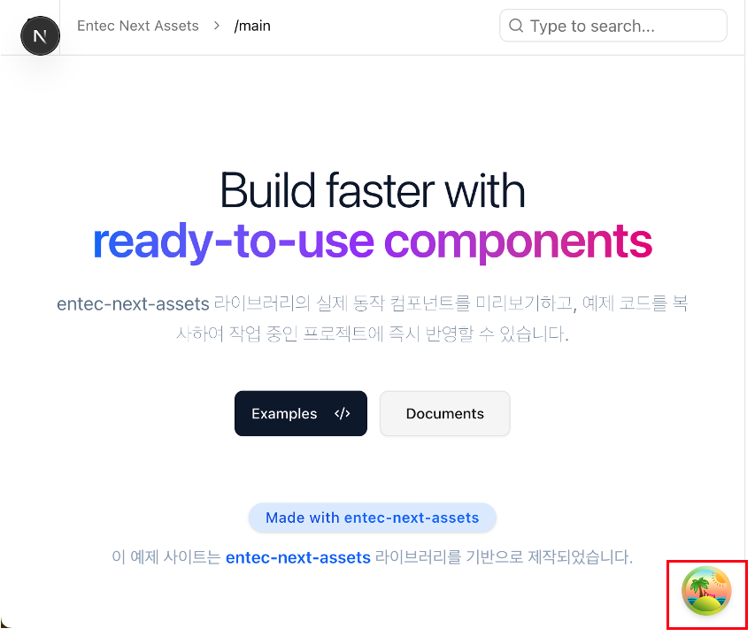
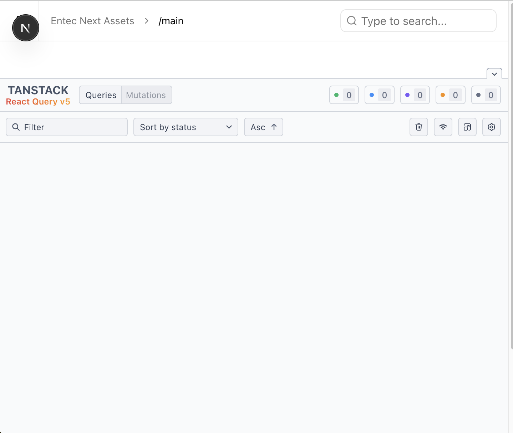
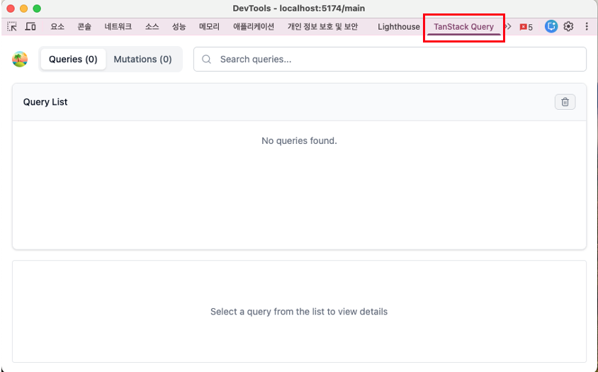

# Tanstack Query(react-query) 초기 세팅 정리

:::info <span class="admonition-title">Tanstack Query(react-query)</span>란?
* **TanStack Query**는 **React**애플리케이션의 서버 상태 관리 라이브러리 입니다.
* 원래 React Query로 알려졌다가 TanStack Query로 리브랜딩되었으며, 현재는 React뿐만 아니라 Vue, Svelte, Solid 등 다른 프레임워크도 지원합니다.
* **핵심 개념** : **TanStack Query**는 클라이언트 상태(예: UI 상태)와 서버 상태를 구분합니다. 서버에서 가져온 데이터는 본질적으로 비동기적이고, 캐싱이 필요하며, 시간이 지나면 오래될 수 있다는 특성을 가집니다. 이 라이브러리는 이러한 서버 상태의 특성을 다루는 데 최적화되어 있습니다.
* **주요 기능** : 
  - **자동 캐싱 및 동기화 -** 데이터를 자동으로 캐싱하고 백그라운드에서 업데이트하여 항상 최신 상태를 유지합니다.
  - **중복 요청 제거 -** 동일한 데이터에 대한 여러 요청을 자동으로 중복 제거합니다.
  - **자동 재시도 및 재검증 -** 실패한 요청을 자동으로 재시도하고, 윈도우 포커스나 네트워크 재연결 시 데이터를 자동으로 재검증합니다.
  - **페이지네이션과 무한 스크롤 -** 페이지네이션과 무한 쿼리를 위한 내장 지원을 제공합니다.
  - **Optimistic Updates -** 서버 응답 전에 UI를 미리 업데이트하여 더 나은 사용자 경험을 제공합니다.
:::


## Tanstack Query 설치
---
```sh
#tanstack/react-query 설치
npm i @tanstack/react-query

#코딩 중에 버그와 불일치를 발견하는 데 도움이 되는 ESLint 플러그인
npm install -D @tanstack/eslint-plugin-query

# Tanstack query 디버깅 툴 설치
npm install -D @tanstack/react-query-devtools
```
* **REST API** 통신을 위한 `axios`설치
```sh
npm i axios
```


## Provider를 이용하여 애플리케이션 루트(`/src/app`)에 Tanstack Query 연결
---
* `QueryProvider.tsx` 파일에 `<QueryClientProvider>`를 이용하여 연결합니다.
* 디버깅 툴인 ReactQueryDevtools도 연결합니다.
```tsx showLineNumbers
'use client';

import { QueryClientProvider } from '@tanstack/react-query';
import { ReactQueryDevtools } from '@tanstack/react-query-devtools';
import { getQueryClient } from './query-client-config';
import { ReactNode, useState, useEffect } from 'react';

interface QueryProviderProps {
  children: ReactNode;
}

export function QueryProvider({ children }: QueryProviderProps) {
  // useState로 QueryClient를 초기화하여 React 생명주기와 동기화
  const [queryClient] = useState(() => getQueryClient());

  // Tanstack Query Client를 전역 변수로 설정(Devtools Extension 사용 시 필요) =======
  useEffect(() => {
    window.__TANSTACK_QUERY_CLIENT__ = queryClient;
  }, [queryClient]);
  // Tanstack Query Client를 전역 변수로 설정(Devtools Extension 사용 시 필요) =======

  return (
    <QueryClientProvider client={queryClient}>
      {children}
      {process.env.NODE_ENV === 'development' && <ReactQueryDevtools initialIsOpen={false} />}
    </QueryClientProvider>
  );
}
```

* **query-client-config.ts** 파일에 Tanstack Query 설정 코드를 작성합니다.
```tsx showLineNumbers
import { QueryClient, DefaultOptions } from '@tanstack/react-query';

// React Query 기본 옵션 설정
const queryConfig: DefaultOptions = {
  queries: {
    retry: 0, // 실패 시 재시도 횟수
    refetchOnWindowFocus: false, // 윈도우 포커스 시 자동 refetch 비활성화
    refetchOnReconnect: true, // 재연결 시 자동 refetch
    staleTime: 0, //5 * 60 * 1000, // 5분 (데이터가 fresh한 상태로 유지되는 시간)
    gcTime: 5, //10 * 60 * 1000, // 10분 (garbage collection time, 이전 cacheTime)
  },
  mutations: {
    retry: 0, // mutation은 재시도하지 않음
  },
};

// QueryClient 인스턴스 생성 함수
export function makeQueryClient() {
  return new QueryClient({
    defaultOptions: queryConfig,
  });
}

// 싱글톤 QueryClient (클라이언트 사이드용)
let browserQueryClient: QueryClient | undefined = undefined;

export function getQueryClient() {
  if (typeof window === 'undefined') {
    // 서버 사이드: 매번 새로운 QueryClient 생성
    return makeQueryClient();
  } else {
    // 클라이언트 사이드: 싱글톤 사용
    if (!browserQueryClient) browserQueryClient = makeQueryClient();
    return browserQueryClient;
  }
}
```

* 생성한 **QueryProvider.tsx** 파일을 루트 **layout.tsx**파일에 연결합니다.
```tsx showLineNumbers
// 루트 layout.tsx 코드 일부
// ...
// highlight-start
import { QueryProvider } from './QueryProvider';
// highlight-end
// ...

const RootLayout: IComponent<IRootLayoutProps> = ({ children }) => {
  return (
    <html lang="en">
      <body className="antialiased">
        // highlight-start
        <QueryProvider>
        // highlight-end
          <LayoutASideProvider>
            <LayoutMainIndex>{children}</LayoutMainIndex>
          </LayoutASideProvider>
        // highlight-start
        </QueryProvider>
        // highlight-end
      </body>
    </html>
  );
};

RootLayout.displayName = 'RootLayout';
export default RootLayout;
```

* 디버깅 화면 확인



## TanStack Query DevTools (Chrome Extension)
---
* 확장팩 URL : [https://chromewebstore.google.com/detail/tanstack-query-devtools/annajfchloimdhceglpgglpeepfghfai](https://chromewebstore.google.com/detail/tanstack-query-devtools/annajfchloimdhceglpgglpeepfghfai)

