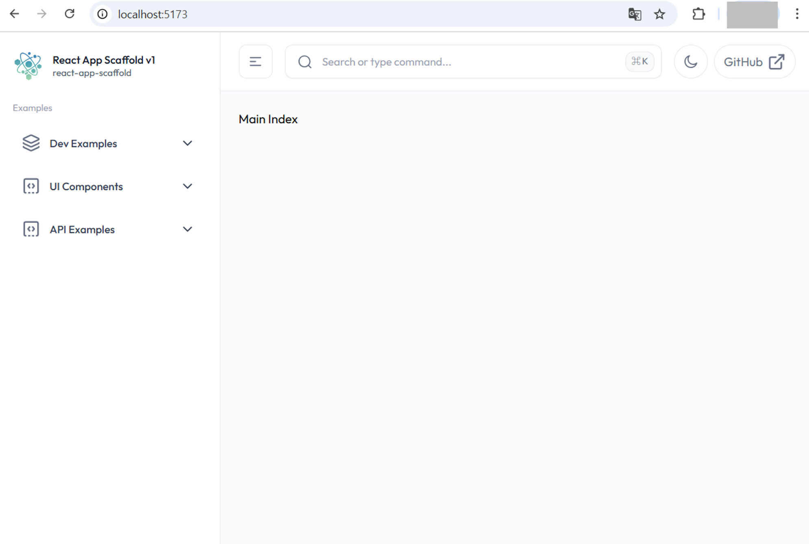

# react-app-scaffold 레이아웃 템플릿 적용

## 기본 레이아웃 템플릿

* `@axiom/react-app-scaffold` 프로젝트에서 기본으로 제공할 레이아웃 템플릿을 적용합니다.
* 이 레이아웃은 **Tailwind CSS**와 **shadcn/ui**로 구성되어 있습니다.
* 이후 프로젝트·디자인 요구에 맞게 레이아웃을 바꾼 뒤, 그 위에서 화면을 이어가면 됩니다.


## layout.css 적용
---
* 프로젝트에서 제공하는 기본 레이아웃 템플릿에서 사용하는 스타일 파일은 `src/assets/styles/layout/default/layout.css` 입니다. 해당 css파일은 이미 폴더에 생성되어 있습니다.
* `layout.css` 파일을 `app.css` 파일에 임포트 합니다.
```css
@import './layout/default/layout.css';
```

### google fonts 적용 warning 해결

* 기본 레이아웃 css는 `src/assets/styles/layout/default/layout.css` 파일에 정의되어 있습니다.
* `layout.css` 파일에서 google fonts를 적용하기 위하여 최상단에 다음 폰트 관련 코드를 삽입하였습니다. 추후 폰트는 프로젝트 상황에 맞는 폰트로 변경하여 사용합니다.
```css
@import url('https://fonts.googleapis.com/css2?family=Outfit:wght@100..900&display=swap');
```
* 이 경우 다음과 같은 warning 메시지가 발생합니다.
```sh
[vite:css][postcss] @import must precede all other statements (besides @charset or empty @layer)
3208 |    unicode-range: U+0000-00FF,U+0131,U+0152-0153,U+02BB-02BC,U+02C6,U+02DA,U+02DC,U+0304,U+0308,U+0329,U+2000-206F,U+2...
3209 |  }
3210 |  @import url('https://fonts.googleapis.com/css2?family=Outfit:wght@100..900&display=swap');
    |  ^^^^^^^^^^^^^^^^^^^^^^^^^^^^^^^^^^^^^^^^^^^^^^^^^^^^^^^^^^^^^^^^^^^^^^^^^^^^^^^^^^^^^^^^^^
3211 |  @layer theme, base, components, utilities;
3212 |  @layer theme;
```
* warning 메시지를 해결하기 위하여 다음과 같이 합니다.
  - `src/assets/styles/layout/default/layout.css` 파일의 다음 코드를 삭제합니다.
  ```css
  @import url('https://fonts.googleapis.com/css2?family=Outfit:wght@100..900&display=swap');
  ```
  - font 가져오는 로직을 `index.html` 파일에 추가.
```tsx
<!doctype html>
<html lang="en">
	<head>
		<meta charset="UTF-8" />
		<link
			rel="icon"
			type="image/svg+xml"
			href="%VITE_BASE_URL%logo.ico"
		/>
    // highlight-start
		<link
			href="https://fonts.googleapis.com/css2?family=Outfit:wght@100..900&display=swap"
			rel="stylesheet"
		/>
    // highlight-end
		<meta
			name="viewport"
			content="width=device-width, initial-scale=1.0"
		/>
		<title>react-app-scaffold</title>
	</head>
	<body>
		<div id="root"></div>
		<script
			type="module"
			src="/src/main.tsx"
		></script>
	</body>
</html>
```
* `index.html` 파일을 수정하지 않고 css파일로만 적용하려면 `app.css` 파일에 다음 코드를 추가합니다.
  ```css
  @import url('https://fonts.googleapis.com/css2?family=Outfit:wght@100..900&display=swap');
  ```
* 그리고 `app.css` 파일에서 `@import './layout/default/layout.css';` 한다음, layout.css 파일에는 템플릿에서 가져온 css 코드를 적용합니다.


## RootLayout.tsx 수정
---
* 공통 라우터 파일인 `src/shared/router.index.tsx` 파일에는 전체 공통 레이아웃으로 `RootLayout.tsx` 컴포넌트를 사용하고 있습니다. 모든 페이지는 `RootLayout.tsx` 컴포넌트를 감싸서 렌더링 될 것입니다.

* 프로젝트가 처음 세팅되면 아무것도 적용되지 않은 상태에서 시작합니다.


* `RootLayout.tsx` 컴포넌트에 다음과 같이 레이아웃 일부에서 사용할 Context API Provider와 레이아웃을 구성할 `RootLayoutContent.tsx` 컴포넌트를 추가합니다.
  ```tsx
  // default template ===============================
  import RootLayoutContent from './RootLayoutContent';
  import LayoutDefaultSidebarProvider from '@/core/providers/layout/default/LayoutDefaultSidebarProvider';
  // default template ===============================

  interface IRootLayoutProps {
    //
  }

  export default function RootLayout({}: IRootLayoutProps): React.ReactNode {
    return (
      <LayoutDefaultSidebarProvider>
        <RootLayoutContent />
      </LayoutDefaultSidebarProvider>
    );
  }
  ```
  - `RootLayoutContent.tsx` 컴포넌트는 기본 제공 레이아웃에서 사용하는 **레이아웃을 구성**하는 컴포넌트입니다.
  - `LayoutDefaultSidebarProvider.tsx` 컴포넌트는는 기본 제공 레이아웃에서 사용하는 **Context API**를 정의하고 있습니다.


## LayoutDefaultSidebarProvider.tsx 파일 작업
---
* `src/core/providers/layout/default/LayoutDefaultSidebarProvider.tsx` 파일에서 **기본 레이아웃에서 사용하는** 여러가지 **Context API**를 정의하고 있습니다.
* `LayoutDefaultSidebarContext.tsx` 파일에서 Context API를 정의하고, `LayoutDefaultSidebarProvider.tsx` 파일에서 사용합니다.

```tsx
import { useState, useEffect } from 'react';
import { LayoutDefaultSidebarContext } from '@/core/context/layout/default/LayoutDefaultSidebarContext';

export interface ISidebarProviderProps {
  children: React.ReactNode;
}

export default function LayoutDefaultSidebarProvider({ children }: ISidebarProviderProps): React.ReactNode {
  const [isExpanded, setIsExpanded] = useState(true);
  const [isMobileOpen, setIsMobileOpen] = useState(false);
  const [isMobile, setIsMobile] = useState(false);
  const [isHovered, setIsHovered] = useState(false);
  const [activeItem, setActiveItem] = useState<string | null>(null);
  const [openSubmenu, setOpenSubmenu] = useState<string | null>(null);

  useEffect(() => {
    const handleResize = () => {
      const mobile = window.innerWidth < 768;
      setIsMobile(mobile);
      if (!mobile) {
        setIsMobileOpen(false);
      }
    };

    handleResize();
    window.addEventListener('resize', handleResize);

    return () => {
      window.removeEventListener('resize', handleResize);
    };
  }, []);

  const toggleSidebar = () => {
    setIsExpanded((prev) => !prev);
  };

  const toggleMobileSidebar = () => {
    setIsMobileOpen((prev) => !prev);
  };

  const toggleSubmenu = (item: string) => {
    setOpenSubmenu((prev) => (prev === item ? null : item));
  };

  return (
    <LayoutDefaultSidebarContext.Provider
      value={{
        isExpanded: isMobile ? false : isExpanded,
        isMobileOpen,
        isHovered,
        activeItem,
        openSubmenu,
        toggleSidebar,
        toggleMobileSidebar,
        setIsHovered,
        setActiveItem,
        toggleSubmenu,
      }}
    >
      {children}
    </LayoutDefaultSidebarContext.Provider>
  );
}
```


### LayoutDefaultSidebarContext.tsx 파일 작업

* `LayoutDefaultSidebarProvider.tsx` 에서 사용하는 레이아웃 Context API 생성을 위하여 `LayoutDefaultSidebarContext.tsx` 파일을 생성합니다.
```tsx
import { createContext } from 'react';

type LayoutDefaultSidebarContextType = {
  isExpanded: boolean;
  isMobileOpen: boolean;
  isHovered: boolean;
  activeItem: string | null;
  openSubmenu: string | null;
  toggleSidebar: () => void;
  toggleMobileSidebar: () => void;
  setIsHovered: (isHovered: boolean) => void;
  setActiveItem: (item: string | null) => void;
  toggleSubmenu: (item: string) => void;
};

export const LayoutDefaultSidebarContext = createContext<LayoutDefaultSidebarContextType | undefined>(undefined);
```


## RootLayoutContent.tsx 파일 작업
---
* `src/shared/components/layout/RootLayoutContent.tsx` 파일은 기본 레이아웃을 구성하는 컴포넌트입니다. 추후 프로젝트 상황에 맞게 수정하여 사용할 것입니다.

```tsx
import { Outlet } from 'react-router';
// default template ===============================
import { useSidebar } from '@/core/hooks/layout/default/useSidebar';
import AppSidebar from './default/AppSidebar';
import Backdrop from './default/Backdrop';
import AppHeader from './default/AppHeader';
// default template ===============================

export default function RootLayoutContent(): React.ReactNode {
  const { isExpanded, isHovered, isMobileOpen } = useSidebar();

  // Layout 구조는 프로젝트 상황에 따라 변경하여 사용합니다.
  return (
    <div className="min-h-screen xl:flex bg-gray-50 dark:bg-gray-950">
      <div>
        <AppSidebar />
        <Backdrop />
      </div>
      <div
        className={`flex-1 transition-all duration-300 ease-in-out ${
          isExpanded || isHovered ? 'lg:ml-[290px]' : 'lg:ml-[90px]'
        } ${isMobileOpen ? 'ml-0' : ''}`}
      >
        <AppHeader />
        <div className="p-4 mx-auto max-w-(--breakpoint-2xl) md:p-6">
          <Outlet />
        </div>
      </div>
    </div>
  );
}
```


* 이렇게 구성된 기본 레이아웃은 다음과 같이 확인할 수 있습니다.
  - 사이드바와 헤더 부분이 적용된 것을 확인할 수 있습니다.
  - 추가된 몇가지 파일들은 소스 코드에 이미 추가되어 있습니다.



