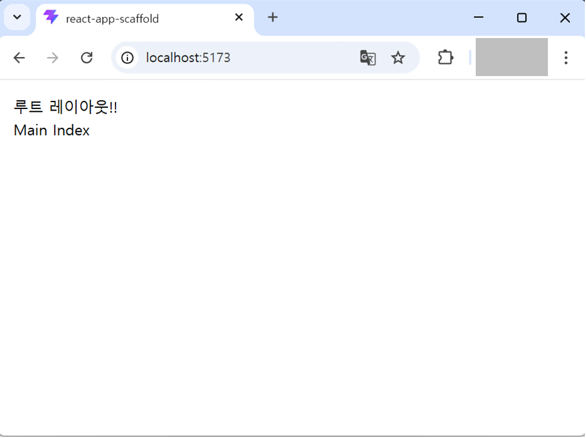

# react-app-scaffold 레이아웃 템플릿 적용

## 기본 레이아웃 템플릿

* **첫 프로젝트 세팅**을 마치면 **기본 레이아웃**이 이미 적용된 상태에서 시작합니다.
* 이 레이아웃은 **Tailwind CSS**와 **shadcn/ui**로 구성되어 있습니다.
* 이후 프로젝트·디자인 요구에 맞게 레이아웃을 바꾼 뒤, 그 위에서 화면을 이어가면 됩니다.

## RootLayout.tsx 수정
---
* 공통 라우터 파일인 `src/shared/router.index.tsx` 파일에는 전체 공통 레이아웃으로 `RootLayout.tsx` 컴포넌트를 사용하고 있습니다. 모든 페이지는 `RootLayout.tsx` 컴포넌트를 감싸서 렌더링 될 것입니다.

* 프로젝트가 처음 세팅되면 아무것도 적용되지 않은 상태에서 시작합니다.



* `RootLayout.tsx` 컴포넌트에 다음과 같이 레이아웃 일부에서 사용할 Context API Provider와 레이아웃을 구성할 `RootLayoutContent.tsx` 컴포넌트를 추가합니다.
  ```tsx
  import RootLayoutContent from './RootLayoutContent';

  // default template ===============================
  import LayoutDefaultSidebarProvider from '@/core/providers/layout/default/LayoutDefaultSidebarProvider';
  // default template ===============================

  interface IRootLayoutProps {
    //
  }

  export default function RootLayout({}: IRootLayoutProps): React.ReactNode {
    return (
      <LayoutDefaultSidebarProvider>
        <RootLayoutContent />
      </LayoutDefaultSidebarProvider>
    );
  }
  ```
  - `src/core/providers/layout/default/LayoutDefaultSidebarProvider.tsx` 파일은 기본 제공 레이아웃에서 사용하는 여러가지 Context API를 정의하고 있습니다.


## google fonts 적용 warning 해결
---
* 기본 레이아웃 css는 `src/assets/styles/layout/default/layout.css` 파일에 정의되어 있습니다.
* google fonts 적용 시 다음과 같은 warning 메시지가 발생할 수 있습니다.
```sh
[vite:css][postcss] @import must precede all other statements (besides @charset or empty @layer)
3208 |    unicode-range: U+0000-00FF,U+0131,U+0152-0153,U+02BB-02BC,U+02C6,U+02DA,U+02DC,U+0304,U+0308,U+0329,U+2000-206F,U+2...
3209 |  }
3210 |  @import url('https://fonts.googleapis.com/css2?family=Outfit:wght@100..900&display=swap');
    |  ^^^^^^^^^^^^^^^^^^^^^^^^^^^^^^^^^^^^^^^^^^^^^^^^^^^^^^^^^^^^^^^^^^^^^^^^^^^^^^^^^^^^^^^^^^
3211 |  @layer theme, base, components, utilities;
3212 |  @layer theme;
```
* 이 경우 다음과 같이 해결합니다.
  - `src/assets/styles/layout/default/layout.css` 파일의 다음 코드를 삭제합니다.
  ```css
  @import url('https://fonts.googleapis.com/css2?family=Outfit:wght@100..900&display=swap') layer(base);
  ```
  - font 가져오는 로직을 `index.html` 파일에 추가.
```tsx
<!doctype html>
<html lang="en">
	<head>
		<meta charset="UTF-8" />
		<link
			rel="icon"
			type="image/svg+xml"
			href="%VITE_BASE_URL%logo.ico"
		/>
    // highlight-start
		<link
			href="https://fonts.googleapis.com/css2?family=Outfit:wght@100..900&display=swap"
			rel="stylesheet"
		/>
    // highlight-end
		<meta
			name="viewport"
			content="width=device-width, initial-scale=1.0"
		/>
		<title>react-app-scaffold</title>
	</head>
	<body>
		<div id="root"></div>
		<script
			type="module"
			src="/src/main.tsx"
		></script>
	</body>
</html>
```

* 현재 다시 수정한 방법은 `app.css` 파일 최상단에 다음 코드를 넣음.
  ```css
  @import url('https://fonts.googleapis.com/css2?family=Outfit:wght@100..900&display=swap') layer(base);
  ```
* 그리고 `layout.css` 파일에서 `@theme inline {` 과 `@layer base `만 적용 되어있으므로, 해당 코드 두개는 `app.css` 파일에서 삭제함.
* app.css 파일에서 `@import './layout/layout.css';` 한다음, layout.css 파일에는 템플릿에서 가져온 css 코드를 적용하였음.