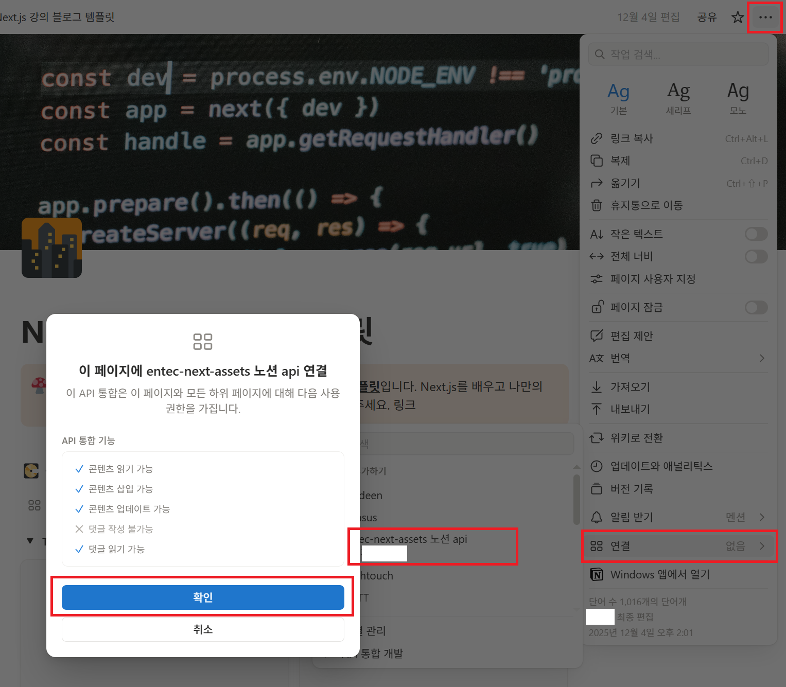

# Notion API 활용 방법

## 패키지 설치
---
* **@notionhq/client** 패키지를 사용하면 Notion API를 호출하고 데이터를 가져오거나 업데이트하는 등의 작업을 수행할 수 있습니다.
```ls
npm i @notionhq/client
```


## Notion Integration 생성 및 연결
---
:::info <span class="admonition-title">Notion Integration</span> 이란?
* Notion 통합(Integration)은 Notion의 기능을 확장하고, Notion 워크스페이스를 다른 외부 도구 및 서비스와 연결하여 워크플로우의 효율성을 높이는 기능입니다.
:::
* **Notion API(https://developers.notion.com/)** 사이트에 들어가서 우측 상단에 `my integrations` 링크를 클릭합니다.
* 몇가지 입력 정보를 입력하고 저장을 하면 API **TOKEN**이 나옵니다.
* 해당 **TOKEN**을 복사하여 현재 프로젝트 루트에 `.env` 환경변수 파일에 **NOTION_TOKEN** 이름으로 저장합니다.


## Notion 템플릿 설정
---
* 마켓플레이스에서 선택하거나 다른 누군가 공유한 템플릿을 적용합니다.


## Notion 데이터베이스 설정
---
* 내가 설정한 워크스페이스의 템플릿화면에서 우측 상단에 공유 버튼을 클릭하면 해당 링크를 복사할 수 있습니다.
* 복사한 링크에서 `https://www.notion.so/Next-js-데이터베이스아이디?source=copy_link` **데이터베이스아이디** 부분만 카피하여 환경변수(`.env`) 파일에 **NOTION_DATABASE_ID** 라는 이름으로 환경변수를 추가합니다.
* 해당 데이터베이스는 **API Integration** 에서 이용할 수 있게 **연결**을 해야합니다.
  


## Notion API 통신
---
* `@notionhq/client` 패키지를 이용하여 데이터 통신을 합니다.
  - 참조 : https://www.npmjs.com/package/@notionhq/client